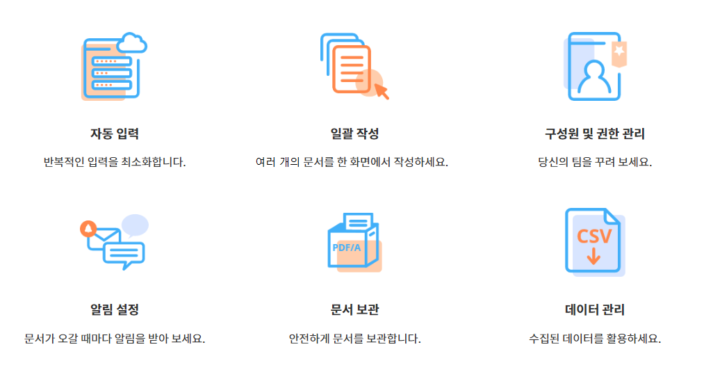

eformsign 소개
==================

eformsign은 기업에서 발생하는 모든 종이 문서를 누구나 손쉽게 전자문서로 만들고 언제 어디서나 바로 사용할 수 있으며 저장된 정보를 다양하게 활용할 수 있는 전자문서 서비스입니다.

eformsign 서비스에서 제공하는 웹 전자문서 편집기인 웹폼 디자이너(Web
form designer)를 통해 사용하던 문서(PDF)를 바로 업로드해 쉽게
전자서식으로 만들어 사용할 수 있는 것은 물론, MS Office Add-in 방식의
**폼 빌더**\ 를 제공해 MS 오피스 프로그램 파일로 작성된 기존의 문서를
그대로 사용해 누구나 전자서식을 만들 수 있습니다.

또한 기업의 업무 흐름에 맞게 워크플로우를 설정할 수 있습니다. 계약서,
동의서, 신청서 등 외부 문서뿐 아니라 결재 등 내부 문서를 포함하여 문서의
처리 과정을 자유롭게 설정할 수 있고 다양한 업무에 적용할 수 있습니다.
또한 워크플로우 단계 또는 수신자 별로 알림, 필수 입력 항목 등의 세부
설정이 가능하며 문서의 진행 및 처리 상태도 실시간으로 확인할 수
있습니다.

문서의 위/변조 방지를 위해 문서의 기본정보, 이력, 서명 정보 등 문서의
모든 기록이 포함된 감사추적증명서를 제공합니다.

이 외에도 작성자 정보, 그룹 관련 정보, 최근 입력값이나 날짜 정보 등에
대한 자동 입력을 지원해 반복적인 입력을 최소화하며 한꺼번에 여러 개의
문서를 작성할 수 있는 일괄 작성 기능도 지원합니다. 회사의 멤버 및 권한을
관리할 수 있고 문서에 대한 알림을 상세하게 설정할 수 있으며, 문서에
입력된 데이터를 추출해 별도로 관리하고 활용할 수 있도록 지원합니다.

eformsign 서비스의 또 다른 핵심 기능 중 하나는 전자서명입니다.

전자서명이란 종이에 하는 서명과 같은 역할을 하는 전자적 형태의
서명입니다. 종이에 서명을 할 때 본인이 직접 서명해야 하는 것처럼
전자서명 또한 서명자가 본인임을 증명하는 인증 단계를 거쳐야 합니다. 본인
인증의 경우, 이메일, 생년월일, 비밀번호, 전화번호 등이 본인 인증
수단으로 사용됩니다.

전자서명은 대부분의 국가에서 단계적으로 법적 효력을 구분하여 적용하고
있습니다. eformsign의 전자서명은 개인과 개인, 법인과 개인 간의 법적
효력을 가지고 있으며, 부인방지를 위한 다양한 부가 기능을 제공하고
있습니다.

.. note::

   전자 서명의 국가별 법적 효력은 다음을 참고하세요.

   -  한국: PKI 기반의 전자서명은 법적으로 강력한 지위를 부여하고 있고,
      공인전자서명 외의 전자서명이라 할지라도 그 자체만으로 서명으로서의
      효력을 부정하지는 않습니다. 전자서명법 제3조제3항에 의거,
      전자서명은 당사자간의 약정에 따른 서명, 서명날인 또는
      기명날인으로서의 효력을 가집니다.

   -  미국: 전자서명에 대한 기술적 중립성이라는 원칙 아래 PKI 기반
      전자서명에 대하여 별도의 법적 효력을 부여하지 않고 있으며,
      본인확인 또는 인증서비스를 통하여 전자서명의 신뢰성을 높이는
      방식을 취하는 경우가 많습니다.

   -  EU: 적격전자서명, 고급전자서명, 일반전자서명으로 구분하여 문서
      성격에 따라 법적 지위를 부여하고 있습니다.

   -  일본: 특정인증업무제도가 있어 업무별로 주무대신의 허가를 받은
      전자서명에는 보다 강력한 법적 효력을 부여하고 있습니다.

기본 용어
-------------

eformsign을 사용하기 전에 숙지하고 있어야 할 eformsign의 기본 용어를
소개합니다.

-  **웹폼 디자이너(Web form designer)**

   웹폼 디자이너는 eformsign 서비스에 기존 문서 파일을
   업로드하여 바로 간단하게 전자서식으로 만들 수 있는 도구입니다.
   신청서, 계약서, 동의서 등 PDF 형식의 문서에 서명, 텍스트 박스,
   체크박스 등 입력할 수 있는 컴포넌트를 올려서 바로 템플릿으로
   저장하거나 이렇게 만들어진 전자문서를 다른 수신인에게 전송하여 문서
   작성 또는 서명 요청할 수 있습니다.

-  **폼 빌더(Form builder)**

   폼 빌더는 eformsign에서 사용하는 전자서식을 만드는
   도구입니다. 신청서, 계약서, 동의서 등의 기존 종이 서식(MS Office로
   만들어 사용하는 문서 서식)을 서명이나 텍스트 박스 등을 포함하는
   전자문서로 변경하여 eformsign에 업로드할 때 사용합니다. MS Office에
   리본메뉴의 형태로 추가(Add-in)되며 **OZ in Office**\ 라고도 합니다.

-  **대시보드**

   eformsign에 로그인하고 나면 처음에 나타나는 서비스의 메인
   화면입니다. 대시보드 좌측 상단의 메뉴 아이콘(|image1|)을 클릭하면
   사이드 바 메뉴에 접근할 수 있습니다. 사이드 바 메뉴는 사용자의 권한에
   따라 다르게 나타납니다.

   .. figure:: resources/dashboard.png
      :alt: eformsign 대시보드 화면
      :width: 750px

  

-  **템플릿**

   eformsign에서 사용하는 전자문서 서식으로, 종이로 된 신청서나
   동의서 템플릿과 같이 문서에 서명이나 동의 여부 등의 내용을 넣기 전의
   서식을 말합니다. 템플릿은 MS Office 파일인 경우에는 eformsign의
   폼빌더로 만들고 업로드할 수 있으며, PDF 파일인 경우에는 서비스에 바로
   파일을 업로드해서 전자문서를 생성할 수 있습니다.

-  **문서**

   템플릿을 사용해 작성/전송하는 전자문서 또는 내가 가지고 있는 파일을 바로 업로드해 작성/전송하는 전자문서를 말합니다.문서는 **내 파일로 문서 작성** 또는 **템플릿으로** **문서 작성** 메뉴를 통해 작성 및 전송할 수 있습니다. 이를 통해 작성/전송된 문서가 eformsign에서 문서 수를 집계하는 기준이 됩니다.

-  **문서함**

   생성된 문서를 보관 및 열람할 수 있는 클라우드 공간입니다.
   문서의 상태에 따라 3개의 문서함에 나뉘어 보관됩니다.

   -  **처리할 문서함:** 내가 작성 또는 처리한 문서 중
      결재, 작성, 요청 등 내가 처리할 사항이 있는 문서 목록을 볼 수
      있습니다.

   -  **진행 중 문서함:** 내가 작성 또는 처리한 문서 중
      완료되지 않은 문서 목록을 볼 수 있습니다.

   -  **완료 문서함:** 내가 작성 또는 처리한 문서 중 완료된
      문서 목록을 볼 수 있습니다.

-  **임시 보관함**

   **내 파일로 문서 작성** 중 **문서 시작하기** 이전에 임시 저장한 문서
   목록을 볼 수 있습니다.\

-  **워크플로우**

   문서가 작성되어 완료되기까지의 처리 과정을 말합니다.
   템플릿 관리자가 템플릿 별로 워크플로우 단계를 설정할 수 있습니다.
   워크플로우는 **시작 – 완료**\ 가 기본 단계이며 다음의 3가지
   단계를 추가할 수 있습니다.

   -  **결재자:** 멤버가 문서를 결재, 승인하는 단계입니다.

   -  **내부 수신자:** 회사 멤버가 문서를 작성하거나
      검토하는 단계입니다.

   -  **외부 수신자:** 멤버 외의 외부인이 문서를 작성하거나
      검토하는 단계입니다.

   .. figure:: resources/workflow_new.png
      :alt: 워크플로우 단계
      :width: 300px

-  **대표 관리자**

   회사의 대표자로, 이폼사인 사용에 대한 모든 권한이 있습니다.

-  **회사 관리 권한**

   회사 관리 권한이 있으면 회사 관리 메뉴에 접근할 수
   있으며, 회사, 그룹, 멤버 등을 관리할 수 있습니다.

-  **템플릿 관리 권한**

   템플릿 관리 권한이 있으면 템플릿 관리 메뉴에 접근할 수 있으며,
   템플릿을 생성, 수정, 배포 및 삭제할 수 있습니다.

-  **문서 관리 권한**

   문서 관리 권한이 있으면 문서 관리 메뉴에 접근하여 권한을 부여받은
   템플릿으로 생성된 문서를 열람하고 완료 문서에 대한 취소 요청을
   승인하거나 문서를 시스템에서 영구 제거할 수 있습니다. 문서 관리
   권한은 템플릿별로 다르게 지정할 수 있습니다.

사용 흐름
-------------

eformsign을 사용하는 방법으로 내 PC에 있는 문서 파일을 그대로 eformsign
서비스에 업로드하여 템플릿 등록없이 바로 전자문서로 만들어 전송하는
방법과 미리 생성 및 저장한 템플릿을 활용하여 해당 템플릿을 전송하는
방법이 있습니다.

.. note::

   서비스에서 파일을 업로드하는 방식의 경우 현재는 PDF 파일만 지원하나,
   향후 MS 오피스 파일, 한글 파일, JPG, PNG 등 이미지 파일 등 다양한
   파일 형식을 추가 지원할 예정입니다.

내 파일로 문서 작성
~~~~~~~~~~~~~~~~~~~~~

PDF 형식의 파일을 eformsign에 업로드한 후 서비스 내에서 텍스트, 서명,
날짜 필드 등의 필요한 컴포넌트를 문서 위에 배치하고 문서를 전송할 수
있습니다.

템플릿 등록 단계를 거치지 않고 자유롭게 문서를 업로드 후 전송할 수
있습니다. 업로드된 문서 위에 필요한 컴포넌트를 배치하고, 수신자
지정하기에서 워크플로우를 설정하고 난 후 문서 작성 시작하기 버튼을
누르면 수신자에게 전송이 완료됩니다.

수신자에게 전송하기 전에 임시 보관함에 저장해 두었다가 나중에 전송할
수도 있습니다.

.. figure:: resources/use_flow_myfile.png
   :alt: 내 파일로 문서 작성시 사용 흐름
   :width: 700px

템플릿으로 문서 작성
~~~~~~~~~~~~~~~~~~~~~~

템플릿을 사용해 문서를 작성할 경우, eformsign에 파일을 업로드해 템플릿을 만들 수 있는 웹폼 디자이너를 통한 방법과 MS 오피스 파일에서 템플릿을
만들어 업로드 할 수 있는 폼 빌더를 활용한 방법 두 가지가 있습니다.

**1. 웹폼 디자이너를 통한 사용 방법**

PDF 형식의 파일을 eformsign에 업로드한 후 서비스 내에서 텍스트, 서명, 날짜 필드 등의 필요한 컴포넌트를 문서 위에 배치해 템플릿을 만들 수 있습니다.

업로드된 문서에 컴포넌트를 배치하고 나면 템플릿 관리 중 설정 메뉴에 가서 일반 설정, 워크플로우 설정, 알림 설정 등을 변경한 후 배포하면 됩니다.

새 문서 작성 메뉴로 이동하면 배포된 템플릿을 통해 문서를 작성하고 수신자에게 전송할 수 있습니다.

**2. 폼 빌더를 통한 사용 방법**

MS Office(Word, Excel, PowerPoint)에서 문서를 작성하거나 문서 파일을 불러온 후 MS Office의 리본 메뉴(OZ in Office)에서 텍스트, 서명, 날짜 필드 등의 필요한 컴포넌트를 문서 위에 배치해 템플릿을 만듭니다. 그 다음 리본 메뉴의 실행 메뉴를 통해 서비스에 로그인하고 템플릿을 업로드한 후 eformsign 사이트로 이동합니다.

eformsign 사이트의 템플릿 관리 메뉴에 가서 템플릿이 업로드된 것을 확인하고 워크플로우나 일반 설정, 알림 설정 등을 변경한 후 배포합니다.

새 문서 작성 메뉴로 이동하여 문서를 작성하고 수신자에게 전송합니다.

최소 지원 사양
~~~~~~~~~~~~~~

폼 빌더와 eformsign 각각의 최소 지원 사양은 다음과 같습니다.

**폼 빌더(OZ in office)**

-  **PC 운영 체제:** 윈도우 7 이상

-  **MS 오피스:** Microsoft Office 2010 이상

**eformsign**

-  **PC 운영 체제:** 윈도우 7 이상, OS X 매버릭스 이상

-  **브라우저:** 인터넷 익스플로러 11 이상, 크롬 49 이상, 사파리 9 이상

-  **모바일 운영 체제:** iOS: 6.1.6 이상, 안드로이드: 5.0(롤리팝) 이상

.. note::

   eformsign을 사용하기 위해 반드시 모바일 앱을 설치해야 하는 것은 아닙니다.

활용 분야
------------

eformsign은 여러 분야에서 다양하게 사용될 수 있으나 대표적으로 계약서, 동의서, 신청서 등에 활용할 수 있습니다. 모든
문서는 암호화(AES-256방식)되어 저장되며, 국제적으로 약속된 장기 보관 문서 형식인 PDF/A 형식으로 저장됩니다.

계약서
~~~~~~~~~

전자문서를 사용해 근로 계약, 구매/렌탈 계약, 가맹점 계약, 유지보수 계약
등 다양한 계약을 맺을 수 있습니다. 계약 과정이 기록되고 감사추적증명서
등을 통해 문서의 위변조를 방지할 수 있고, 고객이나 계약 당사자와
비대면으로 수백 건의 계약을 간단하게 진행할 수 있습니다.

계약 프로세스는 다음과 같습니다.

동의서
~~~~~~~~~

전자문서를 사용해 개인정보 동의서, 병/의원의 치료 동의서, 학부모 동의서,
전대차 동의서 등을 작성할 수 있습니다. 스마트폰, 태블릿, PC 등 다양한
기기로 작성이 가능하며 일괄 작성 기능으로 한 번에 수백, 수천 명의 동의를
받을 수 있습니다.

전자동의 프로세스는 다음과 같습니다.

.. figure:: resources/usecase-process.PNG
   :alt: 전자동의 프로세스
   :width: 730px

신청서
~~~~~~

전자문서를 사용해 가입/참가 신청서, 견적 신청서, 진료 신청서, 구매
신청서 등을 작성할 수 있습니다. 사내의 여러 부서의 결재, 협조, 검토가
필요한 문서도 워크플로우 설정을 통해 유연하게 처리할 수 있으며, 고객이
작성한 신청서가 담당 부서에 바로 전달될 수 있도록 설정할 수 있습니다.
또한, 신청서가 처리되는 즉시 신청자에게 신청 결과를 전송할 수 있습니다.

신청서 작성 프로세스는 다음과 같습니다.

.. |image1| image:: resources/menu_icon.png
