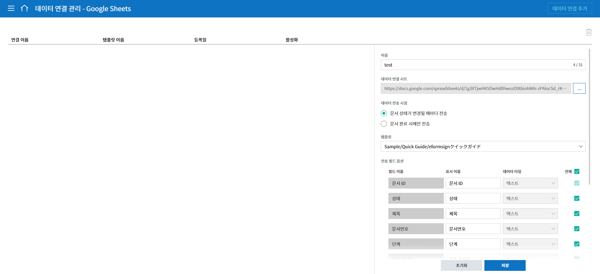

==================
외부 서비스 연동
==================

----------------------------------
외부 파일 저장소 연동
----------------------------------

eformsign에서 작성된 문서가 완료되면 외부의 클라우드 스토리지 서비스에 자동으로 저장되도록 설정할 수 있습니다.

.. note::
 
   현재 **Dropbox, Google Drive, OneDrive, box**\ 를 지원하고 있으며,
   외부 파일저장소 연동은 **대표 관리자**\ 만 설정할 수 있습니다.

1. 메뉴에서 **커넥트> 파일 저장소**\ 로 이동합니다.

2. 완료된 문서를 저장할 클라우드 스토리지를 선택한 다음 **계정 연결** 버튼을 눌러 로그인합니다.

3. 로그인하면 **연결 해제**\ 와 **저장 경로 설정** 버튼이 나타납니다. 필요에 따라 **저장 경로 설정** 버튼을 눌러 저장 경로를
설정합니다.

.. figure:: resources/connect_2.png
   :alt: 파일 저장소의 계정 연결과 연결 해제
   :width: 750px

.. note::

   저장 경로 설정 팝업은 다음과 같습니다.

   기본 경로는 eformsign 하위 폴더로 회사명이 들어갑니다. **새 폴더** 버튼을 눌러 새로운 폴더를 만들고 저장 경로를 변경할 수도 있습니다.

   |image1|

4. **템플릿 관리** 메뉴로 이동합니다.

5. 클라우드 스토리지에 문서를 저장하고자 하는 템플릿을 클릭하여 **템플릿 설정** 화면으로 이동합니다.

6. **워크플로우 설정** 메뉴로 이동합니다.

7. **완료** 단계 속성 탭에서 **별도의 파일 저장소에 완료 문서 저장하기**\ 를 체크합니다. **파일 저장소** 메뉴에서 설정한 클라우드 저장소가 연결되어 있는 것을 확인할 수 있습니다. 이후 해당 템플릿으로 문서를 작성한 후 문서가 완료되면 eformsign 외에도 연결된 외부 파일 저장소에 완료 문서가 자동으로 저장됩니다.

------------------------
분석 및 리포팅
------------------------

문서에 입력된 데이터를 Google 스프레드 시트와 Office 365의 엑셀 문서에 자동으로 저장되도록 설정할 수 있습니다. 매번 새로운 문서가 추가될 때마다 CSV 파일을 다운로드하는 것이 번거로울 경우 이 기능을 사용하면 좋습니다. 

.. note::

   **분석 및 리포팅**\ 은 **대표 관리자**\ 만 설정할 수 있습니다.

1. 메뉴의 **커넥트> 분석 및 리포트**\ 로 이동합니다.

2. Google Spread와 Office 365 중 원하는 서비스를 선택하고 **계정 연결** 버튼을 클릭하여 로그인합니다.

3. **데이터 연결 관리** 버튼을 클릭합니다.

.. figure:: resources/analytic_3.png
   :alt: 데이터 연결 관리 화면
   :width: 750px

4. 화면 중앙 또는 오른쪽 상단의 **데이터 연결 추가** 버튼을 클릭합니다.

.. figure:: resources/analytic_4.png
   :alt: 데이터 연결 관리 화면
   :width: 750px

5. 이름, 데이터 연결 시트, 데이터 전송 시점, 템플릿을 설정하고 **저장** 버튼을 클릭합니다.

.. note::

   데이터 연동 시트란, Google 시트를 예로 들면 해당 시트의 URL에 해당합니다.

6. **데이터 연결 관리** 화면에 데이터 연결이 설정된 시트가 표시됩니다.

7. 연결된 시트로 이동하면 데이터를 가져올 컬럼(입력항목)이 표시된 것을 확인할 수 있습니다. 이후 작성되는 문서의 경우 문서에 데이터가 입력될 때마다 자동으로 업데이트니다. 

.. figure:: resources/analytic_8.png
   :alt: 데이터 연결 관리 화면
   :width: 750px

