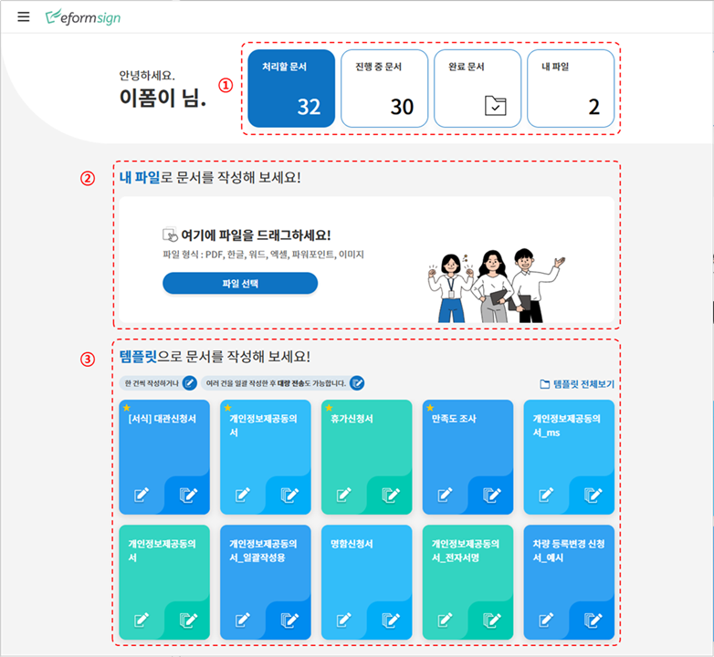
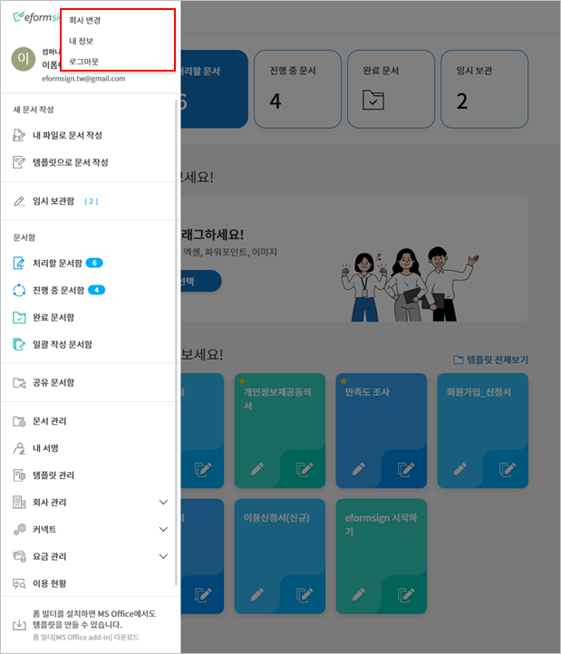
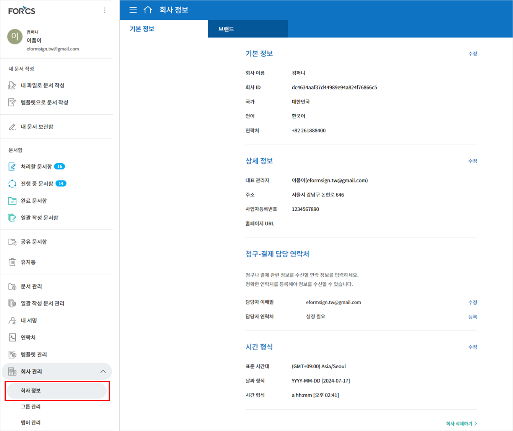
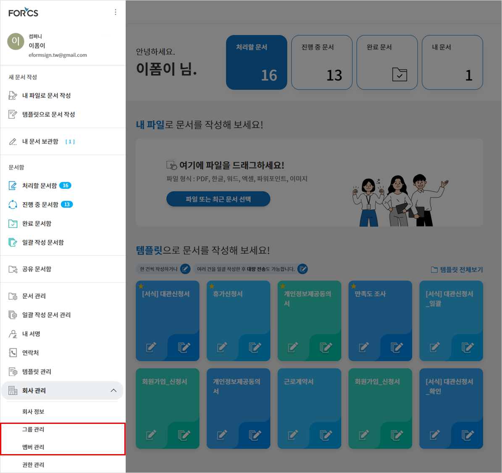
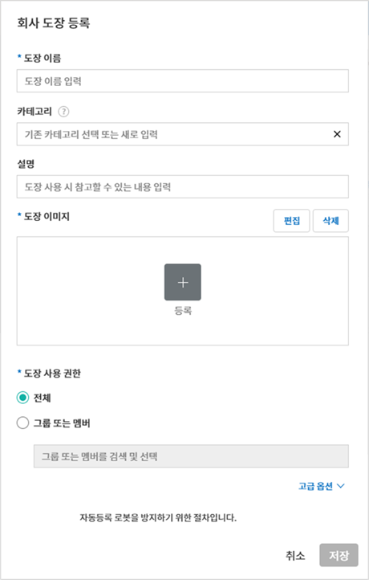
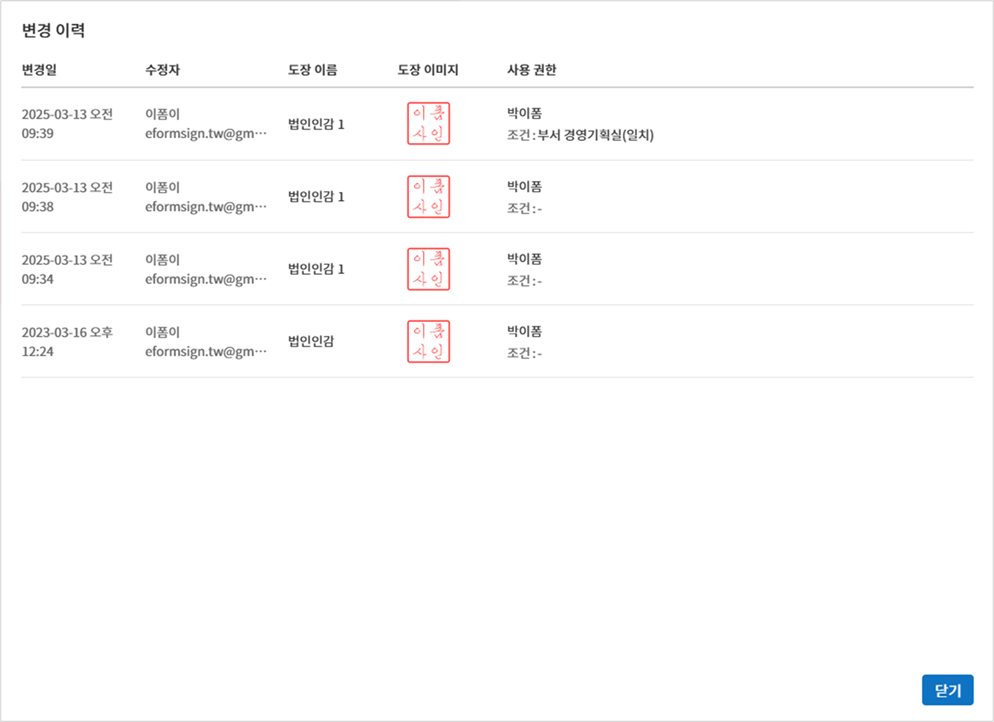
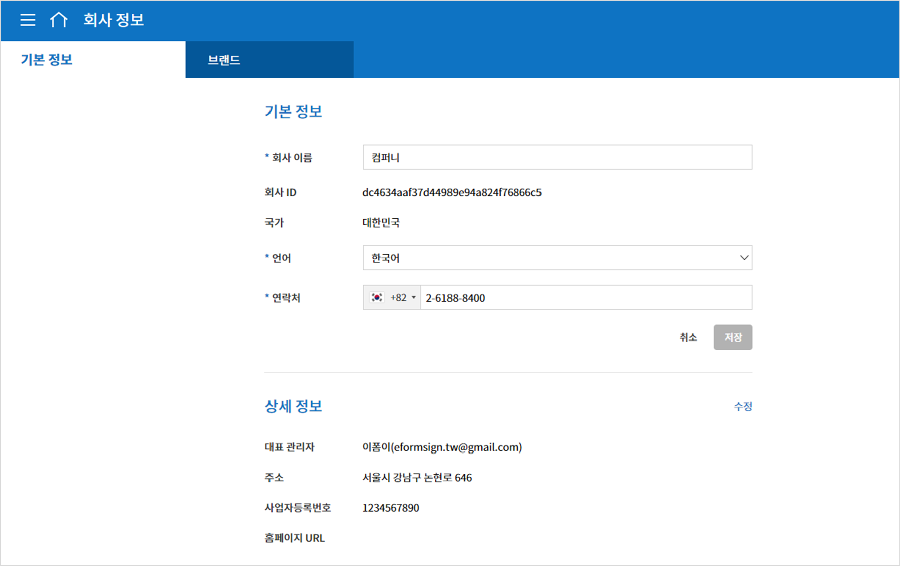

기본정보
============

대시보드
------------

메뉴 구성
~~~~~~~~~~~~~

이폼사인 로그인 후 대시보드 대시보드 화면 왼쪽 상단의 메뉴(|image1|)를 클릭하면, 아래와 같은 사이드바 메뉴가 나타납니다.

.. note::

   메뉴는 사용자의 권한에 따라 다르게 나타납니다. 대표 관리자는 모든 메뉴를 볼 수 있으며, 모든 권한이 있습니다.

.. figure:: resources/dashboard_menu_expand.png
   :alt: 이폼사인 메뉴 구성
   :width: 700px

각각의 메뉴는 다음과 같습니다.

-  **새 문서 작성:** 내 PC에 저장된 문서 파일 또는 eformsign에 등록된 작성 가능한 템플릿 중 선택하여 문서를 작성합니다.

   -  **내 파일로 문서 작성:** 미리 저장된 템플릿이 없더라도 내 PC에 저장된 문서 파일을 eformsign에 바로 업로드한 후 필요한 컴포넌트를 문서 위에 추가하여 수신자에게 전송합니다.

   -  **템플릿으로 문서 작성:** 문서를 작성할 수 있는 템플릿 목록이 조회되고, 템플릿을 선택하여 문서를 작성합니다.

-  **임시 보관함**: **내 파일로 문서 작성** 중 **문서 시작하기** 전 단계에서 임시 저장한 문서 목록을 볼 수 있습니다.

-  **문서함:** 나와 관련된 문서 목록을 확인합니다.

   -  **처리할 문서함:** 내가 처리해야 할 문서(다른 멤버가 나에게 요청한 문서), 또는 멤버가 아닌 수신자에게 보낸 문서 중 처리되지 않은 문서 목록을 볼 수 있습니다.

   -  **진행 중 문서함:** 내가 작성 또는 처리한 문서 중 아직 완료되지 않은 문서 목록을 볼 수 있습니다.

   -  **완료 문서함:** 내가 작성한 문서 중 완료된 모든 문서 목록을 볼 수 있습니다.

   -  **일괄 작성 문서함:** 내가 일괄로 작성한 문서의 진행 상태 등 일괄 작성 문서에 대한 현황을 확인할 수 있습니다.   

-  **문서 관리:** 문서 관리 권한이 있어야만 접근 가능한 메뉴입니다. 문서 관리 권한이 있는 템플릿으로 만들어진 모든 문서를
   조회할 수 있습니다. 단, 대표관리자의 경우, 모든 문서를 조회 및 관리할 수 있습니다.

-  **내 서명:** 내 서명을 등록하고 문서 작성 시 편리하게 서명란에 적용할 수 있습니다.

-  **템플릿 관리:** 템플릿 관리 권한이 있어야만 접근 가능한 메뉴입니다. 템플릿 목록을 확인하고 템플릿을 생성 및 설정할 수 있습니다.

-  **회사 관리:** 대표 관리자와 회사 관리 권한이 부여된 멤버만 접근 가능한 메뉴입니다. 회사 정보를 조회하고 수정할 수 있습니다.

   -  **회사 정보:** 회사 정보 회사 정보를 확인 및 수정하고 대시보드, 이메일 등에 적용되는 브랜드 이미지를 설정할 수 있습니다.

   -  **그룹 관리:** 멤버 그룹을 생성하거나 그룹 정보를 수정할 수 있습니다.

   -  **멤버 관리:** 멤버를 초대하거나 멤버 정보를 수정할 수 있습니다.

   -  **회사 도장 관리:** 법인인감, 사용인감 등 회사의 공식 도장을 등록하고 각 도장 별 사용 권한을 설정할 수 있으며, 도장 사용 내역을 확인할 수 있습니다.

   -  **서명 설정:** 그리기, 텍스트, 도장 중 서명하는 방식을 설정할 수 있습니다.

   -  **알림 템플릿 관리:** eformsign에서 발송되는 이메일, SMS 알림 템플릿 목록을 확인하고 수정할 수 있습니다.   

   -  **사용자 정의 필드 관리:** 회사, 그룹, 멤버에 대한 추가 정보를 입력하거나 수정할 수 있습니다.

-  **커넥트:** 대표 관리자만 접근 가능한 메뉴입니다. 외부 서비스와 연계하여 사용하는 기능들을 확인할 수 있습니다.

   -  **파일 저장소:** 드롭박스, 구글 드라이브, 박스, 원드라이브 계정을 연동하여 최종 완료된 문서가 자동 저장되도록 설정합니다.

   -  **분석 및 리포팅:** 구글 스프레드시트, 오피스365 엑셀로 문서에 입력된 데이터가 자동 저장되도록 설정합니다.

   -  **API / Webhook:** 이폼사인 API를 사용할 때 필요한 API 및 웹훅 키를 관리할 수 있습니다.

-  **요금 관리:** 요금제 및 결제 내역을 조회하고 요금제나 결제 수단을 변경할 수 있습니다.

   -  **요금제 변경:** 사용 중인 요금제를 변경할 수 있습니다.

   -  **실시간 요금:** 현재까지의 이용 내역 및 요금 현황을 실시간으로 조회할 수 있습니다.

   -  **결제 수단 설정:** 요금 결제시 사용될 신용카드 정보를 등록할 수 있습니다.

-  **이용 현황:** 주간, 월간, 연간 이용 현황을 조회할 수 있습니다.

-  **eformsign 폼 빌더 다운로드:** MS 오피스 프로그램에서 전자서식(템플릿)을 생성하기 위한 폼 빌더를 다운로드합니다.

대시보드 화면 구성
~~~~~~~~~~~~~~~~~~~~~
                   
이폼사인 로그인 후 나타나는 대시보드 화면은 권한에 관계없이 모두 동일하게 나타납니다 . 내가 처리해야 할 문서, 진행 중인 문서 등을
한눈에 확인할 수 있으며, **새 문서 작성하기**, **문서함** 등 주요 메뉴로 바로가기를 제공합니다.

**① 템플릿으로 문서 작성**
   저장된 템플릿을 사용하여 새 문서를 작성할 수 있는 **템플릿으로 문서 작성** 화면으로 이동합니다.

**② 내 파일로 문서 작성**
   내 파일을 직접 업로드하여 새 문서를 작성할 수 있는\ **내 파일로 문서 작성** 화면으로 이동합니다.

**③ 즐겨찾기**
   내가 즐겨찾기로 등록한 템플릿을 보여줍니다. 해당 템플릿을 클릭하면 템플릿을 사용하여 문서를 작성할 수 있는 화면으로 바로
   이동합니다. 즐겨찾기에 템플릿을 추가하려면 추가 아이콘(|image2|)을 클릭하여 새로 등록할 수 있습니다. 즐겨찾기에 등록된 템플릿을
   삭제하려면 편집 아이콘(|image3|)을 클릭하여 삭제할 수 있습니다.

   .. tip::

      **자주 사용하는 템플릿 즐겨찾기 방법!**

      자주 사용하는 템플릿은 즐겨찾기에 등록하여 바로 문서를 작성할 수 있습니다. 템플릿 **즐겨찾기**\ 는 대시보드에서 할 수 있습니다.

      1. 대시보드의 즐겨찾기 추가 아이콘( |image4|)을 클릭하세요.

      2. 클릭시 즐겨찾기에 등록이 안된 템플릿의 목록이 팝업창으로 뜹니다.

      3. 즐겨찾기에 추가하고자 하는 템플릿의 체크박스를 클릭합니다.

         |image5|

      4. 선택을 클릭하면 즐겨찾기에 등록됩니다.

**④ 처리할 문서함**
   내가 처리해야 하는 문서의 개수를 보여주며, 클릭시 **처리할 문서함**\ 으로 이동합니다.

**⑤ 진행 중 문서함**
   현재 진행 중인 문서의 개수를 보여주며, 클릭시 진행 중인 문서의 목록을 확인할 수 있는 **진행 중 문서함**\ 으로 이동합니다.

**⑥ 완료 문서함**
   클릭시 **완료 문서함**\ 으로 이동합니다.

**⑦ 임시 보관함**
   **내 파일로 문서 작성**\ 을 통해 문서 작성 진행 중 **문서 시작하기** 이전에 임시 저장된 문서의 개수를 보여주며, 클릭시 **임시 보관함**\ 으로 이동합니다.

**⑧ 처리할 문서**
   내가 처리해야 하는 문서의 개수와 최근 문서 3건을 목록으로 보여줍니다. 목록의 문서명을 클릭하면 해당 문서로 바로 이동하며, **더보기**\ 를 클릭하면 **처리할 문서함**\ 으로 이동합니다.

**⑨ 임시 보관 문서**
   임시 보관함에 저장된 문서의 개수와 최근 문서 3건을 목록으로 보여줍니다. 목록의 문서명을 클릭하면 해당 문서로 바로 이동하며, **더보기**\ 를 클릭하면 **임시 보관함**\ 으로 이동합니다.

**⑩ 진행 중 문서**
   진행 중인 문서의 개수와 최근 문서 3건을 목록으로 보여줍니다. 목록의 문서명을 클릭하면 해당 문서로 바로 이동하며, **더보기**\ 를 클릭하면 **진행 중 문서함**\ 으로 이동합니다.

**⑪ 완료 문서**
   최근 완료된 문서 3건을 목록으로 보여줍니다. 목록의 문서명을 클릭하면 해당 문서로 바로 이동하며, **더보기**\ 를 클릭하면 **완료 문서함**\ 으로 이동합니다.

기본 정보 확인 및 변경
--------------------------

이폼사인 가입시 입력한 개인 정보 및 내가 등록된 회사의 정보를 확인하려면 사이드바 메뉴의 우측 상단에 있는 아이콘(|image6|)을 클릭하여 확인할 수 있습니다.

.. figure:: resources/menu-personalinfo.png
   :alt: 내 정보 확인 아이콘
   :width: 700px

메뉴에서 아이콘(|image7|)을 클릭하면 다음과 같이 하위 메뉴가 표시됩니다.

-  **회사 변경:** 내가 소속된 회사가 여러 개일 경우 회사 변경을 클릭하면 회사의 목록이 나타나며 변경할 회사를 클릭하여 소속 회사를 변경할 수 있습니다.

-  **내 정보:** 이폼사인 가입시 등록한 내 개인 정보를 확인 및 수정할 수 있으며, 내가 소속된 회사의 정보를 확인할 수 있습니다.

-  **로그아웃:** 이폼사인을 로그아웃할 수 있습니다.

내 정보
~~~~~~~~~~

**내 정보 > 개인 정보**

.. figure:: resources/myinfor-personalinfo-main.png
   :alt: 내 정보 > 개인 정보 화면
   :width: 730px

**개인 정보**
   회원가입시 입력한 이름, 이메일 또는 아이디, 비밀번호 및 연락처를 확인 및 수정할 수 있습니다.

**소셜 계정 연결**
   구글, 페이스북의 소셜 계정을 새로 연결, 계정 추가, 연결 해제를 할 수 있습니다.

**알림**
   마케팅 정보 수신 동의 여부를 확인할 수 있으며, 동의 및 해제할 수 있습니다.

**회원 탈퇴**
   이폼사인의 회원 탈퇴를 하고자 하는 경우 화 면 하단의 **eformsign 탈퇴하기**\ 를 클릭하여 회원 탈퇴를 할 수 있습니다.

**내 정보 > 회사 정보**

.. figure:: resources/myinfo-companyinfo.png
   :alt: 내 정보 > 회사 정보 화면
   :width: 730px

**기본 정보**
   내가 소속된 회사의 회사명, 국가, 언어, 연락처 등 기본 정보를 확인할 수 있습니다.

**상세 정보**
   내가 소속된 회사의 주소, 사업자 등록번호, 홈페이지, 대표 관리자 이름 및 이메일 등 상세한 정보를 확인할 수 있습니다.

   .. note::

      내 정보에서는 회사 정보를 확인만 할 수 있으며, 회사 관련 정보의 수정은 **회사 관리 > 회사 정보** 메뉴에서 할 수 있습니다. 회사
      정보 수정은 대표 관리자 또는 회사 관리 권한이 있는 멤버만 가능합니다.

**회사 탈퇴**
   소속된 회사를 탈퇴하고자 하는 경우, 화면 하단의 **이 회사 탈퇴하기**\ 를 클릭하여 탈퇴할 수 있습니다. 
   **이 회사 탈퇴하기**\ 를 클릭하면 소속된 회사의 목록이 표시되고, 목록 중 선택하여 해당 회사의 탈퇴를 진행할 수 있습니다.

   .. important::

      일반 멤버의 경우 소속 회사에서 탈퇴할 경우 개인의 계정은 유지되며 다른 회사에 가입하거나 신규로 회사를 생성할 수 있습니다.

      대표 관리자의 경우 회사 탈퇴시 회사가 삭제됩니다. 회사 삭제를 하지 않고 회사를 탈퇴하려면 대표 관리자 권한을 다른 멤버에게 위임한 후 회사를 탈퇴해야 합니다. 대표 관리자 권한 위임은 **회사 관리 > 회사 정보 > 기본 정보**\ 에서 할 수 있습니다.

회사 정보 수정 및 추가
~~~~~~~~~~~~~~~~~~~~~~~~~

**내 정보**\ 에서 확인가능한 회사 정보는 **회사 관리 > 회사 정보**\ 에서 수정할 수 있습니다.

.. note::

   이 작업은 **대표 관리자** 또는 **회사 관리 권한**\ 이 필요합니다.

**등록된 회사 정보를 수정하는 방법**

1. 사이드바 메뉴에서 **회사 관리 > 회사 정보**\ 로 이동합니다.

   |image8|

2. **회사 정보 > 기본 정보** 화면에서 수정하고자 하는 정보의 **수정**\ 을 클릭합니다.

3. 내용을 수정하고 수정 완료 후 **저장** 버튼을 클릭합니다.

   |image9|

.. _brand:

브랜드
~~~~~~~~~

브랜드 회사의 로고와 심볼을 등록하여 이폼사인의 대시보드와 사이드바 메뉴에 표시되도록 할 수 있으며, 문서 요청시 등 발송하는 이메일 템플릿 등에 표시할 수 있습니다.

.. note::

   **로고와 심볼의 차이**

   로고와 심볼 모두 회사를 대표하는 이미지입니다. 로고는 대체로 브랜드명을 기재하는 가로로 긴 형식, 심볼은 이미지만으로 표현한 정사각형 형식입니다.

   이폼사인에서도 로고는 512 x 128의 가로 투명 이미지, 심볼은 120 x 120의 정사각형 투명 이미지를 권장하고 있습니다.

**회사 로고 등록하는 방법**

1. 사이드바 메뉴에서 **회사 관리 > 회사 정보**\ 로 이동합니다.

2. **브랜드** 탭을 클릭합니다.

3. **브랜드 이미지 > 로고** 영역의 이미지를 클릭합니다.

4. 이미지 업로드 팝업창이 뜨면 내 PC에 저장된 로고 이미지 파일을 선택하여 업로드 합니다.

   -  이미지 크기: 가로 512px, 세로 128px 권장

   -  파일 크기: 최대 300KB

   -  파일 형식: PNG, JPG, JPEG, GIF

   .. figure:: resources/managecompany-logo-upload.png
      :alt: 이미지 업로드 팝업 화면
      :width: 650px

5. 화면 오른쪽 상단의 저장 버튼을 클릭합니다.

6. 대시보드에서 변경된 로고를 확인합니다.

   .. figure:: resources/logo-change.png
      :alt: 로고 변경된 대시보드
      :width: 750px

.. _permissions:

권한 구분
-------------

이폼사인은 멤버에게 권한을 부여할 수 있으며, 총 6단계로 세분화된 권한별 관리가 가능합니다. 사용자별 권한은 다음과 같이 구분됩니다.

-  **대표 관리자**

   회사의 대표자로 이폼사인 사용에 대한 모든 권한이 있습니다.

-  **회사 관리**

   **회사 관리** 메뉴에 접근할 수 있습니다. 회사 정보, 멤버, 그룹 등을 관리할 수 있으며 **멤버 초대** 및 **문서 이관** 등을 할 수 있습니다.

-  **템플릿 관리**

   **템플릿 관리** 메뉴에 접근할 수 있습니다. 폼 빌더를 사용하여 폼파일을 만들거나 웹폼 디자이너로 파일을 업로드하여 새로운 템플릿을 등록할 수 있으며, 템플릿을 수정, 배포 및 삭제할 수 있습니다.

-  **템플릿별 권한**\

   템플릿별로 멤버 또는 그룹에게 다음과 같은 권한을 부여할 수 있습니다. 

   -  **템플릿 사용 권한**\

      템플릿 사용 권한은 템플릿으로 문서를 작성할 수 있는 권한을 말합니다. 권한을 부여 받은 멤버의 **템플릿으로 문서 작성** 화면에 해당 템플릿이 나타나며 문서를 작성할 수 있습니다.

   -  **템플릿 수정 권한**

      템플릿 수정 권한은 해당 템플릿을 수정할 수 있는 권한입니다.

   -  **문서 관리 권한**

      **문서 관리** 메뉴에 접근하여 템플릿 별로 생성된 문서를 열람하고 다운로드 받을 수 있습니다.

대표 관리자
~~~~~~~~~~~~~~

대표 관리자는 가입시 회사를 생성한 사용자가 대표 관리자로 등록되며, 이폼사인 사용에 대한 모든 권한을 갖고 있는 최고 관리자입니다.

대표 관리자는

-  모든 메뉴에 접근할 수 있습니다.

-  템플릿을 생성, 수정, 삭제, 관리할 수 있습니다.

-  모든 문서를 작성, 열람, 관리할 수 있습니다.

-  대표 관리자 변경이 필요한 경우 다른 멤버에게 권한을 위임할 수 있습니다.

대표 관리자가 탈퇴할 경우, 회사가 삭제되며 회사를 삭제하지 않고 계정 탈퇴를 하려면 대표 관리자에 대한 권한은 다른 멤버에게 위임해야 합니다.

**대표 관리자 권한 위임하는 방법**

.. note::

   이 작업은 **대표 관리자** 권한이 필요합니다.

1. 사이드바 메뉴에서 **회사 관리 > 회사 정보**\ 로 이동합니다.

2. **상세 정보**\ 의 **수정** 버튼을 클릭하면 **대표 관리자** 항목의 오른쪽에 나타나는 **권한 위임** 링크를 클릭합니다.

   .. figure:: resources/Admin-auth-change_1.png
      :alt: 대표 관리자 권한 위임 위치
      :width: 700px

3. **권한 위임** 팝업창에서 권한을 위임할 멤버를 검색 및 선택합니다.

   .. figure:: resources/Admin-auth-change-popup_1.png
      :alt: 권한 위임 팝업 화면
      :width: 500px

4. 대표 관리자 계정의 비밀번호를 입력합니다.

5. **저장** 버튼을 클릭해 변경사항을 저장합니다.

회사 관리 권한
~~~~~~~~~~~~~~~~~

회사 관리자는 **회사 관리** 메뉴에 접근 권한을 가지며, 회사와 관련된 정보 및 멤버/그룹 등의 정보를 열람, 수정, 삭제 등을 할 수 있습니다. 회사 관리 권한은 대표 관리자가 멤버에게 권한을 부여할 수 있습니다.

**회사 관리 권한 부여하는 방법**

.. note::

   이 작업은 **대표 관리자** 권한이 필요합니다.

1. 사이드바 메뉴에서 **회사 관리 > 멤버 관리**\ 로 이동합니다.

2. 멤버 목록에서 **회사 관리** 권한을 부여할 멤버를 선택합니다.

3. 오른쪽 **멤버 정보** 상세 보기 화면 하단의 **권한**\ 에서 **회사 관리**\ 를 체크합니다.

   .. figure:: resources/company-manage-auth.png
      :alt: 회사 관리 권한 위치
      :width: 700px

4. **저장** 버튼을 클릭합니다.

템플릿 관리 권한
~~~~~~~~~~~~~~~~~~

템플릿 관리자는 **템플릿 관리** 메뉴에 접근 권한을 가지며, 템플릿을 등록, 수정, 배포, 삭제할 수 있습니다.

템플릿을 등록한 템플릿 관리자는 해당 템플릿의 템플릿 소유자가 됩니다. 한 회사에 여러 명의 템플릿 관리자가 있는 경우 템플릿 소유자와 템플릿 관리자가 다를 수 있습니다.

템플릿 관리자가 템플릿 소유자가 아닌 경우 해당 템플릿의 설정 보기와 템플릿 복제만 할 수 있습니다.

**템플릿 관리 권한 부여하는 방법**

.. note::

   이 작업은 **대표 관리자** 또는 **템플릿 관리** 권한이 필요합니다.

1. 사이드바 메뉴에서 **회사 관리 > 멤버 관리**\ 로 이동합니다.

2. 멤버 목록에서 템플릿 관리 권한을 부여할 멤버를 선택합니다.

3. 오른쪽 **멤버 정보** 상세 보기 화면 하단의 **권한**\ 에서 **템플릿 관리**\ 를 체크합니다.

   .. figure:: resources/template-manage-auth.png
      :alt: 템플릿 관리 권한 위치
      :width: 700px

4. **저장** 버튼을 클릭합니다.

.. _permissionsfortemplate:

템플릿별 권한
~~~~~~~~~~~~~~~~~~~~~~~~~~~~~~~~~~~~~~~~~

각 템플릿 별로 문서를 생성할 수 있는 **템플릿 사용 권한**\ 과 템플릿을 수정할 수 있는 **수정 권한**\ , 그리고 템플릿으로 생성된 문서와 문서에 입력된 데이터를 관리하는 **문서 관리 권한**\ 을 부여할 수 있습니다.

- **템플릿 사용 권한**\ 이 부여된 멤버는 **새 문서 작성** 메뉴 화면에서 해당 템플릿으로 문서를 작성할 수 있습니다.

- **템플릿 수정 권한**\ 이 부여된 멤버는 **템플릿 관리**\ 에서 해당 템플릿을 수정할 수 있습니다. 

- **문서 관리 권한**\ 이 부여된 멤버는 **문서 관리** 메뉴 화면에서 해당 템플릿으로 작성된 문서를 열람, 삭제, 다운로드할 수 있습니다.

**권한 부여하는 방법**

.. note::

   이 작업은 **대표 관리자** 또는 **템플릿 관리** 권한이 필요합니다.

1. 사이드바 메뉴에서 **템플릿 관리**\ 로 이동합니다.

2. **템플릿 설정** 버튼( |image10|)을 클릭합니다.

   .. figure:: resources/template-manage-setting.png
      :alt: 템플릿 설정 버튼 위치
      :width: 700px

3. **권한 설정** 탭으로 이동합니다.

   .. figure:: resources/document-creator-auth_1.png
      :alt: 템플릿 설정 > 권한 설정 탭 위치
      :width: 700px

4. 각각의 권한을 부여할 그룹 또는 멤버를 선택합니다.

5. **저장** 버튼을 클릭합니다.

멤버 및 그룹 관리
--------------------

**회사 관리** 메뉴에서 멤버를 초대, 삭제, 수정 및 그룹 생성, 추가, 삭제 등을 관리할 수 있습니다.

멤버 관리
~~~~~~~~~~~~

**멤버 관리** 메뉴에서는 멤버를 회사 소속으로 초대하거나, 초대된 멤버를 관리할 수 있습니다.

.. figure:: resources/manage-member.png
   :alt: 회사 관리 > 멤버 관리
   :width: 700px

**① 활성 멤버**
   초대를 수락하여 현재 활성화된 멤버 목록 및 정보를 확인할 수 있습니다.

**② 비활성 멤버**
   비활성된 멤버 목록 및 정보를 확인할 수 있습니다.

**③ 초대 멤버**
   초대한 멤버 목록 및 정보를 확인할 수 있습니다.

**④ 멤버 목록**
   목록에서 멤버를 클릭하여 오른쪽 멤버 정보 탭에서 정보를 확인, 수정하거나 삭제할 수 있습니다.

**⑤ 멤버 정보**
   멤버 정보를 확인할 수 있으며, 멤버 상태 변경, 회사 관리, 템플릿 관리 등 권한을 부여할 수 있습니다. .

**⑥ 필드 값 설정**
   멤버와 관련된 필드 값을 설정할 수 있습니다.

**⑦ 문서 이관**
   멤버가 이폼사인을 더 이상 사용하지 않는 경우, 해당 멤버가 처리했거나 처리할 문서를 다른 멤버에게 이관할 수 있습니다.

**⑧ 멤버 일괄 초대**
   멤버 초대시 여러 명의 멤버를 한번에 초대할 수 있습니다.

**⑨ 멤버 초대**
   이메일 또는 ID를 사용하여 멤버를 초대할 수 있습니다.

**⑩ 삭제**
   **휴지통** 아이콘을 클릭하면 멤버 목록 왼쪽에 체크박스가 활성화됩니다. 삭제할 멤버를 체크한 후 **삭제** 버튼을 클릭하면 멤버가 삭제됩니다.

그룹 관리
~~~~~~~~~~~~

그룹 관리 메뉴에서는 회사내 그룹을 생성할 수 있으며, 그룹 정보 확인, 수정 및 삭제 등을 할 수 있습니다.

**① 그룹 정보**
   그룹 목록에서 정보를 확인하고자 하는 그룹을 클릭하면 오른쪽 그룹 정보 탭에서 그룹 이름 및 설명을 확인 및 수정할 수 있습니다.

**② 멤버 목록**
   그룹에 속한 멤버 목록을 보여주며, 멤버를 추가 및 삭제할 수 있습니다.

**③ 필드 값 설정**
   그룹과 관련된 필드 값을 설정할 수 있습니다.

**④ 그룹 추가**
   그룹 추가를 클릭하면 **그룹 추가** 팝업창이 뜨고 그룹 이름 및 설명을 입력, 멤버를 검색하여 추가하면 그룹이 생성됩니다.

**⑤ 그룹 삭제**
   **휴지통** 아이콘을 클릭하면 그룹 목록 왼쪽에 체크박스가 활성화됩니다. 삭제할 그룹을 체크한 후 **삭제** 버튼을 클릭하면 그룹이 삭제됩니다.

.. _mysignature:

내 서명 관리
----------------

**내 서명** 메뉴에서 **서명, 이니셜, 도장**\ 을 등록해 두면 문서 작성 시 등록된 서명을 간편하게 사용할 수 있습니다.

.. _registersignature:

**서명/이니셜 등록하는 방법**
~~~~~~~~~~~~~~~~~~~~~~~~~~~~~~~~~~

.. note::

   작업은 **PC, 모바일, 애플리케이션**\ 에서 진행할 수 있습니다.

.. figure:: resources/menu-mysignature.png
   :alt: 내 서명 관리 화면
   :width: 700px

|image11|

1. 사이드바 메뉴에서 **내 서명**\ 으로 이동합니다.

2. 서명 등록 버튼을 클릭합니다.

   .. figure:: resources/mysignature-register.png
      :alt: 서명 등록 화면
      :width: 700px

   -  **그리기**\

      화면에 서명을 직접 그려서 입력합니다.

   -  **텍스트**\

      내 이름을 입력하여 원하는 스타일의 폰트가 적용된 서명을 선택합니다.

   -  **모바일**\

      모바일 기기의 카메라로 QR 코드를 인식하면 서명 패드 화면으로 연결됩니다. 서명 패드에 직접 서명을 그려서 입력합니다.

   -  **eformsign**\

      연결하고자 하는 모바일 기기를 선택한 뒤 **전송** 버튼을 누르면 해당 기기의 이폼사인 앱에서 서명을 입력할 수 있습니다.

3. **확인** 버튼을 클릭해 서명을 저장합니다.

4. **편집, 삭제** 버튼으로 서명을 편집하거나 삭제합니다.

.. tip::

   전자문서에 첨부될 서명 방식을 설정할 수 있습니다.

   **회사 관리** > **서명 설정** 에서 그리기, 텍스트 중 문서의 서명란에 표시될 서명 방식을 제한하거나 허용할 수 있습니다.

   .. figure:: resources/signature-method.png
      :alt: 서명 방식 설정 화면
      :width: 400px

.. _registerstamp:

**도장 등록하는 방법**
~~~~~~~~~~~~~~~~~~~~~~~~~~~~~~

문서에 직접 서명이 아닌 직인이나 도장을 사용해야 하는 경우가 있습니다. 이폼사인에서는 도장 이미지를 등록하거나, 실물 도장을 실물 크기 그대로 스캔하여 등록한 후 문서의 서명란에 도장을 찍을 수 있습니다.

**도장 이미지 등록**
^^^^^^^^^^^^^^^^^^^^^^^^^^^^^^^^^^^^

.. note::

   도장 이미지를 미리 준비해야 합니다.

   -  이미지 형식: PNG, JPG
   -  파일 크기: 최대 300KB

1. 사이드바 메뉴에서 **내 서명**\ 으로 이동합니다.

2. **도장 등록** 버튼을 클릭합니다

   .. figure:: resources/signature-stamp-register.png
      :alt: 도장 등록 버튼
      :width: 700px

3. 이미지 영역을 클릭하면 내 PC에 저장된 이미지를 업로드 할 수 있는 팝업창이 뜹니다. 원하는 도장 이미지를 선택합니다.

   .. figure:: resources/signature-stamp-image-upload1.png
      :alt: 내 서명 > 도장 등록
      :width: 400px

4. **확인** 버튼을 클릭해 도장을 저장합니다.

5. **편집, 삭제** 버튼으로 등록된 도장을 편집 또는 삭제합니다.

.. _scanstamp:

**실물 도장 스캔**
^^^^^^^^^^^^^^^^^^^^^^^^^^^^^^^^^^^^

.. note::

   실제 등록하고 싶은 도장과 이폼사인에서 제공하는 **도장 스캔 용지**\ 를 다운로드 및 출력해 준비합니다. 
   스캔 용지는 반드시 스캔 영역이 선명하게 출력되어야 합니다. 

- **PC에서 도장 스캔하기**

+++++++++++++++++++++++++++++

1. **내 서명**\ 에서 **도장 등록**\ 버튼을 클릭 후 **실물 도장 스캔** 탭을 클릭합니다. 

   .. figure:: resources/signature-stamp-scan-popup.png
      :alt: 도장 등록 버튼
      :width: 300px

2. **도장 스캔 용지**\ 를 다운로드 후 인쇄합니다. 

   .. figure:: resources/signature-stamp-scan-paper.png
      :alt: 도장 스캔 용지
      :width: 400px

3. **스캔 전용 용지**\ 의 스캔 영역 중앙에 도장을 찍습니다.

4. 모바일 기기의 카메라 앱을 사용하여 QR 코드를 인식하면 도장 스캔 화면으로 이동합니다.

5. 해당 화면에서 도장이 찍힌 스캔 전용 용지의 스캔 영역을 인식합니다. 

6. 추출된 도장 이미지를 확인한 후 저장하면 도장이 등록됩니다.

- **모바일에서 도장 스캔하기**

+++++++++++++++++++++++++++++++

1. **내 서명**\ 에서 **도장 등록**\ 버튼을 터치한 후 **실물 도장 스캔** 탭을 터치합니다. 

   .. figure:: resources/signature-stamp-scan-popup-mobile.png
      :alt: 실물 도장 스캔 팝업
      :width: 300px

2. **도장 스캔 용지**\ 를 다운로드 후 인쇄합니다. 

3. **스캔 전용 용지**\ 의 스캔 영역 중앙에 도장을 찍습니다.

4. 실물 도장 스캔 팝업의 **스캔 시작** 버튼을 터치합니다.

5. 연결된 카메라 화면에서 카메라 접근을 허용합니다.

   .. figure:: resources/stamp-scan-mobile-camera.png
      :alt: 카메라 접근 허용
      :width: 300px

6. 카메라 화면에 스캔 영역을 비추면 도장이 자동으로 인식됩니다.

7. 추출된 도장 이미지를 확인한 후 **확인**\ 을 터치하면 도장이 등록됩니다.

.. _caution_scanstamp:

**실물 도장 스캔시 주의사항**
+++++++++++++++++++++++++++++++++++++

.. tip::

   **Tip 1. 스캔 화면이 연결되지 않을 때**
   
   기기 모델 및 환경에 따라 도장 스캔 화면으로 연결되지 않을 수 있습니다. 이 경우 아래와 같은 방법으로 도장 스캔을 진행할 수 있습니다.

   1. 네이버 또는 카카오톡 앱을 사용하고 있는 경우

      네이버 또는 카카오톡 앱을 사용할 경우 도장이 인식되지 않을 수 있습니다. 이 경우 브라우저를 변경한 후 도장 스캔을 다시 진행하시기 바랍니다.

      -네이버 앱에서 브라우저 변경하는 방법
        ① 실물 도장 스캔 화면 하단의 더보기(···) 아이콘을 터치합니다.

        ② 다른 브라우저를 선택 후 문서 작성 및 도장 스캔을 진행합니다.
      
      -카카오 앱에서 브라우저 변경하는 방법
        ① 알림톡의 **문서 확인하기** 버튼을 터치합니다.

        ② 화면 우측 상단의 더보기(⋮) 아이콘을 터치합니다.

        ③ 다른 브라우저로 열기를 선택 후 문서 작성 및 도장 스캔을 진행합니다.

   2. 스캔 화면이 나오지 않고 작업 선택 화면이 나오는 경우

      일부 안드로이드 기기에서는 스캔 화면으로 연결되지 않고 카메라, 앨범 등을 선택하는 작업 선택 화면이 나타날 수 있습니다. 이 경우 다음과 같이 진행합니다.

      ① 작업 선택 화면에서 **카메라**\ 를 선택합니다.

      ② 카메라 화면에서 도장 스캔 영역이 선명하게 나오도록 사진을 찍습니다.

      ③ 찍힌 사진에서 도장이 자동으로 인식됩니다.

   **Tip 2. 도장이 인식되지 않았다고 나올 때**

   일부 모바일 브라우저의 카메라 화면에서는 해상도가 낮아 도장이 인식되지 않을 수 있습니다. 이 경우 아래와 같은 방법으로 도장 스캔을 진행할 수 있습니다.

   1. 휴대폰의 기본 카메라 앱을 켭니다.
   2. 스캔 영역이 선명하게 나오도록 사진을 찍습니다.
   3. 도장 화면으로 돌아 옵니다.
   4. **사진 업로드** 버튼을 터치합니다.
   5. (필요 시) 사진 보관함 또는 앨범을 선택합니다.
   6. 스캔 영역을 촬영한 사진을 선택합니다.
   7. 사진을 업로드하면, 도장이 자동으로 인식됩니다.
 

회사 도장 관리
----------------

**회사 도장 관리** 메뉴에서는 회사내에서 사용되는 법인 인감, 사용 인감 등 회사 도장을 여러 개 등록하고 관리할 수 있습니다. 
도장 별로 멤버 또는 그룹에게 도장 사용 권한을 부여하고 도장 사용 내역을 확인할 수 있습니다.

.. note::

   회사 도장 관리는 대표 관리자 또는 회사 관리 권한이 있어야 합니다. 

**회사 도장**
~~~~~~~~~~~~~~~~~~~~~~

회사에서 사용되는 도장을 여러 개 등록하고 관리할 수 있습니다. 도장 별로 사용 권한을 다르게 부여할 수 있으며, 도장에 대한 모든 변경 이력을 확인할 수 있습니다. 

.. figure:: resources/menu-company-stamp.png
   :alt: 회사 도장 관리 화면
   :width: 700px

회사 도장을 등록하려면 **회사 도장 등록** 버튼을 클릭하여 도장 이름, 설명, 도장 이미지 업로드 또는 실물 도장 스캔, 도장 사용 권한을 설정합니다. 

- **도장 이름**: 도장 이름을 입력합니다.

- **설명**: 도장 사용 시 참고할 수 있는 내용을 입력합니다.

- **도장 이미지**\: 도장 이미지는 **도장 이미지 파일을 업로드** 하거나 **실물 도장 스캔**\ 으로 도장 이미지를 등록합니다.

- **도장 사용 권한**: 도장 사용 권한을 멤버 전체 또는 특정 그룹 또는 멤버에게 부여할 수 있습니다. 

등록된 도장에 대해서는 편집, 삭제 및 변경 이력 확인이 가능합니다. 도장에 대한 변경 이력은 다음과 같이 나타납니다.

**도장 사용 내역**
~~~~~~~~~~~~~~~~~~~~~~

사용된 모든 도장의 이력을 볼 수 있습니다. 도장 별로 도장을 사용한 멤버, 날짜, 문서 등의 정보가 나타납니다. 
사용된 도장을 누가 언제 사용했는지 한눈에 확인할 수 있으며, 도장 사용 내역은 CSV 파일로 다운로드 가능합니다.

.. |image1| image:: resources/menu_icon.png
.. |image2| image:: resources/favorites-add.PNG
.. |image3| image:: resources/favorites-edit.PNG
.. |image4| image:: resources/favorites-add.PNG
.. |image5| image:: resources/favorites-add-popup2.PNG
   :width: 400px
.. |image6| image:: resources/menu-hamberger-icon.png
.. |image7| image:: resources/menu-hamberger-icon.png

.. |image10| image:: resources/config-icon.PNG

