.. _createnew:

문서 작성하기
==================

eformsign을 사용하면 누구나 쉽게 기존의 문서를 전자문서로 변환해 문서를 작성, 요청 또는 처리 등을 할 수 있습니다. eformsign에서 전자문서를 작성 및 전송하는 방법은 내 PC에 저장된 파일을 직접 업로드해서 전자문서를 만드는 방법과 eformsign에 저장된 기존에 만들어 놓은 템플릿을 사용하는 방법 두 가지가 있습니다.

-  **내 파일로 문서 작성**: 내가 가지고 있는 문서 파일을 사용해 바로 전자문서로 만들어 수신자에게 전송할 수 있습니다. 일회성으로 사용할 문서에 편리하게 사용할 수 있습니다. 

-  **템플릿으로 문서 작성**: 이미 만들어진 템플릿을 사용하여 문서를 작성합니다. 해당 메뉴를 클릭하면 대표 관리자 또는 템플릿 관리자 권한이 있는 멤버가 이미 만들어 놓은 템플릿이 화면에 나타납니다. 

.. note::

   템플릿은 **대표 관리자** 또는 **템플릿 관리자** 권한이 있는 멤버만 만들 수 있으며, 생성된 템플릿은 해당 템플릿의 권한 설정에서 **템플릿 사용 권한**\을 부여한 멤버의 **템플릿으로 문서 작성** 화면에 나타납니다. 

   템플릿은 웹폼 디자이너와 폼 빌더(MS Office Add-in)를 사용하여 만들 수 있으며, 자세한 내용은 `웹폼 디자이너로 템플릿 만들기 <chapter6.html#template_wd>`__\ 와 `폼 빌더로 템플릿 만들기 <chapter7.html#template_fb>`__\ 를 참고해 주세요.

.. caution::

   **내 파일로 문서 작성**\ 하는 경우, 템플릿으로 변경하거나 저장할 수 없습니다.

   ❗자주 사용하는 문서는 **템플릿**\ 으로 등록해 사용하면 편리합니다.❗

내 파일로 문서 작성하기
---------------------------

사용하고자 하는 문서 파일을 업로드해서 문서의 원하는 위치에 입력 항목을 참여자 별로 지정하고 문서 참여자 및/또는 검토자 정보를 입력 후 바로 전송할 수 있습니다.

1. **내 파일로 문서 작성** 메뉴로 이동합니다.

   |image1|

2. 원하는 문서 파일을 업로드합니다.

   |image2|

   .. note::

      업로드 가능한 파일 형식은 pdf, hwp, doc, docx, xls, xlsx, ppt, pptx, odt, jpg, png, gif, tiff 입니다.
      파일 크기는 최대 9MB까지 업로드 가능합니다.

3. 문서 작성에 참여하는 **문서 참여자**\ 를 추가하고 역할을 설정합니다.

   |image3|

   .. note::

      문서 참여자는 최대 30명까지 추가할 수 있으며, 화면 좌측 상단의 **참여자 추가**\ 를 클릭해 추가할 수도 있습니다.

      폼 디자인 후 **수신자 지정하기** 단계에서는 추가한 참여자 정보를 변경 및 단계 추가, 삭제할 수 있습니다.

4. 각 참여자들이 작성할 입력 항목을 문서의 원하는 위치에 배치하고 각 입력 항목의 상세 설정을 오른쪽 설정 화면에서 지정합니다.

   |image4|

   .. tip::

      **파일 추가하기**

      여러 개의 파일을 하나의 문서로 전송하고 싶은 경우 파일을 추가하여 하나의 문서로 만들 수 있습니다.
      또한, 입력 항목이 유지된 상태로 원본 파일을 변경하거나, 추가한 파일의 순서를 변경 또는 삭제할 수 있습니다.

         .. figure:: resources/add-file.png
            :alt: 파일 추가
            :width: 700px

5. 입력 항목 설정 후 **수신자 지정하기** 단계에서 문서가 전송될 수신자 단계를 설정하고 **수신자별 상세 옵션**\ 을 설정합니다.

   .. figure:: resources/newfrommyfile-recipients.png
      :width: 700px

   .. note::

      **수신자 단계 설정하기**

      문서 수신자는 **참여자, 검토자, 열람자**\ 로 구분됩니다. 참여자는 문서 작성 시에 추가한 참여자가 **수신자 지정하기** 단계에서 나타나며 검토자 및 열람자는 해당 문서 처리 프로세스에 따라 추가할 수 있습니다. **수신자 지정하기**\ 에서 참여자, 검토자, 열람자를 삭제/추가할 수 있고 각 수신자별 이메일 등 연락처 정보를 입력하고 상세 옵션을 설정합니다.

      **❗참여자, 검토자, 열람자의 차이**

      - **참여자**\ 는 실제 문서에 서명, 작성 등 입력 항목에 **입력**\ 할 수 있습니다. 
      - **검토자**\ 는 문서에 직접 입력은 할 수 없고 문서 검토 후 **승인 여부만 결정**\ 합니다. 
      - **열람자**\ 는 문서를 승인하거나 작성할 수 없고 **열람**\ 만 할 수 있습니다. 

      |image6|

      **❗열람자 단계 문서 전송 옵션 설정**

      수신자 단계에서 열람자를 선택하면, 문서 전송 옵션을 통해 문서 처리 방법을 설정할 수 있습니다.  

      - **수신자가 문서를 열람하면 다음 단계로 전송:** 열람자 단계의 수신자가 문서를 열람해야지만 문서가 다음 단계로 전송됩니다.

      - **수신자의 문서 열람 여부와 관계없이 바로 다음 단계로 전송:** 열람자 단계의 수신자가 문서를 열람하지 않아도 문서가 다음 단계로 전송됩니다. 

      .. figure:: resources/needtoview_option.png
         :width: 300px

   .. tip::

      **참조자 추가하기**

      문서 전송 시 참조자를 추가할 수 있습니다. 참조자는 문서의 진행상황을 모니터링 할 수 있으며, 문서가 전송 및 완료되면 참조자에게 알림이 발송됩니다. 

      ❗단, 참조자는 **그룹 또는 멤버만 지정**\ 할 수 있으며, 외부 수신자는 참조자로 지정할 수 없습니다. 

      .. figure:: resources/add-cc.png
         :alt: 참조자 추가
         :width: 700px

6. **옵션**\ 을 클릭해 문서 제목과 문서 완료 시 타임스탬프 적용 여부를 설정합니다.

   |image7|

   .. note::

      이 단계까지가 문서 서식에 대한 설정 단계입니다. **문서 작성 시작하기**\ 를 클릭하기 이전에 임시 저장 후 문서 작성을 중단할 경우 `임시 보관함 <chapter8.html#drafts>`__\ 에 보관되며, 저장된 파일을 다시 열어 이후의 단계를 진행할 수 있습니다. 문서의 임시 저장은 오른쪽 상단의 (|image8|) 메뉴 아이콘을 클릭하여 **임시 보관함에 저장**\ 을 클릭합니다.

      |image9|

7. 모든 설정을 완료한 후 **문서 작성 시작하기**\ 를 클릭합니다.

   |image10|

   .. caution::

      **문서 작성 시작하기**\ 를 클릭한 시점부터 과금 대상 문서수에 카운트됩니다.

8. 문서를 확인 후 **전송** 버튼을 클릭하면 수신자에게 문서가 전송됩니다.

   |image11|

**수신자 지정하기 > 수신자 옵션 설정**
~~~~~~~~~~~~~~~~~~~~~~~~~~~~~~~~~~~~~~~~~~

**폼 디자인하기** 단계에서 문서에 참여할 참여자, 즉 문서의 수신자를 추가하고 각 수신자별 입력항목을 설정하였습니다. **수신자 지정하기** 단계에서는 **폼 디자인 하기** 단계에서 추가한 문서 참여자에 대한 연락처를 포함하여 상세 설정을 하고, 참여자의 순서를 변경, 삭제하거나 문서를 검토할 **검토자** 또는 **열람자**\ 를 추가할 수 있습니다. 

각 수신자별로 이름과 문서를 전송할 이메일 또는 아이디를 입력해야 하며, 참여자가 멤버일 경우 목록에서 선택하여 기존에 저장된 멤버 정보를 불러올 수 있습니다. 수신자 옵션은 참여자, 검토자 또는 열람자가 멤버일 경우와 멤버가 아닌 외부 수신자일 경우 각각 다르게 나타납니다.

.. note::

   참여자, 검토자, 열람자 외에 참조자를 추가로 설정할 수 있습니다. 참조자는 문서의 진행 상황을 모니터링할 수 있으며, 문서 전송 및 완료 시 알림 메일을 받게 됩니다. **참조자는 멤버만 설정**\ 할 수 있습니다. 

.. caution::

   수신자가 멤버로 인식되기 위해서는 **이름과 이메일/아이디가 모두 일치**\ 해야 합니다.

-  **수신자가 멤버일 경우**

   -  **문서 발송 수단 선택:** 이메일과 SMS/카카오톡 중 하나 또는 모두를 선택할 수 있으며, 멤버를 선택하면 기본으로 저장된 이메일 주소와 휴대폰 번호가 자동으로 입력됩니다.

      .. note::

         SMS를 선택할 경우, 문자 메시지 또는 카카오톡 알림톡으로 발송됩니다.

   -  **알림:** **알림 내용 편집**\ 을 클릭하여 문서 전송 시 발송되는 문서 알림 메일 또는 SMS 메시지를 직접 편집할 수 있습니다. 또한, SMS 전송 방식(문자 또는 카카오톡 중 선택)을 선택할 수 있습니다.         

   -  **문서 전송 기한 설정:** 수신자가 문서를 열람하고 제출할 수 있는 기한을 정할 수 있으며, 설정된 기간이 지나면 문서를 작성할 수 없습니다.

      .. tip::

         문서 전송 기한이 없도록 설정하려면 **문서 전송 기한을 0일 0시간**\ 으로 설정하시면 됩니다.

   |image12|

-  **멤버가 아닌 외부 수신자일 경우**

   입력한 정보가 멤버의 정보와 일치하지 않을 경우 외부 수신자로 인식되어 다음의 항목에 대해 상세 옵션을 설정해야 합니다.

   -  **문서 발송 수단 선택:** 이메일과 휴대폰 중 하나 또는 모두를 선택할 수 있으며, 휴대폰을 선택하면 발송할 휴대폰 번호를 입력해야 합니다.

      .. caution::

         휴대폰을 선택할 경우, SMS 또는 카카오톡 알림톡으로 발송됩니다.

   -  **알림:** **알림 내용 편집**\ 을 클릭하여 문서 전송 시 발송되는 문서 알림 메일 또는 SMS 메시지를 직접 편집할 수 있습니다. 또한, SMS 전송 방식을 선택할 수 있습니다.    

   -  **문서 전송 기한:** 수신자가 문서를 열람하고 전송할 수 있는 기한을 정할 수 있으며, 설정된 기간이 지나면 문서를 작성할 수 없습니다. 외부 수신자의 경우 문서 전송 기한을 최대 50일까지 설정할 수 있습니다. 

   -  **문서 열람 전 본인확인 설정:** 문서 열람 전 수신자가 본인확인을 진행한 후 문서를 열람할 수 있도록 설정합니다. 간편 인증과 추가 인증 모두 선택할 경우, 2단계로 본인확인을 진행할 수 있습니다. 

      -  **간편 인증**\ : 외부 수신자가 문서를 열람하기 위해서 본 설정에서 미리 설정한 정보를 입력해야 합니다. 도움말을 입력하여 힌트를 제공할 수 있습니다.

         - **문서 접근 암호:** 문서 열람 시 입력할 암호를 설정합니다. 암호 설정은 **직접 입력, 수신자 이름, 문서에 입력된 내용** 중 선택할 수 있습니다. 

            - **직접 입력:** 설정 단계에서 암호를 직접 입력하고 수신자에서 보여질 암호 힌트를 입력합니다. 

            - **수신자 이름:** 수신자 이름으로 설정하면 수신자 정보에 입력한 이름과 일치한 이름을 수신자가 암호로 입력해야 합니다.
   
            - **문서에 입력된 내용:** 문서 내 입력 항목을 선택하여 해당 입력 항목에 입력한 내용을 암호로 설정할 수 있습니다. 

               .. figure:: resources/doc-password-setting.png
                  :alt: 문서 접근 암호 설정
                  :width: 400px     

      -  **추가 인증**\ : 암호 입력과 더불어 한단계 더 확실한 인증수단을 추가로 설정할 수 있습니다. 

         - **이메일/SMS 인증:** 수신자의 이메일 또는 휴대폰 번호로 6자리 인증번호를 발송합니다. 수신자는 인증번호를 인증 창에 입력 후 문서 열람을 할 수 있습니다.

         - **휴대폰 본인확인:** 수신자 명의의 휴대폰으로 본인확인을 진행한 후 문서를 열람하도록 설정합니다.

         - **법인 공동인증서 확인:** 법인간 계약 시 법인 범용 공동인증서로 법인 인증을 진행한 후 문서를 열람하도록 설정합니다. 사업자등록번호는 **직접 입력, 문서에 입력된 내용, 입력 안 함** 중 선택할 수 있습니다. 

            .. figure:: resources/additional-verification.png
               :alt: 추가인증 설정
               :width: 400px  

         .. note::

            추가 인증을 모두 선택하면 수신자가 인증 진행 단계에서 3가지 중 1가지 방법을 선택해 진행할 수 있습니다. 
            이메일 인증을 제외한 추가 인증 수단은 모두 별도의 추가 비용이 발생됩니다. 

.. note::

   **❗열람자 단계 문서 전송 옵션 설정**

   수신자 단계에서 열람자를 선택하면, 우측 **속성 > 문서 전송 옵션**\ 에서 문서 처리 방법을 설정해야 합니다.  

   - **수신자가 문서를 열람하면 다음 단계로 전송:** 열람자 단계의 수신자가 문서를 열람해야만 문서가 다음 단계로 전송됩니다.
 
   - **수신자의 문서 열람 여부와 관계없이 바로 다음 단계로 전송:** 열람자 단계의 수신자가 문서를 열람하지 않아도 문서가 다음 단계로 전송됩니다. 

   .. figure:: resources/needtoview_option.png
      :width: 300px

 
.. _hide1:

**문서 일부 숨기기 설정**
^^^^^^^^^^^^^^^^^^^^^^^^^^^^^^^^^^^^^^^^^^^^^^^^^^^^^^^^^^

.. tip::

      **파일 추가하기 및 수신자별 파일 숨기기**

      여러 개의 파일을 하나의 문서로 전송하고 싶은 경우 파일을 추가하여 하나의 문서로 만들 수 있습니다.  

         1. 문서 하단의 **파일 추가** 버튼을 클릭합니다.
         2. 팝업창에서 추가할 문서를 선택합니다. 
         3. 각 파일별로 더보기 메뉴에서 파일 이름 변경, 파일 변경, 파일 삭제, 앞/뒤로 이동을 할 수 있습니다.

         .. figure:: resources/add-file.png
            :alt: 파일 추가
            :width: 700px

         .. figure:: resources/add-file-menu.png
            :alt: 파일 추가 더보기 메뉴
            :width: 400px

      추가한 파일별로 일부 수신자에게는 문서가 보이지 않도록 설정할 수 있습니다. 
      ❗단, 수신자가 내부 멤버일 경우에는 적용되지 않습니다.

         1. 파일 추가를 클릭해 파일을 추가합니다. 
         2. 수신자 지정하기 단계에서 해당 수신자 단계의 **수신자 옵션**\ 에서 **문서 일부 숨기기 설정** 옵션을 체크합니다. 
         3. 문서 파일별로 **보이기** 또는 **숨기기**\ 를 선택합니다.

         - **보이기:** 보이기를 선택하면 해당 문서는 해당 단계의 수신자에게 보여지게 됩니다.

         - **숨기기:** 숨기기를 선택하면 해당 문서는 해당 단계의 수신자에게 보이지 않게 됩니다. 

         .. figure:: resources/newfrom-hide.png
            :alt: 내 파일로 문서 작성-파일 숨기기
            :width: 700px

**옵션 설정**
~~~~~~~~~~~~~~~~~~~~~~~~~~~~~~~~~~~~~~~~~~
마지막 옵션 설정에서는 문서 제목을 정하고 문서 알림 설정 및 편집, 타임스탬프 적용 여부를 설정할 수 있습니다.

.. note::

   💡 **타임스탬프란?** 

      타임스탬프란 전자문서의 생성 시점확인(존재증명) 및 진본성 확인(내용증명)을 위한 공개키 기반(PKI)의 국제표준 기술로, 전자문서가 어느 특정 시각에 존재하고 있었다는 것을 증명하는 것과 동시에 그 시각 이후에 데이터가 변경되지 않았음을 증명하는 전자적 기술입니다.

      문서에 타임스탬프를 적용하면 특정 시점에 해당 문서가 존재하였으며, 그 이후 변경되지 않은 진본임이 인증기관에 의해 객관적으로 증명됩니다.
 

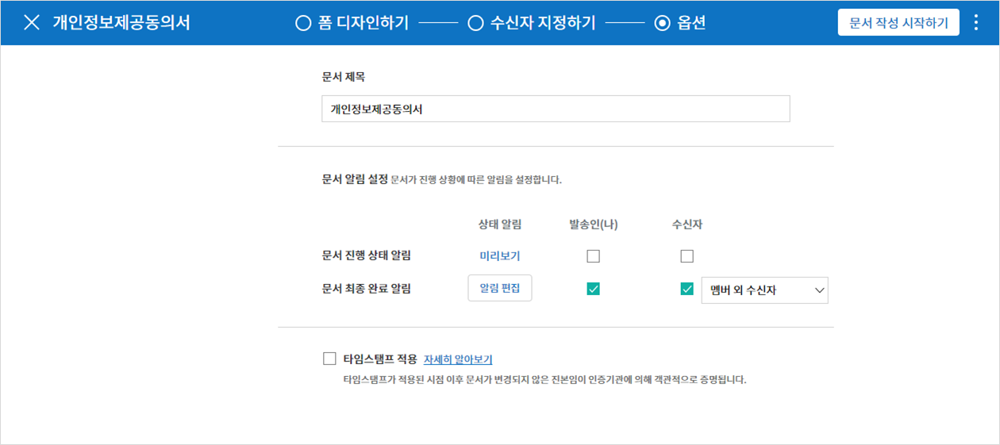

   

템플릿으로 문서 작성하기
------------------------

자주 사용하는 서식을 템플릿으로 만들어 문서 처리 과정인 워크플로우 등 상세 내용을 템플릿 별로 설정해 놓으면  필요할 때 마다 문서를 작성 및 전송할 수 있습니다. 템플릿은 **웹폼 디자이너** 또는 **폼 빌더(MS Office Add-in)**\ 를 사용해 만들 수 있으며, 자세한 내용은 `웹폼 디자이너로 템플릿 만들기 <chapter6.html#template_wd>`__\ 와 `폼 빌더로 템플릿 만들기 <chapter7.html#template_fb>`__\ 를 참고해 주세요.

.. note::

   문서 작성은 템플릿 관리자 권한이 있는 멤버가 **템플릿 설정 > 권한 설정**\ 에서 **템플릿 사용 권한**\ (=문서 작성 권한)을 부여한 그룹 또는 멤버만 할 수 있습니다. 템플릿 사용 권한을 부여받는 그룹 또는 멤버의 **템플릿으로 문서 작성** 목록에만 해당 템플릿이 나타나 작성할 수 있습니다.

1. 대시보드 또는 사이드 메뉴에서 **템플릿으로 문서 작성**\ 을 클릭해 이동합니다.

   |image14|

2. 작성하고자 하는 템플릿의 작성 아이콘(|image15|)을 클릭합니다.

   |image16|

3. 문서를 작성하고 우측 상단의 **전송** 버튼을 클릭하면 다음 단계 수신자 정보를 입력할 수 있는 팝업창이 표시됩니다. 

   .. note::

      템플릿의 설정된 워크플로우에 따라 **전송** 또는 **완료** 버튼으로 다르게 나타납니다.

   .. important::

      템플릿으로 문서 작성 도중에 **임시 저장** 버튼을 클릭해 저장된 문서는 **임시 보관함**\ 이 아닌 **처리할 문서함**\ 에서 확인할 수 있습니다.

      임시 저장한 문서를 계속 작성하려면 **처리할 문서함** 목록에서 해당 문서의 **편집** 버튼을 클릭해 계속 진행할 수 있습니다.

4. **문서 전송** 팝업창에서 문서를 전송할 수단을 이메일 또는 SMS(카카오톡) 중 하나 또는 모두 선택합니다. 

5. 수신자의 정보(이름, 이메일 또는 휴대폰 번호)를 입력하고 필요 시 함께 전달할 메시지도 입력합니다. 

   .. tip::

      **참조자 추가하는 방법**

      해당 문서에 참조자를 추가하려면 팝업창에서 **참조자 추가**\ 를 클릭합니다. 참조자 추가 팝업에서 해당 문서를 참조할 멤버 또는 그룹을 선택합니다.

      참조자는 문서의 진행상황을 모니터링 할 수 있으며, 문서 전송 및 완료 시 참조자에게 알림이 발송됩니다. 
      ❗단, 참조자는 그룹 또는 멤버만 지정할 수 있으며, 외부 수신자는 지정할 수 없습니다. 

      .. figure:: resources/add-cc-template.png
         :alt: 옵션 설정 화면
         :width: 400px

.. _bulksend:

일괄 작성으로 문서 대량 전송하기
-----------------------------------------

템플릿으로 문서 작성 시 **일괄 작성** 기능을 사용하면 한 번에 여러 명에게 문서를 전송할 수 있습니다.

.. note::

   이 작업은 **대표 관리자** 또는 **템플릿 사용 권한**\ 이 필요합니다.

**일괄 작성하기**

1. **새 문서 작성** **> 템플릿으로 문서 작성** 메뉴로 이동합니다.

2. 작성할 템플릿의 일괄 작성 아이콘을 클릭합니다.

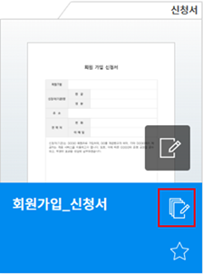

3. 일괄 작성할 문서에 데이터를 입력할 방법을 선택합니다. 데이터 입력은 이폼사인 화면에 **직접 편집** 하거나 **엑셀 파일을 업로드**\ 할 수 있습니다.

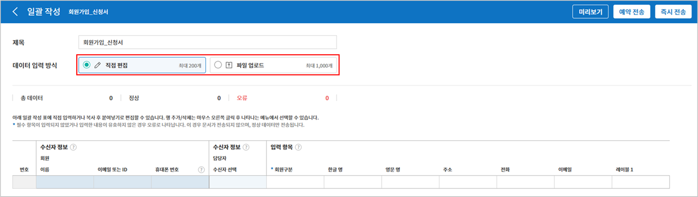

.. tip::

   **일괄 작성 문서 데이터 입력 방법**

   **방법 1. 데이터 직접 편집: 문서 최대 200개까지 가능**

   **직접 편집**\ 을 클릭하면, 이폼사인 화면에서 직접 데이터를 입력할 수 있는 표가 나타납니다. 문서의 입력항목이 각각의 열로 표시된 표입니다. 템플릿의 입력 항목 ID가 각 열의 제목으로 나타납니다. 1개의 행이 한 건의 문서이며, 첫번째 열인 번호 열 가장 하단 행의 숫자가 작성될 전체 문서의 수입니다.

   표는 엑셀과 비슷한 방법으로 사용할 수 있습니다. 각 셀을 더블클릭하여 내용을 입력하고 마우스 오른쪽을 클릭하여 행을 추가하거나 삭제할 수 있습니다. 셀에 입력된 값을 복사 – 붙여넣기, 끌어서 입력하기를 할 수 있습니다.

   .. figure:: resources/bulksend-edit.png
      :alt: 일괄작성 직접 편집 
      :width: 700px

   **방법 2. 파일 업로드: 최대 1000개까지 일괄 작성 가능**

   파일 업로드를 선택하면, 화면에 설명된 대로 우선 파일을 다운로드합니다. 문서의 입력항목이 입력된 엑셀 파일이 다운로드되며, 해당 파일에 데이터를 입력한 후 파일을 업로드합니다.

   .. figure:: resources/bulksend-fileupload.png
      :alt: 일괄작성 파일 업로드
      :width: 400px

4. 오른쪽 상단 **미리보기** 버튼을 클릭하여 작성된 문서를 확인합니다. 

5. **예약 전송** 또는 **즉시 전송** 버튼을 클릭하여 문서 일괄 작성을 완료합니다.

   .. figure:: resources/bulksend-sending.png
      :alt: 일괄작성 전송
      :width: 700px

   .. note::

      **예약 전송** 클릭 시 뜨는 문서 전송 예약 팝업에서 문서를 전송할 날짜 및 시간을 선택합니다.
      예약 전송은 현재 시간 기준으로 10분 후 부터 가능합니다. 

      .. figure:: resources/bulksend-schedule.png
         :alt: 일괄작성 예약전송
         :width: 400px

6. **일괄 작성 문서함**\ 에서 문서 전송 현황 등 문서에 관한 정보를 확인합니다.

.. tip::

   **일괄 작성 문서 TIP 1: 일괄 작성 시 입력된 데이터 오류 확인**

   **직접 편집** 또는 **파일 업로드** 방법으로 문서 일괄 작성 시, 입력된 데이터의 오류를 확인할 수 있습니다. 잘못된 데이터가 입력되거나, 필수 항목이 입력되지 않을 경우 데이터 오류로 표시됩니다. 문서 전송 시 오류로 표시된 데이터의 문서는 전송되지 않으며, 정상 데이터만 전송됩니다. 

   .. figure:: resources/bulksend-error.png
      :alt: 데이터 오류 확인
      :width: 400px

.. tip::

   **일괄 작성 문서 TIP 2: 일괄 작성 시 확인하세요!**

   템플릿의 입력 항목 중 일부가 **일괄 작성** 화면에 나타나지 않는 경우에는 아래 두 가지 경우를 확인해야 합니다.

   1. 일괄 작성에서 입력할 수 없는 입력 항목: 카메라, 녹음, 그룹으로 묶인 선택 입력 항목은 일괄 작성으로 작성할 수 없는 입력 항목입니다.

   2. 작성 단계에서 접근 허용된 입력 항목 확인: **템플릿 관리 > 템플릿 설정(⚙) > 워크플로우 설정 >** 해당 워크플로우 단계에 접근 허용된 입력 항목만 나타납니다.

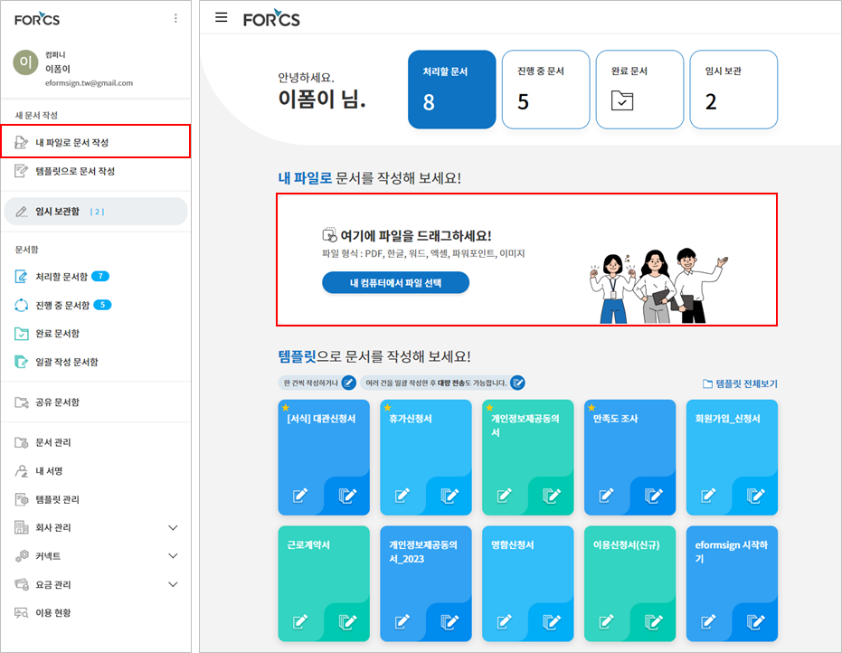
.. |image2| image:: resources/newfrommyfile-uploadfile.png
   :width: 700px
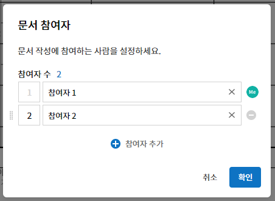
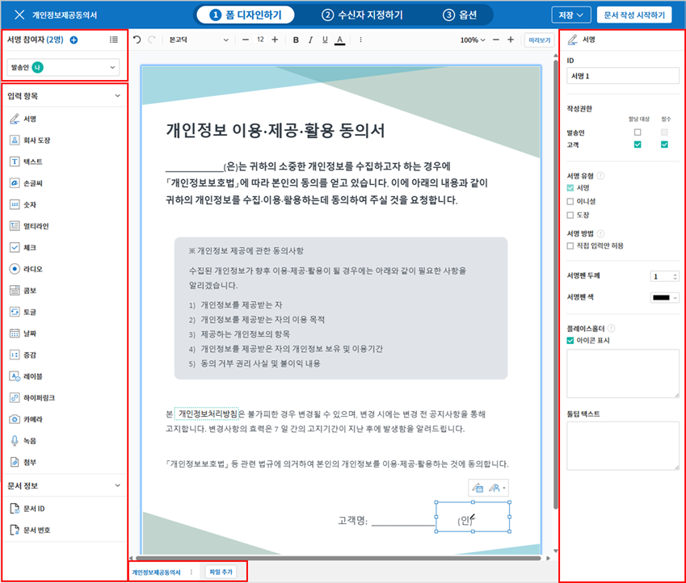
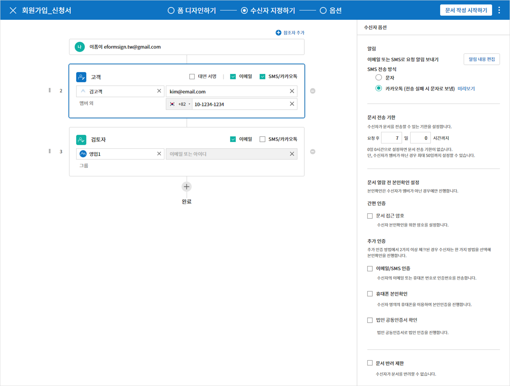
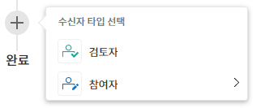
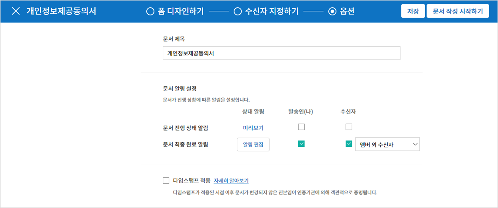

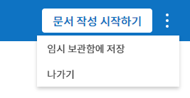
.. |image10| image:: resources/newfrommyfile-startfromnow.png
   :width: 700px
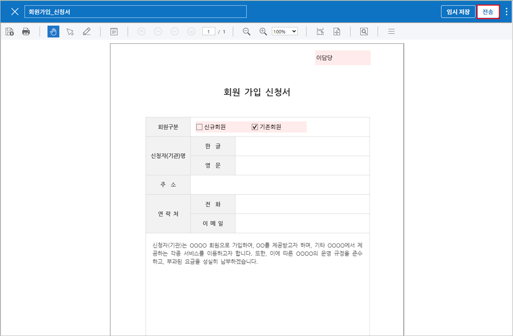
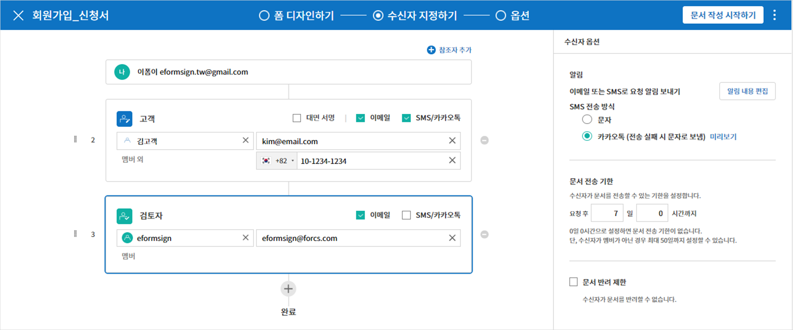
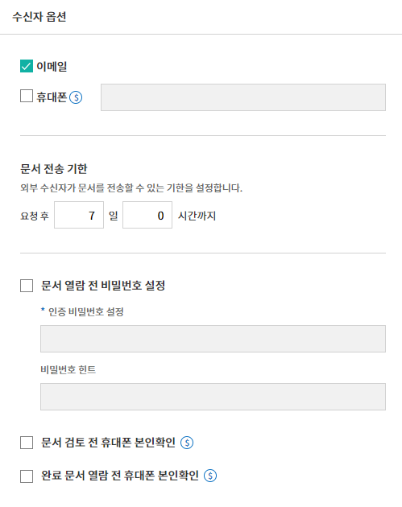
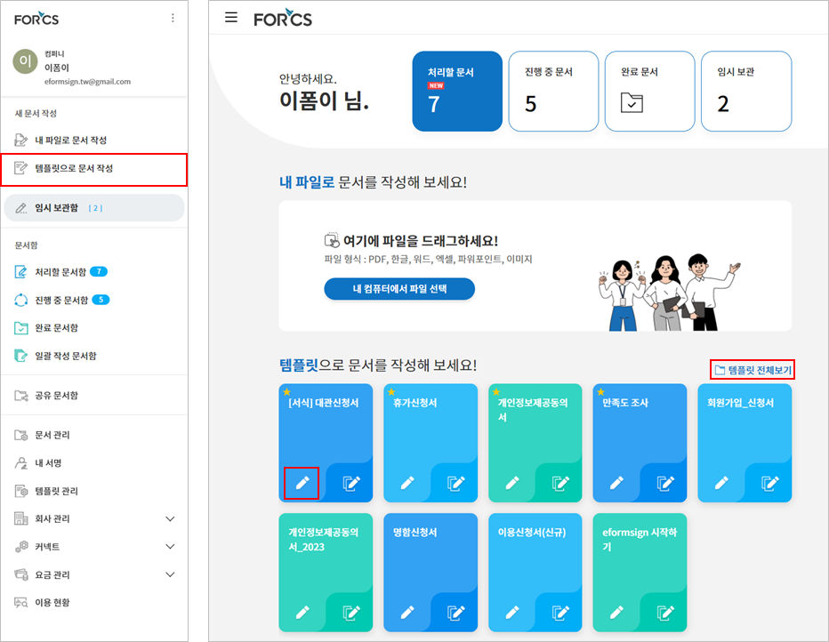

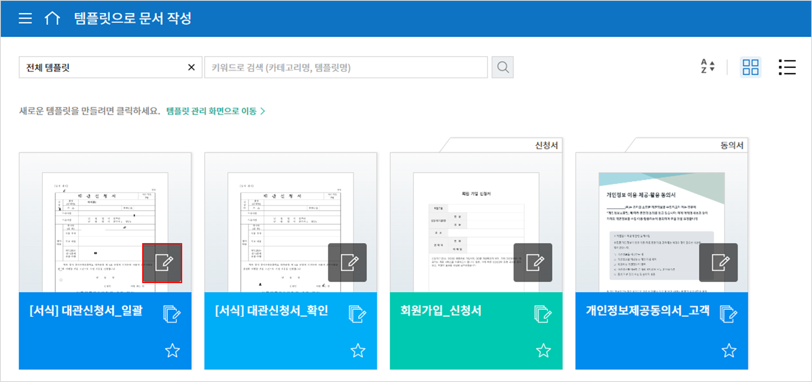
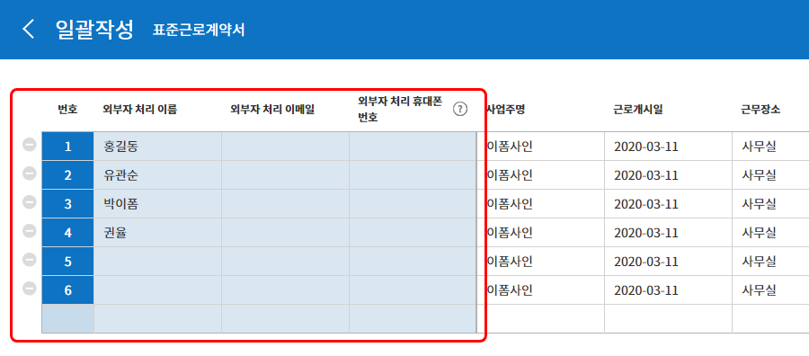
