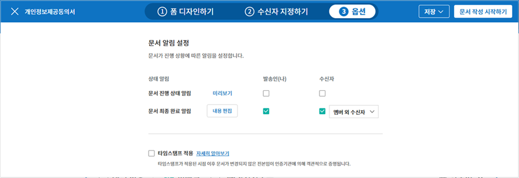
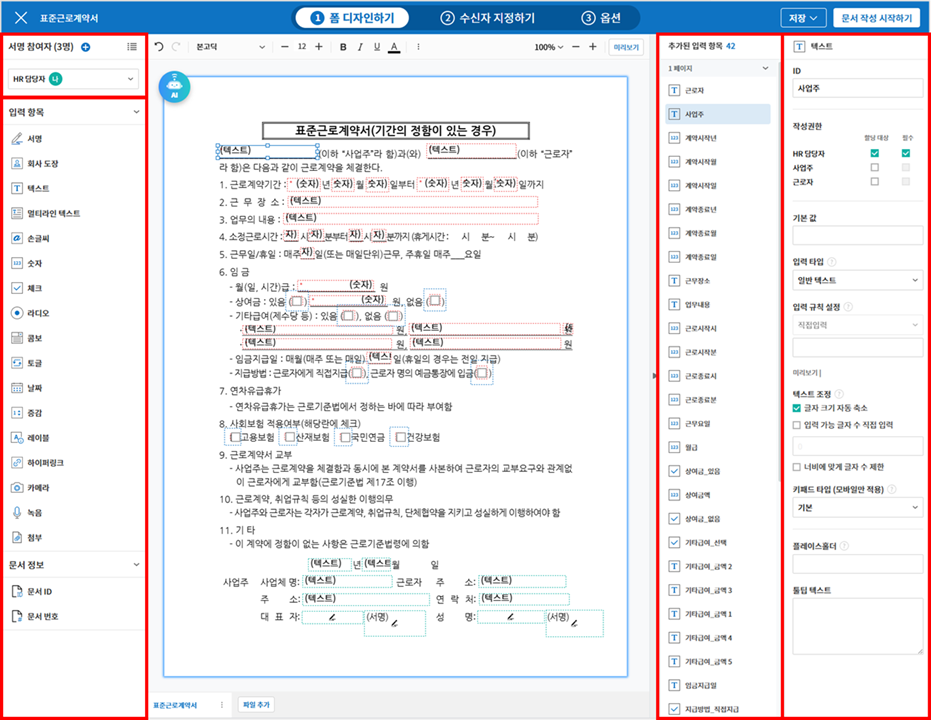

.. _createnew:

문서 작성하기
==================

eformsign에서 전자문서를 작성 및 전송하는 방법은 내 PC에 저장된 파일을 직접 업로드해서 전자문서를 만드는 방법과 eformsign에 저장된 기존에 만들어 놓은 템플릿을 사용하는 방법 두 가지가 있습니다.

-  **내 파일로 문서 작성**: 내가 가지고 있는 문서 파일을 사용해 바로 전자문서로 만들어 수신자에게 전송할 수 있습니다. 일회성으로 사용할 문서에 편리하게 사용할 수 있습니다. 

-  **템플릿으로 문서 작성**: 이미 만들어진 템플릿을 사용하여 문서를 작성합니다. 해당 메뉴를 클릭하면 대표 관리자 또는 권한이 있는 멤버가 이미 만들어 놓은 템플릿이 화면에 나타납니다. 

.. note::

   템플릿은 템플릿 관리 메뉴 또는 MS Office에서 만들 수 있으며, 자세한 내용은 `웹폼 디자이너로 템플릿 만들기 <chapter5.html#template_wd>`__\ 와 `MS Office에서 이폼사인 템플릿 만들기 <chapter7.html#template_fb>`__\ 를 참고해 주세요.

.. caution::

   **내 파일로 문서 작성**\ 하는 경우, 템플릿으로 변경하거나 저장할 수 없습니다.

   ❗자주 사용하는 문서는 **템플릿**\ 으로 등록해 사용하면 편리합니다.❗

.. _createnewfrommyfile:

내 파일로 문서 작성하기
---------------------------

사용하고자 하는 문서 파일을 업로드해서 문서의 원하는 위치에 입력 항목을 참여자 별로 지정하고 서명 참여자 및/또는 검토자 정보를 입력 후 바로 전송할 수 있습니다.

1. 대시보드에 파일을 드래그하거나 사이드바 메뉴에서 클릭하여 **내 파일로 문서 작성** 메뉴로 이동합니다.

   .. figure:: resources/newfrommyfile-menu.png
      :alt: 파일 추가
      :width: 700px

2. 원하는 문서 파일을 업로드하거나 내 문서 보관함에 저장된 문서 중 선택합니다.

   .. figure:: resources/newfrommyfile-uploadfile.png
      :alt: 파일 추가
      :width: 700px

   .. note::

      - 업로드 가능한 파일 형식: pdf, hwp, doc, docx, xls, xlsx, ppt, pptx, odt, jpg, png, gif, tiff

      - 파일 크기: 최대 9MB까지 업로드 가능

3. 문서에 참여하는 **서명 참여자**\ 를 추가하고 역할을 설정합니다.

   .. figure:: resources/newfrommyfile-participants-popup.png
      :alt: 파일 추가
      :width: 400px

   .. note::

      서명 참여자는 최대 30명까지 추가할 수 있으며, 화면 좌측 상단의 **참여자 추가**\ 를 클릭해 추가할 수도 있습니다.

      폼 디자인 후 **수신자 지정하기** 단계에서는 추가한 참여자 정보를 변경, 단계 추가, 삭제할 수 있습니다.

4. 각 참여자들이 작성할 입력 항목을 문서의 원하는 위치에 배치하고 각 입력 항목의 상세 설정을 오른쪽 설정 화면에서 지정합니다.

   .. figure:: resources/newfrommyfile-formdesign.png
      :alt: 파일 추가
      :width: 700px

   .. tip::

      **원본 파일을 추가하거나 수정할 수 있나요?** 

      **파일 추가하기**

      여러 개의 파일을 하나의 문서로 전송하고 싶은 경우 파일을 추가하여 하나의 문서로 만들 수 있습니다.
      또한, 입력 항목이 유지된 상태로 원본 파일을 변경하거나, 추가한 파일의 순서를 변경 또는 삭제할 수 있습니다.

      .. figure:: resources/add-file.png
         :alt: 파일 추가
         :width: 700px

      **파일 변경, 삭제, 이동하기**

      업로드한 파일을 수정하려면 파일을 수정한 후 하단의 더보기(⋮) 아이콘을 클릭, 파일 변경을 선택해 수정한 파일을 업로드해 주세요. 기존에 추가해 놓은 입력항목은 모두 유지된 채 원본 파일만 변경됩니다. 각 파일별로 더보기 메뉴(⋮)에서 파일 이름 변경, 파일 변경, 파일 삭제, 앞/뒤로 이동을 할 수 있습니다.

      .. figure:: resources/add-file-menu.png
         :alt: 파일 추가 더보기 메뉴
         :width: 400px

5. 입력 항목 설정 후 **수신자 지정하기** 단계에서 문서가 전송될 수신자 단계를 설정하고 **수신자별 상세 옵션**\ 을 설정합니다.

   .. figure:: resources/newfrommyfile-recipients.png
      :width: 700px

   .. note::

      **수신자 단계 설정하기**

      문서 수신자는 **참여자, 검토자, 열람자**\ 로 구분됩니다. 참여자는 문서 작성 시에 추가한 참여자가 **수신자 지정하기** 단계에서 나타나며 검토자 및 열람자는 해당 문서 처리 프로세스에 따라 추가할 수 있습니다. **수신자 지정하기**\ 에서 참여자, 검토자, 열람자를 삭제/추가할 수 있고 각 수신자별 이메일 등 연락처 정보를 입력하고 상세 옵션을 설정합니다.

      **❗참여자, 검토자, 열람자의 차이**

      - **참여자**\ 는 실제 문서에 서명, 작성 등 입력 항목에 **입력**\ 할 수 있습니다. 
      - **검토자**\ 는 문서에 직접 입력은 할 수 없고 문서 검토 후 **승인 여부만 결정**\ 합니다. 
      - **열람자**\ 는 문서를 승인하거나 작성할 수 없고 **열람**\ 만 할 수 있습니다. 

         |image6|

      **❗열람자 단계 문서 전송 옵션 설정**

      수신자 단계에서 열람자를 선택하면, 문서 전송 옵션을 통해 문서 처리 방법을 설정할 수 있습니다.  

      - **수신자가 문서를 열람하면 다음 단계로 전송:** 열람자 단계의 수신자가 문서를 열람해야지만 문서가 다음 단계로 전송됩니다.

      - **수신자의 문서 열람 여부와 관계없이 바로 다음 단계로 전송:** 열람자 단계의 수신자가 문서를 열람하지 않아도 문서가 다음 단계로 전송됩니다. 

      .. figure:: resources/needtoview_option.png
         :width: 300px

   .. tip::

      **수신자 단계 병합하기 - 동시 전송**

      일반적으로 수신자를 추가하면 설정된 순서에 따라 문서가 전송됩니다. 
      여러 단계의 수신자를 병합하면 병합된 단계 수신자에게 문서를 동시에 전송할 수 있습니다. 

      1. 병합할 수신자 단계 중 **아래에 있는 수신자를 클릭**\ 하면 왼쪽에 **전송 순서 합치기** 아이콘(|image17|)이 나타납니다. 
      2. 해당 아이콘(|image17|)을 클릭하면 하단과 상단의 단계가 합쳐집니다.

         .. figure:: resources/merge_steps.png
            :alt: 수신자 지정하기 > 합치기
            :width: 500px

         .. note::

            **병합된 단계 나누기**

            병합된 수신자 단계를 클릭하면 아이콘이 표시됩니다. 분할할 단계를 클릭 후 **전송 순서 나누기** 아이콘(|image18|)을 클릭하면 합쳐진 단계가 다시 분리됩니다.

            .. figure:: resources/split_steps.png
               :alt: 수신자 지정하기 > 순서 나누기
               :width: 500px

   .. tip::

      **참조자 추가하기**

      문서 전송 시 참조자를 추가할 수 있습니다. 참조자는 문서의 진행상황을 모니터링 할 수 있으며, 문서가 전송 및 완료되면 참조자에게 알림이 발송됩니다. 

      ❗단, 참조자는 **그룹 또는 멤버만 지정**\ 할 수 있으며, 외부 수신자는 참조자로 지정할 수 없습니다. 

      .. figure:: resources/add-cc.png
         :alt: 참조자 추가
         :width: 500px

6. **옵션**\ 을 클릭해 문서 알림 수신자를 설정하고 문서 완료 시 타임스탬프 적용 여부를 설정합니다.

   .. figure:: resources/newfrommyfile-option.png
      :alt: 옵셜 설정
      :width: 700px

   .. note::

      💡 **타임스탬프란?**   

      타임스탬프란 전자문서의 생성 시점확인(존재증명) 및 진본성 확인(내용증명)을 위한 공개키 기반(PKI)의 국제표준 기술로, 전자문서가 어느 특정 시각에 존재하고 있었다는 것을 증명하는 것과 동시에 그 시각 이후에 데이터가 변경되지 않았음을 증명하는 전자적 기술입니다.

      문서에 타임스탬프를 적용하면 특정 시점에 해당 문서가 존재하였으며, 그 이후 변경되지 않은 진본임이 인증기관에 의해 객관적으로 증명됩니다.

      ❗타임스탬프 적용 시 추가 비용(1건당 500원)이 발생합니다.

   .. tip::

      이 단계까지가 문서 서식에 대한 설정 단계입니다. **문서 작성 시작하기**\ 를 클릭하기 이전에 **저장** 을 클릭하면 설정한 내용 그대로 `내 문서 보관함 <chapter8.html#mydocuments>`__\ 에 보관되며, 저장된 파일을 다시 열어 문서를 편집 후 전송할 수 있습니다.  

7. 모든 설정을 완료한 후 **문서 작성 시작하기**\ 를 클릭합니다.

   .. figure:: resources/newfrommyfile-option.png
      :alt: 옵션 설정
      :width: 700px

   .. note::

      - 문서 제목은 업로드한 파일명으로 자동 설정되며 좌측 상단에서 수정할 수 있습니다.

         .. figure:: resources/newfrommyfile-edit-title.png
            :alt: 참조자 추가
            :width: 500px

      - **임시 저장** 버튼을 클릭하면 초안으로 저장되며, 처리할 문서함에서 확인할 수 있습니다.
        
      - **문서 작성 시작하기**\ 를 클릭한 시점부터 과금 대상 문서수에 카운트됩니다.

8. 문서를 확인 후 **전송** 버튼을 클릭하면 수신자에게 문서가 전송됩니다.

   |image11|

.. _recipient_settings:

수신자 지정하기 - 수신자 옵션 설정
~~~~~~~~~~~~~~~~~~~~~~~~~~~~~~~~~~~~~~~~~~

**폼 디자인하기** 단계에서 문서에 참여할 참여자, 즉 문서의 수신자를 추가하고 각 수신자별 입력항목을 설정하였습니다. 

**수신자 지정하기** 단계에서는 **폼 디자인하기** 단계에서 추가한 서명 참여자에 대한 연락처를 포함하여 상세 설정을 하고, 참여자의 순서를 변경, 삭제하거나 문서를 검토할 **검토자** 또는 **열람자**\ 를 추가할 수 있습니다. 

각 수신자별로 이름과 문서를 전송할 이메일 또는 아이디를 입력해야 하며, 참여자가 멤버일 경우 목록에서 선택하여 기존에 저장된 멤버 정보를 불러올 수 있습니다. 

.. tip::

   참여자, 검토자, 열람자 외에 참조자를 추가로 설정할 수 있습니다. 참조자는 문서의 진행 상황을 모니터링할 수 있으며, 문서 전송 및 완료 시 알림 메일을 받게 됩니다. 

   ❗ **참조자는 멤버**\ 만 설정할 수 있습니다. 

   |image12|

-  **문서 발송 수단 선택:** 이메일과 SMS/카카오톡 중 하나 또는 모두를 선택할 수 있으며, 멤버를 선택하면 기본으로 저장된 이메일 주소와 휴대폰 번호가 자동으로 입력됩니다.

   .. caution::

      SMS/카카오톡을 선택할 경우, 수신자 옵션의 알림 > SMS 전송 방식에서 선택 옵션에 따라 **SMS** 또는 **카카오톡 알림톡**\ 으로 발송됩니다. 카카오톡으로 선택하여 전송하였으나, 문서 수신자가 카카오톡을 사용하지 않는 등의 이유로 카카오톡으로 발송 실패하면 SMS로 전송됩니다. 

-  **알림:** **알림 내용 편집**\ 을 클릭하여 문서 전송 시 발송되는 문서 알림 메일 또는 SMS 메시지를 직접 편집할 수 있습니다. 또한, SMS 전송 방식(문자 또는 카카오톡 중 선택)을 선택할 수 있습니다.         

-  **문서 전송 기한 설정:** 수신자가 문서를 열람하고 제출할 수 있는 기한을 정할 수 있으며, 설정된 기간이 지나면 문서를 작성할 수 없습니다. 

   .. tip::

      수신자가 멤버인 경우, 문서 전송 기한이 없도록 설정하려면 **문서 전송 기한을 0일 0시간**\ 으로 설정해 주세요.
         외부 수신자의 경우 문서 전송 기한을 최대 50일까지 설정할 수 있습니다. 

- **문서 접근 암호:** 문서 열람 시 입력할 암호를 설정합니다. 암호 설정은 **직접 입력, 수신자 이름, 문서에 입력된 내용** 중 선택할 수 있으며, 암호 힌트를 임력하여 도움말을 제공할 수 있습니다. 

   .. figure:: resources/doc-password-setting.png
      :alt: 문서 접근 암호 설정
      :width: 400px   

   - **직접 입력:** 설정 단계에서 암호를 직접 입력하고 수신자에서 보여질 암호 힌트를 입력합니다. 

   - **수신자 이름:** 수신자 이름으로 설정하면 수신자 정보에 입력한 이름과 일치한 이름을 수신자가 암호로 입력해야 합니다.
   
   - **문서에 입력된 내용:** 문서 내 입력 항목을 선택하여 해당 입력 항목에 입력한 내용을 암호로 설정할 수 있습니다. 

-  **본인확인 설정**\ : 수신자가 본인확인을 진행할 시점과 수단을 설정할 수 있습니다. 문서 열람 전 또는 문서 작성 후 전송 전 본인확인을 진행하도록 설정할 수 있습니다.  

      .. figure:: resources/additional-verification.png
         :alt: 본인확인 설정
         :width: 400px 

   -  **문서 열람 전 본인확인 진행**\ : 수신자가 문서 열람 전 본인확인을 진행하도록 설정합니다. 

      - **이메일/SMS 인증:** 수신자의 이메일 또는 휴대폰 번호로 6자리 인증번호를 발송합니다. 수신자는 인증번호를 인증 창에 입력 후 문서 열람을 할 수 있습니다.

      - **휴대폰/인증서 본인확인:** 수신자 명의의 휴대폰이나 간편인증서(네이버/카카오/PASS) 또는 개인 공동인증서로 본인확인을 진행한 후 문서를 열람하도록 설정합니다.

      - **법인 공동인증서 확인:** 법인간 계약 시 법인 공동인증서로 법인 인증을 진행한 후 문서를 열람하도록 설정합니다. 사업자등록번호는 **직접 입력, 문서에 입력된 내용, 입력 안 함** 중 선택할 수 있습니다. 

      .. tip::

         문서가 완료된 후 문서를 열람할때도 설정한 인증을 진행한 후 열람하도록 설정하려면 **완료 문서 열람 시에도 인증 진행**\ 을 체크해 주세요. 

   -  **문서 전송 전 본인확인 진행**\ : 수신자가 문서를 작성 후 전송하기 전에 본인확인을 진행하도록 설정합니다. 

      - **이메일/SMS 인증:** 수신자의 이메일 또는 휴대폰 번호로 6자리 인증번호를 발송합니다. 수신자는 인증번호를 인증 창에 입력 후 문서를 전송할 수 있습니다. 

      - **휴대폰/인증서 본인확인:** 수신자 명의의 휴대폰이나 간편인증서(네이버/카카오/PASS) 또는 개인 공동인증서로 본인확인을 진행한 후 문서를 전송하도록 설정합니다.

      - **법인 공동인증서 확인:** 법인간 계약 시 법인 공동인증서로 법인 인증을 진행한 후 문서를 전송하도록 설정합니다. 사업자등록번호는 **직접 입력, 문서에 입력된 내용, 입력 안 함** 중 선택할 수 있습니다. 

      .. note::

         인증 방법을 모두 선택하면 수신자가 인증 진행 단계에서 3가지 중 1가지 방법을 선택해 진행할 수 있습니다. 
         ❗이메일 인증을 제외한 추가 인증 수단은 모두 별도의 추가 비용이 발생됩니다. ``SMS 인증 20원/건, 휴대폰/인증서 본인확인 50원/건, 법인 공동인증서 확인 50원/건``

-  **인증서 기반 전자서명 설정**

      .. figure:: resources/digital-signature.png
         :alt: 인증서 서명 설정
         :width: 400px 

   - **문서에 전자서명 추가:** 해당 단계의 수신자가 문서를 작성 후 인증서 전자서명을 진행하도록 설정합니다. ❗문서 전송 전 본인확인과 중복으로 설정할 수 없습니다. 

      - **간편인증서/공동인증서 전자서명:** 수신자의 간편인증서(네이버/카카오/PASS) 또는 개인 공동인증서로 전자서명을 진행한 후 전송하도록 설정합니다.

      - **법인 공동인증서 전자서명:** 법인간 계약 시 법인 공동인증서로 전자서명을 진행한 후 전송하도록 설정합니다. 사업자등록번호는 **직접 입력, 문서에 입력된 내용, 입력 안 함** 중 선택할 수 있습니다. 

      .. tip::

         인증서 전자서명을 적용하면 신뢰할 수 있는 인증 기관의 인증서로 전자서명을 부여함으로써 문서의 무결성을 보장합니다. 인증서 전자서명이 적용된 문서는 PDF 파일로 다운로드 후 Adobe Acrobat Reader를 통해 열어 전자서명 내역을 확인할 수 있습니다. 
         ❗인증서 기반 전자서명은 추가 비용(50원/건)이 발생됩니다. 

-  **문서 반려 제한:** 수신자가 문서를 반려할 수 없도록 설정합니다. 옵션에 체크하면 해당 수신자의 문서 화면에 **반려** 버튼이 나타나지 않습니다. 

.. tip::

   💡 **대면 서명 기능 활용하기**
    
   서명자와 직접 대면하여 태블릿 PC나 모바일 등 하나의 기기에서 문서에 서명을 진행하려면 대면 서명 기능을 활용해 보세요.
   대면 서명 기능을 사용하면 각 대면 서명자에 대한 정보가 문서 이력 및 감사추적증명서에 기록되며, 문서가 완료되면 대면 서명자에게 완료 문서가 자동으로 전달되도록 설정할 수 있습니다. 

   대면 서명자로 설정할 수신자 단계에서 **대면 서명**\ 을 선택합니다. 
   해당 단계는 **대면 서명자**\ , 바로 전 단계는 **대면 서명 진행자**\ 가 됩니다. 대면 서명자는 문서 서명 전 휴대폰 인증 등 본인확인을 진행하도록 설정할 수도 있습니다.

   - **대면 서명 진행자:** 대면 서명을 시작 및 완료할 수 있으며, 참여자인 경우 서명도 할 수 있습니다. 멤버만 설정 가능하며, 열람자는 대면 서명 진행자가 될 수 없습니다.
   - **대면 서명자:** 서명하는 사람으로 워크플로우 수신자 타입 중 참여자만 설정할 수 있습니다. 
   

   .. figure:: resources/inperson-signing-wf.png
      :alt: 대면 서명 설정
      :width: 700px
   

   ✅ 대면 서명 설정 시 문서 진행 방법은 `다음 <https://www.eformsign.com/kr/blog/november-2023-update/>`__\ 을 참고해 주세요. 

.. note::

   **❗열람자 단계 문서 전송 옵션 설정**

   수신자 단계에서 열람자를 선택하면, 우측 **속성 > 문서 전송 옵션**\ 에서 문서 처리 방법을 설정해야 합니다.  

   .. figure:: resources/needtoview_option.png
      :width: 300px

   - **수신자가 문서를 열람하면 다음 단계로 전송:** 열람자 단계의 수신자가 문서를 열람해야만 문서가 다음 단계로 전송됩니다.
 
   - **수신자의 문서 열람 여부와 관계없이 바로 다음 단계로 전송:** 열람자 단계의 수신자가 문서를 열람하지 않아도 문서가 다음 단계로 전송됩니다. 

 
.. _hide1:

문서 일부 숨기기 설정
^^^^^^^^^^^^^^^^^^^^^^^^^^^^^^^^^^^^^^^^^^^^^^^^^^^^^^^^^^

.. tip::

      **파일 추가하기 및 수신자별 파일 숨기기**

      여러 개의 파일을 하나의 문서로 전송하고 싶은 경우 파일을 추가하여 하나의 문서로 만들 수 있습니다.  

      1. 문서 하단의 **파일 추가** 버튼을 클릭합니다.
      2. 팝업창에서 추가할 문서를 선택합니다. 
      3. 각 파일별로 더보기 메뉴(⋮)에서 파일 이름 변경, 파일 변경, 파일 삭제, 앞/뒤로 이동을 할 수 있습니다.

      .. figure:: resources/add-file.png
         :alt: 파일 추가
         :width: 700px

      .. figure:: resources/add-file-menu.png
         :alt: 파일 추가 더보기 메뉴
         :width: 400px

      추가한 파일별로 일부 수신자에게는 문서가 보이지 않도록 설정할 수 있습니다. 
      ❗단, 수신자가 내부 멤버일 경우에는 적용되지 않습니다.

      1. 파일 추가를 클릭해 파일을 추가합니다. 
      2. 수신자 지정하기 단계에서 해당 수신자 단계의 **수신자 옵션**\ 에서 **문서 일부 숨기기 설정** 옵션을 체크합니다. 
      3. 문서 파일별로 **보이기** 또는 **숨기기**\ 를 선택합니다.

            - **보이기:** 보이기를 선택하면 해당 문서는 해당 단계의 수신자에게 보여지게 됩니다.

            - **숨기기:** 숨기기를 선택하면 해당 문서는 해당 단계의 수신자에게 보이지 않게 됩니다. 

      .. figure:: resources/newfrom-hide.png
         :alt: 내 파일로 문서 작성-파일 숨기기
         :width: 700px

.. _option:

옵션 설정
~~~~~~~~~~~~~~~~~~~~~~~~~~~~~~~~~~~~~~~~~~
마지막 옵션 설정에서는 문서 알림 설정 및 편집, 타임스탬프 적용 여부를 설정할 수 있습니다.

- **문서 알림 설정:** 문서의 진행 상태 및 문서 완료에 대한 알림을 받을 수신자를 설정하고 알림 메시지를 미리보기 또는 편집할 수 있습니다. 

   **문서 최종 완료 알림 편집**

      .. figure:: resources/template-setting-notification-editl.png
        :alt: 알림 내용 편집
        :width: 600px

   - **알림 템플릿 선택:** 알림 템플릿은 기본 템플릿으로 설정되어 있으며, 별도로 만든 알림 템플릿이 있으면 변경할 수 있습니다. 새로운 알림 템플릿 추가하는 방법은 `알림 템플릿 관리 <chapter9.html#notification-template>`__\ 를 참고해 주세요.  

   - **이메일 제목:** 문서 완료 시 발송되는 이메일 제목을 설정합니다. 

   - **SMS 메시지:** 문서 완료 알림이 SMS으로 전송될 경우 SMS로 전송되는 메시지를 설정합니다. 설정한 메시지와 함께 문서를 확인할 수 있는 링크가 전송됩니다. 

      .. note::

         메시지 길이는 최대 65byte(한글 32자, 영문 65자)까지 작성할 수 있습니다. 

   - **본문 내용:** 알림 메시지의 본문 내용을 편집할 수 있습니다. 

   - **첨부 파일 및 첨부 방법:** 완료 알림에 같이 보낼 파일을 선택하고 첨부 방법을 선택합니다. 

      - **문서 보기 링크:** 완료 문서가 링크(버튼) 형태로 알림 메일 또는 SMS/카카오톡 알림에 포함되어 전송되며, 링크(버튼)를 클릭하면 문서 뷰어 페이지가 열립니다. 뷰어에서 완료 문서를 열람 및 다운로드할 수 있습니다.

      - **파일 첨부:** 이메일에 PDF 파일로 첨부되어 전송됩니다. 단, 문서의 파일 크기가 10MB를 초과하거나 SMS/카카오톡 알림은 **다운로드 링크** 방식으로 전송됩니다.

      .. caution::

         **파일 첨부** 형태로 이메일 알림을 보내면 이메일에 완료문서가 첨부되어 전송되기 때문에 문서 열람 시 본인확인을 하도록 설정하더라도 본인확인을 진행하지 않고 문서를 열람/다운로드할 수 있습니다. 

- **타임스탬프 적용:** 완료된 문서에 타임스탬프가 적용되도록 설정합니다.

.. note::

   💡 **타임스탬프란?** 

      타임스탬프란 전자문서의 생성 시점확인(존재증명) 및 진본성 확인(내용증명)을 위한 공개키 기반(PKI)의 국제표준 기술로, 전자문서가 어느 특정 시각에 존재하고 있었다는 것을 증명하는 것과 동시에 그 시각 이후에 데이터가 변경되지 않았음을 증명하는 전자적 기술입니다.

      문서에 타임스탬프를 적용하면 특정 시점에 해당 문서가 존재하였으며, 그 이후 변경되지 않은 진본임이 인증기관에 의해 객관적으로 증명됩니다.

      ❗타임스탬프 적용 시 추가 비용(1건당 500원)이 발생합니다.
 

.. _createnewfromtemplate:

템플릿으로 문서 작성하기
------------------------

자주 사용하는 서식을 템플릿으로 만들어 문서 처리 과정인 워크플로우 등 상세 내용을 템플릿별로 설정해 놓으면 필요할 때 마다 문서를 작성 및 전송할 수 있습니다. 

템플릿은 **템플릿 관리** 메뉴 또는 **MS Office**\ 에서 만들 수 있으며, 자세한 내용은 `웹폼 디자이너로 템플릿 만들기 <chapter5.html#template_wd>`__\ 와 `MS Office에서 이폼사인 템플릿 만들기 <chapter7.html#template_fb>`__\ 를 참고해 주세요.

.. note::

   문서 작성은 템플릿 관리자 권한이 있는 멤버가 **템플릿 설정 > 권한 설정**\ 에서 **템플릿 사용 권한**\ (=문서 작성 권한)을 부여한 그룹 또는 멤버만 할 수 있습니다. 템플릿 사용 권한을 부여받는 그룹 또는 멤버의 **템플릿으로 문서 작성** 목록에만 해당 템플릿이 나타나 작성할 수 있습니다.

1. **새 문서 작성 > 템플릿으로 문서 작성** 으로 이동하거나 대시보드에서 해당 템플릿의 문서 작성 아이콘(|image2|)을 클릭합니다. 

   .. figure:: resources/startfromtemplate.png
      :alt: 템플릿으로 문서 작성
      :width: 700px
   
   .. figure:: resources/startfromtemplate-create.png
      :alt: 템플릿으로 문서 작성
      :width: 700px

2. 문서를 작성하고 우측 상단의 **전송** 버튼을 클릭하면 다음 단계 수신자 정보를 입력할 수 있는 팝업창이 표시됩니다. 

   .. note::

      템플릿의 설정된 워크플로우에 따라 **전송** 또는 **완료** 버튼으로 다르게 나타납니다.

   .. important::

      ❗템플릿으로 문서 작성 도중에 **임시 저장** 버튼을 클릭해 저장된 문서는 **임시 보관함**\ 이 아닌 **처리할 문서함**\ 에서 확인할 수 있습니다.

      임시 저장한 문서를 계속 작성하려면 **처리할 문서함** 목록에서 해당 문서의 **편집** 버튼을 클릭해 계속 진행할 수 있습니다.

3. **문서 전송** 팝업창에서 문서를 전송할 수단을 이메일 또는 SMS(카카오톡) 중 하나 또는 모두 선택합니다. 

4. 수신자의 정보(이름, 이메일 또는 휴대폰 번호)를 입력하고 필요 시 함께 전달할 메시지도 입력합니다. 

   .. tip::

      **참조자 추가하는 방법**

      해당 문서에 참조자를 추가하려면 팝업창에서 **참조자 추가**\ 를 클릭합니다. 참조자 추가 팝업에서 해당 문서를 참조할 멤버 또는 그룹을 선택합니다.

      참조자는 문서의 진행상황을 모니터링 할 수 있으며, 문서 전송 및 완료 시 참조자에게 알림이 발송됩니다. 
      ❗단, 참조자는 ``그룹 또는 멤버`` 만 지정할 수 있으며, 외부 수신자는 지정할 수 없습니다. 

      .. figure:: resources/add-cc-template.png
         :alt: 옵션 설정 화면
         :width: 400px

.. _bulksend:

문서 대량 전송하기
-----------------------------------------

템플릿으로 문서 작성 시 **일괄 작성** 기능을 사용하면 한 번에 여러 명에게 문서를 작성하여 전송할 수 있습니다.

.. note::

   이 작업은 **대표 관리자** 또는 **템플릿 사용 권한**\ 이 필요합니다.

**일괄 작성하기**

1. **새 문서 작성> 템플릿으로 문서 작성** 메뉴로 이동하거나 대시보드에서 해당 템플릿의 일괄 작성 아이콘(|image1|)을 클릭합니다. 

.. figure:: resources/bulk-creation-icon.png
   :alt: 일괄 작성 아이콘
   :width: 200px

2. 일괄 작성할 문서에 데이터를 입력할 방법을 **직접 편집** 또는 **파일 업로드**\ 중 선택합니다.

.. tip::

   **일괄 작성 문서 데이터 입력 방법**

   **방법 1. 데이터 직접 편집: 문서 최대 200개까지 가능**

   **직접 편집**\ 을 클릭하면, 이폼사인 화면에서 직접 데이터를 입력할 수 있는 표가 나타납니다. 문서의 입력항목이 각각의 열로 표시된 표입니다. 템플릿의 입력 항목 ID가 각 열의 제목으로 나타납니다. 1개의 행이 한 건의 문서이며, 첫번째 열인 번호 열 가장 하단 행의 숫자가 작성될 전체 문서의 수입니다.

   표는 엑셀과 비슷한 방법으로 사용할 수 있습니다. 각 셀을 더블클릭하여 내용을 입력하고 마우스 오른쪽을 클릭하여 행을 추가하거나 삭제할 수 있습니다. 셀에 입력된 값을 복사 – 붙여넣기, 끌어서 입력하기를 할 수 있습니다.

   .. figure:: resources/bulksend-edit.png
      :alt: 일괄작성 직접 편집 
      :width: 700px

   **방법 2. 파일 업로드: 최대 1000개까지 일괄 작성 가능**

   파일 업로드를 선택하면, 화면에 설명된 대로 우선 **파일을 다운로드**\ 합니다. 문서의 입력항목이 입력된 엑셀 파일이 다운로드되며, **해당 파일에 데이터를 입력한 후 파일을 업로드**\ 합니다.

   .. figure:: resources/bulksend-fileupload.png
      :alt: 일괄작성 파일 업로드
      :width: 400px

3. 오른쪽 상단 **미리보기** 버튼을 클릭하여 작성된 문서를 확인합니다. 

4. **예약 전송** 또는 **즉시 전송** 버튼을 클릭하여 문서 일괄 작성을 완료합니다.

   .. figure:: resources/bulksend-sending.png
      :alt: 일괄작성 전송
      :width: 700px

   .. note::

      **예약 전송** 클릭 시 뜨는 문서 전송 예약 팝업에서 문서를 전송할 날짜 및 시간을 선택합니다.
      예약 전송은 현재 시간 기준으로 10분 후 부터 가능합니다. 

      .. figure:: resources/bulksend-schedule.png
         :alt: 일괄작성 예약전송
         :width: 400px

5. **일괄 작성 문서함**\ 에서 문서 전송 현황 등 문서에 관한 정보를 확인합니다.

.. tip::

   **일괄 작성 문서 TIP 1: 일괄 작성 시 입력된 데이터 오류 확인**

   **직접 편집** 또는 **파일 업로드** 방법으로 문서 일괄 작성 시, 입력된 데이터의 오류를 확인할 수 있습니다. 잘못된 데이터가 입력되거나, 필수 항목이 입력되지 않을 경우 데이터 오류로 표시됩니다. 문서 전송 시 오류로 표시된 데이터의 문서는 전송되지 않으며, 정상 데이터만 전송됩니다. 

   .. figure:: resources/bulksend-error.png
      :alt: 데이터 오류 확인
      :width: 400px

.. tip::

   **일괄 작성 문서 TIP 2: 일괄 작성 시 확인하세요!**

   템플릿의 입력 항목 중 일부가 **일괄 작성** 화면에 나타나지 않는 경우에는 아래 두 가지 경우를 확인해야 합니다.

   1. 일괄 작성에서 입력할 수 없는 입력 항목: ``카메라``, ``녹음``, ``그룹으로 묶인 선택`` 입력 항목은 일괄 작성으로 작성할 수 없는 입력 항목입니다.

   2. 작성 단계에서 접근 허용된 입력 항목 확인: **템플릿 관리 > 템플릿 설정(⚙) > 워크플로우 설정 >** 해당 워크플로우 단계에 접근 허용된 입력 항목만 나타납니다.

.. |image1| image:: resources/bulksend-icon-dashboard.png
   :width: 30px
.. |image2| image:: resources/create-icon2.png
   :width: 20px
.. |image3| image:: resources/newfrommyfile-participants-popup.png
   :width: 400px

.. |image5| image:: resources/newfrommyfile-recipients.png
   :width: 700px
.. |image6| image:: resources/newfrommyfile-recipients-type.png

.. |image8| image:: resources/menu_icon_3.png
   :width: 20px

.. |image10| image:: resources/newfrommyfile-startfromnow.png
   :width: 700px

.. |image12| image:: resources/newformmyfile-recipientoption-member.png
   :width: 700px
.. |image13| image:: resources/newformmyfile-recipientoption-external.png
   :width: 400px

.. |image15| image:: resources/create-icon.PNG
   :width: 30px
.. |image16| image:: resources/startfromtemplate-create.png
   :width: 700px
.. |image17| image:: resources/workflow_merge_icon.png
      :width: 30px
.. |image18| image:: resources/workflow_unmerge_icon.png
      :width: 30px
