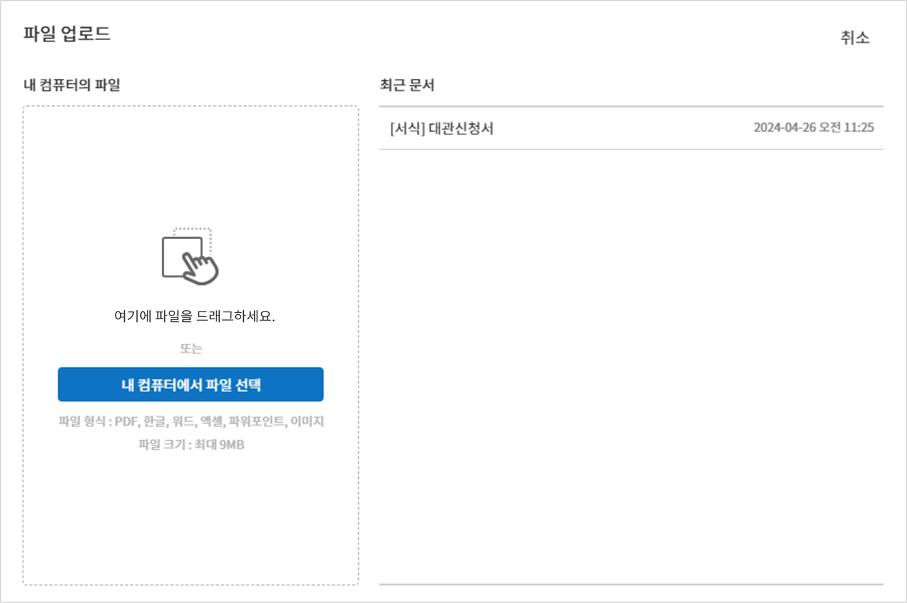
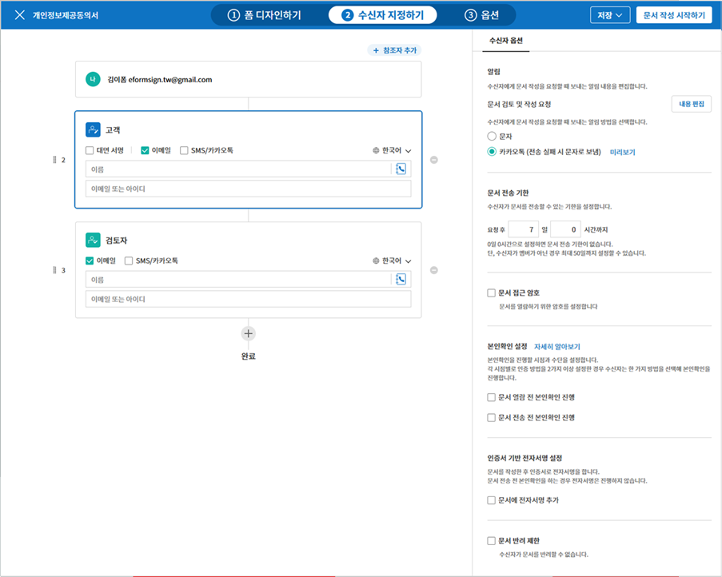
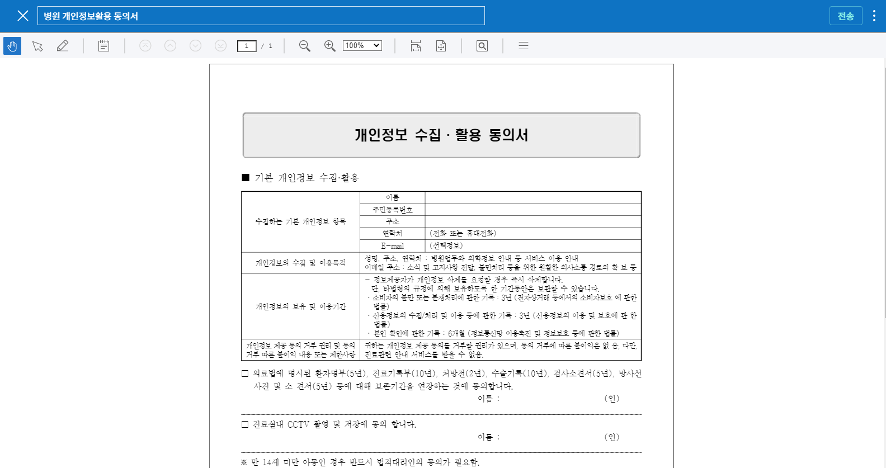

.. _createnew:

문서 작성하기
==================

eformsign을 사용하면 누구나 쉽게 기존의 문서를 전자 문서로 변환해 문서를
작성, 요청 또는 처리 등을 할 수 있습니다. eformsign에서 전자 문서를 작성
및 전송하는 방법은 크게 두 가지가 있습니다. 내 PC에 저장된 파일을 직접
업로드해서 전자 문서를 만드는 방법과 eformsign에 저장된 기존에 만들어
놓은 템플릿을 사용하는 방법입니다.

-  **내 파일로 문서 작성**: 내가 가지고 있는 문서 파일(PDF)을 사용해 바로 전자 서식으로 만들어 참여자에게 전송할 수 있습니다.

-  **템플릿으로 문서 작성**: 이미 만들어진 템플릿을 사용하여 문서를 작성합니다. 해당 메뉴를 클릭 시 대표 관리자 또는 템플릿 관리 권한이 있는 멤버가 이미 만들어 놓은 템플릿이 화면에 나타납니다.

.. note::

   템플릿은 대표 관리자 또는 템플릿 관리 권한이 있는 멤버만 만들 수 있으며, 화면에 나타나는 템플릿은 해당 템플릿의 권한 설정에서 사용권한을 부여한 멤버에게만 보여집니다. 템플릿 생성하는 방법은 웹폼 디자이너와 폼 빌더를 사용하여 만들 수 있으며, 자세한 내용은 `웹폼 디자이너로 템플릿 만들기 <chapter6.html#template_wd>`__\ 와 `폼 빌더로 템플릿 만들기 <chapter7.html#template_fb>`__\ 를 참고해 주세요.

.. important::

   **내 파일로 문서를 작성**\ 하는 경우, 템플릿으로 변경하거나 저장할 수 없습니다. 자주 사용하는 문서의 경우 템플릿으로 등록해 사용하면 편리합니다.

내 파일로 문서 작성하기
---------------------------

사용하고자 하는 PDF 파일을 바로 업로드해서 문서의 원하는 위치에 입력항목(컴포넌트)을 참여자 별로 지정하고 바로 문서 참여자 및/또는 검토자 정보를 입력 후 전송할 수 있습니다.

1. **내 파일로 문서 작성** 메뉴로 이동합니다.

   |image1|

2. 원하는 문서 파일(PDF)을 업로드합니다.

   |image2|

   .. note::

      현재는 PDF 파일만 지원합니다. 향후 다양한 형태의 파일을 직접 업로드할 수 있도록 지원할 예정입니다.

3. 문서 작성에 참여하는 **문서 참여자**\ 를 추가하고 역할을 설정합니다.

   |image3|

   .. note::

      문서 참여자는 화면 좌측 상단의 **참여자 추가** 버튼을 눌러 추가할 수도 있으며 최대 30명까지 설정할 수 있습니다.

      폼 디자인 후 **수신자 지정하기** 단계에서도 설정한 참여자 정보를 변경 및 추가, 삭제할 수 있습니다.

4. 각 참여자들이 작성할 컴포넌트를 배치하고 각 컴포넌트의 상세 설정을 오른쪽 설정 탭에서 지정합니다.

   |image4|

5. 컴포넌트 배치 후 수신자 지정하기 단계에서 이메일, 휴대폰 번호 등 연락처 정보를 입력하고 **수신자 별 상세 옵션**\ 을 설정합니다.

   |image5|

   .. note::

      문서 수신자는 참여자와 검토자로 구분됩니다. 문서 작성 시에 추가한 참여자가 수신자 지정하기 단계에서 나타나며 각 수신자의 이메일 등의 연락처 정보를 입력하면 됩니다. 이 수신자 설정 화면에서 참여자/검토자를 삭제/추가할 수 있고 각 수신자 별 상세 옵션을 설정합니다.

   .. tip::

      **참여자와 검토자의 차이**

      참여자는 실제 문서에 서명, 작성 등 컴포넌트에 입력할 수 있으며, 검토자는 문서에 입력을 할 수 없고 문서 검토 후 승인 여부만 결정합니다.

      단, 컴포넌트 별 작성 권한을 **누구나**\ 로 설정할 경우 검토자도 컴포넌트에 입력할 수 있습니다.

      |image6|

6. **옵션**\ 을 클릭해 문서 제목, 문서 완료 시 타임스탬프 적용 여부 등을 설정합니다.

   |image7|

   .. note::

      이 단계까지가 문서 서식에 대한 설정 단계입니다. **문서 작성 시작하기**\ 를 클릭하기 이전에 임시 저장 후 문서 작성을 중단할 경우 `임시 보관함 <chapter8.html#drafts>`__\ 에 보관되며, 저장된 파일을 다시 열어 이후의 단계를 진행할 수 있습니다. 문서의 임시 저장은 오른쪽 상단의 (|image8|) 메뉴 아이콘을 클릭하여 **임시 보관함에 저장**\ 을 클릭합니다.

      |image9|

7. 모든 설정을 완료한 후 **문서 작성 시작하기**\ 를 클릭합니다.

   |image10|

   .. caution::

      **문서 작성 시작하기**\ 를 클릭한 시점부터 과금 대상 문서수에 카운트됩니다.

8. 문서를 확인 후 **전송** 버튼을 클릭하면 수신자에게 문서가 전송됩니다.

   |image11|

**수신자 지정하기 > 수신자 옵션 설정**

**폼 디자인하기** 단계 또는 **수신자 지정하기** 단계에서 문서에 참여할 참여자, 즉 문서의 수신자를 추가할 수 있습니다.

**수신자 지정하기** 단계에서는 참여자에 대한 상세 설정인 수신자 옵션을 설정하는 것은 물론, 참여자를 추가 또는 삭제하거나 문서를 검토할 검토자를 추가할 수 있습니다.

참여자 또는 검토자 별로 이름과 문서를 전송할 이메일 또는 아이디를 입력해야 하며, 참여자가 멤버일 경우 목록에서 선택하여 기존에 저장된 멤버 정보를 불러올 수 있습니다. 수신자 옵션은 참여자 또는 검토자가 멤버일 경우와 멤버가 아닌 외부 수신자일 경우 각각 다르게 나타납니다.

-  **수신자가 멤버일 경우**

   기본으로 저장된 이메일 주소와 휴대폰 번호가 자동으로 뜨며 문서가 발송될 수단을 선택할 수 있습니다.

   .. caution::

      휴대폰을 선택할 경우, SMS 또는 카카오 알림톡으로 발송되며 건당 추가요금이 발생됩니다.

   |image12|

-  **멤버가 아닌 외부 수신자일 경우**

   입력한 정보가 멤버의 정보와 일치하지 않을 경우 외부 수신자로 인식되어 다음의 항목에 대해 상세 옵션을 설정해야 합니다.

   -  **문서 발송 수단 선택:** 이메일과 휴대폰 중 둘중 하나 또는 모두를 선택할 수 있으며, 휴대폰을 선택하면 발송할 휴대폰 번호를 입력해야 합니다.

      .. caution::

         휴대폰을 선택할 경우, SMS 또는 카카오 알림톡으로 발송되며 건당 추가 요금이 발생합니다.

   -  **문서 전송 기한 설정:** 외부 수신자가 문서를 열람하고 제출할 수
      있는 기한을 정할 수 있으며, 설정된 기간이 지나면 문서를 작성할 수
      없게 됩니다.

   -  **문서 열람 전 비밀번호 설정:** 해당 항목에 체크하면 외부 수신자가
      문서를 열람하기 위해서는 설정한 비밀번호를 입력해야 합니다.
      비밀번호 힌트는 설정한 비밀번호에 대하여 수신자가 알아볼 수 있는
      힌트를 설정하여 제공할 수 있습니다.

   -  **문서 검토 전 휴대폰 본인확인:** 외부 수신자가 문서를
      열람/작성하기 위해서 휴대폰 본인확인을 진행하도록 설정합니다. 본
      기능은 추가 요금이 발생합니다.

   -  **완료 문서 열람 전 휴대폰 본인확인:** 완료된 문서를 외부 수신자가
      열람하기 위해서 휴대폰 본인확인을 진행하도록 설정합니다. 본 기능은
      추가 요금이 발생합니다.

   |image13|

템플릿으로 문서 작성하기
------------------------

자주 사용하는 서식을 템플릿으로 만들고 문서 처리 과정인 워크플로우 등 상세 내용을 템플릿 별로 저장해 필요할 때 마다 문서를 작성 및 전송할 수 있습니다. 템플릿은 **웹폼 디자이너** 또는 **폼 빌더**\ 를 사용해 만들 수 있으며, 자세한 내용은 `웹폼 디자이너로 템플릿 만들기 <chapter6.html#template_wd>`__\ 와 `폼 빌더로 템플릿 만들기 <chapter7.html#template_fb>`__\ 를 참고해 주세요.

.. note::

   문서 작성은 템플릿 관리 권한이 있는 멤버가 **템플릿 설정 > 권한 설정**\ 에서 **템플릿 사용 권한**\ (=문서 작성 권한)을 부여한 그룹 또는 멤버만 할 수 있습니다. 템플릿 사용 권한을 부여받는 그룹 또는 멤버의 템플릿 목록에만 해당 템플릿이 나타나 작성할 수 있습니다.

1. 대시보드 또는 사이드 메뉴에서 **템플릿으로 문서 작성**\ 을 클릭해 이동합니다.

   |image14|

2. 작성하고자 하는 템플릿의 작성 아이콘(|image15|)을 클릭합니다.

   |image16|

3. 문서를 작성하고 우측 상단의 **완료** 혹은 **요청** 버튼을 클릭하면 문서의 워크플로우 따라 다음 단계로 전송됩니다. 도중에 작성을 중단하고 저장할 경우에는 **임시 저장** 버튼을 눌러 저장합니다.

   .. note::

      템플릿에 설정되어 있는 워크플로우에 따라 **완료**, **제출** 혹은 **요청** 버튼으로 다르게 나타납니다.

   .. important::

      템플릿으로 문서 작성 도중에 **임시 저장** 버튼을 클릭해 저장된 문서는 **임시 보관함**\ 이 아닌 **처리할 문서함**\ 에서 확인할 수 있습니다.

      임시 저장한 문서를 계속 작성하려면 **처리할 문서함** 목록에서 해당 문서의 **편집** 버튼을 클릭해 계속 진행할 수 있습니다.

일괄 작성
~~~~~~~~~

템플릿으로 문서을 작성할 경우 일괄 작성 기능을 사용하면 한 번에 여러명에게 문서를 전송할 수 있습니다.

.. note::

   이 작업은 대표관리자 또는 템플릿 사용 권한 필요합니다.

**일괄 작성하기**

1. **새 문서 작성** **> 템플릿으로 문서 작성** 메뉴로 이동합니다.

2. 작성할 템플릿의 일괄 작성 아이콘을 클릭합니다.

.. figure:: resources/bulk-creation-icon.png
   :alt: 일괄 작성 아이콘

3. 화면에 나타나는 각 입력항목에 내용을 입력합니다.

.. figure:: resources/bulk_create.png
   :alt: 일괄 작성 화면
   :width: 700px

.. note::

   문서의 입력항목이 각각의 열로 표시된 표입니다. 템플릿의 입력항목인 컴포넌트의 ID가 각 열의 제목으로 나타납니다. 첫번째 열인 번호 열 가장 하단 행의 숫자가 작성될 문서의 수입니다.

   표는 엑셀과 비슷한 방법으로 입력합니다. 각 셀을 더블클릭하여 내용을 입력하고 마우스 오른쪽을 클릭하여 행을 추가하거나 삭제할 수 있습니다. 셀에 입력된 값을 복사 – 붙여넣기, 끌어서 입력하기를 할 수 있습니다.

4. 오른쪽 상단 **미리보기** 버튼을 클릭하여 작성된 문서를 확인하고 **작성** 버튼을 클릭하여 문서 작성을 완료합니다.

.. note::

   일괄 작성 표에 나타나는 파란색 영역은 요청을 보낼 문서 수신자의 이름, 이메일 등을 입력하는 곳입니다. 워크플로우의 외부 수신자 처리 단계 설정에 따라 휴대폰 번호, 인증 비밀번호 등을 입력할 수 있습니다.

   |image17|

.. tip::

   템플릿의 입력항목 중 일부가 **일괄 작성** 화면에 나타나지 않는 경우에는 아래 두가지 경우를 확인해야 합니다.

   1. 일괄 작성에서 입력할 수 없는 컴포넌트: 카메라, 녹음, 그룹으로 묶인 선택 컴포넌트는 일괄 작성으로 작성할 수 없는 컴포넌트입니다.

   2. 작성 단계에서 접근 허용된 컴포넌트 확인: **템플릿 관리 > 템플릿 설정(⚙) > 워크플로우 설정 >** 해당 워크플로우 단계에 접근 허용된 컴포넌트만 나타납니다.

.. |image1| image:: resources/newfrommyfile-menu.png
   :width: 700px

.. |image3| image:: resources/newfrommyfile-participants-popup.png
   :width: 400px
.. |image4| image:: resources/newfrommyfile-formdesign.png
   :width: 700px

.. |image6| image:: resources/newfrommyfile-recipients-type.png
.. |image7| image:: resources/newfrommyfile-option.png
   :width: 700px
.. |image8| image:: resources/menu_icon_3.png
.. |image9| image:: resources/newfrommyfile-saveasdrafts.png

.. |image11| image:: resources/newfrommyfile-startfromnow-send.png
   :width: 700px
.. |image12| image:: resources/newformmyfile-recipientoption-member.png
   :width: 400px
.. |image13| image:: resources/newformmyfile-recipientoption-external.png
   :width: 400px
.. |image14| image:: resources/menu-startfromtemplate.png
   :width: 700px
.. |image15| image:: resources/create-icon.PNG

