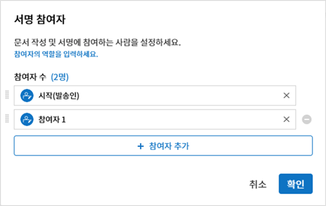
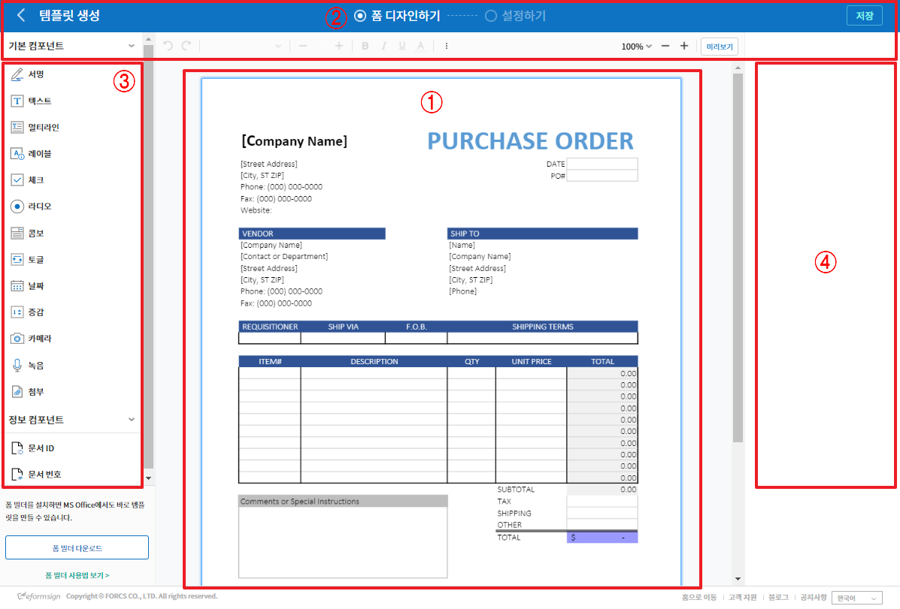
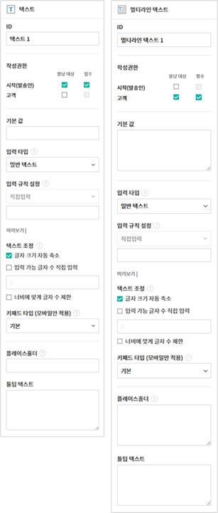
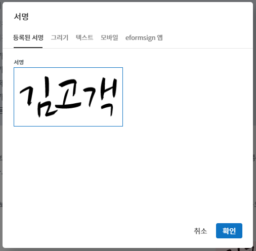

.. _webform:

웹폼 디자이너 소개
====================

웹폼 디자이너는 eformsign 서비스에 기존의 문서 파일을 업로드하여 컴포넌트를 올려 전자서식으로 만들 수 있는 웹폼 에디터입니다.
**내 파일로 문서 작성** 메뉴 또는 **템플릿 관리** 메뉴에서 문서 파일을 업로드하면 웹폼 디자이너 화면이 나타납니다. 이폼사인에서 제공하는 다양한 컴포넌트 중 원하는 컴포넌트를 클릭해서 문서의 원하는 위치에 배치하고 난 후, 각 컴포넌트에 대한 속성을 설정하면 전자서식을 손쉽게 만들 수 있습니다.

.. note::

   업로드 가능한 파일 형식은 pdf, doc, docx, xls, xlsx, ppt, pptx, odt, jpg, png, gif, tiff 입니다.
   파일 크기는 최대 9MB까지 업로드 가능합니다.

.. note::

   MS Office에서 바로 전자문서를 생성할 수 있는 MS Office Add-in 기능(OZ in Office 폼 빌더)도 제공하고 있습니다. 폼 빌더를 사용하려면 `폼 빌더 <chapter5.html#formbuilder>`__\ 를 참고하여 폼 빌더를 설치하신 후 사용하시기 바랍니다.

**내 파일로 문서 작성** 메뉴에서 파일 업로드
~~~~~~~~~~~~~~~~~~~~~~~~~~~~~~~~~~~~~~~~~~~~~~~~~~~~~

1. 메뉴 중 **내 파일로 문서 작성**\ 을 클릭합니다.

   |image1|

2. 화면에 바로 파일을 드래그하거나 **내 컴퓨터에서 파일 선택**\ 을 클릭해서 자신의 컴퓨터에서 업로드하고자 하는 파일을 선택합니다.

   |image2|

3. 문서에 참여할 문서 참여자 및 역할을 추가 및 설정하면, 다음과 같이 문서에 컴포넌트를 올릴 수 있는 웹폼 디자이너 화면이 나타납니다.

   |image3|

**템플릿 관리** 메뉴에서 파일 업로드
~~~~~~~~~~~~~~~~~~~~~~~~~~~~~~~~~~~~~~~~~~~~~~~

1. **템플릿 관리** 메뉴로 이동합니다.

.. figure:: resources/web-form_1.png
   :alt: 웹폼 디자이너 화면

2. 템플릿 관리 화면에 바로 파일을 드래그하거나 **내 컴퓨터에서 파일 선택**\ 을 클릭해 자신의 컴퓨터에서 업로드하고자 하는 파일을 선택합니다.

3. 문서에 참여할 문서 참여자 및 역할을 추가 및 설정하면, 다음과 같이 문서 화면이 나타납니다.

.. _webformdesigner_menus:

웹폼 디자이너 메뉴 구성
-------------------------

웹폼 디자이너는 문서를 보여주는 화면과 상단 바, 왼쪽의 문서 참여자 및 컴포넌트 리스트, 그리고 오른쪽의 컴포넌트 속성 화면으로 구성되어 있습니다.

.. figure:: resources/myfile_create_document4.png
   :alt: 웹폼 디자이너 메뉴 구성-내 파일로 문서 작성

**1. 문서 표시 창:** 업로드한 문서 파일이 표시됩니다.

**2. 상단 바:** **템플릿 설정**\ 의 경우 폼 디자인하기, 설정하기의 2단계가 표시되며, 템플릿 관리 리스트 화면으로 돌아가거나 컴포넌트가 추가된 템플릿의 표시 형태를 미리보기할 수 있습니다. **내 파일로 문서 작성**\ 의 경우 폼 디자인하기, 수신자 지정하기, 옵션의 3단계가 표시되며, 디자인을 완료하고 문서 작성을 시작하거나 임시 보관함에 저장하고 나갈 수 있습니다.

.. note::

   상단 바에 표시되는 각 단계를 클릭하면 해당 단계의 화면으로 이동합니다. **설정하기**\ 를 클릭하면 워크플로우, 권한 등을 설정할 수 있습니다. 템플릿 생성 및 내 파일로 문서 작성을 완료하기 전에 설정을 완료하시기 바랍니다.

**3. 문서 참여자:** 문서에 참여할 참여자를 선택한 후 해당 참여자가 입력할 컴포넌트를 문서에 드래그합니다. 참여자 추가를 클릭해 문서 참여자를 추가할 수 있습니다. 한 문서에 문서 참여자는 최대 30명까지 추가할 수 있습니다.

**4. 컴포넌트 리스트:** 텍스트, 멀티라인, 서명, 체크, 선택 등 14개의 기본 컴포넌트와 문서 ID, 문서 번호 등 2개의 정보 항목을 현재 지원하고 있으며, 사용자 정의 항목, 도형 등의 신규 항목이 계속해서 추가될 예정입니다.

**5. 속성:** 서명, 텍스트, 체크 등 컴포넌트를 클릭하여 문서의 원하는 위치에 추가하면 각 컴포넌트의 상세 속성을 설정할 수 있습니다.

.. _components:

컴포넌트 개요
----------------------

컴포넌트는 전자문서에서 사용자가 내용을 입력할 수 있는 입력란을 만들어주는 역할을 합니다. 서명, 체크, 날짜, 텍스트 등의 다양한 형식의 컴포넌트가 있으며 각각의 컴포넌트는 오른쪽의 속성창에서 세부 사항을 설정할 수 있습니다.

.. figure:: resources/component_web_1.png
   :alt: 웹폼 디자이너에 컴포넌트를 배치한 모습
   :width: 750px

컴포넌트 종류
~~~~~~~~~~~~~~

eformsign은 다음의 컴포넌트를 지원합니다.

**기본 컴포넌트**

-  `서명 <#signature2>`__\ **:** 서명을 입력합니다.

-  `회사 도장 <#company stamp2>`__\ **:** 등록된 회사 도장을 입력합니다.

-  `텍스트 <#text2>`__\ **:** 1~2단어의 짧은 텍스트를 입력합니다.

-  `멀티라인 <#text2>`__\ **:** 여러 줄의 긴 텍스트를 입력합니다.

-  `레이블 <#label2>`__\ **:** 별도로 설정한 값을 문서에 표시하고자 할때 사용합니다.

-  `체크 <#check2>`__\ **:** 체크할 항목이 있을 때 사용합니다. 다중 선택도 설정 가능합니다.

-  `라디오 <#select2>`__\ **:** 여러가지 항목 중 한 가지를 선택합니다.

-  `콤보 <#combo2>`__\ **:** 클릭하면 드롭다운 메뉴가 나타나며 여러 항목 중 하나를 선택합니다.

-  `토글 <#toggle2>`__\ **\ :** 2개 이상의 값을 입력하면 버튼을 클릭할 때마다 다른 값으로 전환됩니다.

-  `날짜 <#date2>`__\ **:** 특정 날짜를 입력합니다.

-  `증감 <#numeric2>`__\ **:** 숫자를 입력합니다.

-  `카메라 <#camera2>`__\ **:** 카메라가 연결된 기기(스마트폰, 태블릿 등)에서는 카메라로 사진을 찍거나 사진첩에서 사진을 선택합니다. 카메라가 없는 기기(일반 PC)에서는 이미지 파일을 선택합니다.

-  `녹음 <#record2>`__\ **:** 녹음 기능이 있는 기기에서 버튼을 클릭해 녹음을 진행합니다.

-  `첨부 <#attach2>`__\ **:** 파일 첨부 기능을 추가합니다.

**정보 컴포넌트**

-  `문서 ID <#document2>`__\ **:** 문서 내에 문서 ID를 입력합니다.

-  `문서 번호 <#document2>`__\ **:** 문서 내에 문서 번호를 입력합니다.

컴포넌트별 속성 설정
-------------------------

모든 컴포넌트는 공통 속성과 고유 속성을 가지고 있으며, 속성 창에서 공통 속성과 각 입력 기능의 고유 속성을 확인할 수 있습니다. 공통 속성으로는 ID, 작성권한, 플레이스 홀더, 툴팁 텍스트가 있으며, 각 속성의 의미는 다음과 같습니다.

-  **ID:** 각각의 컴포넌트를 식별할 수 있는 고유한 ID 입니다. 설정 단계에서 필수 입력 또는 편집 제한 시 컴포넌트 ID로 확인하여 지정할 수 있으며, CSV로 입력 데이터를 추출하여 확인하고자 할때 컴포넌트 ID로 구분할 수 있습니다.

-  **작성권한:** 문서 참여자 별로 해당 컴포넌트에 입력할 수 있는 권한을 설정합니다. 작성권한에는 추가된 문서 참여자의 목록이 표시되며, 할당 대상 또는 필수에 체크할 수 있습니다. 할당 대상으로 체크하면, 해당 참여자가 해당 컴포넌트에 입력할 수 있으며, 필수를 체크하면, 해당 참여자가 반드시 해당 컴포넌트를 입력해야만 문서를 전송할 수 있습니다. 문서 전송 시 할당 대상으로 체크된 컴포넌트는 노란색으로, 필수로 체크된 컴포넌트는 빨간색으로 표시됩니다.  

-  **플레이스홀더:** 입력란에 입력하기 전 안내 문구로 표시되는 텍스트입니다.

-  **툴팁 텍스트:**  수신자가 문서를 열람 시 Windows 환경에서는 컴포넌트에 마우스를 위치하면 툴팁 텍스트가 말풍선 형태로 표시되며, 모바일 환경에서는 컴포넌트가 다이얼로그로 실행될 때 툴팁 텍스트가 다이얼로그의 제목으로 표시됩니다.

.. note::

   문서 관련 정보 제공을 위한 컴포넌트인 정보 컴포넌트의 경우, 툴팁 텍스트 속성이 없습니다.

각 컴포넌트에 대한 설명은 다음과 같습니다.

.. _signature2:

서명
~~~~~~~~

서명 컴포넌트는 문서에 서명을 받아야 할 때 사용합니다.

서명 컴포넌트를 넣으면 서명이 필요한 문서에서 아래와 같이 서명 팝업이 나타나 서명을 직접 그리거나 텍스트를 입력해 서명을 생성할 수 있으며, 기존에 등록한 서명이 있는 경우 이를 사용할 수도 있습니다.

|image4|

**컴포넌트 속성**

.. figure:: resources/Signature-component-properties_web.png
   :alt: 서명 컴포넌트 속성 설정하기

**① ID**

서명 컴포넌트의 ID를 입력합니다. 예를 들어, 계약자의 서명인 경우
컴포넌트 ID는 ‘계약자 서명’으로 합니다.

**② 서명 유형**

서명 시 어떤 서명을 사용할 것인지 선택합니다.

**직접 서명:** 서명란을 클릭하면 서명 팝업이 나타나며 그리기, 텍스트, 모바일, 도장, 등록된 서명 탭 중 원하는 방식으로 서명을 입력합니다.

**등록된 서명:** 문서를 작성하는 사람이 미리 등록해 둔 **내 서명**\ 이 있는 경우 서명란을 클릭하면 등록된 서명이 자동으로 입력됩니다.

**등록된 이니셜:** 등록된 서명과 마찬가지로 **내 서명**\ 에 등록된 이니셜이 있는 경우 서명란을 클릭하면 등록된 이니셜이 자동으로 입력됩니다.

**등록된 도장:** 등록된 서명과 마찬가지로 **내 서명**\ 에 등록된 도장이 있는 경우 서명란을 클릭하면 등록된 도장이 자동으로 입력됩니다.

.. note::

   등록된 서명과 이니셜, 도장이 있는 경우에는 해당 서명이 서명란에 자동으로 입력되지만, 등록된 서명과 이니셜, 도장이 없는 경우 직접 서명과 동일한 서명 팝업이 나타납니다.

.. note::

   문서에 직접 서명이 아닌 직인이나 개인 도장을 사용해야 하는 경우가 있습니다. eformsign에서는 도장 이미지를 사용해 문서의 서명란에 도장을 찍을 수도 있습니다. 도장 이미지를 사용하려면, 서명 팝업에서 **도장** 탭을 클릭하고 도장 이미지를 선택한 후 확인 버튼을 누릅니다.

**③ 서명 방법**

**직접 입력만 허용**\ 을 체크하면 태블릿 PC 등으로 서명란에 직접 서명을 할 수 있도록 설정합니다.

**④ 서명펜 두께**

서명을 그릴 때 표시되는 선의 두께를 설정합니다.

**⑤ 서명펜 색**

서명을 그릴 때 표시하는 선의 색을 설정합니다.

**⑥ 플레이스홀더**

서명 전 표시되는 안내 문구로, 텍스트를 설정할 수 있습니다.

**⑦ 툴팁 텍스트**

입력란에 마우스를 위치하면 툴팁 텍스트에 입력한 설명이 나타납니다.
eformsign 앱에서는 키패드 상단 중앙에 표시됩니다.

.. tip::

   **서명에 대한 서명일 및 서명인 자동 입력 설정하기**

   서명 컴포넌트를 클릭하여 나타나는 아이콘을 클릭하면 서명일 및 서명인을 추가할 수 있습니다.

   .. figure:: resources/Signature-component-properties_web_icon.png
      :alt: 서명일 및 서명인

   **① 서명일:** 서명한 날짜가 자동으로 입력됩니다. 서명일 영역을 클릭하여 우측의 서명일 컴포넌트 속성에서 날짜 표시형식을 설정할 수 있습니다.

   .. figure:: resources/Signature-component-properties_web_date.png
      :alt: 서명일
      :width: 700px

   **② 서명인:** 서명인 정보가 자동으로 입력됩니다. 서명 컴포넌트를 클릭하여 나타나는 사람 모양 아이콘을 클릭하면 ID, 이름, 부서, 직책, 휴대폰 번호, 전화번호 중 서명인 정보에 표시될 정보를 지정할 수 있습니다.

   .. figure:: resources/Signature-component-properties_web_signer.png
      :alt: 서명인

   .. note::

      하나의 서명과 연결된 서명일 및 서명인 컴포넌트를 여러 개 추가할 수 있습니다. 계약서 등의 문서 내에 반복적으로 서명일을 입력하거나, 서명인 정보를 자세히 입력하고자 할 때 유용합니다.

.. _company stamp2:

회사 도장
~~~~~~~~~~~~~~~~~~~~

회사 대표 도장, 사용 인감, 법인 인감 등 **회사 관리 > 회사 도장**\ 에 등록된 회사 도장을 입력하고자 할 때 사용합니다. 회사 도장은 **회사 관리 > 회사 도장**\ 에 등록된 도장과 사용권한을 부여받은 멤버만 사용할 수 있으며, 회사 도장에 대한 이력이 회사 도장 메뉴에 기록됩니다.

**컴포넌트 속성**

**① ID**

회사 도장 컴포넌트의 ID를 입력합니다. 예를 들어, 법인 인감인 경우 컴포넌트 ID를 '법인 인감'으로 설정합니다. 

.. _text2:

텍스트와 멀티라인
~~~~~~~~~~~~~~~~~~~~

텍스트 컴포넌트와 멀티라인 컴포넌트 모두 텍스트 입력란을 만들 때 사용합니다. 텍스트 컴포넌트는 1~2 단어의 짧은 텍스트, 멀티라인은 1줄 이상의 긴 텍스트에 적합합니다.

**컴포넌트 속성**

**① ID**

텍스트/멀티라인 컴포넌트의 ID를 입력합니다. 예를 들어, 홍길동, 이순신 등이 입력되는 컴포넌트의 ID는 ‘이름’으로 합니다.

.. note::

   ID는 자동으로도 부여되나, 컴포넌트 배치 후 각 컴포넌트에 대해 수신자에게 입력 요청을 할지 여부를 결정할 때 해당 ID의 명칭이 표시되므로 사용자 자신이 인식하기 쉬운 ID를 설정하는 것을 권장합니다.

**② 기본 값**

기본으로 표시될 텍스트를 설정할 수 있습니다.

.. note::

   텍스트 컴포넌트에서만 설정 가능한 속성으로 텍스트 숨기기 기능이 있습니다. 텍스트 입력 시 입력한 내용이 별표(*) 또는 패스워드 문자(●)로 입력되어 입력 내용을 숨길 수 있습니다. 입력된 내용은 PDF에서도 패스워드 문자로 숨겨지며, CSV 데이터를 다운로드 받을 때에만 확인할 수 있습니다.

**③ 입력 가능 최대 글자 수**

입력 가능한 최대 글자 수(공백 포함)를 설정할 수 있습니다. 텍스트의 경우 100자, 멀티라인의 경우 400자가 기본으로 설정되어 있습니다.

**④ 모바일 입력 시 키패드 타입**

스마트폰, 태블릿과 같은 모바일 환경에서 문서를 작성할 때 실행할 키패드 타입을 선택합니다.

**⑤ 플레이스홀더**

입력해야 할 내용에 대한 안내 문구로 값이 입력되지 않았을 때 표시됩니다.

**⑥ 툴팁 텍스트**

해당 입력란에 마우스를 위치하면 툴팁 텍스트에 입력한 설명이 나타납니다. eformsign 앱에서는 키패드 상단 중앙에 표시됩니다.

.. _label2:

레이블
~~~~~~

레이블 컴포넌트는 별도로 설정한 값을 문서에 표시하고자 할때 사용합니다.

**컴포넌트 속성**

.. figure:: resources/label_property_web.png
   :alt: 레이블 컴포넌트 속성 설정하기

**① ID**

레이블 컴포넌트의 ID를 설정합니다.

**② 텍스트**

해당 입력란에 입력한 텍스트가 문서상에 표시됩니다.

.. _check2:

체크
~~~~

체크 컴포넌트는 각 항목의 체크 여부를 확인하고자 할때 사용합니다. **라디오**\ 와 유사하나, 체크 컴포넌트는 해당 항목의 체크 여부를 확인할 때 사용하고, 라디오 컴포넌트는 선택한 항목이 무엇인지 알아야 할 때 사용한다는 차이가 있습니다.

.. tip::

   **체크 컴포넌트와 라디오 컴포넌트의 차이**

   체크 컴포넌트는 **다중 선택 가능**\ 한 중복입력을 허용하나, 라디오 컴포넌트는 중복입력을 허용하지 않습니다.

체크 컴포넌트의 입력값은 데이터 다운로드 시 다음과 같이 나타납니다.

-  항목에 체크한 경우: true

-  항목에 체크하지 않은 경우: false

워드, 파워포인트에서는 체크 컴포넌트가 직사각형 도형처럼 나타납니다. 항목의 내용은 컴포넌트 도형 안에 입력해야 합니다.

**컴포넌트 속성**

.. figure:: resources/check-component-properties-1_web.png
   :alt: 체크 컴포넌트 속성 설정하기

**① ID**

체크 컴포넌트의 선택 항목에는 같은 ID를 부여해야 합니다. 는 각 항목 별로 다른 ID를 부여해야 합니다. 여러 개의 체크 컴포넌트에 같은 ID가 부여될 경우 해당 컴포넌트 중 마지막 컴포넌트의 입력값만 표시됩니다.

**② 아이템 리스트**

해당 항목에 표시될 텍스트를 입력할 수 있습니다. 여러 개의 체크 컴포넌트를 추가하여 복수 선택이 가능하도록 설정할 수도 있습니다.

**③ 선택 스타일**

속성에서 색상 및 도형 스타일을 지정할 수 있습니다. 체크를 선택하면 속성에서 체크박스가 기본으로 설정되어 있으며, 이외에 라디오 버튼, 원 표시를 선택할 수 있습니다.

다음의 예시를 보면, 왼쪽부터 체크 / 라디오 / 원 선택 시 각각 체크박스가 어떻게 표시되는지를 알 수 있습니다.

|image5|

.. tip::

   오른쪽 위 아이콘을 눌러 각 스타일의 색상을 지정할 수 있습니다.
   활성화된 아이콘은 아이콘 하단에 현재 표시되는 색상의 선이 나타납니다.
   예를 들어, 체크박스의 경우 박스의 바탕색, 박스의 윤곽선, 체크 색상을 각각 지정할 수 있고, 라디오 버튼의 경우 원 윤곽선과 중심원 색상을 각각 지정할 수 있고, 원 표시의 경우 원 색상을 지정할 수 있습니다.

   |image6|

**④ 비선택 스타일**

선택되지 않은 항목에 표시될 스타일을 지정할 수 있습니다. 체크박스의 경우 사각형, 라디오 버튼의 경우 원형, 원 표시의 경우 아무것도 표시되지 않습니다.

**⑤ 툴팁 텍스트**

해당 입력란에 마우스를 위치하면 툴팁 텍스트에 입력한 설명이 나타납니다.
eformsign 앱에서는 키패드 상단 중앙에 표시됩니다.

.. _select2:

라디오
~~~~~~~~

라디오 컴포넌트는 여러 항목 중 어떤 항목을 선택했는지 확인해야 할 때 사용합니다. 라디오 컴포넌트의 선택값은 데이터 다운로드 시 여러 항목 중 선택한 항목명이 나타납니다.

**컴포넌트 속성**

.. figure:: resources/Radio-component-properties_web.png
   :alt: 선택 컴포넌트 속성 설정하기

**① ID**

라디오 컴포넌트의 선택 항목에는 선택 그룹마다 모두 같은 ID를 부여해야 합니다.

예를 들어, 1번 문제에 대해 1, 2, 3, 4, 5의 보기가 있는 경우 1, 2, 3, 4, 5 항목에 같은 ID ‘1번’을 부여합니다. 2번 문제의 1, 2, 3, 4, 5 보기에는 ‘2번’ ID를 부여합니다. 다음 예시 화면의 모든 선택 항목의 ID는 ‘나이 선택’으로 지정합니다.

.. figure:: resources/radio-items-should-have-same-ID_web.png
   :alt: 선택 컴포넌트의 설정 예
   :width: 700px

**② 아이템 리스트**

같은 ID를 부여한 항목은 컴포넌트 속성 창의 아이템 리스트에 일괄 표시되며, 아이템 리스트에서 편리하게 텍스트를 수정할 수 있습니다.

**③ 선택 스타일**

라디오 컴포넌트는 속성에서 스타일을 지정할 수 있습니다. 검정색 이중 원 형태가 기본으로 설정되어 있으며 드롭박스 메뉴에서 스타일을 변경할 수 있습니다.

.. tip::

   오른쪽 위 아이콘을 클릭해 상세 스타일을 변경할 수도 있습니다. 활성화된 아이콘은 아이콘 하단에 현재 표시되는 색상의 선이 나타나며, 윤곽선과 중심원의 색상을 별도로 설정할 수 있습니다.

   |image7|

**④ 비선택 스타일**

선택되지 않은 항목에 표시될 스타일을 지정할 수 있습니다.

**⑤ 툴팁 텍스트**

해당 입력란에 마우스를 위치하면 툴팁 텍스트에 입력한 설명이 나타납니다.
eformsign 앱에서는 키패드 상단 중앙에 표시됩니다.

.. _combo2:

콤보
~~~~

여러가지 항목 중에서 한 항목을 선택해야 할 때 콤보 컴포넌트를 사용합니다.

다음과 같이 선택란을 클릭하면 항목 리스트가 나타납니다.

|image8|

**컴포넌트 속성**

**① ID**

콤보 컴포넌트의 ID를 입력합니다. 예를 들어, 좋아하는 색을 고르는 컴포넌트의 ID는 ‘좋아하는 색’으로 합니다.

**② 아이템 개수**

선택 항목들을 입력합니다. 엔터(Enter)로 여러 항목을 구분합니다.

**③ 기본 선택 아이템**

기본으로 표시할 항목을 설정합니다.

**④ 플레이스홀더**

입력해야 할 내용에 대한 안내 문구로 값이 입력되지 않았을 때 표시됩니다.

.. note::

   콤보 컴포넌트의 선택란에 ‘선택하세요’를 표시하려면, 플레이스 홀더에 ‘선택하세요’를 입력하고 기본 선택 아이템으로 ‘선택하세요’를 설정합니다.

**⑤ 툴팁 텍스트**

선택란에 마우스를 위치하면 툴팁 텍스트에 입력한 설명이 나타납니다.
eformsign 앱에서는 키패드 상단 중앙에 표시됩니다.

.. _toggle2:

토글
~~~~

켜짐(ON), 꺼짐(OFF)과 같은 특정한 상태를 나타낼 때 사용합니다. 토글 컴포넌트를 사용하면 컴포넌트를 클릭할 때마다 미리
설정한 항목의 순서대로 입력값이 전환됩니다.

다음과 같이 컴포넌트를 클릭하여 양호, 불량 상태로 변경할 수 있습니다.

|image9|

**컴포넌트 속성**

.. figure:: resources/toggle-component-properties_web.png
   :alt: 토글 컴포넌트 속성

**① ID**

토글 컴포넌트의 ID를 입력합니다. 예를 들어, 첫번째 점검 항목에 대한 컴포넌트인 경우 ‘점검항목 1’로 합니다.

**② 아이템 개수**

토글 컴포넌트를 클릭할 때마다 전환될 항목 리스트를 입력합니다. 엔터(Enter)로 항목을 구분합니다.

**③ 기본 선택 아이템**

기본으로 표시할 항목을 설정합니다.

**④ 툴팁 텍스트**

입력란에 마우스를 위치하면 툴팁 텍스트에 입력한 설명이 나타납니다.
eformsign 앱에서는 키패드 상단 중앙에 표시됩니다.

.. _date2:

날짜
~~~~

날짜를 입력해야 할 때 사용합니다. 입력란을 클릭하면 날짜 선택창이 나타나며 원하는 날짜를 선택할 수 있습니다.

**컴포넌트 속성**

.. figure:: resources/datetime-component-properties_02_web.png
   :alt: 날짜 컴포넌트 속성 설정하기

**① ID**

날짜 컴포넌트의 ID를 입력합니다. 예를 들어, 휴가 시작일을 선택하는 컴포넌트의 ID는 ‘휴가 시작일’로 합니다.

**② 기본 값**

기본으로 표시할 날짜를 설정합니다. **오늘 날짜로 설정**\ 에 체크하면 문서를 열었을 때 자동으로 오늘 날짜가 입력됩니다.

**③ 표시형식**

날짜가 표시되는 형식을 지정합니다. 기본 설정값은 date_yyyy-MM-dd입니다.

-  **yyyy:** 연도를 표시합니다. (yyyy년 = 2020년)

-  **MM:** 월을 표시합니다. 반드시 대문자로 표기해야 합니다. (MM월 = 8월)

-  **dd:** 일을 표시합니다. (dd일 = 10일)

‘2020년 2월 5일’처럼 나타나게 하려면, 표시형식에 ‘yyyy년 MM월 dd일’로 입력합니다.

**④ 입력 가능 최소/최대 날짜**

날짜 선택 시 선택할 수 있는 최소, 최대 날짜를 지정하여 입력 가능한 날짜의 범위를 설정합니다.

**⑤ 플레이스홀더**

입력해야 할 내용에 대한 안내 문구로 값이 입력되지 않았을 때 표시됩니다.

**⑥ 툴팁 텍스트**

입력란에 마우스를 위치하면 툴팁 텍스트에 입력한 설명이 나타납니다.
eformsign 앱에서는 키패드 상단 중앙에 표시됩니다.

.. _numeric2:

증감
~~~~

숫자를 입력해야 할 때 사용합니다. 입력란을 클릭하면 오른쪽에 두 개의 화살표가 나타나며, 위 아래 화살표 버튼을 눌러 숫자를 증감시킬 수 있습니다. PC 키보드 환경에서는 입력란에 직접 원하는 숫자를 입력할 수 있습니다. 스마트폰, 태블릿 환경에서는 입력 범위 숫자 리스트에서 스크롤하여 원하는 숫자를 선택할 수 있습니다.

**컴포넌트 속성**

.. figure:: resources/number-component-properties_web.png
   :alt: 증감 컴포넌트 속성 설정하기

**① ID**

증감 컴포넌트의 ID를 입력합니다. 예를 들어, 예약 인원을 입력하는 컴포넌트의 ID는 ‘예약 인원’으로 합니다.

**② 기본 값**

기본으로 표시할 숫자를 설정합니다.

**③ 증감 단위**

입력란의 증가/감소 아이콘을 클릭할 때마다 현재 입력된 값에서 증감시킬 값을 입력합니다. 예를 들어, 증감 단위를 100으로 설정하고 문서를 작성할 때 입력란 오른쪽의 위 화살표(▲)를 클릭하면 입력된 값에서 200, 300, …으로 증가합니다.

**④ 입력 가능 최솟값/최댓값**

입력 가능 최솟값/최댓값을 지정하여 입력 가능한 숫자의 범위를 설정합니다. 예를 들어, 생년월일의 경우 보통 최솟값을 1900, 최댓값을 현재 년도, 증감 단위를 1로 지정합니다. 최솟값 또는 최댓값이 지정된 상태에서 범위 외의 숫자를 입력하면 자동으로 최솟값 또는 최댓값이 입력됩니다. 즉, 최댓값이 100으로 지정되었을 때, 입력란에 101을 입력하면 숫자가 자동으로 최댓값인 100으로 변경됩니다.

**⑤ 플레이스홀더**

입력해야 할 내용에 대한 안내 문구로 값이 입력되지 않았을 때 표시됩니다.

**⑥ 툴팁 텍스트**

입력란에 마우스를 위치하면 툴팁 텍스트에 입력한 설명이 나타납니다.
eformsign 앱에서는 키패드 상단 중앙에 표시됩니다.

.. _camera2:

카메라
~~~~~~~~~

스마트폰, 태블릿 등 카메라가 있는 기기로 사진을 찍어 문서에 삽입하고자 할 경우 사용합니다. 카메라가 없는 PC 환경에서는 컴포넌트를 클릭하면 이미지 파일을 선택할 수 있는 선택창이 나타납니다. 
선택한 이미지의 크기가 입력란의 크기보다 클 경우 입력란 안에 들어갈 수 있도록 축소되어 올라갑니다.

.. note::

   카메라 컴포넌트의 경우 카메라가 연결된 환경에서는 카메라 기능이 실행되고, 카메라가 연결되지 않은 환경에서는 이미지 파일 선택 창이 실행됩니다.

|image10|

**컴포넌트 속성**

**① ID**

카메라 컴포넌트의 ID를 입력합니다. 예를 들어, 신분증 사진을 촬영하는 컴포넌트의 ID는 ‘신분증 사진’으로 합니다.

**② 플레이스홀더**

카메라 촬영 전 표시되는 문구를 설정합니다.

**③ 툴팁 텍스트**

입력란에 마우스를 위치하면 툴팁 텍스트에 입력한 설명이 나타납니다.
eformsign 앱에서는 키패드 상단 중앙에 표시됩니다.

.. tip::

   카메라 아이콘 표시에 체크하면 카메라 영역에 카메라 아이콘이 표시됩니다.

   |image11|

.. _record2:

녹음
~~~~~~~

문서에 사용자의 녹음 데이터를 저장해야 할 때 사용합니다. 녹음 컴포넌트를 추가하면 뷰어에서 다음과 같이 녹음된 내용을 재생하거나
새로운 녹음을 할 수 있습니다.

|image12|

.. note::

   녹음은 eformsign 앱에서만 동작되는 기능입니다.

**컴포넌트 속성**

.. figure:: resources/record_component_web.png
   :alt: 녹음 컴포넌트 속성 설정하기

**① ID**

녹음 컴포넌트의 ID를 입력합니다. 예를 들어, 음성 동의를 녹음하는 컴포넌트의 ID는 ‘음성 동의'로 합니다.

**② 플레이스홀더**

녹음 전 표시되는 문구를 설정합니다.

**③ 툴팁 텍스트**

입력란에 마우스를 위치하면 툴팁 텍스트에 입력한 설명이 나타납니다.
eformsign 앱에서는 키패드 상단 중앙에 표시됩니다.

.. tip::

   녹음 아이콘 표시에 체크하면 녹음 영역에 마이크 아이콘이 표시됩니다.

   |image13|

.. _attach2:

첨부
~~~~

문서에 별도로 첨부 파일을 추가할 수 있도록 할 경우 사용합니다. 첨부 컴포넌트를 통해 문서를 첨부할 경우 문서의 맨 끝에 첨부한 문서가 새로운 페이지로 추가됩니다.

첨부 가능한 파일의 종류와 크기는 다음과 같습니다.

-  파일 종류: PDF, JPG, PNG, GIF

-  파일 크기: 최대 5MB까지

**컴포넌트 속성**

.. figure:: resources/Attachment-component-properties_web.png
   :alt: 첨부 컴포넌트 속성 설정하기

**① ID**

첨부 컴포넌트의 ID를 입력합니다. 예를 들어, 재직증명서를 첨부하는 컴포넌트의 ID는 ‘재직증명서 첨부’로 합니다.

**② 플레이스홀더**

첨부 전 표시되는 문구를 설정합니다.

**③ 툴팁 텍스트**

입력란에 마우스를 위치하면 툴팁 텍스트에 입력한 설명이 나타납니다.
eformsign 앱에서는 키패드 상단 중앙에 표시됩니다.

.. tip::

   첨부 아이콘 표시에 체크하면 첨부 영역에 클립 아이콘이 표시됩니다.

   |image14|

.. _document2:

문서 ID와 문서 번호
~~~~~~~~~~~~~~~~~~~

정보 컴포넌트는 문서 내에 문서 관련 정보를 입력해야 할 때 사용합니다. 문서 ID, 문서 번호를 입력할 수 있습니다.

-  **문서 ID:** 시스템에서 모든 문서에 부여하는 문서의 고유한 ID로, 32자리의 알파벳과 숫자의 조합으로 나타납니다. 예) 0077af27a98846c8872f5333920679b7

-  **문서 번호:** **템플릿 설정 > 일반 설정**\ 에서 설정된 문서 번호입니다. 문서 번호를 설정하는 방법은 `문서 번호 설정 방법 <chapter5.html#docnumber_wd>`__\ 을 참고하세요.

   .. note::

      문서 ID는 시스템에서 부여하는 문서 고유의 ID이기 때문에 별도의 설정이 필요하지 않습니다. 문서 번호와 관련된 설정은 템플릿을 업로드한 뒤 **템플릿 설정 > 일반 설정**\ 에서 할 수 있습니다.

**컴포넌트 속성**

.. figure:: resources/document-domponent-properties_web.png
   :alt: 문서 컴포넌트 속성 설정하기

   문서 컴포넌트 속성 설정하기

**① ID**

문서 컴포넌트의 ID를 입력합니다. 예를 들어, 문서 번호를 입력하는 경우 컴포넌트 ID는 ‘문서 번호’로 합니다.

템플릿에 대한 추가 설정하기
---------------------------

문서에 컴포넌트를 배치하고 나면 템플릿 제목, 문서 번호, 워크플로우 등 템플릿으로 생성되는 문서에 대한 추가 설정을 할 수 있습니다.

폼 디자인하기 화면에서 **설정하기** 버튼을 눌러 설정하기 화면으로 이동합니다. 설정하기 화면에서는 다음의 5가지 설정을 하여 템플릿을 설정할 수 있습니다.

-  **일반 설정:** 템플릿 이름, 약칭, 문서 제목, 문서 번호 등을 설정합니다.

-  **권한 설정:** 해당 템플릿으로 문서를 생성할 멤버나 그룹, 및 생성된 문서를 관리할 멤버나 그룹을 지정합니다.

-  **워크플로우 설정:** 문서의 시작부터 완료까지 작성된 문서가 거쳐갈 단계를 설정합니다.

-  **필드 설정:** 필드의 표시 여부, 순서, 기본값, 자동 입력 값 등을 설정합니다.

-  **알림 설정:** 템플릿으로 생성된 문서에 대한 알림을 보낼 메시지를 설정합니다.

.. figure:: resources/component_web_2.png
   :alt: 템플릿의 5가지 설정 항목
   :width: 750px

.. important::

   해당 템플릿으로 문서를 작성할 수 있도록 하기 위해서는 템플릿을 저장한 후 반드시 배포해야 합니다.

   템플릿을 배포하지 않고 저장만 할 경우 템플릿 사용 권한이 있는 멤버들의 **템플릿으로 문서 작성** 화면에 나타나지 않습니다.

.. note::

   템플릿에 대한 상세한 설명은 `웹폼 디자이너로 템플릿 만들기 <chapter6.html#template_wd>`__\ 를 참고하시기 바랍니다.

.. |image1| image:: resources/myfile_create_document.png

.. |image5| image:: resources/check-component-style-settings.png

.. |image7| image:: resources/Radio-component-properties_web-style.png
.. |image8| image:: resources/combo-1.png
.. |image9| image:: resources/toggle.png
.. |image10| image:: resources/camera1.png
.. |image11| image:: resources/Camera-component-properties_web_icon.png
.. |image12| image:: resources/record1.png
   :width: 400px
.. |image13| image:: resources/record_component_web_icon.png
.. |image14| image:: resources/Attachment-component-properties_web_icon.png
