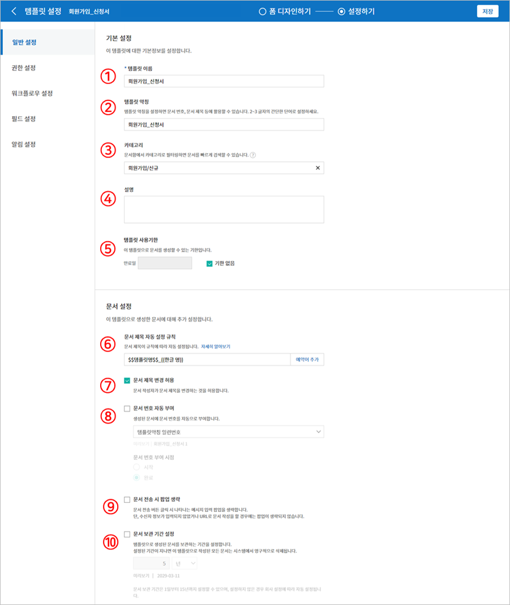
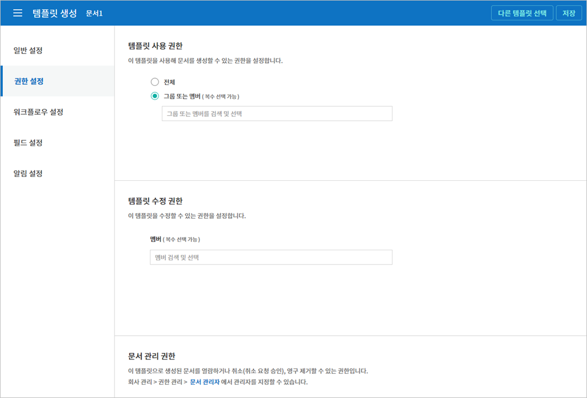
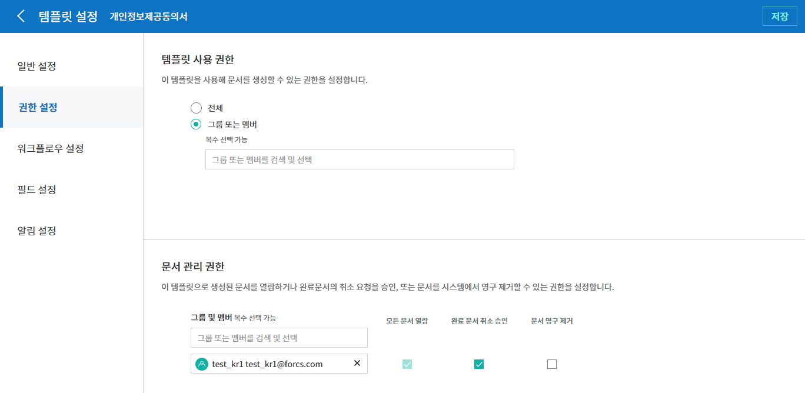
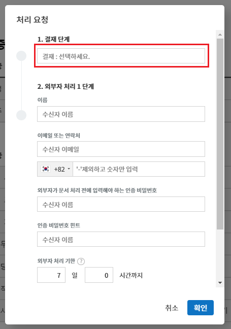
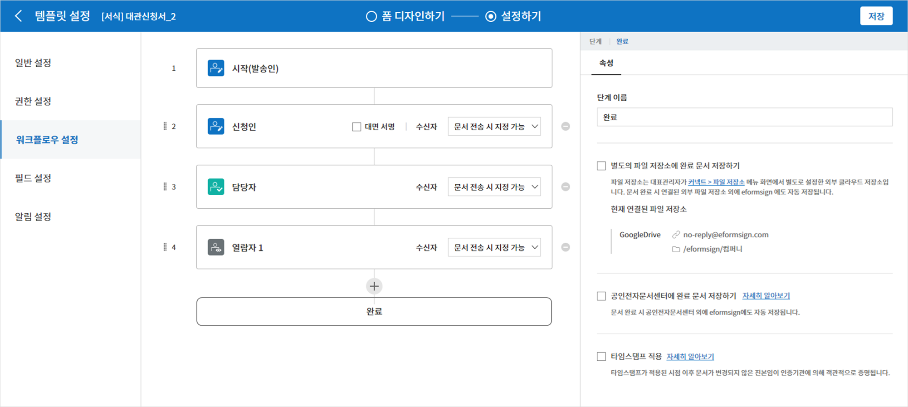
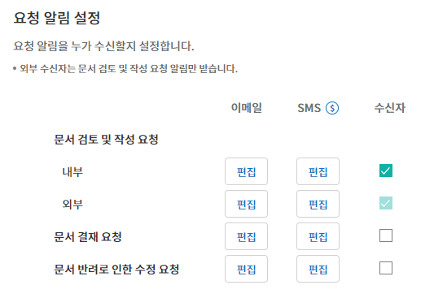
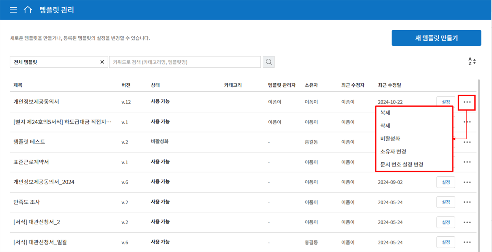

.. _template_wd:

웹폼 디자이너로 템플릿 만들기
=============================

템플릿 소개
-----------

웹폼 디자이너 템플릿 템플릿은 이폼사인에서 사용하는 **전자문서 서식**\ 입니다. 기존에 종이로 작성하던 계약서, 신청서, 동의서와 같이
기본 서식을 전자문서 형태로 만든 것을 템플릿이라고 합니다. 템플릿은 이폼사인 서비스내 웹폼 디자이너 또는 이폼사인 폼 빌더를 통해 만들고 업로드 할 수 있습니다. 폼 빌더를 통한 템플릿 설정 및 관리 방법은 `폼 빌더로 템플릿 만들기 <chapter7.html#template_fb>`__\ 를 참고해 주세요.

템플릿 개요
~~~~~~~~~~~

이폼사인을 통해 전자문서를 작성 및 전송하려면 전자문서를 생성할 수 있는 템플릿을 우선 만들어서 배포해야 합니다.

**웹폼 디자이너로 템플릿 만드는 방법**

템플릿을 온라인에서 바로 문서를 업로드하여 만들수 있습니다.

.. note::

   웹폼 디자이너에 대한 상세한 설명은 `웹폼 디자이너 <chapter4.html#webform>`__\ 를 참고하시기 바랍니다.

기존 문서를 PDF파일로 변환하고 웹폼 디자이너에 업로드하여 쉽게 템플릿을 만들수 있습니다.

1. 템플릿으로 만들 PDF 파일을 직접 드래그하거나 **내 컴퓨터에서 파일 선택**\ 을 클릭하여 해당 파일 선택 후 업로드 합니다.

   .. figure:: resources/template-manage-upload.png
      :alt: 템플릿 관리>파일 업로드(1)
      :width: 700px

   .. figure:: resources/template-manage-upload-popup.png
      :alt: 템플릿 관리>파일 업로드(2)
      :width: 700px

2. 업로드된 파일에 입력항목 종류를 선택하여 드래그합니다.

   .. figure:: resources/web-form-designer1.png
      :alt: 입력항목 드래그 방법
      :width: 700px

3. 입력항목의 크기와 위치를 조정합니다.

4. 해당 입력항목의 속성에서 상세 설정을 합니다.

5. **미리보기** 버튼을 클릭해 문서를 확인합니다.

6. 폼 디자인을 마친 후 **다음**\ 을 클릭하여 템플릿 설정으로 이동합니다.

**템플릿 설정**

생성할 템플릿에 대한 상세 설정을 할 수 있습니다.

-  `일반 설정 <#general_wd>`__\

   템플릿 이름, 약칭, 문서 제목, 문서 번호등을 설정합니다.

-  `권한 설정 <#auth_wd>`__\

   해당 템플릿을 사용해 문서를 생성할 수 있는 템플릿 사용 권한과 생성된 문서를 관리할 멤버 또는 그룹을 지정합니다.

-  `워크플로우 설정 <#workflow_wd>`__\

   문서의 작성부터 완료까지 작성된 문서가 처리될 단계를 설정합니다.

-  `필드 설정 <#field_wd>`__\

   필드의 기본값, 자동 입력 값 등을 설정합니다.

-  `알림 설정 <#noti_wd>`__\

   해당 템플릿을 통해 생성되는 문서의 요청 또는 상태 변경시 알림을 수신할 채널, 수신자, 또는 알림 메시지 내용 등을 설정합니다

워크플로우 개요
~~~~~~~~~~~~~~~

워크플로우 워크플로우란 문서가 작성되어 완료되기까지의 문서의 요청 및 처리 과정을 말합니다.

워크플로우는 템플릿 관리자가 템플릿 별로 **템플릿 설정** > **워크플로우 설정**\ 에서 설정할 수 있습니다.

워크플로우는 **시작 - 완료**\ 가 기본 단계이며, 아래와 같이 **결재**, **내부 수신자**, **외부 수신자** 3가지 단계를 원하는 대로 추가하여 워크플로우를 생성할 수 있습니다.

-  **결재**

   동일한 회사에 소속된 멤버에게 문서의 결재를 요청하는 단계입니다.

-  **내부 수신자**

   멤버에게 문서의 처리를 요청하는 단계입니다.

-  **외부 수신자**

   회사 소속 멤버가 아닌 외부 사용자에게 문서의 처리를 요청하는 단계입니다.

   .. important::

      **결재와 내부 수신자의 차이!**

      결재자와 내부 수신자는 모두 요청받은 문서에 대한 승인 또는 반려할 수 있지만, 내부 수신자로 요청 받은 멤버의 경우 문서 검토 및 작성 후 다음 담당자를 지정할 수 있습니다.

      즉, 내부 수신자 단계 이후의 외부 수신자, 내부 수신자 또는 결재자를 지정할 수 있습니다.

      예를 들어, 타 부서의 결재라인을 지정하지 않은 상태에서 해당 문서에 대해 타 부서에 협조 요청을 할 경우 내부 수신자 단계로 해당 타 부서의 담당자를 지정하면 됩니다. 문서 처리시 타 부서의 담당자가 해당 부서의 결재라인을 따로 설정하여 문서를 처리할 수 있습니다.

템플릿 설정
-----------

업로드한 파일로 생성될 템플릿에 대한 상세 사항을 설정할 수 있습니다.

.. note::

   이 작업은 **대표 관리자** 또는 **템플릿 관리** 권한이 필요합니다.

   이 작업은 PC, 모바일, 애플리케이션에서 진행할 수 있습니다.

.. _general_wd:

일반 설정
~~~~~~~~~

**템플릿 기본정보 설정**
   템플릿 이름, 카테고리, 유효기간 등 템플릿에 대한 기본 정보를 설정합니다.

**① 템플릿 이름**
   **템플릿 관리**, **새 문서 작성** 메뉴 화면에 나타날 템플릿의 이름입니다.

   **템플릿 이름**\ 은 공백 포함 11글자 정도를 권장합니다. 11글자 이상 입력할 경우 전체 템플릿 이름은 이름 위에 마우스를 위치시킨 뒤 잠시 기다리면 확인할 수 있습니다.

   .. figure:: resources/template-name.png
      :alt: 템플릿 이름
      :width: 250px

         

**② 템플릿 약칭**
   템플릿을 간단히 표시하는 짧은 이름입니다. 2~3글자 정도의 짧은 단어를 권장합니다.

   **탬플릿 약칭**\ 은 문서번호, 문서 제목, 메일 템플릿 등에서 **$$**\ 를 입력해 사용할 수 있습니다.

   .. figure:: resources/template-short-name.png
      :alt: 템플릿 약칭

         

**③ 카테고리**
   템플릿을 종류별로 구분할 때 사용합니다. 카테고리 이름으로 **템플릿 관리** 화면의 템플릿이나 **문서함**, **문서 관리** 메뉴의 문서들을 필터링할 수 있습니다. 기존의 카테고리에서 선택하거나 새로운 이름을 입력해 새로운 카테고리를 생성할 수 있습니다.

   구분자( **/** )를 사용하면 다단계 카테고리를 설정할 수 있습니다. 예를 들어, 카테고리를 **인사팀/휴가관련**\ 으로 설정하면 1단계 카테고리인 **인사팀** 안에 2단계 카테고리인 **휴가관련** 카테고리가 생성됩니다.

**④ 설명**
   템플릿에 대한 추가적인 설명을 입력합니다. 이 설명 내용은 목록 및 새 문서 작성의 템플릿 이름 하단에 나타납니다.

**⑤ 문서작성 유효기간**
   템플릿으로 문서를 생성할 수 있는 기한을 설정합니다. 시작일은 템플릿을 업로드한 날로 기본 설정되며 날짜를 변경할 수 있습니다.

   **기간 제한 없음**\ 을 체크하면 계속해서 문서를 작성할 수 있습니다. **기간 제한 없음** 체크를 해제한 후 날짜를 설정하면 설정된 날짜까지만 문서 생성이 가능합니다.

**문서 설정**

템플릿으로 생성한 문서에 대한 제목 설정 규칙 등 추가 설정을 합니다.

**⑥ 문서 제목 자동 설정 규칙**
   템플릿으로 문서를 작성할 때 입력된 문서의 제목을 설정합니다. 문서 제목 규칙을 설정하지 않을 경우 템플릿 이름이 문서 제목이 됩니다.

   문서 제목에는 **$$**\ 와 **{{**\ 를 사용하여 예약어를 추가할 수 있습니다.

**⑦ 문서 제목 변경 허용**
   **문서 제목 변경 허용**\ 을 체크하면 **작성** 단계의 문서 작성자가 문서 제목을 수정할 수 있습니다.

**⑧ 문서 번호 자동 부여**
   문서 번호 자동 부여를 체크하면 생성된 문서에 대해 자동으로 문서번호가 부여됩니다. 문서번호 표현식 중 원하는 표현식을 선택하고, 언제 문서번호를 생성할 지 문서번호 채번 시점을 선택합니다.

   |image1|

**⑨ 문서 전송 시 팝업 생략**
   문서를 빨리 작성하고 제출하는 일이 많을 때 사용합니다. 이 설정을 체크하지 않으면 문서 전송 시 **확인 메시지 입력** 팝업창이 나타납니다. **문서 전송 시 팝업 생략**\ 을 체크하면 **메시지 입력** 팝업창이 나타나지 않고 바로 다음 단계로 진행됩니다.

.. _document_naming:

일반 설정 > 문서 제목 규칙 만들기
~~~~~~~~~~~~~~~~~~~~~~~~~~~~~~~~~

**템플릿 설정**\ 에서 해당 템플릿으로 생성되는 문서의 제목 규칙을 설정할 수 있습니다.

**템플릿 문서 제목 규칙**

문서에 입력된 내용, 또는 문서 작성 관련 정보가 문서 제목에 자동으로 입력되도록 설정할 수 있습니다. 문서 제목 규칙을 설정하면 문서 작성 시점의 정보를 바탕으로 문서 제목이 생성되며 이 제목은 모든 문서함(진행 중 문서함, 처리할 문서함, 완료 문서함)과 문서 관리 메뉴의 문서 목록에서 확인할 수 있습니다

.. note::

   이 작업은 **대표 관리자** 또는 **템플릿 관리** 권한이 필요합니다.

.. figure:: resources/document-list.png
   :alt: 문서 관리 > 문서 목록
   :width: 700px

-  **문서 제목 규칙 설정하는 방법**

   .. figure:: resources/template-setting-general-doc-numering_rule.png
      :alt: 템플릿 설정 > 문서 제목 규칙 설정
      :width: 600px

   1. 사이드바 메뉴에서 **템플릿 관리**\ 로 이동합니다.

   2. 템플릿의 **설정** 아이콘(|image2|)을 클릭하여 **템플릿 설정** 화면으로 이동합니다.

   3. **일반 설정** 화면의 **문서 제목 자동 설정 규칙** 입력란에 원하는 제목 규칙을 입력합니다.

   4. 오른쪽 상단에 **저장** 버튼을 클릭하여 변경 사항을 저장합니다.

-  **예약어 사용하는 방법**

   .. figure:: resources/template-setting-general-doc-numering_rule_reserved.png
      :alt: 예약어 사용해서 문서 제목 규칙 설정

   **{{** : 문서에 입력된 내용을 문서 제목에 추가하고자 할 때

   **문서 제목 규칙** 입력란에 **{{**\ 를 입력하면 템플릿의 컴포넌트 ID 리스트가 나타나며, 원하는 ID를 선택하면 해당 컴포넌트에 입력된 내용이 문서 제목에 추가됩니다.

   **$$** : 문서와 관련된 정보를 제목에 추가하고자 할 때

   **문서 제목 규칙** 입력란에 **$$**\ 를 입력하면 드롭다운 메뉴가 나타나며 아래 정보 중 원하는 정보를 선택할 수 있습니다.

+----------------------+-----------------------------------------------+
| 정보 종류            | 설명                                          |
+======================+===============================================+
| 현재_날짜            | 문서 작성 시점의 날짜 (예. 2020년 02월 20일)  |
+----------------------+-----------------------------------------------+
| 현재_시간            | 문서 작성 시점의 시간 (예. 오후 02:59)        |
+----------------------+-----------------------------------------------+
| 현재_날짜시간        | 문서 작성 시점의 날짜와 시간 (예. 2020년 02월 |
|                      | 20일 오후 02:59)                              |
+----------------------+-----------------------------------------------+
| 최초_작성자_ID       | 문서를 작성한 멤버의 ID                       |
+----------------------+-----------------------------------------------+
| 최초_작성자_이름     | 문서를 작성한 멤버의 이름                     |
+----------------------+-----------------------------------------------+
| 최초_작성자_부서     | 문서를 작성한 멤버의 부서                     |
+----------------------+-----------------------------------------------+
| 최초_작성자_회사명   | 문서를 작성한 멤버의 회사명                   |
+----------------------+-----------------------------------------------+
| 템플릿명             | 템플릿 설정 > 일반설정에 입력된 템플릿명      |
+----------------------+-----------------------------------------------+
| 템플릿_약칭          | 템플릿 설정 > 일반설정에 입력된 템플릿 약칭   |
+----------------------+-----------------------------------------------+
| 회사명               | 회사 관리 > 회사 정보에 입력된 회사명         |
+----------------------+-----------------------------------------------+
| 회사_주소            | 회사 관리 > 회사 정보에 입력된 주소           |
+----------------------+-----------------------------------------------+
| 회사_연락처          | 회사 관리 > 회사 정보에 입력된 연락처         |
+----------------------+-----------------------------------------------+
| 회                   | 회사 관리 > 회사 정보에 입력된 사업자         |
| 사_사업자_등록_번호  | 등록번호                                      |
+----------------------+-----------------------------------------------+
| 회사_홈페이지        | 회사 관리 > 회사 정보에 입력된 홈페이지 URL   |
+----------------------+-----------------------------------------------+

.. tip::

   **문서 제목 변경 허용** 여부를 확인하세요!

   문서 제목 규칙을 설정해 놓더라도 **문서 제목 변경 허용**\ 이 체크되어 있으면 문서 작성자가 임의로 문서 제목을 변경할 수 있습니다. 문서 제목이 변경되는 것을 원하지 않는 경우 **문서 제목 변경 허용**\ 을 체크 해지하시기 바랍니다.

.. figure:: resources/template-setting-general-doc-numering_rule_allow_change.png
   :alt: 문서 제목 변경 허용 여부 확인

.. _docnumber_wd:

일반 설정 > 문서번호 생성 및 확인하기
~~~~~~~~~~~~~~~~~~~~~~~~~~~~~~~~~~~~~

이폼사인에서 생성되는 문서에 연속되는 문서번호를 부여할 수 있습니다. 
템플릿 별로 문서 번호 자동 생성 여부를 설정할 수 있으며 번호 형식 4가지 중 한 가지를 선택해야 합니다. 문서 번호는 문서 컴포넌트를 사용하여 문서 내에 입력할 수 있습니다. 또한 문서 목록에서 별도의 컬럼으로 확인할 수 있으며 문서 번호로 문서를 검색할 수 있습니다.

**문서번호 생성하는 방법**

.. note::

   이 작업은 **대표 관리자** 또는 **템플릿 관리** 권한이 필요합니다.

.. figure:: resources/template-setting-general-doc-numering1.png
   :alt: 문서번호 설정하기
   :width: 600px

1. 사이드바 메뉴에서 **템플릿 관리**\ 로 이동합니다.

2. 템플릿의 **설정** 아이콘(|image3|)을 클릭하여 **템플릿 설정** 화면으로 이동합니다.

3. **일반 설정** 화면의 **문서 번호 자동 부여**\ 를 체크합니다.

   -  **문서번호 규칙 선택하기**

   .. figure:: resources/template-setting-general-doc-numering1_1.png
      :alt: 문서번호 규칙 선택

   **▪ 일련번호**
      문서 생성 순서대로 1번부터 생성

      예) 1, 2, 3...

   **▪ 년도 일련번호**
      문서가 생성된 년도 + 번호 1번부터 생성

      예) 2020_1, 2020_2...

   **▪ 템플릿약칭 일련번호**
      템플릿 약칭 + 번호 1번부터 생성

      예) 신청서 1, 신청서 2...

   **▪ 템플릿약칭 년도 일련번호**
      템플릿 약칭 + 문서가 생성된 년도 + 번호 1번부터 생성

      예) 신청서 2020_1, 신청서 2020_2...

   -  **문서 번호 부여 시점 선택하기**

   ▪ **시작**
      문서를 작성하기 시작할 때 문서번호를 생성합니다.

   ▪ **완료**
      문서가 모든 워크플로우를 거쳐 완료가 될 때 문서번호를 생성합니다.

4. 오른쪽 상단의 **저장** 버튼을 클릭해 설정을 저장합니다.

**문서번호 확인하는 방법**

생성된 문서번호는 문서 컴포넌트를 사용하여 문서 내에 입력하거나 문서 목록에서 확인할 수 있습니다.

-  **문서 내에 문서번호 표시하기**

   문서번호는 문서 컴포넌트를 사용하여 문서 내에 입력할 수 있습니다.

   1. 웹폼 디자이너에 PDF 파일을 업로드 합니다.

   2. 문서번호가 들어갈 위치에 문서 컴포넌트를 추가합니다.

      |image4|

   3. **다음** 버튼을 눌러 **템플릿 설정**\ 으로 이동합니다.

   4. **템플릿 설정 > 일반 설정**\ 에서 **문서 번호 자동 부여**\ 를 체크합니다.

   5. 문서 번호 규칙을 선택합니다.

   6. **저장** 버튼을 눌러 설정을 저장합니다.

-  **문서 목록에서 문서번호 확인하기**

   .. figure:: resources/doc-list-docnumber1.PNG
      :alt: 문서함 - 문서 목록
      :width: 700px

   .. figure:: resources/doc-list-docnumber2.png
      :alt: 문서함 - 문서 목록 - 문서번호 확인
      :width: 700px

   문서번호는 문서 목록을 볼 수 있는 문서함(진행 중 문서함, 처리할 문서함, 완료 문서함) 및 문서 관리 메뉴(문서 관리 권한 필요)에서
   확인할 수 있습니다.

   1. 사이드바 메뉴에서 **문서함** 또는 **문서 관리** 메뉴로 이동합니다.

   2. 오른쪽 상단의 **컬럼 설정** 아이콘을 클릭합니다.

   3. 컬럼 리스트의 **문서번호**\ 를 체크합니다.

      |image5|

   4. 문서 목록에 **문서번호** 컬럼이 추가된 것을 확인합니다.

-  **문서번호로 문서 검색하기**

   |image6|

   문서번호 검색은 상세 검색 기능을 통해 확인할 수 있습니다.

   1. **문서함** 또는 **문서 관리** 메뉴로 이동합니다.

   2. 문서 목록 상단의 **상세** 버튼을 클릭합니다.

   3. 검색 기준 중 **문서번호**\ 를 선택합니다.

   4. 검색할 단어나 숫자를 입력합니다.

   5. 검색 결과를 확인합니다.

.. _auth_wd:

권한 설정
~~~~~~~~~

권한 설정 화면에서는 템플릿 사용 권한과 문서 관리 권한을 설정할 수 있습니다.

**템플릿 사용 권한**

템플릿을 사용해서 문서를 만들 수 있는 권한을 설정하며, 회사에 속한 모든 멤버가 사용할 수 있도록 **전체** 설정을 하거나 특정 **그룹 또는 멤버**\ 를 검색하여 선택할 수 있습니다.

**문서 관리 권한**

그룹 또는 멤버를 선택하여 템플릿을 사용해서 만들어진 문서를 열람하거나 완료 문서에 대한 취소 요청을 승인하거나 문서를 영구적으로 제거할 수 있는 권한을 모두 또는 각각 설정할 수 있습니다.

-  **모든 문서 열람(기본권한):** 문서 관리자의 기본 권한으로 선택에 관계없이 문서 관리 권한이 부여된 그룹 또는 멤버는 모든 문서를 열람할 수 있는 권한이 부여됩니다.

-  **완료 문서 취소 승인(선택시):** 완료된 문서에 대해 문서 작성자가 취소를 요청할 경우 취소를 승인하여 해당 문서를 취소할 수 있는 권한입니다.

-  **문서 영구 제거(선택시):** 시스템에서 문서를 영구적으로 제거할 수 있는 권한입니다.

|image7|

.. _workflow_wd:

워크플로우 설정
~~~~~~~~~~~~~~~

**템플릿 설정** 화면에서 **워크플로우 설정** 탭을 클릭해 해당 템플릿의 워크플로우를 생성 또는 수정할 수 있습니다. 

.. figure:: resources/workflow-setting_new.PNG
   :alt: 템플릿 설정 > 워크플로우 설정
   :width: 600px

**워크플로우 단계 추가하는 방법**

1. **워크플로우 설정** 탭을 클릭해 이동합니다.

2. 시작과 완료 사이의 단계 추가(|image8|) 버튼을 클릭합니다.

3. **수신자 타입 선택**\ 에서 추가하고자 하는 **수신자 타입**\ 을 선택합니다.

   |image9|

4. 선택 시 워크플로우에 단계가 추가됩니다

.. tip::

   워크플로우 단계는 개수 제한없이 추가할 수 있습니다. 워크플로우 단계 옆에 위치한 화살표를 클릭하여 단계의 순서를 조정할 수 있습니다.

   단계를 삭제하려면 단계 버튼 오른쪽에 위치한 **X**\ 를 클릭하면 삭제됩니다.

   |image10|

**워크플로우 단계별 상세 설정**

단계를 클릭하여 각 워크플로우 단계별로 속성, 항목 제어, 알림 등 상세 내용을 설정할 수 있습니다.

-  **속성**\ 은 단계 이름, 상태 설정 외에도 단계별로 설정이 필요한 항목을 세부적으로 설정할 수 있습니다.

-  **항목 제어**\ 는 워크플로우 각 단계별로 수신자가 편집할 수 있도록 허용하는 **편집 허용** 필드와 필수로 입력해야 하는 **입력 필수** 필드를 설정할 수 있습니다.

|image11|

**시작: 문서를 작성하는 단계입니다.**

|image12|

-  **단계 이름**\ (공통): 기본 이름으로 설정된 단계의 이름을 변경할 수 있습니다.

-  **문서 생성 수 제한**: 체크하여 해당 템플릿으로 생성되는 최대 문서 개수를 설정할 수 습니다.

-  **URL로 문서 생성 허용**: 멤버가 아닌 외부 사용자에게 요청시 이폼사인에 로그인하지 않고 URL을 통해 바로 접속하여 문서를 처리할 수 있는 공개 링크를 생성합니다.

-  **문서 중복 전송 방지**: 문서를 중복으로 전송하는 것을 방지하며, 필드를 선택해 해당 필드를 기준으로 중복 여부를 확인합니다.

**결재자: 회사 내부 결재자에게 문서 결재를 요청하는 단계입니다.**

|image13|

-  **표시 이름**: 문서 작성 후 결재 또는 외부자 처리시 표시되는 이름을 설정합니다. 입력을 안할 경우 아래와 같이 기본값으로 나타납니다.

|image14|

**내부 수신자: 회사 내부 멤버에게 문서 처리를 요청하는 단계입니다.**

|image15|

-  **수신자**: 내부 수신자 단계를 처리할 멤버를 설정합니다.

   -  **이전 단계 처리자**: 시작 단계 포함 이전 단계의 내부 수신자가 문서를 처리하도록 설정합니다. 단계를 선택할 수 있습니다.

   -  **그룹 및 멤버**: 그룹 또는 멤버 중 한 사람이 문서를 처리하도록 설정합니다. 그룹 또는 멤버는 여러명을 선택할 수 있습니다.

**외부 수신자: 멤버가 아닌 외부 사용자에게 문서 처리를 요청하는 단계입니다.**

|image16|

-  **문서 전송 기한**: 일정 기간이 지나면 외부 수신자에게 보낸 URL 링크가 만료되도록 설정합니다.

-  **수신자 정보 자동 설정**: 외부 수신자에게 문서 요청시 문서에 입력된 정보를 바탕으로 외부 수신자의 이름 및 연락처를 자동으로 설정할 수 있습니다.

-  **문서 열람 전 비밀번호 설정**: 수신자의 이름, 보내는 사람이 직접 입력 또는 입력항목 중 하나를 선택하여 사용 등의 방법으로 외부 수신자가 문서 처리시 입력해야 할 인증 비밀번호를 설정할 수 있습니다.

-  **비밀번호 힌트**: 외부 수신자가 문서 열람시 비밀번호를 입력할때 표시될 안내 문구를 설정할 수 있습니다.

|image17|

-  **문서 검토 전 휴대폰 본인확인:** 외부 수신자가 문서 열람을 위해 휴대폰 본인확인을 받도록 설정합니다. 본 기능은 추가 요금이 발생합니다.

**완료: 문서가 모든 워크플로우 단계를 거쳐 최종 완료되는 단계입니다.**

|image18|

-  **별도의 파일 저장소에 완료 문서 저장하기**: 대표 관리자 또는 회사 관리자가 별도로 설정한 외부 클라우드 저장소에 완료된 문서가 저장되도록 설정합니다.

-  **완료 문서에 타임스탬프 찍기**: 완료된 문서가 그 이후 변경되지 않았음을 증명하는 타임스탬프를 설정합니다. 본 기능은 추가 요금이 발생합니다.

.. _field_wd:

필드 설정
~~~~~~~~~

**템플릿 필드 설정**\ 에서는 문서 목록과 CSV로 데이터 다운로드 시 표시되는 컴포넌트의 컬럼의 표시 여부 및 순서를 설정할 수 있습니다. 또한, 템플릿에 들어가는 필드의 기본값 또는 자동입력 값을 설정할 수 있습니다.

.. figure:: resources/template-field-setting.png
   :alt: 템플릿 설정 > 필드 설정
   :width: 700px

필드의 기본값은 사용자 정의 필드 관리에 저장되어 있는 회사/그룹/멤버 정보를 입력되도록 설정하거나, 최근 입력값 선택 또는 사용자가 직접 입력하도록 설정할 수 있습니다.

.. tip::

   **자동 입력 설정하는 방법**

   문서에 자주 입력하는 정보를 미리 저장하고 자동으로 입력되도록 설정할 수 있습니다.

   예를 들어 작성자의 이름, 연락처 등 작성자 정보, 부서명, 책임자, 회사 대표 번호 등 회사 또는 그룹에 대한 정보를 미리 저장하여 자동으로 입력되도록 설정할 수 있습니다. 관련 필드의 항목 추가 및 기본 값 설정은 **회사 관리 > 사용자 정의 필드 관리**\ 에서 할 수 있습니다.

   1. **사용자 정의 필드 관리** 화면에서 필드를 추가합니다.

   2. **템플릿 관리** 메뉴로 이동합니다.

   3. **템플릿 설정** 아이콘을 클릭합니다.

   4. **필드 설정** 메뉴로 이동합니다.

   5. 자동 입력이 되도록 설정할 필드의 기본값을 입력합니다.

   6. 모든 설정을 완료한 후 **저장** 버튼을 클릭합니다

.. _noti_wd:

알림 설정
~~~~~~~~~

템플릿으로 생성되는 문서의 요청 또는 상태 알림을 수신할 채널, 수신자 설정 및 내용 확인, 편집 등을 할 수 있습니다.

**알림 채널 설정**

내부 수신자 및 외부 수신자에게 보낼 알림 채널을 설정합니다. **이메일** 또는 **SMS** 중 하나 또는 모두를 선택할 수 있습니다.

.. note::

   **SMS**\ 는 유료 요금제 구독 회사만 선택할 수 있으며, 선택시 추가 요금이 발생됩니다.

SMS 선택 시, **문자로 보내기**\ 와 **카카오톡으로 보내고 전송 실패시 문자로 보내기**\ 가 활성화 됩니다.

-  **문자로 보내기**: 수신자에게 SMS로 알람 메시지를 전송합니다.

-  **카카오톡으로 보내고 전송 실패시 문자로 보내기**: 수신자에게 카카오톡으로 알람 메시지를 전송하고 카카오톡을 사용하지 않는
   수신자에게는 SMS로 전송됩니다.

.. figure:: resources/template-setting-notification-channel.png
   :alt: 알림 채널 설정

**요청 알림 설정**

해당 템플릿으로 생성된 문서를 수신자에게 요청시 발송되는 알림 메시지를 확인하고 편집할 수 있습니다.

.. note::

   SMS 템플릿은 유료 요금제 구독 회사만 편집할 수 있습니다.

각 알림 템플릿 메시지는 **회사 관리 > 알림 템플릿 관리** 페이지에 설정된 내용에 따라 기본적으로 반영되어 있습니다. **편집**\ 버튼을 클릭해 직접 메시지를 편집할 수 있으며, 해당 요청의 수신자에게 알림 발송 여부를 설정할 수 있습니다.

|image19|

|image20|

-  **문서 검토 및 작성 요청 > 내부**: 내부 수신자에게 문서 검토 및 작성 요청 시 내부 수신자에게 전송하는 요청 알림 메시지를 편집할 수 있습니다.

-  **문서 검토 및 작성 요청 > 외부**: 외부 수신자에게 문서 검토 및 작성 요청 시 외부 수신자에게 전송하는 요청 알림 메시지를 편집할 수 있습니다.

-  **문서 결재 요청**: 결재자에게 문서 결재 요청 시 결재자에게 전송하는 요청 알림 메시지를 편집할 수 있습니다

-  **문서 반려로 인한 수정 요청**: 결재자, 내부 수신자, 외부 수신자가 문서 반려 시 문서 요청자에게 전송하는 요청 알림 메시지를 편집할 수 있습니다.

**상태 알림 설정**

해당 템플릿으로 생성된 문서의 진행 상태 알림의 수신자를 설정하고 알림 메시지의 미리보기(문서 승인/검토 및 작성/반려/취소/수정 알림) 또는 편집(문서 최종 완료 알림)이 가능합니다.

.. note::

   문서 반려 알림, 문서 취소 알림, 문서 수정 알림은 이메일 템플릿만 제공됩니다.

   문서 최종 완료 알림(내부/외부)의 SMS 템플릿은 유료 요금제 구독 회사만 편집할 수 있습니다.

|image21|

.. note::

   **최초 작성자** 옵션에 체크, **단계별 처리자** 옵션 체크 해제 시, 문서를 최초 작성한 사람에게 상태 알림을 전송합니다.

   **최초 작성자** 옵션 체크 해제, **단계별 처리자** 옵션에 체크 시, 최초 작성한 사람을 제외하고 현재 단계 이전에 문서를 처리한 사람들에게 상태 알림을 전송합니다.

   **최초 작성자**, **단계별 처리자** 옵션 모두 체크 시, 최초 작성한 사람, 현재 단계 이전에 문서를 처리한 사람 모두에게 상태 알림을
   전송합니다.

   **최초 작성자**, **단계별 처리자** 옵션 모두 체크 해제 시, 해당 단계의 상태 알림을 전송하지 않습니다.

-  **문서 승인 알림**: 결재자가 문서 승인 시, 문서가 승인되었다는 알림을 전송합니다.

-  **문서 검토 및 작성 알림**: 내부 수신자 또는 외부 수신자가 문서 처리 시, 문서가 검토 및 작성되었다는 알림을 전송합니다.

-  **문서 반려 알림**: 결재자, 내부 수신자, 외부 수신자가 문서 반려 시, 문서가 반려되었다는 알림을 전송합니다.

-  **문서 취소 알림**: 취소 요청된 문서에 대해 취소가 승인되었을 경우, 문서가 취소되었다는 알림을 전송합니다.

-  **문서 수정 알림**: 최초 작성자가 문서를 수정한 경우, 문서가 수정되었다는 알림을 전송합니다.

-  **문서 최종 완료 알림 > 내부**: 문서가 최종 완료된 경우, 해당 문서의 최초 작성자, 결재자, 내부 수신자에게 문서가 최종 완료되었다는 알림을 전송합니다.

-  **문서 최종 완료 알림 > 외부**: 문서가 최종 완료된 경우, 외부 수신자에게 문서가 최종 완료되었다는 알림을 전송합니다.

   .. note::

      **문서 최종 완료 알림 > 외부**\ 의 **최초 작성자** 옵션에 체크된 경우, 외부 사용자가 URL을 통해 문서를 생성 후 제출할 때, 최종 완료 알림을 수신할 정보를 입력해야 하며, 입력한 외부 수신자에게 상태 알림을 전송합니다.

개별 템플릿 메뉴
----------------

**템플릿 관리** 화면에서 템플릿 이름 오른쪽에 위치한 메뉴 아이콘(|image22|)을 클릭하면 각 템플릿별 설정할 수 있는 메뉴가
나타납니다.

|image23|

-  **복제**: 템플릿을 복제합니다. 해당 템플릿의 폼 파일과 상세 템플릿 설정이 복제되며 상세 설정을 변경하여 저장할 수 있습니다.

-  **삭제**: 템플릿을 삭제합니다. 템플릿이 삭제되면 더 이상 해당 템플릿으로 문서를 생성할 수 없습니다.

-  **비활성화**: 템플릿을 비활성화하면 다른 멤버의 **새 문서 작성** 페이지에 표시되지 않습니다.

-  **소유자 변경**: 템플릿의 소유자를 변경할 수 있습니다. 기본적으로 템플릿 소유자는 템플릿을 생성한 사람으로 자동 지정됩니다. 이후
   변경하고자 할 경우 소유자 변경을 통해 다른 멤버로 소유자를 변경할 수 있습니다. 템플릿 소유자는 템플릿 관리 권한을 가진 멤버 중에 선택할 수 있습니다.

   |image24|

-  **문서 관리자 설정:** 해당 템플릿으로 작성되는 문서의 관리자를 설정할 수 있습니다. **템플릿 설정 > 문서 관리자 설정**\ 과 동일합니다.

   |image25|

-  **문서 번호 설정 변경**: 템플릿 설정에서 설정한 문서 번호 설정을 변경할 수 있는 기능으로 문서번호가 채번되는 템플릿의 시작번호를 다시 설정할 수 있습니다.

   .. caution::

      단, 같은 문서 번호로 2개의 문서가 생성될 수 있으니 잘 확인하고 변경해야 합니다.

   |image26|

템플릿 검색
-----------

**템플릿 관리** 화면에서는 템플릿 카테고리별 조회, 검색 등을 할 수 있습니다.

|image27|

**① 템플릿 조회**
   클릭하여 템플릿 상태, 카테고리 별로 템플릿을 조회할 수 있습니다. **X** 를 클릭하면 전체 카테고리로 돌아갑니다.

   템플릿은 Sample 카테고리에 기본 템플릿이 저장됩니다. 카테고리의 생성은 **템플릿 설정 > 일반 설정**\ 에서 할 수 있습니다.

**② 템플릿 검색**
   검색 키워드를 입력하여 템플릿을 검색합니다.

**③ 정렬**
   템플릿 정렬 순서를 템플릿 이름 또는 카테고리 기준으로 오름차순, 내림차순을 설정합니다.

.. |image1| image:: resources/template-setting-general-doc-numering.png
.. |image2| image:: resources/config-icon.PNG
.. |image3| image:: resources/config-icon.PNG

.. |image5| image:: resources/columnlist-docnum.png
.. |image6| image:: resources/doc-number-search.png
   :width: 600px

.. |image8| image:: resources/workflow-addstep-plus-button.png
.. |image9| image:: resources/workflow-addstep-type2.png
   :width: 700px
.. |image10| image:: resources/workflow-step-added.png
   :width: 700px

.. |image12| image:: resources/workflow-step-start-property.png
   :width: 700px
.. |image13| image:: resources/workflow-step-approval-property.png
   :width: 700px

.. |image17| image:: resources/workflow-step-external-recipient-property-pw.png
   :width: 400px

.. |image20| image:: resources/template-setting-notification-edit-email.png
   :width: 700px
.. |image21| image:: resources/template-setting-notification-status.png
   :width: 500px

.. |image24| image:: resources/template-owner-change.PNG
.. |image25| image:: resources/document-manager-setting.PNG

.. |image27| image:: resources/template-manage-search.png
   :width: 700px
