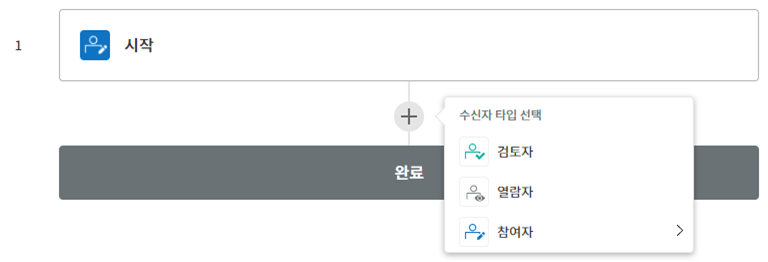
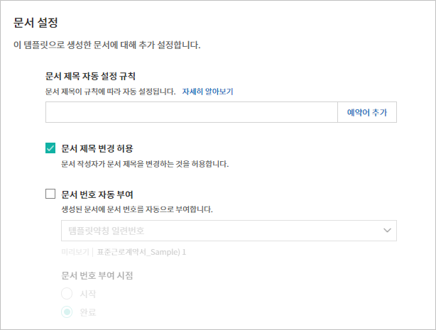
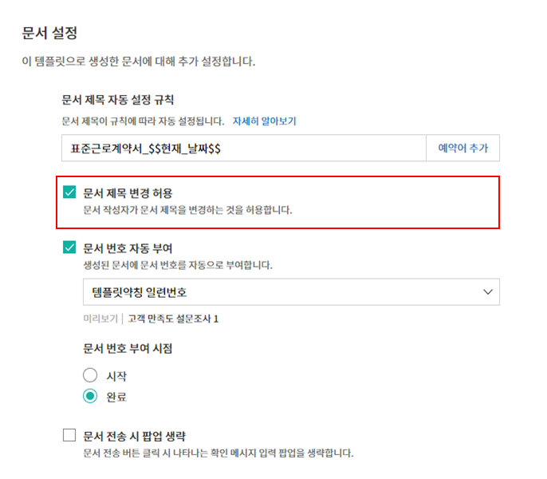
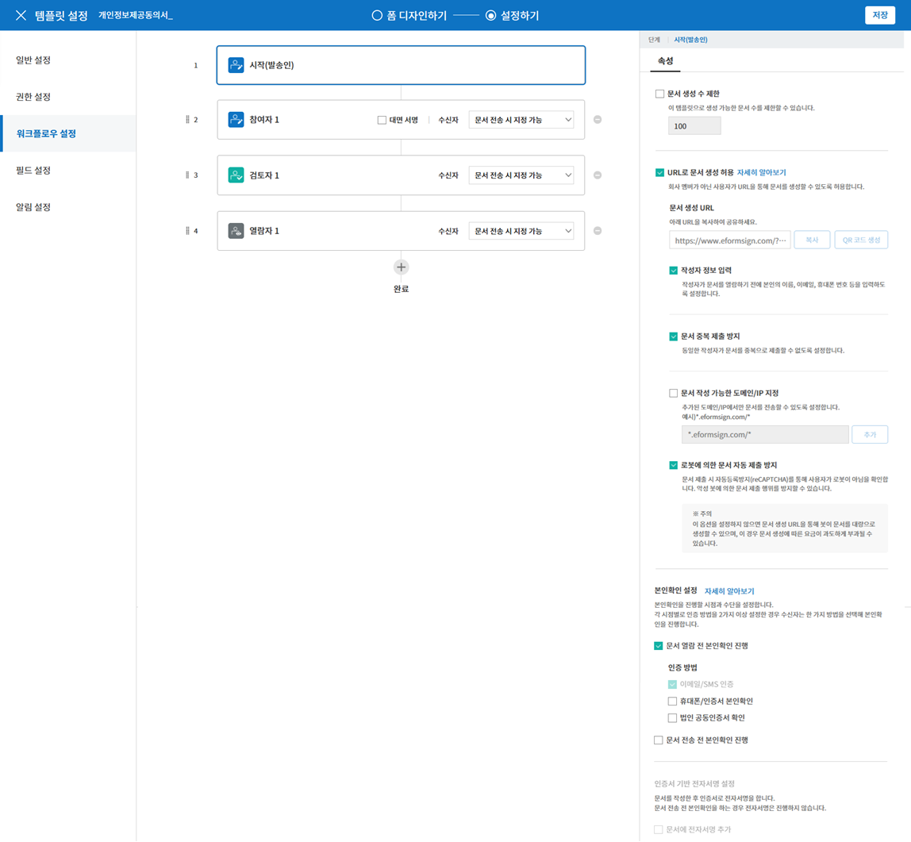
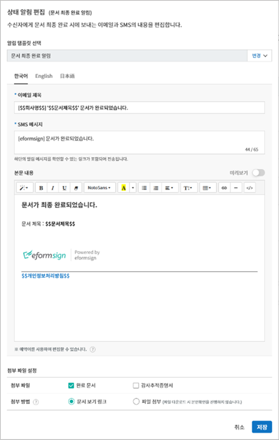
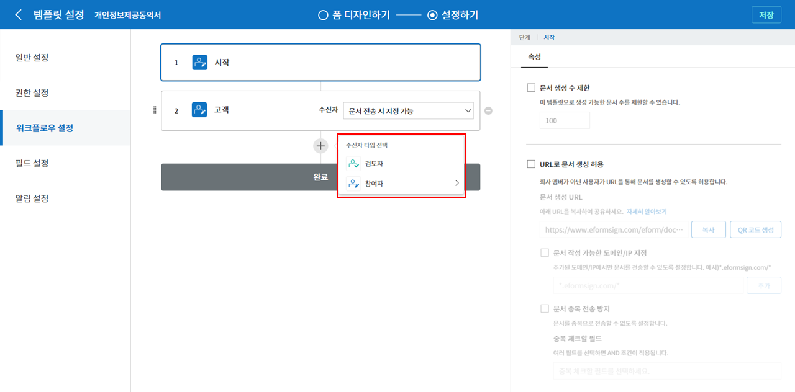
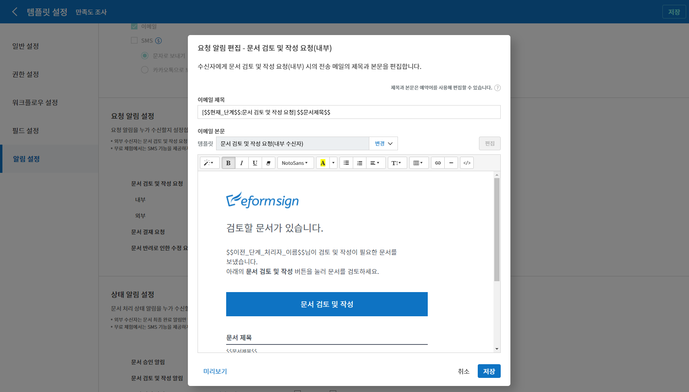
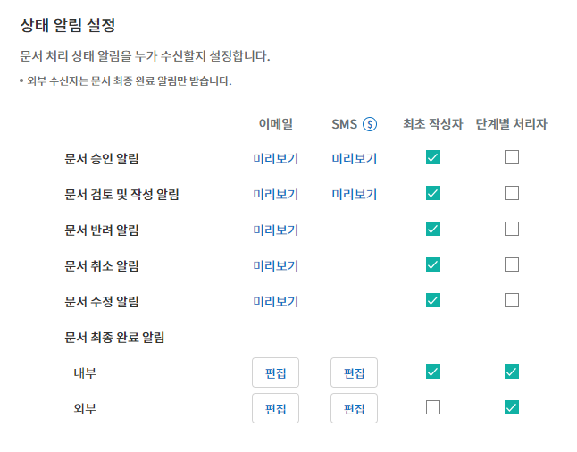

.. _template_wd:

=============================
웹폼 디자이너로 템플릿 만들기
=============================

-----------------------------------------
템플릿 개요
-----------------------------------------

**템플릿**\ 은 이폼사인에서 사용하는 **전자문서 서식**\ 입니다. 기존에 종이로 작성하던 계약서, 신청서, 동의서와 같은 기본 문서 서식을 전자문서 형태로 만든 것을 **템플릿**\ 이라고 합니다. 템플릿은 이폼사인 서비스내 **웹폼 디자이너** 또는 **이폼사인 폼 빌더**\ 를 통해 만들고 업로드할 수 있습니다.

.. tip::

   **❗템플릿은 왜 사용하나요?**

   템플릿은 자주 또는 주기적으로 작성해야 하는 문서를 사용할 때 유용합니다. 
   템플릿으로 한번 등록해 놓으면 문서 작성할 일이 생길때 마다 문서를 새로 업로드하여 만들지 않아도 쉽고 빠르게 문서를 전송할 수 있습니다. 

.. note::
   
   폼 빌더를 통한 템플릿 설정 및 관리 방법은 `폼 빌더로 템플릿 만들기 <chapter7.html#template_fb>`__\ 를 참고하시기 바랍니다.

**웹폼 디자이너로 템플릿 만드는 방법**
~~~~~~~~~~~~~~~~~~~~~~~~~~~~~~~~~~~~~~~~~~

.. note::

   웹폼 디자이너에 대한 자세한 설명은 `웹폼 디자이너 <chapter4.html#webform>`__\ 를 참고하시기 바랍니다.

기존 문서 파일을 웹폼 디자이너에 업로드하여 쉽게 템플릿을 만들수 있습니다.

.. note::

   업로드 가능한 파일 형식은 pdf, hwp, doc, docx, xls, xlsx, ppt, pptx, odt, jpg, png, gif, tiff 입니다.
   파일 크기는 최대 9MB까지 업로드 가능하며, 파일을 추가하더라도 모든 파일 용량의 총합이 9MB을 넘지 않아야 합니다.

1. 템플릿으로 만들 문서 파일을 직접 드래그하거나 **내 컴퓨터에서 파일 선택**\ 을 클릭하여 템플릿으로 만들고자 하는 파일을 선택한 후 업로드 합니다.

   .. figure:: resources/template-manage-upload.png
      :alt: 템플릿 관리>파일 업로드(1)
      :width: 700px

   .. figure:: resources/template-manage-upload-popup.png
      :alt: 템플릿 관리>파일 업로드(2)
      :width: 400px

2. 문서에 맞게 문서 참여자를 추가하고 역할을 설정합니다.

   .. figure:: resources/wfd-participants.png
      :alt: 입력항목 드래그 방법
      :width: 400px

3. 참여자가 입력해야 하는 입력항목를 선택하여 문서에 드래그합니다.

   .. figure:: resources/web-form-designer1.png
      :alt: 입력항목 드래그 방법
      :width: 700px

4. 입력항목의 크기와 위치를 조정합니다.

5. 해당 입력항목의 속성에서 상세 설정을 합니다.

6. **미리보기** 버튼을 클릭해 문서를 확인합니다.

7. 폼 디자인을 마친 후 **설정하기**\ 를 클릭하여 템플릿 설정으로 이동합니다.

**템플릿 설정**

템플릿에 대한 상세 설정을 할 수 있습니다.

-  `일반 설정 <#general-wd>`__\

   템플릿 이름, 약칭, 문서 제목, 문서 번호 등을 설정합니다.

-  `권한 설정 <#auth-wd>`__\

   해당 템플릿을 사용해 문서를 생성할 수 있는 템플릿 사용 권한과 템플릿을 수정할 수 있는 수정 권한을 부여할 멤버 또는 그룹을 지정합니다.

-  `워크플로우 설정 <#workflow-wd>`__\

   문서의 시작부터 완료까지 작성된 문서가 처리될 단계를 설정합니다.

-  `필드 설정 <#field-wd>`__\

   필드의 기본값, 자동 입력 값 등을 설정합니다.

-  `알림 설정 <#noti-wd>`__\

   해당 템플릿으로 생성된 문서에 대한 상태 알림의 수신자를 설정하고 최종 완료 알림 메시지를 편집합니다. 

.. _workflow:

---------------------
워크플로우 개요
---------------------

**워크플로우**\ 란 문서가 작성되어 완료되기까지의 문서의 요청 및 처리 과정을 말합니다.

워크플로우는 템플릿 관리자가 템플릿별로 **템플릿 설정** > **워크플로우 설정**\ 에서 설정할 수 있습니다.

워크플로우는 **시작 - 완료**\ 가 기본 단계이며, 아래와 같이 **검토자**, **참여자** 2가지 단계를 원하는 대로 추가하여 워크플로우를 생성할 수 있습니다.

-  **검토자**

   문서를 검토 후 승인 또는 반려합니다.

-  **참여자**

   문서의 입력항목에 작성 또는 서명합니다.

.. _template_setting:

---------------------
템플릿 설정
---------------------

업로드한 파일로 생성될 템플릿에 대한 상세 사항을 설정할 수 있습니다.

.. note::

   이 작업은 **대표 관리자** 또는 **템플릿 관리자** 권한이 필요하며, PC, 모바일, 애플리케이션에서 진행할 수 있습니다.

.. _general_wd:

일반 설정
~~~~~~~~~~~~~~~

.. figure:: resources/template-setting-general.png
   :alt: 템플릿 설정 > 일반 설정
   :width: 700px

**템플릿 기본정보 설정**
-----------------------------------

템플릿 이름, 카테고리, 유효기간 등 템플릿에 대한 기본 정보를 설정합니다.

**① 템플릿 이름**
   **템플릿 관리**, **템플릿으로 문서 작성** 메뉴 화면에 표시될 템플릿의 이름입니다.

   **템플릿 이름**\ 은 공백 포함 11글자 정도를 권장합니다. 11글자 이상 입력할 경우 전체 템플릿 이름은 이름 위에 마우스를 위치시킨 뒤 잠시 기다리면 확인할 수 있습니다.

   .. figure:: resources/template-name.png
      :alt: 템플릿 이름
      :width: 250px

         

**② 템플릿 약칭**
   템플릿을 간단히 표시하는 짧은 이름입니다. 2~3글자 정도의 짧은 단어를 권장합니다.

   **탬플릿 약칭**\ 은 문서번호, 문서 제목, 메일 템플릿 등에서 사용할 수 있습니다.

         

**③ 카테고리**
   템플릿을 종류별로 구분할 때 사용합니다. 카테고리 이름으로 **템플릿 관리** 화면의 템플릿이나 **문서함**, **문서 관리** 메뉴의 문서들을 필터링할 수 있습니다. 기존의 카테고리에서 선택하거나 새로운 이름을 입력해 새로운 카테고리를 생성할 수 있습니다.

   구분자( **/** )를 사용하면 다단계 카테고리를 설정할 수 있습니다. 예를 들어, 카테고리를 **인사팀/휴가관련**\ 으로 설정하면 1단계 카테고리인 **인사팀** 안에 2단계 카테고리인 **휴가관련** 카테고리가 생성됩니다.

**④ 설명**
   템플릿에 대한 추가적인 설명을 입력합니다. 이 설명 내용은 목록 및 템플릿으로 문서 작성의 템플릿 이름 하단에 나타납니다.

**⑤ 템플릿 유효기간**
   템플릿으로 문서를 작성할 수 있는 기한을 설정합니다. 시작일은 템플릿을 업로드한 날로 기본 설정되며 날짜를 변경할 수 있습니다.

   **기간 제한 없음**\ 을 체크하면 계속해서 문서를 작성할 수 있습니다. **기간 제한 없음** 체크를 해제한 후 날짜를 설정하면 설정된 날짜까지만 해당 템플릿으로 문서를 작성할 수 있습니다. 

**문서 설정**
-----------------------------------

템플릿으로 작성한 문서에 대한 제목 설정 규칙 등 추가 설정을 합니다.

**⑥ 문서 제목 자동 설정 규칙**
   템플릿으로 문서를 작성할 때 입력된 문서의 제목을 설정합니다. 문서 제목 규칙을 설정하지 않을 경우 템플릿 이름이 문서 제목이 됩니다.

**⑦ 문서 제목 변경 허용**
   **문서 제목 변경 허용**\ 을 체크하면 **작성** 단계의 문서 작성자가 문서 제목을 수정할 수 있습니다.

**⑧ 문서 번호 자동 부여**
   문서 번호 자동 부여를 체크하면 생성된 문서에 자동으로 문서번호가 부여됩니다. 문서번호 표현식 중 원하는 표현식을 선택하고, 언제 문서번호를 생성할 지 문서번호 채번 시점을 선택합니다.

   |image1|

**⑨ 문서 전송 시 팝업 생략**
   문서를 빨리 작성하고 제출하는 일이 많을 때 사용합니다. 이 설정을 체크하지 않으면 문서 전송 시 **확인 메시지 입력** 팝업창이 나타납니다. **문서 전송 시 팝업 생략**\ 을 체크하면 **메시지 입력** 팝업창이 나타나지 않고 바로 다음 단계로 진행됩니다.

   
-------------------------------------

.. _document_naming:

일반 설정 > 문서 제목 규칙 만들기
-----------------------------------

**템플릿 설정**\ 에서 해당 템플릿으로 작성되는 문서의 제목 규칙을 설정할 수 있습니다.

**템플릿 문서 제목 규칙**
^^^^^^^^^^^^^^^^^^^^^^^^^^^

문서에 입력된 내용, 또는 문서 작성 관련 정보가 문서 제목에 자동으로 입력되도록 설정할 수 있습니다. 문서 제목 규칙을 설정하면 문서 작성 시점의 정보를 바탕으로 문서 제목이 생성되며 이 제목은 모든 문서함(진행 중 문서함, 처리할 문서함, 완료 문서함)과 **문서 관리** 메뉴의 문서 목록에서 확인할 수 있습니다

.. figure:: resources/document-list.png
   :alt: 문서 관리 > 문서 목록
   :width: 700px

**문서 제목 규칙 설정하는 방법**
+++++++++++++++++++++++++++++++++++++++++++++++

1. 사이드바 메뉴에서 **템플릿 관리**\ 로 이동합니다.

2. 템플릿의 **설정** 아이콘(|image2|)을 클릭하여 **템플릿 설정** 화면으로 이동합니다.

3. **일반 설정** 화면의 **문서 제목 자동 설정 규칙** 입력란에 예약어를 추가하여 원하는 제목 규칙을 입력합니다.

4. 오른쪽 상단에 **저장** 버튼을 클릭하여 변경 사항을 저장합니다.

**예약어 추가하는 방법**
+++++++++++++++++++++++++++++++++++++++

.. figure:: resources/template-setting-general-doc-numering_rule_reserved.png
   :alt: 예약어 사용해서 문서 제목 규칙 설정

-  **문서입력항목**\ : 문서에 입력된 내용을 문서 제목에 추가합니다.

   **예약어 추가** 버튼 클릭 후, **문서입력항목**\ 을 클릭하면 템플릿의 입력 항목 ID 리스트가 나타나며, 원하는 ID를 선택하면 해당 입력 항목에 입력된 내용이 문서 제목에 추가됩니다.

-  **시스템 정보**\ : 문서와 관련된 정보를 제목에 추가합니다.

   **시스템 정보**\ 를 클릭하여 아래 정보 중 선택하여 문서 제목에 표시될 수 있도록 설정합니다.

+----------------------+-----------------------------------------------+
| 정보 종류            | 설명                                          |
+======================+===============================================+
| 현재_날짜            | 문서 작성 시점의 날짜 (예. 2020년 02월 20일)  |
+----------------------+-----------------------------------------------+
| 현재_시간            | 문서 작성 시점의 시간 (예. 오후 02:59)        |
+----------------------+-----------------------------------------------+
| 현재_날짜시간        | 문서 작성 시점의 날짜와 시간 (예. 2020년 02월 |
|                      | 20일 오후 02:59)                              |
+----------------------+-----------------------------------------------+
| 최초_작성자_ID       | 문서를 작성한 멤버의 ID                       |
+----------------------+-----------------------------------------------+
| 최초_작성자_이름     | 문서를 작성한 멤버의 이름                     |
+----------------------+-----------------------------------------------+
| 최초_작성자_부서     | 문서를 작성한 멤버의 부서                     |
+----------------------+-----------------------------------------------+
| 최초_작성자_회사명   | 문서를 작성한 멤버의 회사명                   |
+----------------------+-----------------------------------------------+
| 템플릿명             | 템플릿 설정 > 일반설정에 입력된 템플릿명      |
+----------------------+-----------------------------------------------+
| 템플릿_약칭          | 템플릿 설정 > 일반설정에 입력된 템플릿 약칭   |
+----------------------+-----------------------------------------------+
| 회사명               | 회사 관리 > 회사 정보에 입력된 회사명         |
+----------------------+-----------------------------------------------+
| 회사_주소            | 회사 관리 > 회사 정보에 입력된 주소           |
+----------------------+-----------------------------------------------+
| 회사_연락처          | 회사 관리 > 회사 정보에 입력된 연락처         |
+----------------------+-----------------------------------------------+
| 회                   | 회사 관리 > 회사 정보에 입력된 사업자         |
| 사_사업자_등록_번호  | 등록번호                                      |
+----------------------+-----------------------------------------------+
| 회사_홈페이지        | 회사 관리 > 회사 정보에 입력된 홈페이지 URL   |
+----------------------+-----------------------------------------------+

.. tip::

   **문서 제목 변경 허용** 여부를 확인하세요!

   문서 제목 규칙을 설정해 놓더라도 **문서 제목 변경 허용**\ 이 체크되어 있으면 문서 작성자가 임의로 문서 제목을 변경할 수 있습니다. 문서 제목이 변경되는 것을 원하지 않는 경우 **문서 제목 변경 허용**\ 을 체크 해지해 주세요.

.. _docnumber_wd:

일반 설정 > 문서번호 생성 및 확인하기
---------------------------------------

템플릿 별로 작성된 문서에 연속되는 문서번호를 부여할 수 있습니다. 
템플릿 별로 문서 번호 자동 생성 여부를 설정할 수 있으며 번호 형식 4가지 중 한 가지를 선택하여 설정 가능합니다. 문서 번호는 정보 입력 항목을 사용하여 문서 내에 입력할 수 있습니다. 또한 문서 목록에서 별도의 컬럼으로 확인할 수 있으며 문서 번호로 문서를 검색할 수 있습니다.

**문서번호 생성하는 방법**
^^^^^^^^^^^^^^^^^^^^^^^^^^^^

.. figure:: resources/template-setting-general-doc-numering1.png
   :alt: 문서번호 설정하기
   :width: 600px

1. 사이드바 메뉴에서 **템플릿 관리**\ 로 이동합니다.

2. 템플릿의 **설정** 아이콘(|image3|)을 클릭하여 **템플릿 설정** 화면으로 이동합니다.

3. **일반 설정** 화면의 **문서 번호 자동 부여**\ 를 체크합니다.

   -  **문서번호 규칙 선택하기**

   .. figure:: resources/template-setting-general-doc-numering1_1.png
      :alt: 문서번호 규칙 선택

   **▪ 일련번호**
      문서 생성 순서대로 1번부터 생성

      예) 1, 2, 3...

   **▪ 년도 일련번호**
      문서가 생성된 년도 + 번호 1번부터 생성

      예) 2020_1, 2020_2...

   **▪ 템플릿약칭 일련번호**
      템플릿 약칭 + 번호 1번부터 생성

      예) 신청서 1, 신청서 2...

   **▪ 템플릿약칭 년도 일련번호**
      템플릿 약칭 + 문서가 생성된 년도 + 번호 1번부터 생성

      예) 신청서 2020_1, 신청서 2020_2...

   -  **문서 번호 부여 시점 선택하기**

   ▪ **시작**
      문서 작성 시작 단계에서 문서번호를 생성합니다.

   ▪ **완료**
      문서가 모든 워크플로우를 거쳐 문서 완료 시 문서번호를 생성합니다.

4. 오른쪽 상단의 **저장** 버튼을 클릭해 설정을 저장합니다.

**문서번호 확인하는 방법**
^^^^^^^^^^^^^^^^^^^^^^^^^^^^

문서번호는 문서번호 입력 항목을 사용하여 문서 내에 입력하거나 문서 목록에서 확인할 수 있습니다.

-  **문서 내에 문서번호 표시하기**

   문서번호는 문서번호 입력 항목을 사용하여 문서 내에 입력할 수 있습니다.

   1. 웹폼 디자이너에 문서 파일을 업로드합니다.

   2. 문서번호가 들어갈 위치에 문서 입력 항목을 추가합니다.

      |image4|

   3. **다음** 버튼을 클릭해 **템플릿 설정**\ 으로 이동합니다.

   4. **템플릿 설정 > 일반 설정**\ 에서 **문서 번호 자동 부여**\ 를 체크합니다.

   5. 문서 번호 규칙을 선택합니다.

   6. **저장** 버튼을 클릭해 설정을 저장합니다.

-  **문서 목록에서 문서번호 확인하기**

   .. figure:: resources/doc-list-docnumber1.PNG
      :alt: 문서함 - 문서 목록
      :width: 700px

   .. figure:: resources/doc-list-docnumber2.png
      :alt: 문서함 - 문서 목록 - 문서번호 확인
      :width: 700px

   문서번호는 문서 목록을 볼 수 있는 문서함(진행 중 문서함, 처리할 문서함, 완료 문서함) 및 문서 관리 메뉴(문서 관리자 권한 필요)에서 확인할 수 있습니다.

   1. 사이드바 메뉴에서 **문서함** 또는 **문서 관리** 메뉴로 이동합니다.

   2. 오른쪽 상단의 **컬럼 설정** 아이콘을 클릭합니다.

   3. 컬럼 리스트의 **문서번호**\ 를 체크합니다.

      |image5|

   4. 문서 목록에 **문서번호** 컬럼이 추가된 것을 확인합니다.

-  **문서번호로 문서 검색하기**

   |image6|

   문서번호 검색은 상세 검색 기능을 통해 확인할 수 있습니다.

   1. **문서함** 또는 **문서 관리** 메뉴로 이동합니다.

   2. 문서 목록 상단의 **상세** 버튼을 클릭합니다.

   3. 검색 기준 중 **문서번호**\ 를 선택합니다.

   4. 검색할 단어나 숫자를 입력합니다.

   5. 검색 결과를 확인합니다.

.. _auth_wd:

권한 설정
~~~~~~~~~~~~~~~

권한 설정 화면에서는 템플릿 사용 권한, 템플릿 수정 권한을 설정할 수 있습니다.

.. figure:: resources/template-setting-auth-new.PNG
   :alt: 템플릿 설정 > 권한 설정
   :width: 700px

**템플릿 사용 권한**

템플릿을 사용해서 문서를 만들 수 있는 권한을 설정하며, 회사에 속한 모든 멤버가 사용할 수 있도록 **전체**\로 설정을 하거나 특정 **그룹 또는 멤버**\ 를 검색하여 선택할 수 있습니다.

**템플릿 수정 권한**

해당 템플릿을 수정할 수 있는 권한을 설정하며 **멤버**\ 를 검색하여 선택합니다.

**문서 관리 권한**

문서 관리 권한은 **회사 관리 > 권한 관리 > 문서 관리자**\ 에서 설정할 수 있습니다. 자세한 내용은 `권한 구분 <chapter2.html#permissions>`__\ 을 참고해 주세요.

.. _workflow_wd:

워크플로우 설정
~~~~~~~~~~~~~~~

**템플릿 설정** 화면에서 **워크플로우 설정** 탭을 클릭해 해당 템플릿의 워크플로우를 생성 또는 수정할 수 있습니다. 

.. figure:: resources/workflow-setting_new.PNG
   :alt: 템플릿 설정 > 워크플로우 설정
   :width: 600px

**워크플로우 단계 추가하는 방법**
-------------------------------------

1. **워크플로우 설정** 탭을 클릭해 이동합니다.

2. 시작과 완료 사이의 단계 추가(|image8|) 버튼을 클릭합니다.

3. **수신자 타입 선택**\ 에서 추가하고자 하는 **수신자 타입**\ 을 선택합니다.

   |image9|

.. tip::

   **❗참여자와 검토자의 차이**

   참여자는 실제 문서에 서명, 작성 등 입력 항목에 입력할 수 있으며, 검토자는 문서에 직접 입력은 할 수 없고 문서 검토 후 승인 여부만 결정합니다.

4. 선택 시 워크플로우에 단계가 추가됩니다

.. tip::

   참여자는 **폼 디자인하기** 단계에서 추가하여야 하며, 최대 30명까지 추가할 수 있습니다. 
   검토자를 포함한 워크플로우 단계는 개수 제한없이 추가할 수 있습니다. 
   워크플로우 단계를 클릭한 후 드래그해서 순서를 조정할 수 있으며, 단계 오른쪽에 위치한 **-**\ 를 클릭하면 단계가 삭제됩니다.

   |image10|

**워크플로우 단계별 상세 설정**
-------------------------------------

단계를 클릭하여 각 워크플로우 단계별로 상세 속성을 설정할 수 있습니다.

**시작: 문서 작성을 시작하는 단계입니다.**

+++++++++++++++++++++++++++++++++++++++++++++++++++++

-  **문서 생성 수 제한**: 체크하여 해당 템플릿으로 생성되는 최대 문서 개수를 설정할 수 있습니다.

-  **URL로 문서 생성 허용**: 멤버가 아닌 외부 사용자에게 요청시 이폼사인에 로그인하지 않고 URL을 통해 바로 접속하여 문서를 처리할 수 있는 공개 링크를 생성합니다.

-  **문서 작성 가능한 도메인/IP 지정**: 특정 도메인 또는 IP에서만 문서를 전송할 수 있도록 설정할 수 있습니다.

-  **문서 중복 전송 방지**: 문서를 중복으로 전송하는 것을 방지하며, 필드를 선택해 해당 필드를 기준으로 중복 여부를 확인합니다.

.. tip::

   **URL로 문서 작성 요청시 QR 코드 생성 기능 활용하기**

   URL 주소를 상대방한테 전달해서 문서를 작성할 수 있는 기능을 사용할 때 해당 링크를 QR코드로 바로 만들수 있습니다.
   QR 코드 이미지를 웹사이트에 게시하거나 다른 사람과 공유하여 문서 작성을 요청할 수 있습니다. 작성자는 모바일 기기의 카메라로 QR 코드를 스캔해서 문서를 작성 및 제출할 수 있습니다.

   시작 단계 워크플로우 속성에서 **URL로 문서 생성 허용** 옵션을 체크하고 
   **QR 코드 생성** 버튼을 클릭하면 QR 코드 이미지가 바로 다운로드됩니다.

   
   .. figure:: resources/workflow-step-start-QRcode.png
      :alt: 워크플로우 설정 > QR 코드 생성하기
      :width: 400px

**참여자: 문서의 입력항목에 작성, 서명 등 문서에 참여하는 수신자 단계입니다.**

+++++++++++++++++++++++++++++++++++++++++++++++++++++++++++++++++++++++++++++++++++++++++++++

.. figure:: resources/workflow-participant-properties.png
   :alt: 워크플로우 설정 > 참여자 단계 속성
   :width: 700px

-  **알림**\: 수신자에게 문서 작성 요청 시 알림을 보낼 방법을 설정하고 알림 내용을 편집할 수 있습니다. 

   - **알림 방법 선택:** 알림은 기본적으로 이메일로 발송되며, SMS 선택 시, **문자**\ 와 **카카오톡**\ 이 활성화되어 선택할 수 있습니다.

   - **알림 내용 편집:** 각 단계별로 수신자에게 발송되는 문서 요청 알림 내용을 편집할 수 있습니다. 

-  **문서 전송 기한**\: 수신자가 문서를 받은 후 다음 단계 수신자에게 문서를 전송하기까지의 기한을 설정합니다.       

   .. tip::

      멤버의 경우 문서 전송 기한이 없도록 설정할 수 있습니다. **문서 전송 기한을 0일 0시간**\ 으로 설정하세요.
      외부 수신자는 문서 전송 기한을 최대 50일까지 설정할 수 있습니다. 
   

-  **수신자 정보 자동 설정**\: 수신자에게 문서 요청시 문서에 입력된 정보를 바탕으로 수신자의 이름 및 연락처를 자동으로 설정할 수 있습니다.

-  **문서 열람 전 본인확인 설정:** 문서 열람 전 수신자가 본인확인을 진행한 후 문서를 열람할 수 있도록 설정합니다. 간편 인증과 추가 인증 모두 선택할 경우, 2단계로 본인확인을 진행할 수 있습니다. 

   -  **간편 인증**\ : 외부 수신자가 문서를 열람하기 위해서 본 설정에서 미리 설정한 정보를 입력해야 합니다. 도움말을 입력하여 힌트를 제공할 수 있습니다.

      - 문서 접근 암호: 문서 열람 시 입력할 암호를 설정합니다. 암호 설정은 **직접 입력, 수신자 이름, 문서에 입력된 내용** 중 선택할 수 있습니다. 

         - 직접 입력: 설정 단계에서 암호를 직접 입력하고 수신자에서 보여질 암호 힌트를 입력합니다. 

         - 수신자 이름: 수신자 이름으로 설정하면 수신자 정보에 입력한 이름과 일치한 이름을 수신자가 암호로 입력해야 합니다.
   
         - 문서에 입력된 내용: 문서 내 입력 항목을 선택하여 해당 입력 항목에 입력한 내용을 암호로 설정할 수 있습니다. 

            .. figure:: resources/doc-password-setting.png
               :alt: 문서 접근 암호 설정
               :width: 400px    

   - **추가 인증**\: 본인확인 수단을 추가로 설정합니다. 
      
      - **이메일/SMS 인증:** 수신자의 이메일 또는 휴대폰 번호로 6자리 인증번호를 발송합니다. 수신자는 인증번호를 인증 창에 입력 후 문서 열람을 할 수 있습니다.

      - **휴대폰 본인확인:** 수신자 명의의 휴대폰으로 본인확인을 진행한 후 문서를 열람하도록 설정합니다.

      - **법인 공동인증서 확인:** 법인간 계약 시 법인 공동인증서로 법인 인증을 진행한 후 문서를 열람하도록 설정합니다. 사업자등록번호는 **직접 입력, 문서에 입력된 내용, 입력 안 함** 중 선택할 수 있습니다. 

         .. figure:: resources/additional-verification.png
            :alt: 추가인증 설정
            :width: 400px  

      .. note::

         추가 인증을 모두 선택하면 수신자가 인증 진행 단계에서 3가지 중 1가지 방법을 선택해 진행할 수 있습니다. 
         이메일 인증을 제외한 추가 인증 수단은 모두 별도의 추가 비용이 발생됩니다. 

-  **문서 일부 숨기기 설정:** 2개 이상의 파일로 구성된 문서일 경우 일부 문서를 숨기기 설정할 수 있습니다.

.. note::

   **참여자/검토자 단계 - 수신자 지정하기**

   해당 단계의 수신자를 미리 선택하거나 문서 전송 시 전송자가 선택할 수 있도록 할 수 있습니다.

   .. figure:: resources/workflow-participant-selected.png
      :alt: 워크플로우 설정 > 참여자 수신자 지정
      :width: 700px   

   -  **문서 전송 시 지정 가능**: 문서 전송 단계에서 수신자를 정보를 입력할 수 있도록 설정합니다. 수신자 정보를 입력하지 않으면 해당 단계는 건너뛰고 진행되게 됩니다.

   -  **문서 전송 시 필수로 지정**: 문서 전송 단계에서 수신자 정보를 반드시 입력/선택하도록 설정합니다. 수신자 정보를 입력하지 않으면 문서가 전송되지 않습니다.

   -  **그룹 또는 멤버**: 그룹 또는 멤버 중 한 사람이 문서를 처리하도록 설정합니다. 그룹 또는 멤버는 여러명을 선택할 수 있으나, 선택된 사람 중 한 사람만 문서를 처리할 수 있습니다.

   -  **이전 단계 수신자**: 시작 단계를 포함해서 이전 단계의 수신자가 문서를 처리하도록 설정합니다. 단계를 선택할 수 있습니다.

**검토자: 검토자는 문서를 검토 후 승인 또는 반려할 수 있습니다.**

+++++++++++++++++++++++++++++++++++++++++++++++++++++++++++++++++++++++++++++

.. figure:: resources/workflow-reviewer-properties.png
   :alt: 워크플로우 설정 > 검토자
   :width: 700px

-  **단계 이름**\: 해당 단계의 이름을 설정할 수 있습니다.

-  **알림**\: 수신자에게 문서 작성 요청 시 알림을 보낼 방법을 설정하고 알림 내용을 편집할 수 있습니다. 

   - 알림 방법 선택: 알림은 기본적으로 이메일로 발송되며, SMS 선택 시, **문자**\ 와 **카카오톡**\ 이 활성화되어 선택할 수 있습니다.

   - 알림 내용 편집: 각 단계별로 수신자에게 발송되는 문서 요청 알림 내용을 편집할 수 있습니다. 

-  **문서 전송 기한**\: 수신자가 문서를 받은 후 다음 단계 수신자에게 문서를 전송하기까지의 기한을 설정합니다. 문서 전송 기한을 설정하지 않으려면 0일 0시간으로 입력하세요(수신자가 내부 멤버일 경우에만 해당). 

.. _hide:

**문서에서 일부 영역만 보이도록 설정하는 방법**
^^^^^^^^^^^^^^^^^^^^^^^^^^^^^^^^^^^^^^^^^^^^^^^^^^^^^^^^^^

.. tip::

   
   **문서 일부 숨기기 설정**

   파일을 추가해서 여러 개의 파일로 문서를 만든 경우 수신자에게 보여지는 문서의 일부를 숨기도록 설정할 수 있습니다. 즉, 한 템플릿에서 수신자에게 보낼 부분과 보내지 않을 문서를 구분할 수 있습니다. 

   업로드한 문서 파일이 여러 개인 경우, 워크플로우의 **수신자 단계** 속성 설정에서 **문서 일부 숨기기 설정**\ 이 나타납니다. 문서에 추가된 파일 이름이 목록으로 표시되어 각 파일별로 **보이기, 숨기기 또는 이전 단계 요청자가 선택**\ 할 수 있도록 설정할 수 있습니다.

   ❗단, 문서 일부 숨기기 기능은 문서 수신자가 내부 멤버가 아닌 외부 수신자일 경우에만 적용됩니다. 

   **설정 방법**

   1. 대시보드 **메뉴 > 템플릿 관리**\ 로 이동합니다.
   2. 템플릿의 **설정 아이콘(⚙)**\ 을 클릭하여 템플릿 설정 화면으로 이동합니다.
   3. **워크플로우 설정** 탭으로 이동합니다.
   4. **수신자** 단계를 추가합니다. 
   5. 오른쪽 속성 영역 하단의 **문서 일부 숨기기 설정**\ 을 체크합니다. 
   6. 문서 내 영역에 따라 노출 여부를 선택합니다. 

      - **보이기:** 수신자에게 해당 시트 또는 구역이 전송됩니다.

      - **선택:** 전송 단계에서 해당 영역의 노출 여부를 선택합니다.

      - **숨기기:** 수신자에게 해당 시트 또는 구역이 보이지 않습니다.

   .. figure:: resources/hide-setting.png
      :alt: 문서 일부 숨기기 설정
      :width: 500px

**완료: 문서가 모든 워크플로우 단계를 거쳐 최종 완료되는 단계입니다.**

+++++++++++++++++++++++++++++++++++++++++++++++++++++++++++++++++++++++++++++

|image18|

-  **별도의 파일 저장소에 완료 문서 저장하기**: 문서가 완료되면 대표 관리자 또는 회사 관리자가 별도로 설정한 외부 클라우드 저장소에 완료된 문서가 저장되도록 설정합니다.

-  **공인전자문서센터에 완료 문서 저장하기**: 문서가 완료되면 이폼사인과 연계된 공인전자문서센터에 자동으로 저장되도록 설정합니다. 본 기능은 추가 요금이 발생합니다.

-  **최종 완료 문서에 타임스탬프 찍기**: 완료된 문서가 그 이후 변경되지 않았음을 증명하는 타임스탬프가 문서에 적용될 수 있도록 설정합니다. 본 기능은 추가 요금이 발생합니다.

.. _field_wd:

필드 설정
~~~~~~~~~

**필드 설정**\ 에서는 문서 목록에 표시되는 컬럼의 표시 여부 및 순서를 설정할 수 있습니다. 또한, 템플릿에 들어가는 필드의 기본값 또는 자동입력 값을 설정할 수 있습니다.

.. figure:: resources/template-field-setting.png
   :alt: 템플릿 설정 > 필드 설정
   :width: 700px

필드의 기본값은 **사용자 정의 필드 관리**\ 에 저장되어 있는 회사/그룹/멤버 정보를 입력되도록 설정하거나, 최근 입력값 선택 또는 사용자가 직접 입력하도록 설정할 수 있습니다.

.. tip::

   **자동 입력 설정하는 방법**

   문서에 자주 입력하는 정보를 미리 저장하고 자동으로 입력되도록 설정할 수 있습니다.

   예를 들어 작성자의 이름, 연락처 등 작성자 정보, 부서명, 책임자, 회사 대표 번호 등 회사 또는 그룹에 대한 정보를 미리 저장하여 자동으로 입력되도록 설정할 수 있습니다. 관련 필드의 항목 추가 및 기본 값 설정은 **회사 관리 > 사용자 정의 필드 관리**\ 에서 할 수 있습니다.

   1. **사용자 정의 필드 관리** 화면에서 필드를 추가합니다.

   2. **템플릿 관리** 메뉴로 이동합니다.

   3. **템플릿 설정** 아이콘을 클릭합니다.

   4. **필드 설정** 메뉴로 이동합니다.

   5. 자동 입력이 되도록 설정할 필드의 기본값을 입력합니다.

   6. 모든 설정을 완료한 후 **저장** 버튼을 클릭합니다

.. _noti_wd:

알림 설정
~~~~~~~~~

템플릿으로 작성되는 문서의 상태 알림을 수신할 수신자 설정 및 알림 내용 확인, 편집 등을 할 수 있습니다.

**상태 알림 설정**

해당 템플릿으로 생성된 문서의 진행 상태에 대한 알림의 수신자를 설정하고 알림 메시지를 미리보기(문서 승인/검토 및 작성/반려/취소/수정 알림) 또는 편집(문서 최종 완료 알림) 할 수 있습니다.

.. figure:: resources/template-setting-notification-channel.png
   :alt: 알림 채널 설정

.. note::

   **최초 작성자** 옵션에 체크, **단계별 처리자** 옵션 체크 해제 시, 문서를 최초 작성한 사람에게 상태 알림을 전송합니다.

   **최초 작성자** 옵션 체크 해제, **단계별 처리자** 옵션에 체크 시, 최초 작성한 사람을 제외하고 현재 단계 이전에 문서를 처리한 사람들에게 상태 알림을 전송합니다.

   **최초 작성자**, **단계별 처리자** 옵션 모두 체크 시, 최초 작성한 사람, 현재 단계 이전에 문서를 처리한 사람 모두에게 상태 알림을
   전송합니다.

   **최초 작성자**, **단계별 처리자** 옵션 모두 체크 해제 시, 해당 단계의 상태 알림을 전송하지 않습니다.

------------------
개별 템플릿 메뉴
------------------

**템플릿 관리** 화면에서 템플릿 이름 오른쪽에 위치한 메뉴 아이콘(⋮)을 클릭하면 각 템플릿별 메뉴가 나타납니다.

|image23|

-  **복제**: 템플릿을 복제합니다. 해당 템플릿의 문서 파일과 상세 템플릿 설정이 복제되며 상세 설정을 변경하여 저장할 수 있습니다.

-  **삭제**: 템플릿을 삭제합니다. 템플릿이 삭제되면 더 이상 해당 템플릿으로 문서를 생성할 수 없습니다.

-  **비활성화**: 템플릿을 비활성화하면 다른 멤버의 **템플릿으로 문서 작성** 페이지에 표시되지 않습니다.

-  **소유자 변경**: 템플릿의 소유자를 변경할 수 있습니다. 기본적으로 템플릿 소유자는 템플릿을 생성한 사람으로 자동 지정됩니다. 이후 변경하고자 할 경우 소유자 변경을 통해 다른 멤버로 소유자를 변경할 수 있습니다. 템플릿 소유자는 템플릿 관리 권한을 가진 멤버 중에 선택할 수 있습니다.

   |image24|

-  **문서 번호 설정 변경**: 템플릿 설정에서 설정한 문서 번호 설정을 변경할 수 있는 기능으로 문서번호가 채번되는 템플릿의 시작번호를 다시 설정할 수 있습니다.

   .. caution::

      단, 같은 문서 번호로 2개의 문서가 생성될 수 있으니 잘 확인하고 변경해야 합니다.

   |image26|

-----------
템플릿 검색
-----------

**템플릿 관리** 화면에서는 템플릿 카테고리별 조회, 검색 등을 할 수 있습니다.

|image27|

**① 템플릿 조회**
   클릭하여 템플릿 상태, 카테고리 별로 템플릿을 조회할 수 있습니다. **X** 를 클릭하면 전체 카테고리로 돌아갑니다.

   카테고리의 생성은 **템플릿 설정 > 일반 설정**\ 에서 할 수 있습니다.

**② 템플릿 검색**
   검색 키워드를 입력하여 템플릿을 검색합니다.

**③ 정렬**
   템플릿 정렬 순서를 템플릿 이름 또는 카테고리 기준으로 오름차순, 내림차순을 설정합니다.

.. |image1| image:: resources/template-setting-general-doc-numering.png
.. |image2| image:: resources/config-icon.PNG
.. |image3| image:: resources/config-icon.PNG
.. |image4| image:: resources/web-form-designer-document-component.png
   :width: 700px
.. |image5| image:: resources/columnlist-docnum.png
.. |image6| image:: resources/doc-number-search.png
   :width: 600px
.. |image7| image:: resources/template-setting-auth-doc-new.PNG
   :width: 700px
.. |image8| image:: resources/workflow-addstep-plus-button.png

.. |image10| image:: resources/workflow-step-added.png
   :width: 400px
.. |image11| image:: resources/workflow-step-item-manage.png
   :width: 700px

.. |image14| image:: resources/template-approval-property-displayname.png
   :width: 250px
.. |image15| image:: resources/workflow-step-internal-recipient-property.png
   :width: 700px
.. |image16| image:: resources/workflow-step-external-recipient-property.png
   :width: 700px
.. |image17| image:: resources/workflow-step-external-recipient-property-pw.png
   :width: 400px
.. |image18| image:: resources/workflow-step-complete-property.png
   :width: 700px
.. |image19| image:: resources/template-setting-notification-edit.png
   :width: 450px

.. |image22| image:: resources/template-hamburgericon.png
.. |image23| image:: resources/template-manage-menu-wfd.png
   :width: 500px
.. |image24| image:: resources/template-owner-change.PNG
.. |image25| image:: resources/document-manager-setting.PNG
.. |image26| image:: resources/template-manage-menu-wfd-numbersetting.png
   :width: 400px
.. |image27| image:: resources/template-manage-search.png
   :width: 700px
