.. _template_fb:

============================================
폼 빌더로 템플릿 만들기
============================================

--------------
템플릿 개요
--------------

**템플릿**\ 은 이폼사인에서 사용하는 **전자문서 서식**\ 입니다. 기존에 종이로 작성하던 계약서, 신청서, 동의서와 같은 기본 문서 서식을 전자문서 형태로 만든 것을 **템플릿**\ 이라고 합니다. 템플릿은 이폼사인 서비스내 **웹폼 디자이너** 또는 **이폼사인 폼 빌더(MS Office Add-in)**\ 로 만들고 업로드할 수 있습니다. 

.. tip::

   **❗템플릿은 왜 사용하나요?**

   템플릿은 자주 또는 주기적으로 작성해야 하는 문서를 사용할 때 유용합니다. 

   템플릿으로 한번 등록해 놓으면 문서 작성할 일이 생길때 마다 문서를 새로 업로드하여 만들지 않아도 쉽고 빠르게 문서를 전송할 수 있습니다. 

.. note::
   
   웹폼 디자이너를 통한 템플릿 설정 및 관리 방법은 `웹폼 디자이너로 템플릿 만들기 <chapter5.html#template_wd>`__\ 를 참고하시기 바랍니다.

폼 빌더(MS Office Add-in)로 템플릿 만드는 방법
~~~~~~~~~~~~~~~~~~~~~~~~~~~~~~~~~~~~~~~~~~~~~~~~~~~~~~~

폼 빌더(MS Office Add-in)를 사용하면 기존에 워드, 엑셀, 파워포인트 등 MS Office 문서로 만들어진 파일을 전자문서 서식으로 만들어 바로 이폼사인에 템플릿으로 업로드할 수 있습니다. 템플릿을 만들려면 우선 이폼사인 `폼 빌더를 다운로드 <https://www.eformsign.com/eform/dev_tool.html>`__\ 해야합니다.

.. note::

   폼 빌더(MS Office Add-in)에 대한 자세한 설명은 `폼 빌더 소개 <chapter6.html#formbuilder>`__\ 를 참고해 주세요.

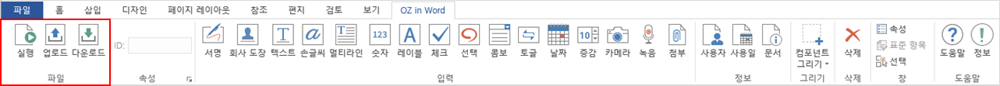

1. 워드, 엑셀 또는 파워포인트로 만든 문서 파일을 엽니다.

2. **OZ in Word(Excel 또는 PPT)** 메뉴로 이동합니다.

3. 입력항목를 추가할 위치를 선택합니다.

4. 입력항목 종류를 선택합니다.

5. 추가된 입력항목의 크기와 위치를 조정합니다.

6. **실행** 버튼을 클릭해 입력항목의 동작을 확인합니다.

7. **업로드** 버튼을 클릭해 템플릿을 업로드 합니다.

8. 새 템플릿을 선택한 후 템플릿에 대한 상세 설정을 합니다. 

**템플릿 설정**

템플릿에 대한 상세 설정을 할 수 있습니다.

-  `일반 설정 <#general_fb>`__

   템플릿 이름, 약칭, 문서 제목, 문서 번호 등을 설정합니다.

-  `권한 설정 <#auth_fb>`__

   해당 템플릿을 사용해 문서를 생성할 수 있는 템플릿 사용 권한과 템플릿을 수정할 수 있는 수정 권한을 부여할 멤버 또는 그룹을 지정합니다.

-  `워크플로우 설정 <#workflow_fb>`__

   문서의 시작부터 완료까지 작성된 문서가 처리될 단계를 설정합니다.

-  `필드 설정 <#field_fb>`__

   필드의 기본값, 자동 입력 값 등을 설정합니다.

-  `알림 설정 <#noti_fb>`__

   해당 템플릿을 통해 작성된 문서의 상태 변경시 상태 알림의 수신자를 설정하고 최종 완료 알림 메시지를 편집합니다

.. _workflow_fb_overview:

---------------------
워크플로우 개요
---------------------

**워크플로우**\ 란 문서가 작성되어 완료되기까지의 문서의 요청 및 처리 과정을 말합니다.

워크플로우는 템플릿 관리자가 템플릿별로 **템플릿 설정** > **워크플로우 설정**\ 에서 설정할 수 있습니다. **시작 - 완료**\ 가 기본 단계이며, 다음의 수신자 타입을 원하는 대로 추가하여 워크플로우를 생성할 수 있습니다.

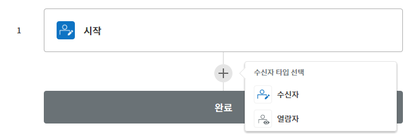

-  **수신자**

   문서를 검토 후 승인/반려하거나 문서의 입력항목에 작성/서명합니다.

-  **열람자**

   문서를 열람만 할 수 있습니다.
   

.. _template_setting_fb:

---------------------
템플릿 설정
---------------------

업로드한 파일로 생성될 템플릿에 대한 상세 사항을 설정할 수 있습니다.

.. note::

   이 작업은 **대표 관리자** 또는 **템플릿 관리자** 권한이 필요하며, PC, 모바일, 애플리케이션에서 진행할 수 있습니다.

**템플릿 설정 화면으로 이동하는 방법**

1. 사이드바 메뉴에서 **템플릿 관리**\ 로 이동합니다.

2. 원하는 템플릿의 이름이나 설정 아이콘(|image1|)을 클릭합니다.

   |image2|

.. _general_fb:

일반 설정
~~~~~~~~~~~

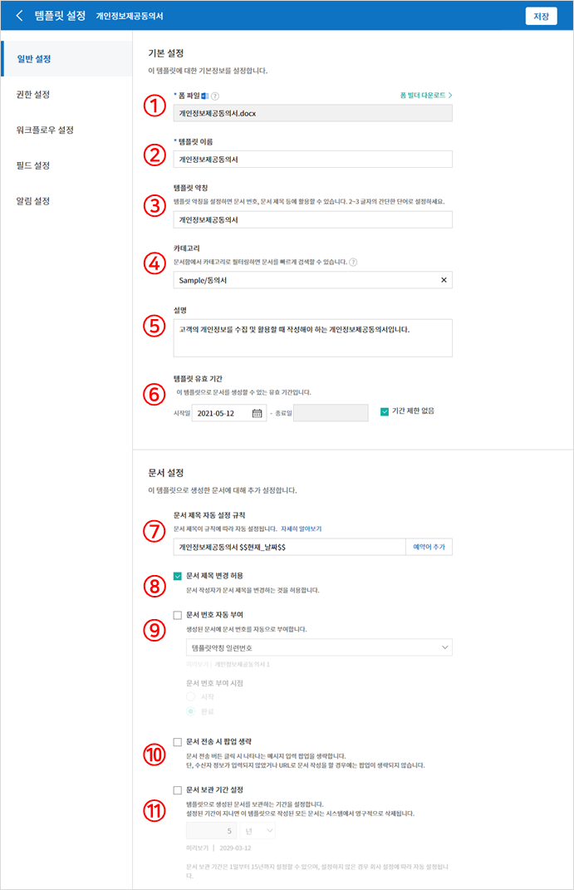

템플릿 기본정보 설정
-----------------------------------

템플릿 이름, 카테고리, 유효기간 등 템플릿에 대한 기본 정보를 설정합니다.

**① 폼 파일**
   **폼 빌더(MS Office Add-in)**\ 를 통해 워드, 파워포인트, 엑셀에서 이폼사인에 업로드한 파일의 파일명입니다. 폼 파일 이름을 변경하려면 업로드한 워드, 파워포인트, 엑셀 파일의 파일명을 변경한 뒤 해당 파일을 다시 업로드해야 합니다.

**② 템플릿 이름**
   **템플릿 관리**, **템플릿으로 문서 작성** 메뉴 화면에 표시될 템플릿의 이름입니다.

   **템플릿 이름**\ 은 공백 포함 11글자 정도를 권장합니다. 11글자 이상 입력할 경우 전체 템플릿 이름은 이름 위에 마우스를 위치시킨 뒤 잠시 기다리면 확인할 수 있습니다.

   .. figure:: resources/template-name.png
      :alt: 템플릿 이름
      :width: 250px

**③ 템플릿 약칭**
   템플릿을 간단히 표시하는 짧은 이름입니다. 2~3글자 정도의 짧은 단어를 권장합니다.

   **탬플릿 약칭**\ 은 문서번호, 문서 제목, 메일 템플릿 등에서 **$$**\ 를 입력해 사용할 수 있습니다.

   .. figure:: resources/template-short-name.png
      :alt: 템플릿 약칭

**④ 카테고리**
   템플릿을 종류별로 구분할 때 사용합니다. 카테고리 이름으로 **템플릿 관리** 화면의 템플릿이나 **문서함**, **문서 관리** 메뉴의 문서을 필터링 할 수 있습니다. 기존의 카테고리에서 선택하거나 새로운 이름을 입력해 새로운 카테고리를 생성할 수 있습니다.

   구분자( **/** )를 사용하면 다단계 카테고리를 설정할 수 있습니다. 예를 들어, 카테고리를 **인사팀/휴가관련**\ 으로 설정하면 1단계 카테고리인 **인사팀** 안에 2단계 카테고리인 **휴가관련** 카테고리가 생성됩니다.

**⑤ 설명**
   템플릿에 대한 추가적인 설명을 입력합니다. 이 설명 내용은 목록 및 템플릿으로 문서 작성의 템플릿 이름 하단에 나타납니다.

**⑥ 템플릿 유효기간**
   템플릿으로 문서를 작성할 수 있는 기한을 설정합니다. 시작일은 템플릿을 업로드한 날로 기본 설정되며 날짜를 변경할 수 있습니다.

   **기간 제한 없음**\ 을 체크하면 해당 템플릿으로 계속해서 문서를 작성할 수 있습니다. **기간 제한 없음** 체크를 해제한 후 날짜를 설정하면 설정된 날짜까지만 해당 템플릿으로 문서를 작성할 수 있습니다.

문서 설정
---------------------------

템플릿으로 작성한 문서에 대한 제목 설정 규칙 등 추가 설정을 합니다.

**⑦ 문서 제목 자동 설정 규칙**
   템플릿으로 문서를 작성할 때 입력된 문서의 제목을 설정합니다. 문서 제목 규칙을 설정하지 않을 경우 템플릿 이름이 문서 제목이 됩니다.

**⑧ 문서 제목 변경 허용**
   **문서 제목 변경 허용**\ 을 체크하면 **작성** 단계의 문서 작성자가 문서 제목을 수정할 수 있습니다.

**⑨ 문서 번호 자동 부여**
   문서 번호 자동 부여를 체크하면 생성된 문서에 대해 자동으로 문서번호가 부여됩니다. 문서번호 표현식 중 원하는 표현식을 선택하고, 언제 문서번호를 생성할 지 문서번호 채번 시점을 선택합니다.

   |image3|

**⑩ 문서 전송 시 팝업 생략**
   문서를 빨리 작성하고 제출하는 일이 많을 때 사용합니다. 이 설정을 체크하지 않으면 문서 전송 시 **확인 메시지 입력** 팝업창이 나타납니다. **문서 전송 시 팝업 생략**\ 을 체크하면 **메시지 입력** 팝업창이 나타나지 않고 바로 다음 단계로 진행됩니다.

-------------------

.. _document_naming:

문서 제목 규칙 만들기
----------------------------------------

**템플릿 설정**\ 에서 해당 템플릿으로 작성되는 문서의 제목 규칙을 설정할 수 있습니다.

문서에 입력된 내용, 또는 문서 작성 관련 정보가 문서 제목에 자동으로 입력되도록 설정할 수 있습니다. 

문서 제목 규칙을 설정하면 문서 작성 시점의 정보를 바탕으로 문서 제목이 생성되며 이 제목은 모든 문서함(진행 중 문서함, 처리할 문서함, 완료 문서함)과 **문서 관리** 메뉴의 문서 목록에서 확인할 수 있습니다

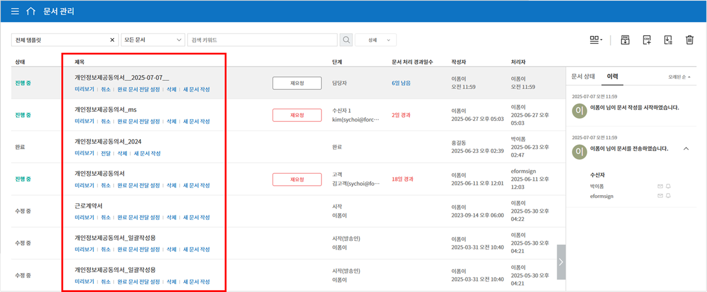

문서제목 규칙 설정하는 방법
^^^^^^^^^^^^^^^^^^^^^^^^^^^^^^^^^

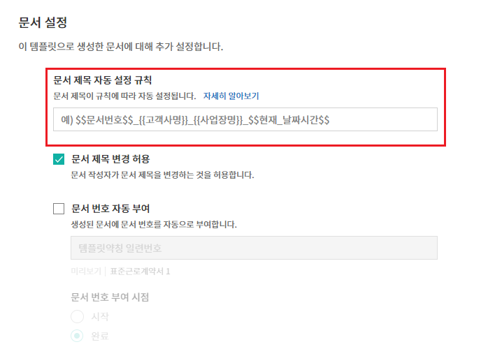

1. 사이드바 메뉴에서 **템플릿 관리**\ 로 이동합니다.

2. 템플릿의 **설정** 아이콘(|image1|)을 클릭하여 **템플릿 설정** 화면으로 이동합니다.

3. **일반 설정** 화면의 **문서 제목 자동 설정 규칙** 입력란에 예약어를 추가하여 원하는 제목 규칙을 입력합니다.

4. 오른쪽 상단에 **저장** 버튼을 클릭하여 변경 사항을 저장합니다.

예약어 추가 방법
^^^^^^^^^^^^^^^^^^^^^^^^^^^^^^

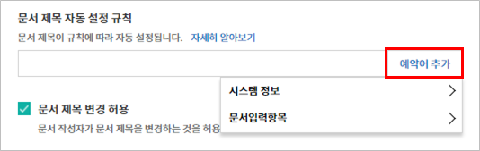

-  **문서입력항목**\ : 문서에 입력된 내용을 문서 제목에 추가합니다.

   **예약어 추가** 버튼 클릭 후, **문서입력항목**\ 을 클릭하면 템플릿의 컴포넌트 ID 리스트가 나타나며, 원하는 ID를 선택하면 해당 컴포넌트에 입력된 내용이 문서 제목에 추가됩니다.

-  **시스템 정보**\ : 문서와 관련된 정보를 제목에 추가합니다.

   **시스템 정보**\ 를 클릭하여 아래 정보 중 선택하여 문서 제목에 표시될 수 있도록 설정합니다.

+-------------------------------+--------------------------------------------------------------+
| 정보 종류                     | 설명                                                         |
+===============================+==============================================================+
| 현재_날짜                     | 문서 작성 시점의 날짜(예. 2020년 02월 20일)                  |
+-------------------------------+--------------------------------------------------------------+
| 현재_시간                     | 문서 작성 시점의 시간(예. 오후 02:59)                        |
+-------------------------------+--------------------------------------------------------------+
| 현재_날짜시간                 | 문서 작성 시점의 날짜와 시간(예.2020년 02월 20일 오후02:59)  |
+-------------------------------+--------------------------------------------------------------+
| 최초_작성자_ID                | 문서를 작성한 멤버의 ID                                      |
+-------------------------------+--------------------------------------------------------------+
| 최초_작성자_이름              | 문서를 작성한 멤버의 이름                                    |
+-------------------------------+--------------------------------------------------------------+
| 최초_작성자_부서              | 문서를 작성한 멤버의 부서                                    |
+-------------------------------+--------------------------------------------------------------+
| 최초_작성자_회사명            | 문서를 작성한 멤버의 회사명                                  |
+-------------------------------+--------------------------------------------------------------+
| 템플릿명                      | 템플릿 설정 > 일반설정에 입력된 템플릿명                     |
+-------------------------------+--------------------------------------------------------------+
| 템플릿_약칭                   | 템플릿 설정 > 일반설정에 입력된 템플릿 약칭                  |
+-------------------------------+--------------------------------------------------------------+
| 회사명                        | 회사 관리 > 회사 정보에 입력된 회사명                        |
+-------------------------------+--------------------------------------------------------------+
| 회사_주소                     | 회사 관리 > 회사 정보에 입력된 주소                          |
+-------------------------------+--------------------------------------------------------------+
| 회사_연락처                   | 회사 관리 > 회사 정보에 입력된 연락처                        |
+-------------------------------+--------------------------------------------------------------+
| 회사_사업자_등록_번호         | 회사 관리 > 회사 정보에 입력된 사업자등록번호                |
+-------------------------------+--------------------------------------------------------------+
| 회사_홈페이지                 | 회사 관리 > 회사 정보에 입력된 홈페이지 URL                  |
+-------------------------------+--------------------------------------------------------------+
| 다음_수신자로_진행_안내       | 열람자 단계를 추가한 경우 문서 전송 옵션 선택에 따라 표시됨  |
+-------------------------------+--------------------------------------------------------------+

.. tip::

   **시스템 정보: 다음_수신자로_진행_안내** 예시 

   워크플로우에 열람자 단계를 추가한 후 문서 전송 옵션 선택에 따라 문서의 진행 상태가 문서 제목에 표시됩니다.

   예를 들어 문서 전송 옵션을 다음과 같이 **수신자가 문서를 열람하면 다음 단계로 전송**\ 을 선택한 경우, 

      .. figure:: resources/title-needtoview-sample.png
         :alt: 문서 제목 예약어-열람자 설정

   열람자 단계의 수신자가 문서를 열람하면 문서함에 문서제목이 다음과 같이 표시됩니다. 

      .. figure:: resources/title-needtoview-sample2.png
         :alt: 문서 제목 표시 예시
         :width: 500px

.. tip::

   **문서 제목 변경 허용** 여부를 확인하세요!

   문서 제목 규칙을 설정해 놓더라도 **문서 제목 변경 허용**\ 이 체크되어 있으면 문서 작성자가 임의로 문서 제목을 변경할 수 있습니다. 문서 제목이 변경되는 것을 원하지 않는 경우 **문서 제목 변경 허용**\ 을 체크 해지하시기 바랍니다.

   .. figure:: resources/template-setting-general-doc-numering_rule_allow_change.png
      :alt: 문서 제목 변경 허용 여부 확인
      :width: 400px

-------------------

.. _docnumber_fb:

문서번호 생성 및 확인하기
-----------------------------------------

템플릿 별로 작성된 문서에 연속되는 문서번호를 부여할 수 있습니다.
템플릿 별로 문서 번호 자동 생성 여부를 설정할 수 있으며 번호 형식 4가지 중 한 가지를 선택하여 설정 가능합니다. 문서 번호는 문서 컴포넌트를 사용하여 문서 내에 입력할 수 있습니다. 또한 문서 목록에서 별도의 컬럼으로 확인할 수 있으며 문서 번호로 문서를 검색할 수 있습니다.

문서번호 생성 방법
^^^^^^^^^^^^^^^^^^^^^^^^^^^^^^^^^

1. 사이드바 메뉴에서 **템플릿 관리**\ 로 이동합니다.

2. 템플릿의 **설정** 아이콘(|image5|)을 클릭하여 **템플릿 설정**
   화면으로 이동합니다.

3. **일반 설정** 화면의 **문서 번호 자동 부여**\ 를 체크합니다.

   .. figure:: resources/template-setting-general-doc-numering1.png
      :alt: 문서번호 설정하기
      :width: 600px

   ▪  **문서번호 규칙 선택하기**

      .. figure:: resources/template-setting-general-doc-numering1_1.png
         :alt: 문서번호 규칙
         :width: 600px

      - **일련번호**
         문서 생성 순서대로 1번부터 생성

         예) 1, 2, 3...

      - **년도 일련번호**
         문서가 생성된 년도 + 번호 1번부터 생성

         예) 2020_1, 2020_2...

      - **템플릿약칭 일련번호**
         템플릿 약칭 + 번호 1번부터 생성

         예) 신청서 1, 신청서 2...

      - **템플릿약칭 년도 일련번호**
         템플릿 약칭 + 문서가 생성된 년도 + 번호 1번부터 생성

         예) 신청서 2020_1, 신청서 2020_2...

   ▪  **문서번호 부여 시점 선택하기**

      - **시작**
         문서 작성 시작 단계에서 문서번호를 생성합니다.

      - **완료**
         문서가 모든 워크플로우를 거쳐 문서 완료 시 문서번호를 생성합니다.

4. 오른쪽 상단의 **저장** 버튼을 클릭해 설정을 저장합니다.

문서번호 확인 방법
^^^^^^^^^^^^^^^^^^^^^^^^^^^^

문서번호는 문서 컴포넌트를 사용하여 문서 내에 입력하거나 문서 목록에서 확인할 수 있습니다.

- **문서 내에 문서번호 표시하기**

   문서번호는 **폼 빌더(MS Office Add-in)**\ 의 문서 컴포넌트를 사용해 문서 내에 입력할 수 있습니다.

   1. 워드, 엑셀, 파워포인트 템플릿 파일을 엽니다.

   2. 문서번호가 들어갈 위치에 문서 컴포넌트를 추가합니다.

   3. **업로드** 버튼을 클릭해 문서를 이폼사인에 업로드합니다.

   4. **템플릿 설정 > 일반 설정**\ 에서 **문서 번호 자동 부여**\ 를 체크합니다.

   5. 문서 번호 규칙을 선택합니다.

   6. **저장** 버튼을 클릭해 설정을 저장합니다.

- **문서 목록에서 문서번호 확인하기**

   문서번호는 문서 목록을 볼 수 있는 문서함(진행 중 문서함, 처리할 문서함, 완료 문서함) 및 문서 관리 메뉴(문서 관리 권한 필요)에서 확인할 수 있습니다.

   1. 사이드바 메뉴에서 **문서함** 또는 **문서 관리** 메뉴로 이동합니다.

   2. 오른쪽 상단의 **컬럼 설정** 아이콘을 클릭합니다.

   3. 컬럼 리스트의 **문서번호**\ 를 체크합니다.

   4. 문서 목록에 **문서번호** 컬럼이 추가된 것을 확인합니다.

   .. figure:: resources/doc-list-docnumber1.PNG
      :alt: 문서함 - 문서 목록
      :width: 700px

**문서번호로 문서 검색하기**

   |image7|

   문서번호 검색은 상세 검색 기능을 통해 확인할 수 있습니다.

   1. **문서함** 또는 **문서 관리** 메뉴로 이동합니다.

   2. 문서 목록 상단의 **상세** 버튼을 클릭합니다.

   3. 검색 기준 중 **문서번호**\ 를 선택합니다.

   4. 검색할 단어나 숫자를 입력합니다.

   5. 검색 결과를 확인합니다.

-------------------

.. _auth_fb:

권한 설정
~~~~~~~~~~~

**권한 설정** 화면에서는 템플릿 사용 권한, 템플릿 수정 권한을 설정할 수 있습니다.

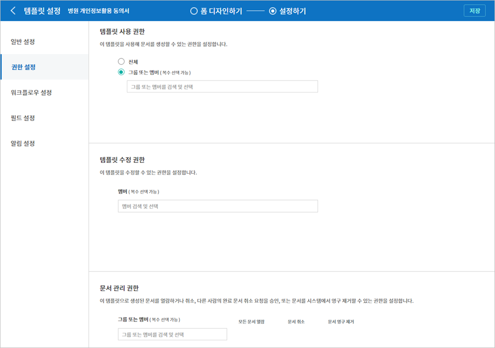

- **템플릿 사용 권한**

   템플릿을 사용해서 문서를 만들 수 있는 권한을 설정합니다. 템플릿 사용 권한이 부여된 멤버는 **템플릿으로 문서 작성** 화면에 해당 템플릿이 표시되어 문서를 작성할 수 있습니다. 회사에 속한 모든 멤버가 사용할 수 있도록 **전체**\로 설정을 하거나 특정 **그룹 또는 멤버**\ 를 검색하여 선택할 수 있습니다.

- **템플릿 수정 권한**

   해당 템플릿을 수정할 수 있는 권한을 설정합니다. 템플릿 수정 권한이 있으면 **템플릿 관리** 메뉴에서 해당 템플릿을 수정할 수 있습니다. 권한을 부여할 **멤버**\ 를 검색하여 선택합니다. ❗템플릿 수정 권한은 템플릿 관리자 권한이 있는 멤버만 지정할 수 있습니다.

- **문서 관리 권한**

   문서 관리 권한은 **회사 관리 > 권한 관리 > 문서 관리자**\ 에서 설정할 수 있습니다. 자세한 내용은 `권한 구분 <chapter2.html#permissions>`__\ 을 참고해 주세요.

-------------------

.. _workflow_fb:

워크플로우 설정
~~~~~~~~~~~~~~~

**템플릿 설정** 화면에서 **워크플로우 설정** 탭을 클릭해 해당 템플릿의 워크플로우를 생성 또는 수정할 수 있습니다.

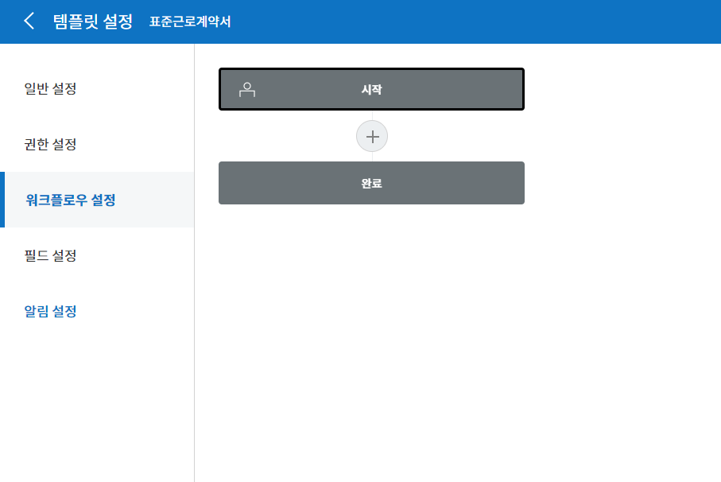

워크플로우 단계 추가 방법
---------------------------------------

1. **워크플로우 설정** 탭을 클릭해 이동합니다.

2. 시작과 완료 사이의 단계 추가(|image9|) 버튼을 클릭합니다.

3. **수신자 타입 선택**\ 에서 추가하고자 하는 **수신자 타입**\ 을 선택합니다.

   .. figure:: resources/workflow-steps-fb.PNG
      :alt: 템플릿 설정 > 워크플로우 설정
      :width: 600px

   .. tip::

      워크플로우 단계는 개수 제한없이 추가할 수 있습니다. 워크플로우 단계를 클릭한 후 드래그해서 순서를 조정할 수 있으며, 단계 오른쪽에 위치한 **(-)**\ 를 클릭하면 단계가 삭제됩니다.

   .. tip::

      **워크플로우 단계 합치기 - 동시 전송**

      일반적으로 워크플로우를 추가하면 설정된 순서에 따라 각 단계 수신자에게 문서가 전송됩니다. 
      여러 단계의 워크플로우를 병합하면 병합된 워크플로우 단계 수신자에게 문서를 동시에 전송할 수 있습니다. 

      1. **템플릿 관리** 화면에서 템플릿 설정 아이콘을 클릭합니다. 
      2. 화면 상단에서 **설정하기**\ 를 클릭한 후 **워크플로우** 설정을 클릭합니다.
      3. 병합할 워크플로우 단계 중 **아래에 있는 워크플로우를 클릭**\ 하면 워크플로우 왼쪽에 **전송 순서 합치기** 아이콘(|image8|)이 나타납니다. 
      4. 해당 아이콘(|image8|)을 클릭하면 하단과 상단의 워크플로우가 합쳐집니다.

      .. figure:: resources/workflow_merge_fb.png
         :alt: 템플릿 설정 > 워크플로우 설정 > 합치기
         :width: 500px

      .. note::

         **병합된 워크플로우 나누기**

         병합된 워크플로우를 클릭하면 아이콘이 표시됩니다. 분할할 워크플로우 단계를 클릭 후 **전송 순서 나누기** 아이콘(|image10|)을 클릭하면 합쳐진 워크플로우 단계가 다시 분리됩니다.

         .. figure:: resources/workflow_split_fb.png
            :alt: 템플릿 설정 > 워크플로우 설정 > 나누기
            :width: 500px
   
      **❗제약 사항**

      - 병합된 워크플로우가 포함된 템플릿으로는 **일괄작성을 할 수 없습니다.**
      - 병합된 워크플로우 단계의 수신자는 **이전 단계 수신자**\ 로 설정할 수 없습니다.
      - 병합된 워크플로우 다음 단계는 수신자를 **그룹 또는 멤버**\ 로 지정하거나, **완료** 단계로 설정해야 합니다.

워크플로우 단계별 상세 설정
----------------------------------------

단계를 클릭하여 각 워크플로우 단계별로 상세 속성을 설정할 수 있습니다.

-  **속성**\ 은 단계 이름, 상태 설정 외에도 단계별로 설정이 필요한 항목을 세부적으로 설정할 수 있습니다.

-  **항목 제어**\ 에서는 워크플로우 각 단계별로 수신자가 컴포넌트(입력 항목)에 입력할 수 있도록 허용하는 **편집 허용** 항목과 필수로 입력해야 하는 **입력 필수** 항목을 설정할 수 있습니다.

|image12|

++++++++++++++++++++++++++++++++++++++++++++++++++++++

.. _workflow_fb_start:

시작
^^^^^^^^^^^^^

**문서 작성을 시작하는 단계입니다.**

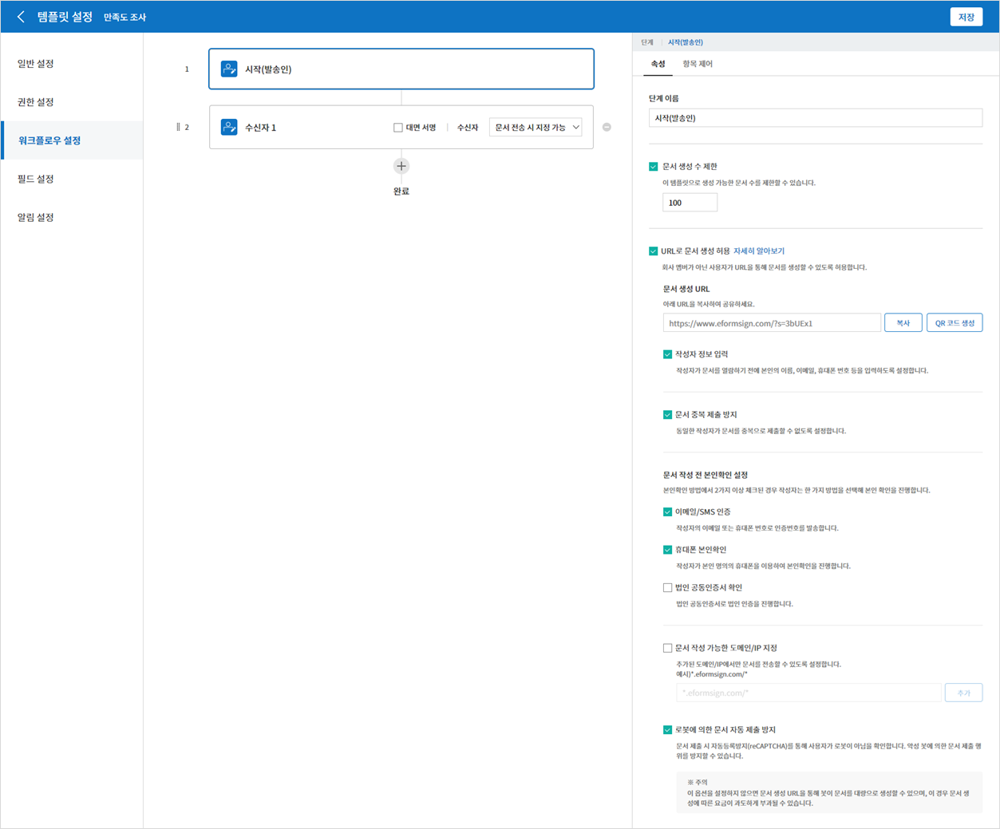

-  **단계 이름**\ (공통): 기본 이름으로 설정된 단계의 이름을 변경할 수 있습니다.

-  **문서 생성 수 제한**: 체크하여 해당 템플릿으로 생성되는 최대 문서 개수를 설정할 수 습니다.

-  **URL로 문서 생성 허용**: 멤버가 아닌 외부 사용자에게 요청시 이폼사인에 로그인하지 않고 URL을 통해 바로 접속하여 문서를 처리할 수 있는 공개 링크를 생성합니다.

-  **문서 작성 가능한 도메인/IP 지정**: 특정 도메인 또는 IP에서만 문서를 전송할 수 있도록 설정할 수 있습니다.

-  **문서 중복 전송 방지**: 문서를 중복으로 전송하는 것을 방지하며, 필드를 선택해 해당 필드를 기준으로 중복 여부를 확인합니다.

-  **로봇에 의한 문서 자동 제출 방지**: URL로 문서를 생성하여 제출 시 사용자가 자동등록방지(reCAPTCHA)를 체크하도록 하여 악성 봇이 문서를 무작위로 생성하는 행위를 방지합니다. 

   .. note::

      **로봇에 의한 문서 자동 제출 방지**

      해당 옵션을 선택하면 URL로 접속하여 문서를 작성하는 사람이 문서 작성 후 제출 버튼을 클릭하면 자동등록방지(reCAPTCHA) 기능이 문서 제출 팝업에 표시됩니다. 작성자는 '로봇이 아닙니다'를 체크한 후 문서를 제출할 수 있습니다. 

      .. figure:: resources/URL-option-recaptcha.png
         :alt: reCAPTCHA
         :width: 300px

      ❗이 옵션을 설정하지 않으면 문서 생성 URL을 통해 봇이 문서를 대량으로 생성할 수 있으며, 이 경우 문서 생성에 따른 요금이 과도하게 부과될 수 있습니다.

.. tip::

   **URL로 문서 작성 요청시 QR 코드 생성 기능 활용하기**

   URL 주소를 상대방한테 전달해서 문서를 작성할 수 있는 기능을 사용할 때 해당 링크를 QR코드로 바로 만들수 있습니다.
   QR 코드 이미지를 웹사이트에 게시하거나 다른 사람과 공유하여 문서 작성을 요청할 수 있습니다. 작성자는 모바일 기기의 카메라로 QR 코드를 스캔해서 문서를 작성 및 제출할 수 있습니다.

   시작 단계 워크플로우 속성에서 **URL로 문서 생성 허용** 옵션을 체크하고 **QR 코드 생성** 버튼을 클릭하면 QR 코드 이미지가 바로 다운로드됩니다.

   
   .. figure:: resources/workflow-step-start-QRcode.png
      :alt: 워크플로우 설정 > QR 코드 생성하기
      :width: 400px

+++++++++++++++++++++++++++++++++++++++++++++++++++++++++++++++++++++++++++++++++++++++++++++

.. _workflow_signer:

수신자
^^^^^^^^^^^^^

**문서의 입력항목에 작성, 서명 등 문서에 참여하는 수신자 단계입니다.**

.. note::

   수신자 단계별 상세 속성은 **내부 멤버 수신자**\ 와 **외부 수신자**\ 에 따라 달라집니다. 단계 수신자를 멤버가 아닌 **외부 수신자로 지정**\ 할 경우 **수신자 정보 자동 설정 옵션**\ 과 **문서 열람 전 본인확인 설정**\ 옵션을 추가로 설정할 수 있습니다. 

   내부 멤버의 경우 이름, 이메일 등 이폼사인에 저장된 정보로 문서가 전송되도록 설정되며, 이폼사인에 로그인 후 요청받은 문서를 작성할 수 있기 때문에 로그인 단계로 본인확인이 되었다고 간주하여 해당 옵션을 설정하지 않습니다. 

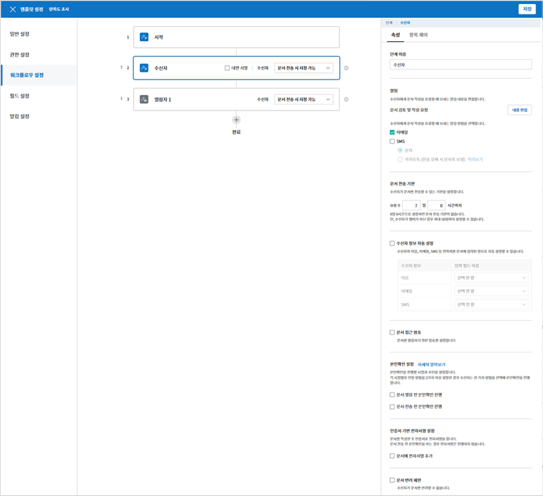

-  **단계 이름**\ : 해당 단계의 이름을 설정할 수 있습니다.

-  **알림**\ : 수신자에게 문서 작성 요청 시 알림을 보낼 방법을 설정하고 알림 내용을 편집할 수 있습니다. 

   - **알림 방법 선택**\ : 알림은 기본적으로 이메일로 발송되며, SMS 선택 시, **문자**\ 와 **카카오톡**\ 이 활성화되어 선택할 수 있습니다.

   - **알림 내용 편집**\ : 각 단계 별로 수신자에게 발송되는 문서 요청 알림 내용을 편집할 수 있습니다. 

-  **문서 전송 기한**\ : 수신자가 문서를 받은 후 다음 단계 수신자에게 문서를 전송하기까지의 기한을 설정합니다.  
   
   .. tip::

      멤버의 경우 문서 전송 기한이 없도록 설정할 수 있습니다. **문서 전송 기한을 0일 0시간**\ 으로 설정하세요.
      외부 수신자는 문서 전송 기한을 최대 50일까지 설정할 수 있습니다. 
   

-  **수신자 정보 자동 설정**\ : 수신자에게 문서 요청시 문서에 입력된 정보를 바탕으로 수신자의 이름 및 연락처를 자동으로 설정할 수 있습니다.

-  **문서 열람 전 본인확인 설정:** 문서 열람 전 수신자가 본인확인을 진행한 후 문서를 열람할 수 있도록 설정합니다. 간편 인증과 추가 인증 모두 선택할 경우, 2단계로 본인확인을 진행할 수 있습니다. 

   -  **간편 인증**\ : 외부 수신자가 문서를 열람하기 위해서 본 설정에서 미리 설정한 정보를 입력해야 합니다. 도움말을 입력하여 힌트를 제공할 수 있습니다.

      .. figure:: resources/doc-password-setting.png
         :alt: 문서 접근 암호 설정
         :width: 400px   

      - **문서 접근 암호:** 문서 열람 시 입력할 암호를 설정합니다. 암호 설정은 **직접 입력, 수신자 이름, 문서에 입력된 내용** 중 선택할 수 있습니다. 

         - **직접 입력:** 설정 단계에서 암호를 직접 입력하고 수신자에서 보여질 암호 힌트를 입력합니다. 

         - **수신자 이름:** 수신자 이름으로 설정하면 수신자 정보에 입력한 이름과 일치한 이름을 수신자가 암호로 입력해야 합니다.
   
         - **문서에 입력된 내용:** 문서내 입력 항목을 선택하여 해당 입력 항목에 입력한 내용을 암호로 설정할 수 있습니다. 

   - **추가 인증**\: 본인확인 수단을 추가로 설정합니다. 

      .. figure:: resources/additional-verification.png
               :alt: 추가인증 설정
               :width: 400px  

      
      - **이메일/SMS 인증:** 수신자의 이메일 또는 휴대폰 번호로 6자리 인증번호를 발송합니다. 수신자는 인증번호를 인증 창에 입력 후 문서 열람을 할 수 있습니다.

      - **휴대폰 본인확인:** 수신자 명의의 휴대폰으로 본인확인을 진행한 후 문서를 열람하도록 설정합니다.

      - **법인 공동인증서 확인:** 법인간 계약 시 법인 공동인증서로 법인 인증을 진행한 후 문서를 열람하도록 설정합니다. 사업자등록번호는 **직접 입력, 문서에 입력된 내용, 입력 안 함** 중 선택할 수 있습니다. 

      .. tip::

         문서가 완료된 후 문서를 열람할때도 설정한 인증을 진행한 후 열람하도록 설정하려면 **완료 문서 열람 시에도 인증 진행**\ 을 체크해 주세요. 

      .. note::

         추가 인증을 모두 선택하면 수신자가 인증 진행 단계에서 3가지 중 1가지 방법을 선택해 진행할 수 있습니다. 
         ❗이메일 인증을 제외한 추가 인증 수단은 모두 **별도의 추가 비용이 발생**\ 됩니다.  ``SMS 인증 20원/건, 휴대폰 본인확인 50원/건, 법인 공동인증서 확인 50원/건``

-  **문서 일부 숨기기 설정:** 2개 이상의 시트로 만들어진 엑셀 문서 또는 2개 이상의 구역으로 나누어진 워드 파일일 경우 설정할 수 있습니다.

-  **문서 반려 제한:** 수신자가 문서를 반려할 수 없도록 설정합니다. 옵션에 체크하면 해당 수신자의 문서 화면에 **반려** 버튼이 나타나지 않습니다. 

.. tip::

   💡 **대면 서명 기능 활용하기**
    
   서명자와 직접 대면하여 태블릿 PC나 모바일 등 하나의 기기에서 문서에 서명을 진행하려면 대면 서명 기능을 활용해 보세요.
   대면 서명 기능을 사용하면 각 대면 서명자에 대한 정보가 문서 이력 및 감사추적증명서에 기록되며, 문서가 완료되면 대면 서명자에게 완료 문서가 자동으로 전달되도록 설정할 수 있습니다. 

   대면 서명자로 설정할 수신자 단계에서 **대면 서명**\ 을 선택합니다. 
   해당 단계는 **대면 서명자**\ , 바로 전 단계는 **대면 서명 진행자**\ 가 됩니다. 대면 서명자는 문서 서명 전 휴대폰 인증 등 본인확인을 진행하도록 설정할 수도 있습니다.

   - **대면 서명 진행자:** 대면 서명을 시작 및 완료할 수 있으며, 서명도 할 수 있습니다. 멤버만 설정 가능하며, 열람자는 대면 서명 진행자가 될 수 없습니다.
   - **대면 서명자:** 서명하는 사람으로 열람자는 대면 서명자가 될 수 없습니다.
   
   .. figure:: resources/inperson-signing-fb.png
      :alt: 대면 서명 설정
      :width: 700px
   
   **❗제한 사항**
      - **시작** 단계에 **대면 서명**\ 이 설정된 경우 **일괄 작성**\ 이 불가능합니다.
      - **동시 전송(전송 순서 합치기)**\ 이 설정된 워크플로우 단계는 **대면 서명**\ 을 설정할 수 없으며, **대면 서명**\ 이 설정된 단계의 앞뒤로는 **동시 전송(전송 순서 합치기)**\ 을 설정할 수 없습니다.         

   ✅ 대면 서명 설정 시 문서 진행 방법은 `다음 <https://www.eformsign.com/kr/blog/november-2023-update/>`__\ 을 참고해 주세요. 

.. note:: 

   **수신자 지정하기**

   해당 단계의 수신자를 미리 선택하거나 문서 전송 시 전송자가 선택할 수 있도록 설정합니다.

   .. figure:: resources/workflow-participant-selected-fb.png
      :alt: 워크플로우 설정 > 참여자 수신자 지정
      :width: 700px

   -  **문서 전송 시 지정 가능**: 문서 전송 시 수신자 정보를 입력할 수 있도록 설정합니다. 수신자 정보를 입력하지 않으면 해당 단계는 건너뛰고 진행됩니다.

   -  **문서 전송 시 필수로 지정**: 문서 전송 시 수신자 정보를 반드시 입력/선택하도록 설정합니다. 수신자 정보를 입력하지 않으면 문서가 전송되지 않습니다.

   -  **그룹 또는 멤버**: 문서를 수신할 그룹 또는 멤버를 워크플로우 설정 단계에서 미리 지정합니다. 그룹/멤버 여러명을 선택할 수 있으며, 수신자 모두 문서를 처리할 수 있습니다.

   -  **이전 단계 수신자**: 시작 단계를 포함해서 이전 단계의 수신자가 문서를 처리하도록 설정합니다. 단계를 선택할 수 있습니다.

.. _hide:

문서에서 일부 시트 또는 구역만 보이도록 설정하는 방법
^^^^^^^^^^^^^^^^^^^^^^^^^^^^^^^^^^^^^^^^^^^^^^^^^^^^^^^^^^

.. tip::

   **문서 일부 숨기기**

   엑셀 또는 워드 파일 문서가 여러 개의 시트 또는 구역으로 구성된 파일의 경우 수신자에게 보여지는 문서의 일부를 숨기도록 설정할 수 있습니다. 즉, 한 템플릿에서 수신자에게 보낼 부분과 보내지 않을 부분을 구분할 수 있습니다. 

   업로드한 문서에 여러 개의 시트 또는 구역이 포함된 경우, 워크플로우의 **수신자 단계** 속성 설정에서 **문서 일부 숨기기 설정**\ 이 나타납니다. 문서에 포함된 시트 또는 구역의 이름이 목록으로 표시되어 각 시트 또는 구역 별로 **보이기, 숨기기 또는 이전 단계 요청자가 선택**\ 할 수 있도록 설정할 수 있습니다.

   ❗단, 문서 일부 숨기기 기능은 문서 수신자가 내부 멤버가 아닌 외부 수신자일 경우에만 적용됩니다. 

   **설정 방법**

   1. 대시보드 **메뉴 > 템플릿 관리**\ 로 이동합니다.
   2. 템플릿의 **설정 아이콘(⚙)**\ 을 클릭하여 템플릿 설정 화면으로 이동합니다.
   3. **워크플로우 설정** 탭으로 이동합니다.
   4. **수신자** 단계를 추가합니다. 
   5. 오른쪽 속성 영역 하단의 **문서 일부 숨기기 설정**\ 을 체크합니다. 
   6. 문서 내 영역에 따라 노출 여부를 선택합니다. 

      - **보이기:** 수신자에게 해당 시트 또는 구역이 전송됩니다.

      - **선택:** 수신자가 노출 여부를 선택합니다.

      - **숨기기:** 수신자에게 해당 시트 또는 구역이 보이지 않습니다.

   |image19|

+++++++++++++++++++++++++++++++++++++++++++++++++++++++++++++++++++++++++++++++++++++++++++++

.. _workflow_fb_needtoview:

열람자 
^^^^^^^^^^^^^^^^

**문서를 열람만 할 수 있는 수신자 단계입니다.**

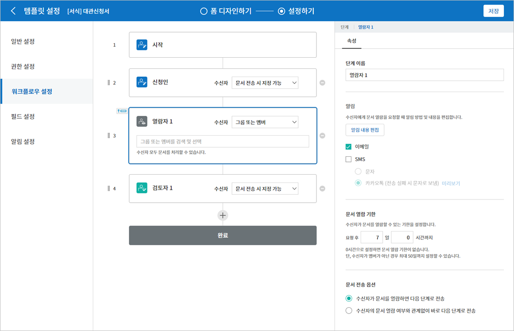

-  **단계 이름**\ : 해당 단계의 이름을 설정할 수 있습니다.

-  **알림**\ : 수신자에게 문서 작성 요청 시 알림을 보낼 방법을 설정하고 알림 내용을 편집할 수 있습니다. 

   - **알림 방법 선택:** 알림은 기본적으로 이메일로 발송되며, SMS 선택 시, **문자**\ 와 **카카오톡**\ 이 활성화되어 선택할 수 있습니다.

   - **알림 내용 편집:** 각 단계별로 수신자에게 발송되는 문서 요청 알림 내용을 편집할 수 있습니다. 

-  **문서 열람 기한**\ : 수신자가 문서를 받은 후 열람할 수 있는 기한을 설정합니다. 기한을 설정하지 않으려면 0일 0시간으로 입력하세요(수신자가 내부 멤버일 경우에만 해당, 외부 수신자는 최대 50일까지 가능). 

-  **문서 전송 옵션**\ : 해당 단계에서 문서가 다음 단계로 전송되는 옵션을 선택합니다. 

   - **수신자가 문서를 열람하면 다음 단계로 전송:** 열람자 단계의 수신자가 문서를 열람해야만 문서가 다음 단계로 전송됩니다.
 
   - **수신자의 문서 열람 여부와 관계없이 바로 다음 단계로 전송:** 열람자 단계의 수신자가 문서를 열람하지 않아도 문서가 다음 단계로 전송됩니다. 

   .. figure:: resources/needtoview_option.png
      :width: 300px

+++++++++++++++++++++++++++++++++++++++++++++++++++++++++++++++++++++++++++++++++++++++++++++

.. _workflow_fb_complete:

완료
^^^^^^^^^^^^^^^^

**문서가 모든 워크플로우 단계를 거쳐 최종 완료되는 단계입니다.**

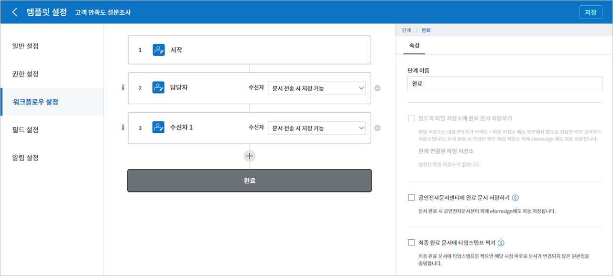

-  **별도의 파일 저장소에 완료 문서 저장하기**: 대표 관리자 또는 회사 관리자가 별도로 설정한 외부 클라우드 저장소에 완료된 문서가 저장되도록 설정합니다.

-  **공인전자문서센터에 완료 문서 저장하기**: 문서가 완료되면 이폼사인과 연계된 공인전자문서센터에 자동으로 저장되도록 설정합니다. 본 기능은 추가 요금이 발생합니다.

-  **타임스탬프 적용**: 완료된 문서가 그 이후 변경되지 않았음을 증명하는 타임스탬프가 문서에 적용될 수 있도록 설정합니다. ❗본 기능은 추가 요금(건당 500원)이 발생합니다.

.. note::

   💡 **타임스탬프란?** 

      타임스탬프(Timestamp)란 전자문서의 생성 시점확인(존재증명) 및 진본성 확인(내용증명)을 위한 공개키 기반(PKI: Public Key Infra Structure)의 국제표준 기술로, 전자문서가 어느 특정 시각에 존재하고 있었다는 것을 증명하는 것과 동시에 그 시각 이후에 데이터가 변경되지 않았음을 증명하는 전자적 기술입니다.

      문서에 타임스탬프를 적용하면 특정 시점에 해당 문서가 존재하였으며, 그 이후 변경되지 않은 진본임이 인증기관에 의해 객관적으로 증명됩니다.
 

-------------------

.. _field_fb:

필드 설정
~~~~~~~~~~~

**필드 설정**\ 에서는 문서 목록에 표시되는 컬럼의 표시 여부 및 순서를 설정할 수 있습니다. 또한, 템플릿에 들어가는 필드의 기본값 또는 자동입력 값을 설정할 수 있습니다.

.. figure:: resources/template-setting-FB-field-setting.png
   :alt: 템플릿 설정 > 필드 설정
   :width: 700px

필드의 기본값은 **사용자 정의 필드 관리**\ 에 저장되어 있는 회사/그룹/멤버 정보를 입력되도록 설정하거나, 최근 입력값 선택 또는 사용자가 직접 입력하도록 설정할 수 있습니다.

.. tip::

   **자동 입력 설정하는 방법**

   문서에 자주 입력하는 정보를 미리 저장하고 자동으로 입력되도록 설정할 수 있습니다.

   예를 들어 작성자의 이름, 연락처 등 작성자 정보, 부서명, 책임자, 회사 대표 번호 등 회사 또는 그룹에 대한 정보를 미리 저장하여 자동으로 입력되도록 설정할 수 있습니다. 관련 필드의 항목 추가 및 기본 값 설정은 **회사 관리 > 사용자 정의 정보셋 관리**\ 에서 할 수 있습니다.

   1. **사용자 정의 정보셋 관리** 화면에서 회사/그룹/사용자 관련 필드를 추가합니다.

   2. **템플릿 관리** 메뉴로 이동합니다.

   3. **템플릿 설정** 아이콘을 클릭합니다.

   4. **필드 설정** 메뉴로 이동합니다.

   5. 자동 입력이 되도록 설정할 필드의 기본값을 입력합니다.

   6. 모든 설정을 완료한 후 **저장** 버튼을 클릭합니다

-------------------

.. _noti_fb:

알림 설정
~~~~~~~~~~

템플릿으로 작성되는 문서의 상태 알림을 수신할 수신자 설정 및 알림 내용 확인, 편집 등을 할 수 있습니다.

**상태 알림 설정**

해당 템플릿으로 작성된 문서의 진행 상태에 대한 알림의 수신자를 설정하고 알림 메시지를 미리보기(문서 승인/검토 및 작성/반려/취소/수정 알림) 또는 편집(문서 최종 완료 알림) 할 수 있습니다.

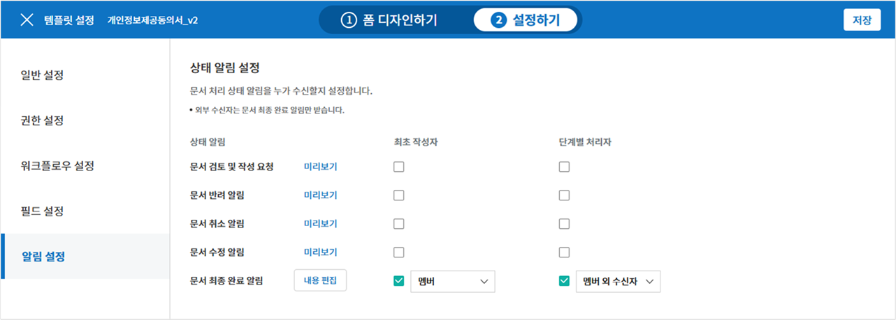

.. note::

   **최초 작성자** 옵션에 체크, **단계별 처리자** 옵션 체크 해제 시, 문서를 최초 작성한 사람에게 상태 알림을 전송합니다.

   **최초 작성자** 옵션 체크 해제, **단계별 처리자** 옵션에 체크 시, 최초 작성한 사람을 제외하고 현재 단계 이전에 문서를 처리한 사람들에게 상태 알림을 전송합니다.

   **최초 작성자**, **단계별 처리자** 옵션 모두 체크 시, 최초 작성한 사람, 현재 단계 이전에 문서를 처리한 사람 모두에게 상태 알림을
   전송합니다.

   **최초 작성자**, **단계별 처리자** 옵션 모두 체크 해제 시, 해당 단계의 상태 알림을 전송하지 않습니다.

.. caution::

   ❗외부 수신자에게는 문서 최종 완료 알림만 전송됩니다.

   외부 수신자에게 완료 알림을 전송하려면 **문서 최종 완료 알림 > 단계별 처리자**\ 를 **멤버 외 수신자** 또는 **모두**\ 로 설정해 주세요. 

**문서 최종 완료 알림 편집**

   .. figure:: resources/template-setting-notification-editl.png
      :alt: 알림 내용 편집
      :width: 600px

- **알림 템플릿 선택:** 알림 템플릿은 기본 템플릿으로 설정되어 있으며, 별도로 만든 알림 템플릿이 있으면 변경할 수 있습니다. 새로운 알림 템플릿 추가하는 방법은 `알림 템플릿 관리 <chapter9.html#notification-template>`__\ 를 참고해 주세요.  

- **이메일 제목:** 문서 완료 시 발송되는 이메일 제목을 설정합니다. 

- **SMS 메시지:** 문서 완료 알림이 SMS으로 전송될 경우 SMS로 전송되는 메시지를 설정합니다. 설정한 메시지와 함께 문서를 확인할 수 있는 링크가 전송됩니다. 

.. note::

   메시지 길이는 최대 65byte(한글 32자, 영문 65자)까지 작성할 수 있습니다. 

- **첨부 파일 및 첨부 방법:** 완료 알림에 같이 보낼 파일을 선택하고 첨부 방법을 선택합니다. 

   - **문서 보기 링크:** 완료 문서가 링크(버튼) 형태로 알림 메일 또는 SMS/카카오톡 알림에 포함되어 전송되며, 링크(버튼)를 클릭하면 문서 뷰어 페이지가 열립니다. 뷰어에서 완료 문서를 열람 및 다운로드할 수 있습니다.

   - **파일 첨부:** 이메일에 PDF 파일로 첨부되어 전송됩니다. 단, 문서의 파일 크기가 10MB를 초과하거나 SMS/카카오톡 알림은 **다운로드 링크** 방식으로 전송됩니다.

   .. caution::

      **파일 첨부** 형태로 이메일 알림을 보내면 이메일에 완료문서가 첨부되어 전송되기 때문에 문서 열람 시 본인확인을 하도록 설정하더라도 본인확인을 진행하지 않고 문서를 열람/다운로드할 수 있습니다. 

- **본문 내용:** 알림 메시지의 본문 내용을 편집할 수 있습니다. 

   
----------------
개별 템플릿 메뉴
----------------

**템플릿 관리** 화면에서 템플릿 이름 오른쪽에 위치한 메뉴 아이콘(|image24|)을 클릭하면 각 템플릿별 메뉴가 나타납니다.

|image25|

-  **복제**: 템플릿을 복제합니다. 해당 템플릿의 파일과 상세 템플릿 설정이 복제되며 상세 설정을 변경하여 저장할 수 있습니다.

-  **삭제**: 템플릿을 삭제합니다. 템플릿이 삭제되면 더 이상 해당 템플릿으로 문서를 생성할 수 없습니다.

-  **파일 다운로드**: 파일 다운로드를 클릭하면 업로드한 파일 양식으로 다운로드됩니다.(예. 워드, 엑셀 파일 등)

-  **비활성화**: 템플릿을 비활성화하면 다른 멤버의 **템플릿으로 문서 작성** 페이지에 표시되지 않습니다.

-  **소유자 변경**: 템플릿의 소유자를 변경할 수 있습니다. 기본적으로 템플릿 소유자는 템플릿을 생성한 사람으로 자동 지정됩니다. 이후 변경하고자 할 경우 소유자 변경을 통해 다른 멤버로 소유자를 변경할 수 있습니다. 템플릿 소유자는 템플릿 관리 권한을 가진 멤버 중에 선택할 수 있습니다.

   |image26|

----------------
템플릿 검색
----------------

**템플릿 관리** 화면에서는 템플릿 카테고리별 조회, 검색 등을 할 수 있습니다.

|image28|

**① 템플릿 조회**
   클릭하여 템플릿 상태, 카테고리 별로 템플릿을 조회할 수 있습니다. **X** 를 클릭하면 전체 카테고리로 돌아갑니다.

   카테고리의 생성은 **템플릿 설정 > 일반 설정**\ 에서 할 수 있습니다.

**② 템플릿 검색**
   템플릿 명, 카테고리 명 등 검색 키워드를 입력하여 템플릿을 검색합니다.

**③ 정렬**
   템플릿 정렬 순서를 템플릿 이름 또는 카테고리 기준으로 오름차순, 내림차순을 설정합니다.

.. |image1| image:: resources/config-icon.PNG
   :width: 20px
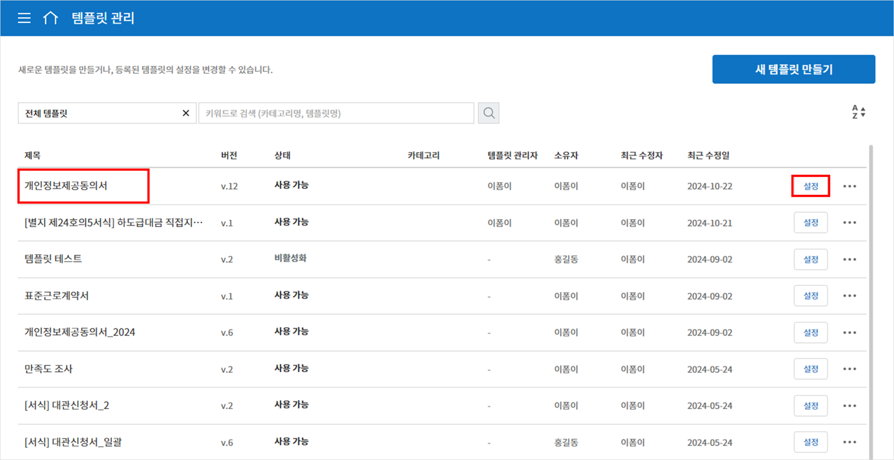
.. |image3| image:: resources/template-setting-general-doc-numering.png
   :width: 500px
.. |image4| image:: resources/config-icon.PNG
.. |image5| image:: resources/config-icon.PNG
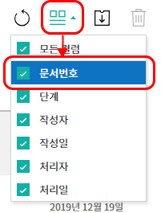
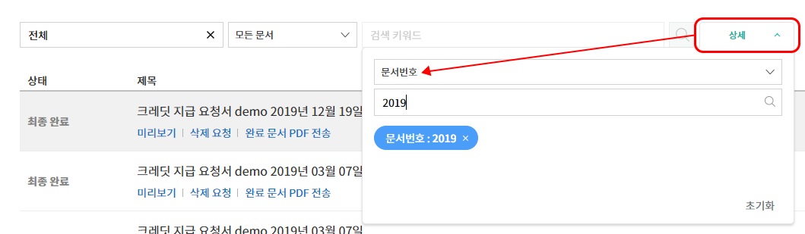

.. |image11| image:: resources/template-setting-FB-workflow-add-step-change.png
   :width: 700px
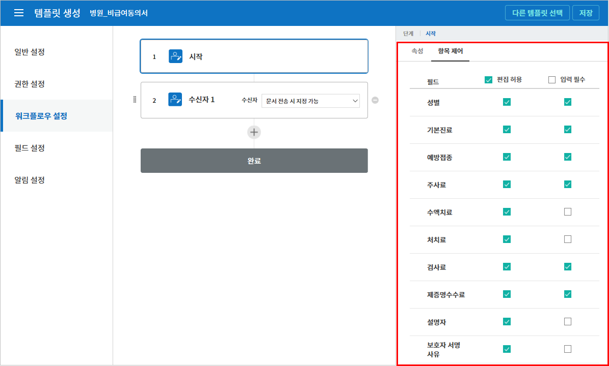
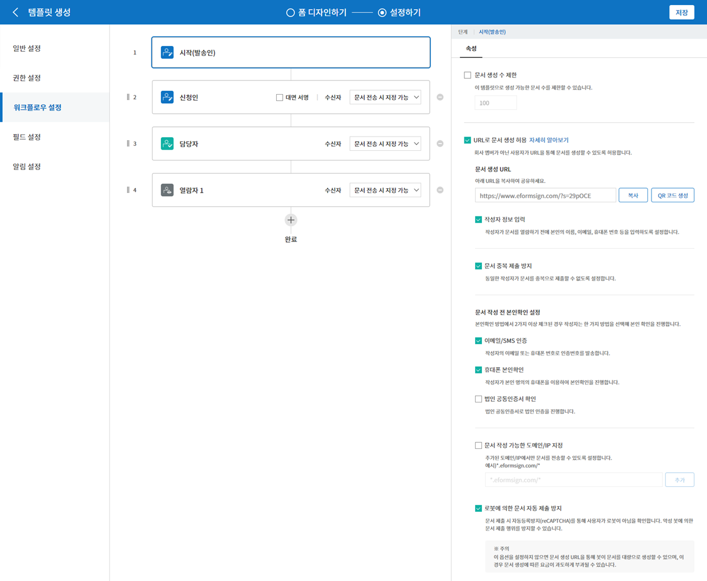
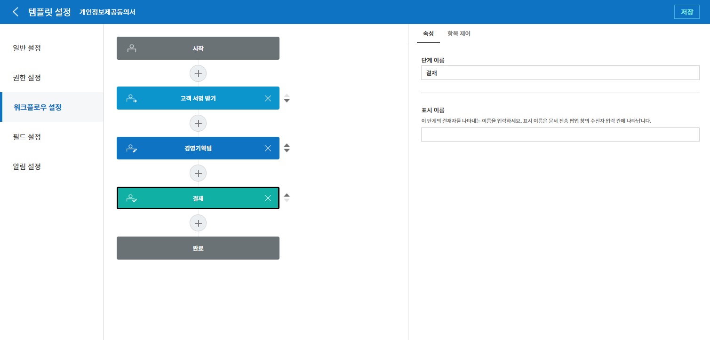
.. |image15| image:: resources/template-approval-property-displayname.png
   :width: 250px
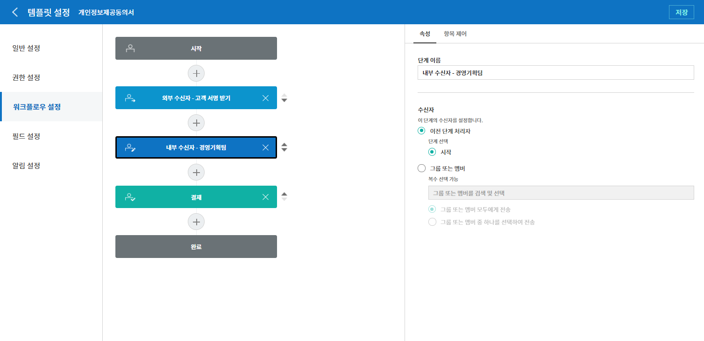
.. |image17| image:: resources/template-setting-FB-workflow-step-external-recipient.png
   :width: 700px
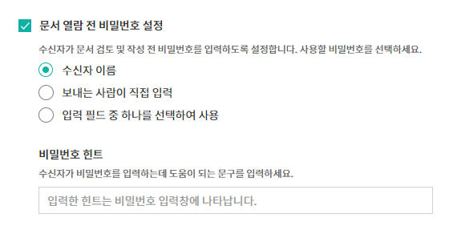
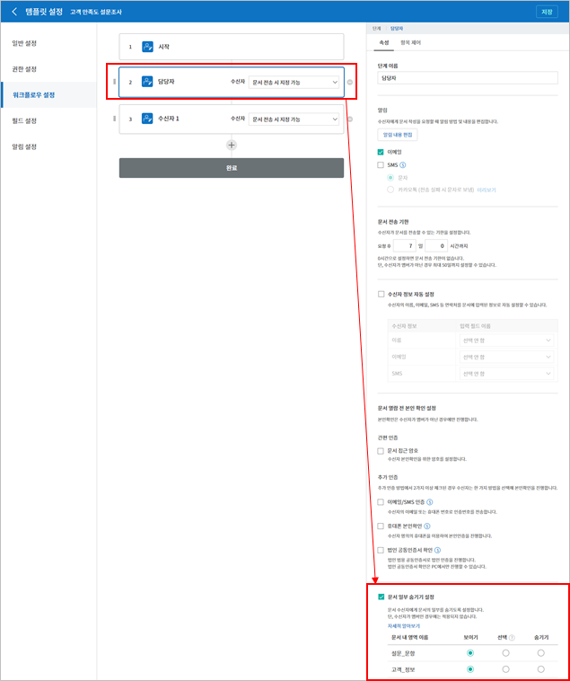
.. |image20| image:: resources/template-setting-FB-workflow-step-complete.png
   :width: 700px
.. |image21| image:: resources/template-setting-notification-edit.png
   :width: 400px
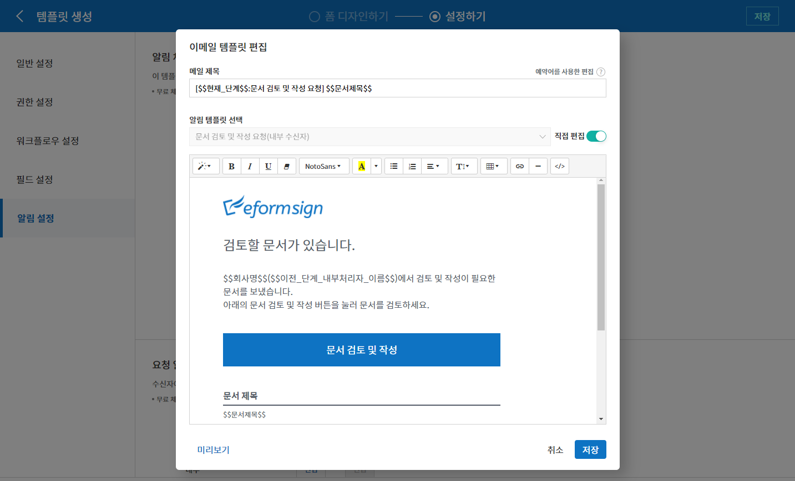
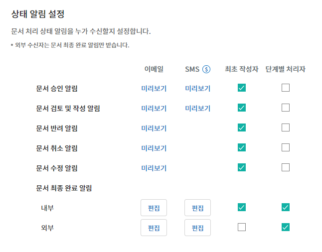
.. |image24| image:: resources/template-hamburgericon.png
   :width: 20px
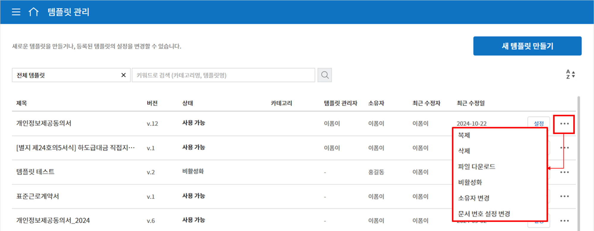
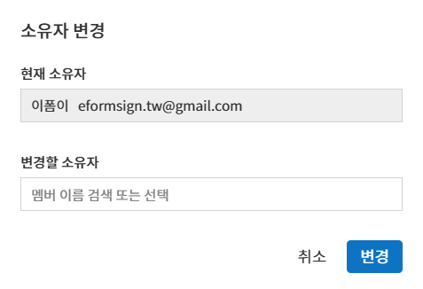
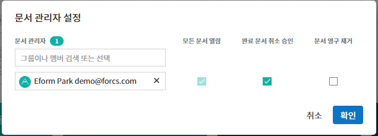
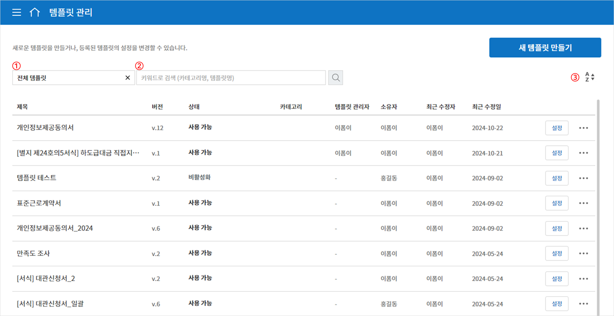
