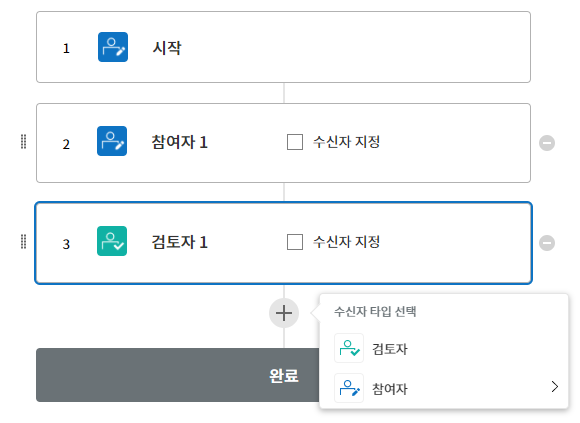
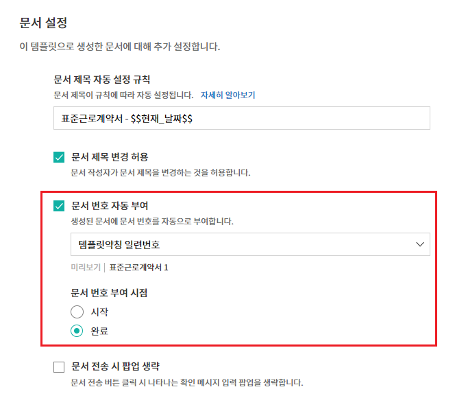
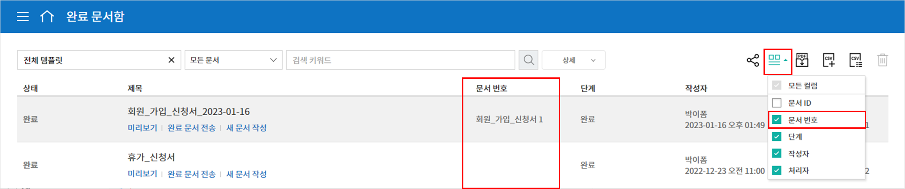
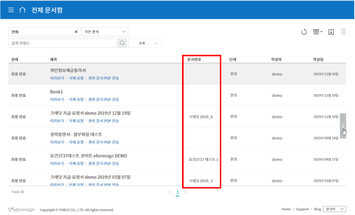
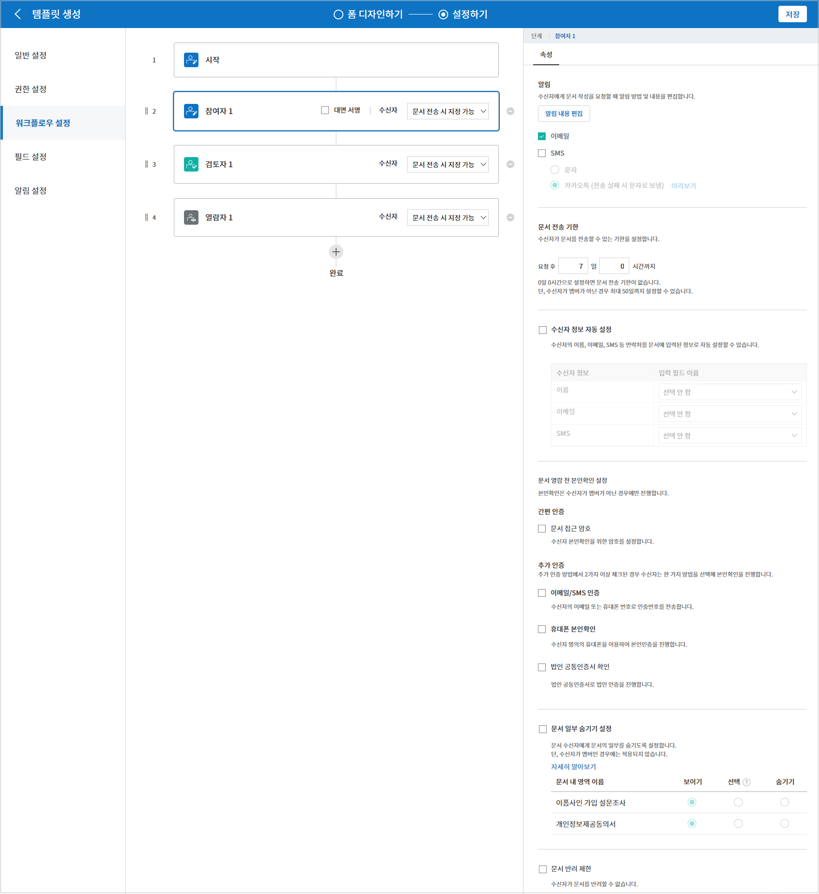
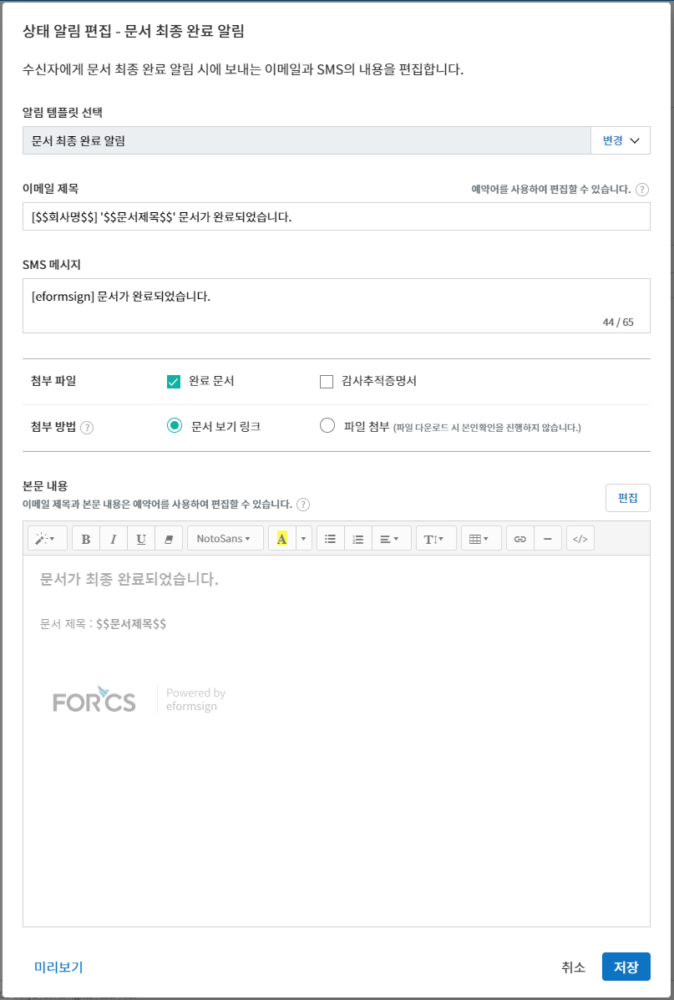
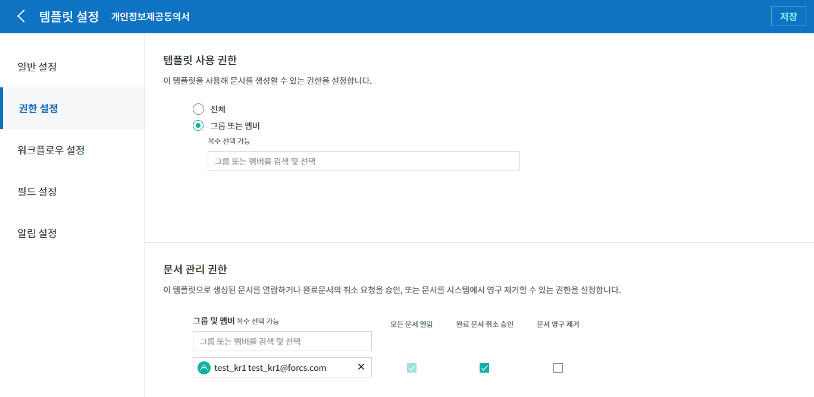
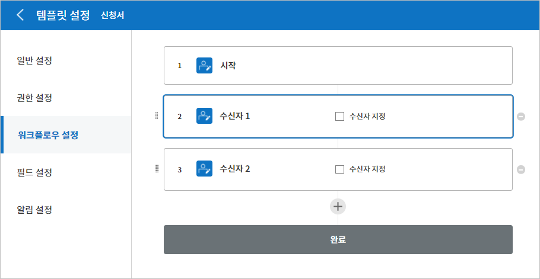

.. _template_fb:

폼 빌더로 템플릿 만들기
=======================

템플릿 개요
--------------

템플릿은 이폼사인에서 사용하는 **전자문서 서식**\ 입니다. 기존에 종이로 작성하던 계약서, 신청서, 동의서와 같이 기본 서식을 전자문서 형태로 만든 것을 템플릿이라고 합니다. 템플릿은 이폼사인 서비스내 웹폼 디자이너 또는 이폼사인 폼 빌더를 통해 만들고 업로드할 수 있습니다. 

.. note::
   
   웹폼 디자이너를 통한 템플릿 설정 및 관리 방법은 `웹폼 디자이너로 템플릿 만들기 <chapter6.html#template_wd>`__\ 를 참고해 주세요.

**폼 빌더로 템플릿 만드는 방법**
~~~~~~~~~~~~~~~~~~~~~~~~~~~~~~~~~~~~~~~

폼 빌더를 사용하면 기존에 워드, 엑셀, 파워포인트 등 MS Office 문서로 만들어진 파일을 전자문서 서식으로 만들어 바로 이폼사인에 템플릿으로 업로드 할 수 있습니다. 템플릿을 만들려면 우선 이폼사인 `폼 빌더를 다운로드 <https://www.eformsign.com/eform/dev_tool.html>`__\ 해야 합니다.

.. note::

   폼 빌더에 대한 상세한 설명은 `폼 빌더 <chapter5.html#formbuilder>`__\ 를 참고해 주세요.

1. 워드, 엑셀 또는 파워포인트로 만든 문서 파일을 엽니다.

2. **OZ in Word(Excel 또는 PPT)** 메뉴로 이동합니다.

3. 입력항목를 추가할 위치를 선택합니다.

4. 입력항목 종류를 선택합니다.

5. 추가된 입력항목의 크기와 위치를 조정합니다.

6. **실행** 버튼을 클릭해 입력항목의 동작을 확인합니다.

7. **업로드** 버튼을 클릭해 템플릿을 업로드 합니다.

8. 새 템플릿을 선택한 후 템플릿에 대한 상세설정을 합니다. 

.. figure:: resources/fb-menu.PNG
   :alt: 폼 빌더 리본 메뉴

**템플릿 설정**

생성할 템플릿에 대한 상세 설정을 할 수 있습니다.

-  `일반 설정 <#general_fb>`__

   템플릿 이름, 약칭, 문서 제목, 문서 번호 등을 설정합니다.

-  `권한 설정 <#auth_fb>`__

   해당 템플릿을 사용해 문서를 생성할 수 있는 템플릿 사용 권한과 생성된 문서를 관리할 멤버 또는 그룹을 지정합니다.

-  `워크플로우 설정 <#workflow_fb>`__

   문서의 작성부터 완료까지 작성된 문서가 처리될 단계를 설정합니다.

-  `필드 설정 <#field_fb>`__

   필드의 기본값, 자동 입력 값 등을 설정합니다.

-  `알림 설정 <#noti_fb>`__

   해당 템플릿을 통해 생성되는 문서의 요청 또는 상태 변경시 알림을 수신할 채널, 수신자, 또는 알림 메시지 내용 등을 설정합니다

워크플로우 개요
~~~~~~~~~~~~~~~~~

워크플로우란 문서가 작성되어 완료되기까지의 문서의 요청 및 처리 과정을 말합니다.

워크플로우는 템플릿 관리자가 템플릿 별로 **템플릿 설정** > **워크플로우 설정**\ 에서 설정할 수 있습니다.

워크플로우는 **시작 - 완료**\ 가 기본 단계이며, 아래와 같이 **검토자**, **참여자** 2가지 단계를 원하는 대로 추가하여 워크플로우를 생성할 수 있습니다.

-  **검토자**

   문서를 검토 후 승인 또는 반려합니다.

-  **참여자**

   문서의 입력란에 작성 또는 서명합니다.

템플릿 설정
---------------

업로드한 파일로 생성될 템플릿에 대한 상세 사항을 설정할 수 있습니다.

.. note::

   이 작업은 **대표 관리자** 또는 **템플릿 관리** 권한이 필요합니다.

   이 작업은 PC, 모바일, 애플리케이션에서 진행할 수 있습니다.

**템플릿 설정 화면으로 이동하는 방법**

1. 사이드바 메뉴에서 **템플릿 관리**\ 로 이동합니다.

2. 원하는 템플릿의 이름이나 설정 아이콘(|image1|)을 클릭합니다.

   |image2|

.. _general_fb:

일반 설정
~~~~~~~~~~~

.. figure:: resources/template-setting-general-formbuilder.png
   :alt: 템플릿 설정 > 일반 설정
   :width: 700px

**템플릿 기본정보 설정**
^^^^^^^^^^^^^^^^^^^^^^^^^^^^

템플릿 이름, 카테고리, 유효기간 등 템플릿에 대한 기본 정보를 설정합니다.

**① 폼 파일**
   **폼빌더**\ 를 통해 워드, 파워포인트, 엑셀에서 이폼사인에 업로드한 파일의 파일명입니다. 폼 파일 이름을 변경하려면 업로드한 워드, 파워포인트, 엑셀 파일의 파일명을 변경한 뒤 해당 폼을 업데이트 해야 합니다.

**② 템플릿 이름**
   **템플릿 관리**, **새 문서 작성** 메뉴 화면에 나타날 템플릿의 이름입니다.

   **템플릿 이름**\ 은 공백 포함 11글자 정도를 권장합니다. 11글자 이상 입력할 경우 전체 템플릿 이름은 이름 위에 마우스를 위치시킨 뒤 잠시 기다리면 확인할 수 있습니다.

   .. figure:: resources/template-name.png
      :alt: 템플릿 이름
      :width: 250px

**③ 템플릿 약칭**
   템플릿을 간단히 표시하는 짧은 이름입니다. 2~3글자 정도의 짧은 단어를 권장합니다.

   **탬플릿 약칭**\ 은 문서번호, 문서 제목, 메일 템플릿 등에서 **$$**\ 를 입력해 사용할 수 있습니다.

   .. figure:: resources/template-short-name.png
      :alt: 템플릿 약칭

**④ 카테고리**
   템플릿을 종류별로 구분할 때 사용합니다. 카테고리 이름으로 **템플릿 관리** 화면의 템플릿이나 **문서함**, **문서 관리** 메뉴의 문서들을 필터링 할 수 있습니다. 기존의 카테고리에서 선택하거나 새로운 이름을 입력해 새로운 카테고리를 생성할 수 있습니다.

   구분자( **/** )를 사용하면 다단계 카테고리를 설정할 수 있습니다. 예를 들어, 카테고리를 **인사팀/휴가관련**\ 으로 설정하면 1단계 카테고리인 **인사팀** 안에 2단계 카테고리인 **휴가관련** 카테고리가 생성됩니다.

**⑤ 설명**
   템플릿에 대한 추가적인 설명을 입력합니다. 이 설명 내용은 목록 및 새 문서 작성의 템플릿 이름 하단에 나타납니다.

**⑥ 문서작성 유효기간**
   템플릿으로 문서를 생성할 수 있는 기한을 설정합니다. 시작일은 템플릿을 업로드한 날로 기본 설정되며 날짜를 변경할 수 있습니다.

   **기간 제한 없음**\ 을 체크하면 계속해서 문서를 작성할 수 있습니다. **기간 제한 없음** 체크를 해제한 후 날짜를 설정하면 설정된 날짜까지만 해당 템플릿으로 문서를 작성할 수 있습니다.

**문서 설정**
^^^^^^^^^^^^^^^^^^^^^^^^

템플릿으로 생성한 문서에 대한 제목 설정 규칙 등 추가 설정을 합니다.

**⑦ 문서 제목 자동 설정 규칙**
   템플릿으로 문서를 작성할 때 입력된 문서의 제목을 설정합니다. 문서 제목 규칙을 설정하지 않을 경우 템플릿 이름이 문서 제목이 됩니다.

   문서 제목에는 **$$**\ 와 **{{**\ 를 사용하여 예약어를 추가할 수 있습니다.

**⑧ 문서 제목 변경 허용**
   **문서 제목 변경 허용**\ 을 체크하면 **작성** 단계의 문서 작성자가 문서 제목을 수정할 수 있습니다.

**⑨ 문서 번호 자동 부여**
   문서 번호 자동 부여를 체크하면 생성된 문서에 대해 자동으로 문서번호가 부여됩니다. 문서번호 표현식 중 원하는 표현식을 선택하고, 언제 문서번호를 생성할 지 문서번호 채번 시점을 선택합니다.

   |image3|

**⑩ 문서 전송 시 시 팝업 생략**
   문서를 빨리 작성하고 제출하는 일이 많을 때 사용합니다. 이 설정을 체크하지 않으면 문서 전송 시 **확인 메시지 입력** 팝업창이 나타납니다. **문서 전송 시 팝업 생략**\ 을 체크하면 **메시지 입력** 팝업창이 나타나지 않고 바로 다음 단계로 진행됩니다.

일반 설정 > 문서 제목 규칙 만들기
~~~~~~~~~~~~~~~~~~~~~~~~~~~~~~~~~

**템플릿 설정**\ 에서 해당 템플릿으로 생성되는 문서의 제목 규칙을 설정할 수 있습니다.

문서에 입력된 내용, 또는 문서 작성 관련 정보가 문서 제목에 자동으로 입력되도록 설정할 수 있습니다. 문서 제목 규칙을 설정하면 문서 작성 시점의 정보를 바탕으로 문서 제목이 생성되며 이 제목은 모든 문서함(진행 중 문서함, 처리할 문서함, 완료 문서함)과 문서 관리 메뉴의 문서 목록에서 확인할 수 있습니다

.. note::

   이 작업은 **대표 관리자** 또는 **템플릿 관리** 권한이 필요합니다.

.. figure:: resources/document-list.png
   :alt: 문서 관리 > 문서 목록
   :width: 700px

**문서 제목 규칙 설정하는 방법**
^^^^^^^^^^^^^^^^^^^^^^^^^^^^^^^^^

.. figure:: resources/template-setting-general-doc-numering_rule.png
   :alt: 템플릿 설정 > 문서 제목 규칙 설정
   :width: 600px

1. 사이드바 메뉴에서 **템플릿 관리**\ 로 이동합니다.

2. 템플릿의 **설정** 아이콘(|image4|)을 클릭하여 **템플릿 설정** 화면으로 이동합니다.

3. **일반 설정** 화면의 **문서 제목 자동 설정 규칙** 입력란에 원하는 제목 규칙을 입력합니다.

4. 오른쪽 상단에 **저장** 버튼을 클릭하여 변경 사항을 저장합니다.

**예약어 사용하는 방법**
^^^^^^^^^^^^^^^^^^^^^^^^^^^^^^

.. figure:: resources/template-setting-general-doc-numering_rule_reserved.png
   :alt: 예약어 사용해서 문서 제목 규칙 설정

- **{{** : 문서에 입력된 내용을 문서 제목에 추가하고자 할 때

**문서 제목 규칙** 입력란에 **{{**\ 를 입력하면 템플릿의 컴포넌트 ID 리스트가 나타나며, 원하는 ID를 선택하면 해당 컴포넌트에 입력된 내용이 문서 제목에 추가됩니다.

- **$$** : 문서와 관련된 정보를 제목에 추가하고자 할 때

**문서 제목 규칙** 입력란에 **$$**\ 를 입력하면 드롭다운 메뉴가 나타나며 아래 정보 중 원하는 정보를 선택할 수 있습니다.

+----------------------+--------------------------------------------------+
| 정보 종류            | 설명                                             |
+======================+==================================================+
| 현재_날짜            | 문서 작성 시점의 날짜 (예. 2020년 02월 20일)     |
+----------------------+--------------------------------------------------+
| 현재_시간            | 문서 작성 시점의 시간 (예. 오후 02:59)           |
+----------------------+--------------------------------------------------+
| 현재_날짜시간        | 문서 작성 시점의 날짜와 시간                     |
|                      | (예. 2020년 02월20일 오후 02:59)                 |
+----------------------+--------------------------------------------------+
| 최초_작성자_ID       | 문서를 작성한 멤버의 ID                          |
+----------------------+--------------------------------------------------+
| 최초_작성자_이름     | 문서를 작성한 멤버의 이름                        |
+----------------------+--------------------------------------------------+
| 최초_작성자_부서     | 문서를 작성한 멤버의 부서                        |
+----------------------+--------------------------------------------------+
| 최초_작성자_회사명   | 문서를 작성한 멤버의 회사명                      |
+----------------------+--------------------------------------------------+
| 템플릿명             | 템플릿 설정 > 일반설정에 입력된 템플릿명         |
+----------------------+--------------------------------------------------+
| 템플릿_약칭          | 템플릿 설정 > 일반설정에 입력된 템플릿 약칭      |
+----------------------+--------------------------------------------------+
| 회사명               | 회사 관리 > 회사 정보에 입력된 회사명            |
+----------------------+--------------------------------------------------+
| 회사_주소            | 회사 관리 > 회사 정보에 입력된 주소              |
+----------------------+--------------------------------------------------+
| 회사_연락처          | 회사 관리 > 회사 정보에 입력된 연락처            |
+----------------------+--------------------------------------------------+
| 회사_사업자_등록_번호| 회사 관리 > 회사 정보에 입력된 사업자 등록번호   |
+----------------------+--------------------------------------------------+
| 회사_홈페이지        | 회사 관리 > 회사 정보에 입력된 홈페이지 URL      |
+----------------------+--------------------------------------------------+

.. tip::

   **문서 제목 변경 허용** 여부를 확인하세요!

   문서 제목 규칙을 설정해 놓더라도 **문서 제목 변경 허용**\ 이 체크되어 있으면 문서 작성자가 임의로 문서 제목을 변경할 수 있습니다. 문서 제목이 변경되는 것을 원하지 않는 경우 **문서 제목 변경 허용**\ 을 체크 해지하시기 바랍니다.

.. figure:: resources/template-setting-general-doc-numering_rule_allow_change.png
   :alt: 문서 제목 변경 허용 여부 확인

.. _docnumber_fb:

설정 > 문서번호 생성 및 확인하기
~~~~~~~~~~~~~~~~~~~~~~~~~~~~~~~~

이폼사인에서 생성되는 문서에 연속되는 문서번호를 부여할 수 있습니다.
템플릿 별로 문서 번호 자동 생성 여부를 설정할 수 있으며 번호 형식 4가지 중 한 가지를 선택해야 합니다. 문서 번호는 문서 컴포넌트를 사용하여 문서 내에 입력할 수 있습니다. 또한 문서 목록에서 별도의 컬럼으로 확인할 수 있으며 문서 번호로 문서를 검색할 수 있습니다.

**문서번호 생성하는 방법**
^^^^^^^^^^^^^^^^^^^^^^^^^^^^^^^^^

.. note::

   이 작업은 **대표 관리자** 또는 **템플릿 관리** 권한이 필요합니다.

1. 사이드바 메뉴에서 **템플릿 관리**\ 로 이동합니다.

2. 템플릿의 **설정** 아이콘(|image5|)을 클릭하여 **템플릿 설정**
   화면으로 이동합니다.

3. **일반 설정** 화면의 **문서 번호 자동 부여**\ 를 체크합니다.

   -  **문서번호 규칙 선택하기**

   .. figure:: resources/template-setting-general-doc-numering1_1.png
      :alt: 문서번호 규칙 선택

   **▪ 일련번호**
      문서 생성 순서대로 1번부터 생성

      예) 1, 2, 3...

   **▪ 년도 일련번호**
      문서가 생성된 년도 + 번호 1번부터 생성

      예) 2020_1, 2020_2...

   **▪ 템플릿약칭 일련번호**
      템플릿 약칭 + 번호 1번부터 생성

      예) 신청서 1, 신청서 2...

   **▪ 템플릿약칭 년도 일련번호**
      템플릿 약칭 + 문서가 생성된 년도 + 번호 1번부터 생성

      예) 신청서 2020_1, 신청서 2020_2...

   -  **문서 번호 부여 시점 선택하기**

   ▪ **시작**
      문서를 작성하기 시작할 때 문서번호를 생성합니다.

   ▪ **완료**
      문서가 모든 워크플로우를 거쳐 완료가 될 때 문서번호를 생성합니다.

4. 오른쪽 상단의 **저장** 버튼을 클릭해 설정을 저장합니다.

**문서번호 확인하는 방법**
^^^^^^^^^^^^^^^^^^^^^^^^^^^^

생성된 문서번호는 문서 컴포넌트를 사용하여 문서 내에 입력하거나 문서 목록에서 확인할 수 있습니다.

-  **문서 내에 문서번호 표시하기**

+++++++++++++++++++++++++++++++++++++++

문서번호는 **폼 빌더**\ 의 문서 컴포넌트를 사용하여 문서 내에 입력할 수 있습니다.

1. 워드, 엑셀, 파워포인트 템플릿 파일을 엽니다.

2. 문서번호가 들어갈 위치에 문서 컴포넌트를 추가합니다.

3. **업로드** 버튼을 눌러 문서를 이폼사인에 업로드합니다.

4. **템플릿 설정 > 일반 설정**\ 에서 **문서 번호 자동 부여**\ 를 체크합니다.

5. 문서 번호 규칙을 선택합니다.

6. **저장** 버튼을 눌러 설정을 저장합니다.

-  **문서 목록에서 문서번호 확인하기**

++++++++++++++++++++++++++++++++++++++++

문서번호는 문서 목록을 볼 수 있는 문서함(진행 중 문서함, 처리할 문서함, 완료 문서함) 및 문서 관리 메뉴(문서 관리 권한 필요)에서 확인할 수 있습니다.

1. 사이드바 메뉴에서 **문서함** 또는 **문서 관리** 메뉴로 이동합니다.

2. 오른쪽 상단의 **컬럼 설정** 아이콘을 클릭합니다.

3. 컬럼 리스트의 **문서번호**\ 를 체크합니다.

   |image6|

4. 문서 목록에 **문서번호** 컬럼이 추가된 것을 확인합니다.

-  **문서번호로 문서 검색하기**

+++++++++++++++++++++++++++++++++++++++

|image7|

문서번호 검색은 상세 검색 기능을 통해 확인할 수 있습니다.

1. **문서함** 또는 **문서 관리** 메뉴로 이동합니다.

2. 문서 목록 상단의 **상세** 버튼을 클릭합니다.

3. 검색 기준 중 **문서번호**\ 를 선택합니다.

4. 검색할 단어나 숫자를 입력합니다.

5. 검색 결과를 확인합니다.

.. _auth_fb:

권한 설정
~~~~~~~~~~~

권한 설정 화면에서는 템플릿 사용 권한과 문서 관리 권한을 설정할 수 있습니다.

.. figure:: resources/template-setting-auth-new.PNG
   :alt: 템플릿 설정 > 권한 설정
   :width: 700px

**템플릿 사용 권한**

템플릿을 사용해서 문서를 만들 수 있는 권한을 설정하며, 회사에 속한 모든 멤버가 사용할 수 있도록 **전체** 설정을 하거나 특정 **그룹 또는 멤버**\ 를 검색하여 선택할 수 있습니다.

**템플릿 수정 권한**

해당 템플릿을 수정할 수 있는 권한을 설정하며 **멤버**\ 를 검색하여 선택합니다.

**문서 관리 권한**

그룹 또는 멤버를 선택하여 템플릿을 사용해서 만들어진 문서를 열람하거나 완료 문서에 대한 취소 요청을 승인하거나, 문서를 영구적으로 제거할 수 있는 권한을 모두 또는 각각 설정할 수 있습니다.

-  **모든 문서 열람(기본권한):** 문서 관리자의 기본 권한으로 선택에 관계없이 문서 관리 권한이 부여된 그룹 또는 멤버는 모든 문서를 열람할 수 있는 권한이 부여됩니다.

-  **완료 문서 취소 승인(선택시):** 완료된 문서에 대해 문서 작성자가 취소를 요청할 경우 취소를 승인하여 해당 문서를 취소할 수 있는 권한입니다.

-  **문서 영구 제거(선택시):** 시스템에서 문서를 영구적으로 제거할 수 있는 권한입니다.

|image8|

.. _workflow_fb:

워크플로우 설정
~~~~~~~~~~~~~~~

**템플릿 설정** 화면에서 **워크플로우 설정** 탭을 클릭해 해당 템플릿의 워크플로우를 생성 또는 수정할 수 있습니다.

.. figure:: resources/workflow-setting_new.PNG
   :alt: 템플릿 설정 > 워크플로우 설정
   :width: 500px

**워크플로우 단계 추가하는 방법**
^^^^^^^^^^^^^^^^^^^^^^^^^^^^^^^^^^^^^^^

1. **워크플로우 설정** 탭을 클릭해 이동합니다.

2. 시작과 완료 사이의 단계 추가(|image9|) 버튼을 클릭합니다.

3. 수신자가 워크플로우 단계에 추가됩니다

   |image10|

   .. tip::

      워크플로우 단계는 개수 제한없이 추가할 수 있습니다. 워크플로우 단계를 클릭한 후 드래그해서 순서를 조정할 수 있으며, 단계 오른쪽에 위치한 **-**\ 를 클릭하면 단계가 삭제됩니다.

**워크플로우 단계별 상세 설정**
^^^^^^^^^^^^^^^^^^^^^^^^^^^^^^^^^^^^^^

단계를 클릭하여 각 워크플로우 단계별로 상세 속성을 설정할 수 있습니다.

-  **속성**\ 은 단계 이름, 상태 설정 외에도 단계별로 설정이 필요한 항목을 세부적으로 설정할 수 있습니다.

-  **항목 제어**\ 는 워크플로우 각 단계별로 수신자가 편집할 수 있도록 허용하는 **편집 허용** 필드와 필수로 입력해야 하는 **입력 필수** 필드를 설정할 수 있습니다.

|image12|

**시작: 문서를 작성하는 단계입니다.**

+++++++++++++++++++++++++++++++++++++++++++++++++++++++++++++++++++++++++++++
   
|image13|

-  **단계 이름**\ (공통): 기본 이름으로 설정된 단계의 이름을 변경할 수 있습니다.

-  **문서 생성 수 제한**: 체크하여 해당 템플릿으로 생성되는 최대 문서 개수를 설정할 수 습니다.

-  **URL로 문서 생성 허용**: 멤버가 아닌 외부 사용자에게 요청시 이폼사인에 로그인하지 않고 URL을 통해 바로 접속하여 문서를 처리할 수 있는 공개 링크를 생성합니다.

-  **문서 작성 가능한 도메인/IP 지정**: 특정 도메인 또는 IP에서만 문서를 전송할 수 있도록 설정할 수 있습니다.

-  **문서 중복 전송 방지**: 문서를 중복으로 전송하는 것을 방지하며, 필드를 선택해 해당 필드를 기준으로 중복 여부를 확인합니다.

**수신자: 문서의 입력항목에 작성, 서명 등 문서에 참여하는 문서 수신자 단계입니다.**

++++++++++++++++++++++++++++++++++++++++++++++++++++++++++++++++++++++++++++++++++++++++++

-  **단계 이름**\: 해당 단계의 이름을 설정할 수 있습니다.

-  **알림**\: 수신자에게 문서 작성 요청 시 알림을 보낼 방법을 설정하고 알림 내용을 편집할 수 있습니다. 

   - 알림 방법 선택: 알림은 기본적으로 이메일로 발송되며, SMS 선택 시, **문자**\ 와 **카카오톡**\ 이 활성화되어 선택할 수 있습니다.

   - 알림 내용 편집: 각 단계 별로 수신자에게 발송되는 문서 요청 알림 내용을 편집할 수 있습니다. 

-  **문서 전송 기한**\: 수신자가 문서를 받은 후 다음 단계 수신자에게 문서를 전송하기까지의 기한을 설정합니다. 문서 전송 기한을 설정하지 않으려면 0일 0시간으로 입력하세요. 
   

-  **수신자 정보 자동 설정**\: 수신자에게 문서 요청시 문서에 입력된 정보를 바탕으로 수신자의 이름 및 연락처를 자동으로 설정할 수 있습니다.

-  **문서 열람 전 본인확인 설정**\: 문서를 열람하기 전에 본인확인을 한 후 문서를 열람할 수 있도록 설정합니다.  

   - **본인확인 정보**\: **수신자 이름**\, **입력항목 중 하나를 선택**\, 또는 **보내는 사람이 직접 입력**\  중 선택하여 수신자가 문서 열람 시 해당 정보를 입력하도록 설정합니다.

   - **추가 인증 수단**\: 본인확인 수단을 추가로 설정합니다. 이메일 인증과 휴대폰 본인확인 모두 설정할 경우, 수신자가 본인확인 단계에서 선택할 수 있습니다. 
      
      - **이메일 인증**\: 수신자의 이메일로 인증번호 6자리가 전송되며, 전송된 인증번호를 본인확인 창에 입력합니다.
      
      - **휴대폰 본인확인**\: 휴대폰 본인확인을 진행하도록 설정하며, 본 기능은 반드시 본인 명의의 휴대폰이 있어야만 가능합니다. 

-  **문서 일부 숨김 설정:** 2개 이상의 시트로 만들어진 엑셀 문서 또는 2개 이상의 구역으로 나누어진 워드 파일일 경우 설정할 수 있습니다.

.. note:: 

   **수신자 지정**

   .. figure:: resources/workflow-participant-selected.png
      :alt: 워크플로우 설정 > 참여자 수신자 지정
      :width: 700px

   해당 단계의 수신자를 미리 설정할 수 있는 기능입니다.

   -  **그룹 또는 멤버**: 그룹 또는 멤버 중 한 사람이 문서를 처리하도록 설정합니다. 그룹 또는 멤버는 여러명을 선택할 수 있으나, 선택된 사람 중 한 사람만 문서를 처리할 수 있습니다.

   -  **이전 단계 수신자**: 시작 단계 포함 이전 단계의 수신자가 문서를 처리하도록 설정합니다. 단계를 선택할 수 있습니다.
  

.. _hide:

**문서에서 일부 시트 또는 구역만 보이도록 설정하는 방법**
^^^^^^^^^^^^^^^^^^^^^^^^^^^^^^^^^^^^^^^^^^^^^^^^^^^^^^^^^^

.. tip::

   
   **문서 일부 숨기기**

   문서가 여러 개의 시트 또는 구역으로 구성된 파일일 경우 외부 수신자에게 보여지는 문서의 일부를 숨길 수 있습니다.

   업로드한 문서에 여러 개의 시트 또는 구역이 포함된 경우, 워크플로우의 외부 수신자 단계 속성 설정에서 문서 일부 숨김 설정이 나타납니다. 문서에 포함된 시트 또는 구역의 이름이 목록으로 표시되어 각 시트 또는 구역 별로 보이기, 숨기기 또는 이전 단계 요청자가 선택할 수 있도록 설정할 수 있습니다.

   |image19|

**완료: 문서가 모든 워크플로우 단계를 거쳐 최종 완료되는 단계입니다.**

+++++++++++++++++++++++++++++++++++++++++++++++++++++++++++++++++++++++++++++

|image18|

-  **별도의 파일 저장소에 완료 문서 저장하기**: 대표 관리자 또는 회사 관리자가 별도로 설정한 외부 클라우드 저장소에 완료된 문서가 저장되도록 설정합니다.

-  **공인전자문서센터에 완료 문서 저장하기**: 문서가 완료되면 이폼사인과 연계된 공인전자문서센터에 자동으로 저장되도록 설정합니다. 본 기능은 추가 요금이 발생합니다.

-  **완료 문서에 타임스탬프 찍기**: 완료된 문서가 그 이후 변경되지 않았음을 증명하는 타임스탬프가 문서에 적용될 수 있도록 설정합니다. 본 기능은 추가 요금이 발생합니다.

.. _field_fb:

필드 설정
~~~~~~~~~~~

**필드 설정**\ 에서는 문서 목록과 CSV로 데이터 다운로드 시 표시되는 컴포넌트의 컬럼의 표시 여부 및 순서를 설정할 수 있습니다. 또한, 템플릿에 들어가는 필드의 기본값 또는 자동입력 값을 설정할 수 있습니다.

.. figure:: resources/template-setting-FB-field-setting.png
   :alt: 템플릿 설정 > 필드 설정
   :width: 700px

필드의 기본값은 사용자 정의 필드 관리에 저장되어 있는 회사/그룹/멤버 정보를 입력되도록 설정하거나, 최근 입력값 선택 또는 사용자가 직접 입력하도록 설정할 수 있습니다.

.. tip::

   **자동 입력 설정하는 방법**

   문서에 자주 입력하는 정보를 미리 저장하고 자동으로 입력되도록 설정할 수 있습니다.

   예를 들어 작성자의 이름, 연락처 등 작성자 정보, 부서명, 책임자, 회사 대표 번호 등 회사 또는 그룹에 대한 정보를 미리 저장하여 자동으로 입력되도록 설정할 수 있습니다. 관련 필드의 항목 추가 및 기본 값 설정은 **회사 관리 > 사용자 정의 필드 관리**\ 에서 할 수 있습니다.

   1. **사용자 정의 필드 관리** 화면에서 필드를 추가합니다.

   2. **템플릿 관리** 메뉴로 이동합니다.

   3. **템플릿 설정** 아이콘을 클릭합니다.

   4. **필드 설정** 메뉴로 이동합니다.

   5. 자동 입력이 되도록 설정할 필드의 기본값을 입력합니다.

   6. 모든 설정을 완료한 후 **저장** 버튼을 클릭합니다

.. _noti_fb:

알림 설정
~~~~~~~~~~

템플릿으로 생성되는 문서의 상태 알림을 수신할 수신자 설정 및 알림 내용 확인, 편집 등을 할 수 있습니다.

**상태 알림 설정**

해당 템플릿으로 생성된 문서의 진행 상태에 대한 알림의 수신자를 설정하고 알림 메시지를 미리보기(문서 승인/검토 및 작성/반려/취소/수정 알림) 또는 편집(문서 최종 완료 알림) 할 수 있습니다.

.. figure:: resources/template-setting-notification-channel.png
   :alt: 알림 채널 설정

.. note::

   **최초 작성자** 옵션에 체크, **단계별 처리자** 옵션 체크 해제 시, 문서를 최초 작성한 사람에게 상태 알림을 전송합니다.

   **최초 작성자** 옵션 체크 해제, **단계별 처리자** 옵션에 체크 시, 최초 작성한 사람을 제외하고 현재 단계 이전에 문서를 처리한 사람들에게 상태 알림을 전송합니다.

   **최초 작성자**, **단계별 처리자** 옵션 모두 체크 시, 최초 작성한 사람, 현재 단계 이전에 문서를 처리한 사람 모두에게 상태 알림을
   전송합니다.

   **최초 작성자**, **단계별 처리자** 옵션 모두 체크 해제 시, 해당 단계의 상태 알림을 전송하지 않습니다.

   

개별 템플릿 메뉴
----------------

**템플릿 관리** 화면에서 템플릿 이름 오른쪽에 위치한 메뉴 아이콘(|image24|)을 클릭하면 각 템플릿별 설정할 수 있는 메뉴가
나타납니다.

|image25|

-  **복제**: 템플릿을 복제합니다. 해당 템플릿의 파일과 상세 템플릿 설정이 복제되며 상세 설정을 변경하여 저장할 수 있습니다.

-  **삭제**: 템플릿을 삭제합니다. 템플릿이 삭제되면 더 이상 해당 템플릿으로 문서를 생성할 수 없습니다.

-  **파일 다운로드**: 파일 다운로드를 클릭하면 업로드한 파일 양식으로 다운로드됩니다.(예. 워드, 엑셀 파일 등)

-  **비활성화**: 템플릿을 비활성화하면 다른 멤버의 **새 문서 작성** 페이지에 표시되지 않습니다.

-  **소유자 변경**: 템플릿의 소유자를 변경할 수 있습니다. 기본적으로 템플릿 소유자는 템플릿을 생성한 사람으로 자동 지정됩니다. 이후 변경하고자 할 경우 소유자 변경을 통해 다른 멤버로 소유자를 변경할 수 있습니다. 템플릿 소유자는 템플릿 관리 권한을 가진 멤버 중에 선택할 수 있습니다.

   |image26|

-  **문서 관리자 설정:** 해당 템플릿으로 작성되는 문서의 관리자를 설정할 수 있습니다. **템플릿 설정 > 권한 설정**\ 과 동일합니다.

   |image27|

템플릿 검색
-----------

**템플릿 관리** 화면에서는 템플릿 카테고리별 조회, 검색 등을 할 수 있습니다.

|image28|

**① 템플릿 조회**
   클릭하여 템플릿 상태, 카테고리 별로 템플릿을 조회할 수 있습니다. **X** 를 클릭하면 전체 카테고리로 돌아갑니다.

   템플릿은 Sample 카테고리에 기본 템플릿이 저장됩니다. 카테고리의 생성은 **템플릿 설정 > 일반 설정**\ 에서 할 수 있습니다.

**② 템플릿 검색**
   템플릿 명, 카테고리 명 등 검색 키워드를 입력하여 템플릿을 검색합니다.

**③ 정렬**
   템플릿 정렬 순서를 템플릿 이름 또는 카테고리 기준으로 오름차순, 내림차순을 설정합니다.

.. |image1| image:: resources/config-icon.PNG
.. |image2| image:: resources/template-settings.png
   :width: 700px
.. |image3| image:: resources/template-setting-general-doc-numering.png
   :width: 500px
.. |image4| image:: resources/config-icon.PNG
.. |image5| image:: resources/config-icon.PNG
.. |image6| image:: resources/columnlist-docnum.png
.. |image7| image:: resources/doc-number-search.png
   :width: 600px

.. |image9| image:: resources/workflow-addstep-plus-button.png

.. |image11| image:: resources/template-setting-FB-workflow-add-step-change.png
   :width: 700px
.. |image12| image:: resources/template-setting-FB-workflow-field-control.png
   :width: 700px
.. |image13| image:: resources/workflow-step-start-property.png
   :width: 700px
.. |image14| image:: resources/template-setting-FB-workflow-step-approval.png
   :width: 700px
.. |image15| image:: resources/template-approval-property-displayname.png
   :width: 250px
.. |image16| image:: resources/template-setting-FB-workflow-step-internal-recipient.png
   :width: 700px
.. |image17| image:: resources/template-setting-FB-workflow-step-external-recipient.png
   :width: 700px
.. |image18| image:: resources/workflow-step-external-recipient-property-pw.png
   :width: 400px
.. |image19| image:: resources/template-fb-setting-workflow-outsider-1.png
   :width: 700px
.. |image20| image:: resources/template-setting-FB-workflow-step-complete.png
   :width: 700px
.. |image21| image:: resources/template-setting-notification-edit.png
   :width: 400px
.. |image22| image:: resources/template-setting-notification-edit-email.png
   :width: 700px
.. |image23| image:: resources/template-setting-notification-status.png
   :width: 500px
.. |image24| image:: resources/template-hamburgericon.png
.. |image25| image:: resources/template-manage-menu.png
   :width: 700px
.. |image26| image:: resources/template-owner-change.PNG
.. |image27| image:: resources/document-manager-setting.PNG
.. |image28| image:: resources/template-manage-search.png
   :width: 700px
