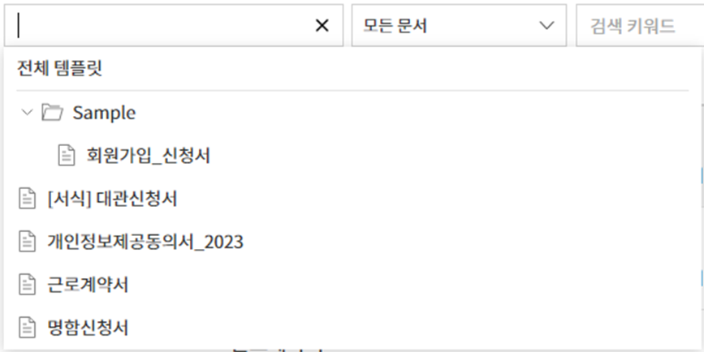

문서함
======

문서함
------

문서함 작성한 문서는 문서 처리 상태에 따라 다음 3개의 문서함에
저장됩니다.

문서함에서 각각의 문서에 대한 상태와 이력을 쉽게 확인하고 문서를
관리하며, 필터 및 검색 기능을 통해 문서를 검색하고 문서를 다시 보내거나
진행 중 또는 완료 문서에 대한 취소/반려 요청 등 추가 작업을 수행할 수
있습니다. 임시 저장한 문서도 문서함에 나타나며 목록에서 다시 작성을
시작할 수 있습니다.

문서함을 통해 모든 문서 및 관련 작업을 기록하고 저장할 수 있고 문서의
상태와 이력에 대한 상세 정보를 확인할 수 있습니다.

-  **진행 중 문서함:** 문서함 진행 중 문서함 내가 작성 또는 처리한 문서
   중 완료되지 않은 문서 목록을 확인할 수 있습니다.

-  **처리할 문서함:** 문서함 처리할 문서함 임시 저장한 문서, 내가
   처리해야 할 문서(다른 멤버가 나에게 작성 또는 결재 요청한 문서), 또는
   외부 수신자에게 보낸 문서 중 처리되지 않은 문서 목록을 확인할 수
   있습니다.

-  **완료 문서함:** 문서함 완료 문서함 내가 작성 또는 처리한 문서 중
   완료된 문서 목록을 확인할 수 있습니다.

이 외에도 문서 관리 페이지가 별도로 존재합니다.

-  **문서 관리:** 문서 관리 문서 관리자만 접근 가능한 메뉴입니다. 문서
   관리자는 권한이 있는 템플릿에서 만들어진 모든 문서를 조회할 수
   있습니다.

.. note::

   대표 관리자는 모든 문서를 조회하고 관리할 수 있습니다.

   문서함 형태

**진행 중 문서함, 처리할 문서함, 완료 문서함** 및 **문서 관리** 각각의
형태는 거의 동일합니다.

.. note::

   문서함의 형태는 거의 동일하지만, 상태 또는 권한에 따라 표시되는
   문서에 차이가 있습니다.

.. figure:: resources/inbox_layout.png
   :alt: 문서함 형태
   :width: 750px

   문서함 형태

문서함은 크게 다음의 5가지 항목으로 구성되어 있습니다.

1. **메뉴 및 홈 아이콘, 문서함 이름**

   메뉴(|image1|)와 홈(|image2|) 아이콘을 통해 다른 메뉴로 이동하거나
   대시보드로 이동할 수 있습니다. 현재 표시되고 있는 문서함의 이름을
   확인할 수 있습니다.

2. `카테고리 표시창, 필터(문서/상태) 콤보박스 및 검색
   입력박스 <#category>`__

   **템플릿 관리 > 템플릿 설정** 메뉴에서 설정한 카테고리별로 문서를 볼
   수 있으며 필터를 통해 필요한 문서만 리스트에 표시되도록 할 수
   있습니다.

   검색은 키워드 검색은 물론, 상세 검색을 통해 제목이나 내용을 조합해서
   검색하거나, 숫자, 날짜 범위를 지정해 검색, 사용자 지정 필터를 통한
   검색 등 다양한 검색 방법을 제공하고 있습니다.

3. **문서 리스트 및**\ `작업 항목 <#additional_work>`__

   문서는 페이지마다 최대 20개의 리스트를 표시하며 20개를 넘는 문서는
   페이지 구분을 통해 표시됩니다.

   문서의 상태, 제목, 단계, 작성자, 처리자, 문서 ID, 문서 번호 등의
   컬럼을 기반으로 문서 리스트의 내용을 보여주며, 표시 컬럼의 종류는
   문서함 오른쪽 상단의 아이콘 중 컬럼(|image3|) 아이콘을 클릭하면
   나타나는 `컬럼 체크박스 <#document_column>`__\ 를 통해 조정할 수
   있습니다.

   문서 리스트에서 수행할 수 있는 추가 작업에는 문서함 마다 다르지만
   미리보기, 취소, 수정, 재요청, 완료 문서 전송 등이 있습니다.

4. `문서 상태 및 이력 보기 <#history>`__

   각 문서 상태와 이력을 확인할 수 있습니다.

   문서 상태에서는 문서의 워크플로우에 따라 언제 문서가 만들어지고 각
   단계별로 언제, 누가 처리하고 문서가 최종 완료되었는지를 확인할 수
   있습니다.

   이력보기를 통해서는 시간 순 및 작성자 및 수신자 기준으로 누가 어떤
   작업을 수행했는지를 확인할 수 있습니다.

5. `문서함 필드 조정 <#document_column>`__\ **,**\ `문서
   다운로드 <#document_download>`__\ **및**\ `삭제 <#document_delete>`__\ **아이콘**

   문서함의 컬럼 아이콘(|image4|)을 클릭하면 컬럼의 종류가 표시되고,
   컬럼 체크박스를 통해 리스트에 어떤 컬럼을 보여줄 지를 선택할 수
   있습니다.

   문서 다운로드를 클릭하면 리스트 중에 다운로드하고자 하는 문서를
   선택(복수 선택 가능)하고 PDF 문서, 감사추적증명서, 선택 필드의 CSV
   데이터를 다운로드할 수 있습니다.

   문서함에서는 문서 삭제 아이콘이 비활성화되어 있습니다.

   .. note::

      문서 삭제는 **문서 관리** 메뉴에서만 가능하며, 삭제를 위해서는
      **문서 관리 권한**\ 이 필요합니다. 문서 관리 권한은, 대표 관리자
      또는 템플릿 관리자가 **템플릿 관리 > 템플릿 설정 > 권한 설정 >**
      **문서 관리 권한**\ 에서 부여할 수 있습니다. 문서 관리자는 각
      템플릿 별로 지정이 가능하며, 지정되면 **문서 관리** 메뉴에서 해당
      템플릿으로 작성된 문서를 열람, 삭제 및 다운로드(PDF, CSV) 할 수
      있는 권한을 가지게 됩니다.

.. _category:

카테고리, 키워드 및 필터 검색
~~~~~~~~~~~~~~~~~~~~~~~~~~~~~

카테고리, 키워드 및 필터 검색 창은 각 문서함의 왼쪽 상단에 있습니다.
문서 관리함에만 상태별 필터가 더 추가되어 있습니다.

-  **진행 중/처리할/완료 문서함**

   문서함에는 카테고리별 검색창, 문서별 필터, 검색 키워드 창이 좌측
   상단에 배치되어 있습니다.

-  **문서 관리**

   문서함에는 카테고리별 검색창, 문서별/상태별 필터, 검색 키워드 창이
   좌측 상단에 배치되어 있습니다.

**카테고리 검색 문서함 카테고리 검색**

카테고리 검색 박스를 활용하면 템플릿 관리 메뉴에서 설정한 카테고리별로
문서를 표시하고 이 중 원하는 카테고리나 문서를 확인할 수 있습니다.

카테고리 검색 박스의 **X** 아이콘를 클릭하면 아래와 같이 카테고리 목록이
분류되어 나타납니다.

   카테고리 검색 박스

**키워드 및 필터 검색 문서함 키워드 및 필터 검색**

검색은 키워드 검색뿐 아니라, 상세 검색을 통해 제목이나 내용을 조합해서
검색하거나, 숫자, 날짜 범위를 지정하거나, 사용자 지정 필터를 통한 검색
등 다양한 검색 방법을 제공하고 있습니다. 또한, 사용자 지정 필터를
설정해서 문서의 입력필드 값도 상세 검색할 수 있습니다. 또한, 사용자 지정
필터를 통해 숫자의 범위, 날짜의 기간을 설정해서 검색할 수도 있습니다.

필터를 사용해서 검색 가능한 필터는 다음과 같습니다. 한편, 사용자 지정
필터는 **완료 문서함**\ 과 **문서 관리**\ 에서만 사용할 수 있습니다.

.. table:: 필터 종류 리스트

   ============== ================== ================ ================
   진행 중 문서함 처리할 문서함      완료 문서함      문서 관리
   ============== ================== ================ ================
   제목 + 내용    제목 + 내용        제목 + 내용      제목 + 내용
   제목           제목               제목             제목
   내용           내용               내용             내용
   문서 ID        문서 ID            문서 ID          문서 ID
   문서 번호      문서 번호          문서 번호        문서 번호
   템플릿 이름    템플릿 이름        단계             단계
   단계           단계               작성자           작성자
   작성자         작성자             작성일           작성일
   작성일         작성일             처리자           처리자
   처리자         요청자             처리일           처리일
   처리일         요청일             사용자 지정 필터 사용자 지정 필터
   \              문서 처리 경과일수                  
   ============== ================== ================ ================

**사용자 지정 필터 사용 방법 문서함 사용자 지정 필터**

1. 상세 검색 박스에서 **사용자 지정 필터**\ 를 선택합니다.

   사용자 지정 필터 1

2. 필드 이름, 필드 타입, 검색 값을 설정합니다.

.. figure:: resources/search-userdefined-filter1.png
   :alt: 사용자 지정 필터 2

   사용자 지정 필터 2

필드 이름은 기본 값이 빈 값입니다. 검색하고자 하는 문서 입력 필드의
표시이름(=템플릿의 필드 설정 표시이름)을 직접 입력해야 합니다.

.. note::

   1. 존재하지 않는 문서 입력 필드의 표시이름을 설정해서 검색하면 문서가
   조회되지 않습니다.

   2. 필드 이름에 특수 문자(", ', ;, <, >, \\)를 입력할 수는 없습니다.

   3. 필드 이름의 앞/뒤 공백은 모두 제거되어 추가됩니다. 예) “
   휴가신청서 ”  “휴가신청서”

   4. 추가 또는 수정 시, 기존에 추가된 사용자 지정 필터를 클릭하면 필드
   타입, 필드 검색 값이 기존에 설정한 정보로 표시되며, 해당 정보를
   수정할 수 있습니다.

필드 타입은 **키워드, 범위, 기간** 중에 선택합니다. 기본 값은
**키워드**\ 입니다.

필드 타입 선택에 따라 검색 값으로 표시되는 입력 박스가 다릅니다.

========= =========== ===========
필드 타입 입력 박스 1 입력 박스 2
========= =========== ===========
키워드    텍스트      
범위      시작 값     종료 값
기간      시작 날짜   종료 날짜
========= =========== ===========

-  **키워드**

   콤마(,)로 구분해서 여러 개의 값을 설정할 수 있습니다. 기본값은 빈
   값입니다.

   설정한 텍스트를 포함하는 값이 검색됩니다. 즉, 여러 값 중 하나 이상을
   포함하는 문서를 검색합니다.

   예) 필드 이름: 과일 / 필드 타입: 키워드 / 값1: 딸기 , 사과  과일에
   ‘딸기’와 ‘사과’ 둘 중 하나 이상을 포함하는 문서 검색

-  **범위**

   숫자나 날짜의 사이값을 검색할 때 사용합니다. 예) 숫자: 100~200 /
   기간: 2019/01/01~2019/06/30

   설정한 시작 값과 종료 값 사이에 있는 값이 검색됩니다. 범위 값 중 시작
   값만 입력한 경우에는 시작 값 이상을 검색하며, 범위 값 중 종료 값만
   입력한 경우에는 종료 값 이하를 검색합니다. 예) 연봉 : 1000~ / 연봉 :
   ~5000

-  **기간**

   표시되는 달력에서 날짜의 기간을 설정합니다. 기본값은 현재일 기준으로
   이전 1주일로 설정되어 있습니다.

   설정한 시작일과 종료일 사이의 날짜를 검색합니다.

3. 검색 추가(|image5|) 버튼을 클릭하면 검색 키워드로 추가되고, 설정한
조건에 따라 문서가 검색됩니다.

.. note::

   1. 사용자 지정 필터를 여러 개 추가할 수 있고, 추가한 사용자 지정
   필터를 수정/삭제할 수 있습니다.

   2. 사용자 지정 필터는 중복된 필드 이름으로 여러 개 추가할 수
   없습니다.

   3. 이미 지정한 사용자 지정 필터를 수정하면, 필드 타입과 검색 값은
   최근 입력 값으로 변경됩니다.

**검색 키워드 표시 방법 및 수정/삭제 방법**

1. 검색 키워드는 **필드 이름 : 값**\ 의 형식으로 다음과 같이 추가됩니다.

-  키워드: "근무형태 : 정규직 , 계약직"

-  범위: "근속연수 : 5~10"

-  기간: "근로계약기간_년월일 : 2018-01-01~2018-12-31"

2. 추가한 검색 키워드를 선택해서 **사용자 지정 필터**\ 를 수정합니다.
수정 시에는 상세 검색 필터 항목이 "**사용자 지정 필터**"로 변경되고
선택한 필터의 필드 이름, 필드 타입, 검색 값이 표시됩니다.

3. 추가한 검색 키워드는 오른쪽의 **X** 아이콘을 클릭해 삭제합니다.

.. _additional_work:

문서함별 작업 항목
~~~~~~~~~~~~~~~~~~

문서 리스트에서 수행할 수 있는 추가 작업에는 미리보기, 취소, 재요청,
문서 다운로드 등이 있습니다.

**진행 중 문서함**

미리보기, 재요청, 수정, 취소, 다운로드를 할 수 있습니다.

**처리할 문서함**

미리보리, 수정, 취소, 재요청, 검토하기, 다운로드를 할 수 있습니다.

**완료 문서함**

미리보기, 취소, 완료 문서 전송, 다운로드를 할 수 있습니다.

**문서 관리**

미리보기, 취소, 완료 문서 전송, 제거 및 문서를 다운로드 및 삭제할 수
있습니다. 문서 삭제는 **문서 관리**\ 에서만 가능합니다.

.. _history:

상태 및 이력보기
~~~~~~~~~~~~~~~~

문서 리스트에서 하나의 문서를 선택하면 해당 문서의 **문서 상태**\ 와
**이력**\ 을 화면 오른쪽에서 확인할 수 있습니다.

문서 상태에서는 문서의 워크플로우에 따라 언제 문서가 만들어지고 각
단계별로 누가, 언제 문서를 처리하고 최종 완료되었는지를 확인할 수
있으며, 이력에서는 시간 순 및 작성자 및 수신자 기준으로 누가 어떤 작업을
수행했는지를 확인할 수 있습니다.

.. figure:: resources/document_status.png
   :alt: 문서 상태 탭
   :width: 300px

   문서 상태 탭

.. figure:: resources/document_history.png
   :alt: 이력 탭
   :width: 300px

   이력 탭

.. _document_download:

문서 다운로드 문서함 문서 다운로드
~~~~~~~~~~~~~~~~~~~~~~~~~~~~~~~~~~

eformsign에서 작성된 문서는 대부분 오랜 기간 안전하게 보관해야 하는
문서들입니다. 모든 문서는 장기 보관용 파일 형식인 PDF/A 형식으로
저장되며 지정된 관리자만 문서와 데이터를 열람하거나 삭제할 수 있습니다.

1. 문서함 리스트의 오른쪽 다운로드(|image6|) 아이콘을 클릭합니다.

2. 다운로드할 문서를 선택하고 다운로드 버튼을 클릭합니다.

.. figure:: resources/download_popup.png
   :alt: 문서 다운로드 팝업

   문서 다운로드 팝업

.. note::

   CSV 파일도 PDF 문서를 다운로드하는 위치에서 다운로드할 수 있습니다.
   다운로드 팝업창에서 CSV를 선택하고 다운받을 필드를 확인한 후 다운로드
   버튼을 클릭하면 됩니다.

.. _document_delete:

문서 삭제하기
~~~~~~~~~~~~~

eformsign에서는 지정된 관리자만 문서를 삭제할 수 있습니다.

1. 문서함 리스트의 오른쪽 삭제 아이콘(|image7|)을 클릭합니다.

2. 삭제할 문서를 선택하고 **삭제** 버튼을 클릭합니다.

3. **삭제** 확인 팝업창에서 **예**\ 를 클릭하면 문서가 삭제됩니다.

.. _document_column:

문서함 컬럼 설정
~~~~~~~~~~~~~~~~

문서함 오른쪽 상단의 아이콘 중 컬럼 아이콘(|image8|)을 클릭하면 리스트에
어떤 컬럼을 보여줄 지를 선택할 수 있습니다.

   문서함 컬럼 설정 아이콘

새 문서 작성
------------

업로드한 템플릿을 사용해 새 문서를 작성할 수 있습니다.

.. note::

   문서 작성은 템플릿 관리자가 문서 작성 권한을 준 그룹 및 멤버만 할 수
   있습니다.

**새 문서 작성하기**

1. **새 문서 작성** 메뉴로 이동합니다.

2. 작성할 템플릿의 작성 아이콘(|image9|)을 클릭합니다.

   새 문서 작성 리스트

3. 문서를 작성하고 우측 상단의 **완료**, **제출** 혹은 **요청** 버튼을
클릭합니다.

.. note::

   템플릿에 설정되어 있는 워크플로우에 따라 **완료**, **제출**, 또는
   **요청** 버튼으로 다르게 나타납니다.

일괄 작성
---------

문서함 일괄 작성 일괄 작성 기능을 사용하면 한 번에 여러 명에게 문서를
보낼 수 있습니다. 작성을 완료하기 전 미리보기를 통해 작성될 문서를
확인할 수 있습니다.

.. note::

   이 작업은 **대표 관리자** 또는 **문서 작성 권한**\ 이 필요합니다.

**일괄 작성하기**

1. **새 문서 작성** 메뉴로 이동합니다.

2. 작성할 템플릿의 **일괄 작성** 아이콘을 클릭합니다.

.. figure:: resources/bulk-creation-icon.png
   :alt: 일괄 작성 아이콘

   일괄 작성 아이콘

3. 화면에 나타나는 각 입력항목에 내용을 입력합니다.

   일괄 작성 화면

.. note::

   문서의 입력항목이 각각의 열로 표시된 표입니다. 템플릿의 입력항목인
   컴포넌트 ID가 각 열의 제목으로 나타납니다. 첫번째 열인 번호 열 가장
   하단 행의 숫자가 작성될 문서의 수입니다.

   표는 엑셀과 비슷한 방법으로 입력합니다. 각 셀을 더블클릭하여 내용을
   입력하고 마우스 오른쪽을 클릭하여 행을 추가하거나 삭제할 수 있습니다.
   셀에 입력된 값을 복사 – 붙여넣기, 끌어서 입력하기를 할 수 있습니다.

4. 오른쪽 상단 **미리보기** 버튼을 클릭하여 작성된 문서를 확인하고
**작성** 버튼을 클릭하여 문서 작성을 완료합니다.

.. note::

   **일괄 작성** 표에 나타나는 파란색 영역은 요청을 보낼 외부자의 이름,
   이메일 등을 입력하는 곳입니다. 외부 수신자 처리 단계 설정에 따라
   휴대폰 번호, 인증 비밀번호 등을 입력할 수 있습니다.

   |image10|

.. tip::

   템플릿의 입력항목 중 일부가 **일괄 작성** 화면에 나타나지 않는
   경우에는 아래 두 가지 경우를 확인해야 합니다.

   1. 일괄 작성에서 입력할 수 없는 컴포넌트: 카메라, 녹음, 그룹으로 묶인
   선택 컴포넌트는 일괄 작성으로 작성할 수 없는 입력항목입니다.

   2. 작성 단계에서 접근 허용된 컴포넌트 확인: **템플릿 관리 > 템플릿
   설정 > 워크플로우 설정 >** 해당 워크플로우 단계에 접근 허용된
   입력항목만 나타납니다.

.. |image1| image:: resources/menu_icon_2.png
   :width: 25px
.. |image2| image:: resources/home_icon_2.png
   :width: 25px
.. |image3| image:: resources/column_icon.png
   :width: 35px
.. |image4| image:: resources/column_icon.png
   :width: 35px
.. |image5| image:: resources/searchplus.png
.. |image6| image:: resources/download_icon.png
.. |image7| image:: resources/delete_icon1.png
.. |image8| image:: resources/column_icon.png
   :width: 35px
.. |image9| image:: resources/create-icon.PNG
.. |image10| image:: resources/bulk-creation-table-blue-section.png
   :width: 700px
