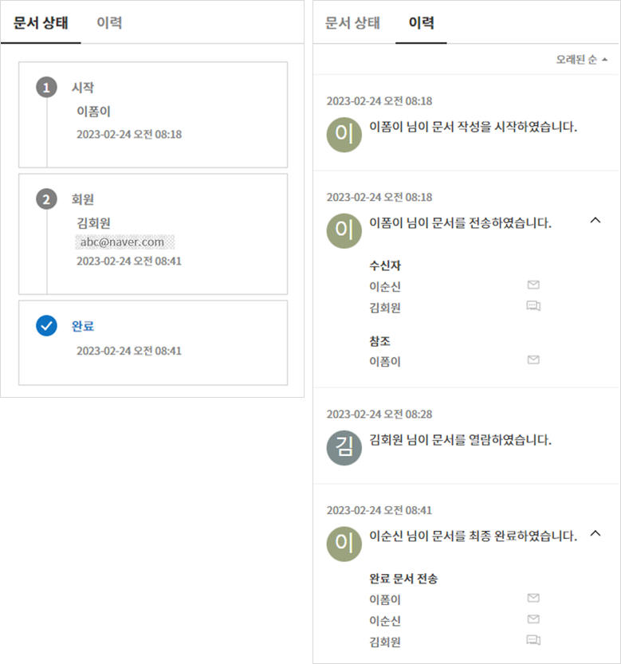

문서함
=======

기본 문서함
--------------------------------

작성한 문서는 상태에 따라 다음의 3개의 문서함에 저장됩니다.

.. note::

   일괄 작성한 문서는 `일괄 작성 문서함 <#bulksend-documents>`__ 에서 확인할 수 있습니다.

문서함에서 각각 문서의 상태와 이력에 대한 상세 정보를 확인하고 관리할 수 있으며, 문서를 처리하거나, 재전송, 완료 문서 전송 등 추가 작업을 수행할 수 있습니다. 문서 작성 도중 임시 저장한 문서는 처리할 문서함에 나타나며 목록에서 문서를 선택해 문서를 전송할 수 있습니다.

-  **처리할 문서함:** 임시 저장한 문서, 내가 처리해야 할 문서(다른 구성원이 나에게 작성 또는 결재 요청한 문서), 또는 외부자에게 보낸 문서 중 처리되지 않은 문서 목록을 확인할 수 있습니다.

-  **진행 중 문서함:** 내가 작성 또는 처리한 문서 중 완료되지 않은 문서 목록을 확인할 수 있습니다.

-  **완료 문서함:** 내가 작성한 문서 중 완료된 문서 목록을 확인할 수 있습니다.

문서 관리 메뉴에서는 템플릿 설정에서 문서 관리 권한을 부여한 멤버가 해당 템플릿으로 작성된 모든 문서를 확인할 수 있습니다.

-  **문서 관리:** 문서 관리 권한이 있는 멤버만 접근 가능한 메뉴입니다. 해당 멤버는 문서 관리 권한이 있는 템플릿으로 작성된 모든 문서를 조회할 수 있습니다.

.. note::

   대표 관리자는 모든 문서를 조회하고 관리할 수 있습니다.

|image1|

.. note::

   각각의 문서함과 문서 관리 화면 구성은 거의 동일하지만, 상태 또는 권한에 따라 표시되는 문서에 차이가 있습니다.

.. figure:: resources/inbox_layout.png
   :alt: 문서함 형태
   :width: 700px

문서함 구성
--------------------------------

문서함은 다음의 5가지 항목으로 구성되어 있습니다.

① 메뉴 및 홈 아이콘, 문서함 이름
   메뉴(|image2|)와 홈(|image3|) 아이콘을 통해 다른 메뉴로 이동하거나 대시보드로 이동할 수 있습니다. 현재 표시되고 있는 문서함의 이름을
   확인할 수 있습니다.

②  `카테고리 <#category>`__ 표시창, 필터 콤보박스 및 검색 입력박스
   템플릿 관리 메뉴에서 설정한 카테고리별로 문서를 볼 수 있으며 필터를 통해 필요한 문서만 리스트에 표시되도록 할 수 있습니다.

   검색은 키워드 검색뿐 아니라, 상세 검색을 통해 제목이나 내용을  조합해서 검색하거나, 숫자, 날짜 범위를 지정해 검색, 사용자 지정
   필터를 통한 검색 등 다양한 검색 방법을 제공하고 있습니다.

③ 문서 목록 및 `작업 항목 <#additional_work>`__
   문서는 페이지마다 최대 20개의 목록을 표시하며 20개를 넘는 문서는 페이지 구분을 통해 표시됩니다.

   문서의 상태, 제목, 단계, 작성자, 작성일, 처리자, 처리일, 문서 ID, 문서 번호 등의 컬럼을 기반으로 문서 리스트의 내용을 보여주며, 표시
   컬럼의 종류는 문서함 오른쪽 상단의 아이콘 중 컬럼(|image4|) 아이콘을 클릭하면 나타나는 `컬럼 체크박스 <#document_column>`__\ 를 통해
   조정할 수 있습니다.

   문서 리스트에서 수행할 수 있는 추가 작업에는 미리보기, 삭제 요청, 반려 요청 승인하기, 재요청, 완료 문서 전송 등이 있습니다.

④ `문서 상태 및 이력 보기 <#history>`__
   문서 상태와 이력을 확인할 수 있습니다.

   문서 상태에서는 문서의 관점에서 언제 문서가 만들어지고 처리되고 완료되었는지를 확인할 수 있습니다.

   이력보기를 통해서는 작성자 및 수신자 입장에서 누가 어떤 작업을 수행했는지를 확인할 수 있습니다.

⑤ `문서함 필드 조정 <#document_column>`__, `문서 다운로드 <#document_download>`__ 및 `삭제 <#document_delete>`__ 아이콘
   문서함의 컬럼(|image5|)아이콘을 클릭하면 컬럼의 종류가 표시되고, 컬럼 체크박스를 통해 리스트에 어떤 컬럼을 보여줄 지를 선택할 수 있습니다.

   문서 다운로드를 클릭하면 리스트 중에 다운로드하고자 하는 문서를 선택(복수 선택 가능)하고 PDF 문서, 감사 추적증명서, 선택 필드의 CSV
   데이터를 다운로드할 수 있습니다.

   .. note::

      **문서 삭제하는 방법**

      문서함에서는 문서 삭제 아이콘이 비활성화되어 있습니다.

      문서 삭제는 **문서 관리** 메뉴에서만 가능하며, 삭제를 위해서는 **문서 관리 권한**\ 이 필요합니다. 
      문서 관리 권한은, 대표 관리자 또는 템플릿 관리자가 **템플릿 관리 > 템플릿 설정 > 권한 설정 > 문서 관리 권한**\ 에서 부여할 수 있습니다. 문서 관리자는 각 템플릿 별로 지정이 가능하며, 지정되면 **문서 관리** 메뉴에서 해당 템플릿으로 작성된 문서를 열람, 삭제 및 다운로드(PDF, CSV)할 수 있는 권한을 갖게 됩니다.

.. _category:

카테고리, 키워드 및 필터 검색
~~~~~~~~~~~~~~~~~~~~~~~~~~~~~

카테고리, 키워드 및 필터 검색 창은 각 문서함의 왼쪽 상단에 있습니다.
문서 관리함에만 상태별 필터가 더 추가되어 있습니다.

-  **진행 중/처리할/완료 문서함**

   문서함에는 카테고리별 검색창, 문서별 필터, 검색 키워드 창이 좌측 상단에 배치되어 있습니다.

-  **문서 관리**

   문서함에는 카테고리별 검색창, 문서별/상태별 필터, 검색 키워드 창이 좌측 상단에 배치되어 있습니다.

**카테고리 검색**

카테고리 검색 콤보박스를 활용하면 템플릿 관리 메뉴에서 설정한 카테고리별로 문서를 표시하고 이 중 원하는 카테고리나 문서를 확인할 수
있습니다.

콤보박스의 **X** 아이콘를 누르면 아래와 같이 템플릿에서 설정한 카테고리에 맞춰 분류되어 나타납니다.

.. figure:: resources/category_search.png
   :alt: 카테고리 검색 콤보박스
   :width: 500px

**문서 상태별 검색**

각각의 문서함에서 문서의 상태별로 문서를 검색할 수 있습니다.

-  **처리할 문서함**

|image6|

-  **진행 중 문서함**

|image7|

-  **완료 문서함**

|image8|

-  **문서 관리**

   |image9|

**키워드 및 필터 검색**

검색은 키워드 검색뿐 아니라, 상세 검색을 통해 제목이나 내용을 조합해서 검색하거나, 숫자, 날짜 범위를 지정해 검색, 사용자 지정 필터를 통한 검색 등 다양한 검색 방법을 제공하고 있습니다. 또한, 사용자 지정 필터를 설정해서 문서의 입력필드 값을 상세 검색할 수 있으며, 숫자의 범위, 날짜의 기간을 설정해서 검색할 수도 있습니다.

필터를 사용해서 검색 가능한 필터는 다음과 같습니다. 한편, 사용자 지정 필터는 완료 문서함과 문서 관리에서만 사용할 수 있습니다.

.. table:: **필터 종류 리스트**

   ============== ==================== =================== ===================
   처리할 문서함   진행 중 문서함         완료 문서함         문서 관리
   ============== ==================== =================== ===================
   제목 + 내용      제목 + 내용          제목 + 내용         제목 + 내용
   제목             제목                 제목               제목
   내용             내용                 내용               내용
   문서 ID          문서 ID              문서 ID            문서 ID 
   문서 번호         문서 번호            문서 번호          문서 번호
                                                            단계
                                        단계                작성자
   템플릿 이름      템플릿 이름           작성자              작성일
   단계             단계                 작성일              처리자
   작성자           작성자               처리자              처리일
   작성일           작성일               처리일              사용자 지정 필터
   요청자           처리자                     
   요청일           처리일                사용자 지정 필터                          
                   문서 처리 경과일수                  
   ============== ==================== =================== ===================

**사용자 지정 필터 사용 방법**

1. 상세 콤보박스에서 **사용자 지정 필터**\ 를 선택합니다.

   |image10|

2. 필드 이름, 필드 타입, 검색 값을 설정합니다.

   필드 이름은 기본 값이 빈 값입니다. 검색하고자 하는 문서 입력 필드의 표시이름(=템플릿의 필드 설정 표시이름)을 직접 입력해야 합니다.

   .. note::

      1. 존재하지 않는 문서 입력 필드의 표시이름을 설정해서 검색하면 문서가 조회되지 않습니다.

      2. 필드 이름에 특수 문자(", ', ;, <, >, \\)를 입력할 수는 없습니다.

      3. 필드 이름의 앞/뒤 공백은 모두 제거되어 추가됩니다. 예) “휴가신청서 ” → “휴가신청서”

      4. 추가/수정 시, 기존에 추가된 사용자 지정 필터와 동일한 필드 이름을 입력하면, 필드 타입, 필드 검색 값이 기존에 설정한 정보로
      표시됩니다. 예) 기존에 사용자 지정 필터 ‘근속연수 : 5~10’가 추가된 상태에서 다시 사용자 지정 필터를 추가할 때, 필드 이름에 동일한
      이름의 ‘근속연수’를 입력하면 필드 타입은 ‘범위’, 검색 값1은 ‘5’, 값2는 ‘10’으로 기존 설정이 표시됩니다.

   필드 타입은 키워드, 범위, 기간 타입 중에 선택합니다. 기본 값은 키워드입니다.

   필드 타입 선택에 따라 검색 값으로 표시되는 입력 박스가 다릅니다.

   ========= ============= =============
   필드 타입  입력 박스 1    입력 박스 2
   ========= ============= =============
   키워드     텍스트       
   범위       시작 값        종료 값
   기간       시작 날짜      종료 날짜
   ========= ============= =============

   -  **키워드**

      콤마(,)로 구분해서 복수 개의 값을 설정할 수 있습니다. 기본값은 빈 값입니다.

      설정한 텍스트를 포함하는 값이 검색됩니다. 즉, 복수의 값 중 하나 이상을 포함하는 문서를 검색합니다.

      예) 필드 이름: 과일 / 필드 타입: 키워드 / 값1: 딸기 , 사과 → 과일에 ‘딸기’와 ‘사과’ 둘 중 하나 이상을 포함하는 문서 검색

   -  **범위**

      숫자나 날짜의 사이값을 검색할 때 사용합니다. 예) 숫자: 100~200 / 기간: 2019/01/01~2019/06/30

      설정한 시작 값과 종료 값 사이에 있는 값이 검색됩니다. 범위 값 중 시작 값만 입력한 경우에는 시작 값 이상을 검색하며, 범위 값 중 종료
      값만 입력한 경우에는 종료 값 이하를 검색합니다. 예) 연봉 : 1000~ / 연봉 : ~5000

   -  **기간**

      표시되는 달력에서 날짜의 기간을 설정합니다. 기본값은 현재일 기준으로 이전 1주일로 설정되어 있습니다.

      설정한 시작일과 종료일 사이에 있는 날짜를 검색합니다.

3. 검색 추가(|image11|) 버튼을 클릭하면 검색 키워드로 추가되고, 설정한 조건에 따라 문서가 검색됩니다.

   .. note::

      1. 사용자 지정 필터를 여러 개 추가할 수 있고, 추가한 사용자 지정 필터를 수정/삭제할 수 있습니다.

      2. 사용자 지정 필터는 중복된 필드 이름으로 여러 개 추가할 수 없습니다.

      3. 이미 지정한 사용자 지정 필터를 수정하면, 필드 타입과 검색 값은 최근 입력 값으로 변경됩니다.

**검색 키워드 표시 방법 및 수정/삭제 방법**

1. 검색 키워드는 **필드 이름 : 값**\ 의 형식으로 다음과 같이 추가됩니다.

   -  키워드: “근무형태 : 정규직 , 계약직”

   -  범위: “근속연수 : 5~10”

   -  기간: “근로계약기간_년월일 : 2018-01-01~2018-12-31“

2. 추가한 검색 키워드를 선택해서 사용자 지정 필터를 수정합니다. 수정 시에는 상세 검색 필터 항목이 “사용자 지정 필터”로 변경되고 선택한
   필터의 필드 이름, 필드 타입, 검색 값이 표시됩니다.

3. 추가한 검색 키워드는 오른쪽의 **X**\ 아이콘을 클릭해 삭제합니다.

.. _additional_work:

문서함별 작업 항목
~~~~~~~~~~~~~~~~~~

각 문서함의 문서 리스트에서 수행할 수 있는 추가 작업에는 미리보기, 삭제 요청, 반려 요청 승인하기, 재요청, 완료 문서 전송 등이 있습니다.

-  **처리할 문서함**

   편집, 검토하기, 재요청, 미리보기, 수정, 취소, 완료 문서 전송, 다운로드를 할 수 있습니다.

-  **진행 중 문서함**

   재요청, 미리보기, 수정, 취소, 완료 문서 전송, 다운로드를 할 수 있습니다.

-  **완료 문서함**

   미리보기, 취소, 완료 문서 전송, 다운로드를 할 수 있습니다.

-  **문서 관리**

   미리보기, 취소, 완료 문서 전송, 제거, 다운로드 및 문서를 삭제할 수 있습니다. 문서는 **문서 관리**\ 에서만 삭제할 수 있습니다.

.. _history:

상태 및 이력보기
~~~~~~~~~~~~~~~~

문서함 목록에서 문서를 선택하면 해당 문서의 상태와 이력을 화면 오른쪽에서 확인할 수 있습니다.

-**문서 상태**\ : 워크플로우 단계별로 문서가 언제, 누구에 의해 작성/처리되었는지 표시
-**이력**\ : 작성자 및 수신자 관점에서 시간 순으로 누가 어떤 작업을 수행했는지 표시

.. _document_download:

문서 다운로드
~~~~~~~~~~~~~~~~

eformsign에서 작성된 문서는 대부분 오랜 기간 안전하게 보관해야 하는 문서들입니다. 모든 문서는 장기 보관용 파일 형식(PDF/A)으로 저장되며
지정된 관리자만 문서와 데이터를 열람하거나 삭제할 수 있습니다.

1. 문서 목록에서 오른쪽 상단 다운로드(|image12|) 아이콘을 클릭합니다.

2. 다운로드할 문서를 선택하고 **다운로드** 버튼을 클릭합니다.

.. figure:: resources/download_popup.png
   :alt: 문서 다운로드 팝업
   :width: 400px

.. note::

   **CSV 다운로드**\ 는 문서에 입력된 데이터를 엑셀 파일로 다운로드 받아 별도로 관리할 수 있습니다. CSV 다운로드를 선택하고 다운받을 데이터를 확인한 후 **다운로드** 버튼을 클릭합니다.

.. _document_delete:

문서 삭제하기
~~~~~~~~~~~~~

eformsign에서는 지정된 관리자만 문서를 삭제할 수 있습니다.

1. 문서함 목록에서 오른쪽 상단에 있는 삭제(|image13|) 아이콘을 클릭합니다.

2. 삭제할 문서를 선택한 후 **삭제** 버튼을 클릭합니다.

3. 삭제 확인 팝업창에서 **예**\ 를 클릭하면 문서가 삭제됩니다.

.. _document_column:

문서함 컬럼 설정
~~~~~~~~~~~~~~~~

문서함 오른쪽 상단의 아이콘 중 컬럼(|image14|) 아이콘을 클릭하면 목록에서 어떤 컬럼을 보여줄 지 선택할 수 있습니다.

.. figure:: resources/column_type.png
   :alt: 문서함 컬럼 설정 아이콘

.. _drafts:

임시 보관함
-----------

**임시 보관함**\ 에는 **내 파일로 문서 작성** 과정에서 **문서를 전송하기** 이전에 **임시 보관함에 저장**\ 을 클릭하여 저장한 문서들이 보관됩니다. **임시 보관함**\ 에 저장된 파일은 언제든지 다시 열어 이후 단계를 계속 진행하거나 문서를 삭제할 수 있습니다.

1. 사이드바 메뉴에서 **임시 보관함**\ 을 클릭하여 이동합니다.

   |image15|

2. 임시 저장된 문서 목록에서 원하는 문서의 **계속** 버튼을 클릭합니다.

   |image16|

3. **내 파일로 문서 작성** 화면에서 문서를 수정한 후 전송합니다.

.. note::

   내 파일로 문서 작성하는 방법은 `내 파일로 문서 작성하기 <chapter3.html#id2>`__ 를 참고하시기 바랍니다.

.. _bulksend_documents:

일괄 작성 문서함
-------------------------

일괄 작성 문서함에서는 일괄 작성으로 대량 전송한 문서를 한 눈에 볼 수 있습니다. 일괄 작성한 문서의 진행 상황을 확인하고, 예약 전송 변경, 취소 또는 재요청 등을 할 수 있습니다. 

.. figure:: resources/bulksend-documents.png
   :alt: 일괄 작성 문서함

일괄 작성한 문서 목록에서 상세 보기를 클릭하면 전송된 문서의 응답 여부, 단계 상태 등을 확인할 수 있습니다.

- 문서의 응답/미응답 여부 확인
- 일괄 또는 개별 재요청, 문서 취소, 다운로드(PDF, CSV 파일) 가능
- 문서 별 단계, 상태 및 이력 확인 가능

.. figure:: resources/bulksend-documents-detail.png
   :alt: 일괄 작성 문서함-상세보기

.. tip::

   일괄로 재요청 시 수신자 정보는 수정할 수 없으며, 처음 입력한 이메일 주소 또는 휴대폰 번호로 전송됩니다. 수신자 정보를 변경해야 할 경우 개별로 재요청하시기 바랍니다. 

예약 전송한 문서의 경우, 예약 변경 또는 취소를 할 수 있습니다.

.. note::

   한번에 대량으로 문서를 전송할 수 있는 문서 일괄 작성 방법은 `일괄 작성으로 문서 대량 전송하기 <chapter3.html#bulksend>`__ 를 참고하시기 바랍니다.

.. |image1| image:: resources/inbox_ex1.png
   :width: 700px

.. |image3| image:: resources/home_icon_2.png
   :width: 25px
.. |image4| image:: resources/column_icon.png
   :width: 35px
.. |image5| image:: resources/column_icon.png
   :width: 35px
.. |image6| image:: resources/actionrequiredbox-status-search.png
   :width: 700px
.. |image7| image:: resources/inprocessbox-status-search.png
   :width: 700px

.. |image9| image:: resources/documentmanage_status_search.png
   :width: 700px
.. |image10| image:: resources/userdefined_search1.png

.. |image12| image:: resources/download_icon.png
.. |image13| image:: resources/delete_icon1.png
.. |image14| image:: resources/column_icon.png
   :width: 35px
.. |image15| image:: resources/draftbox-menu.png
   :width: 700px
.. |image16| image:: resources/draftbox-documentlist.png
   :width: 700px
