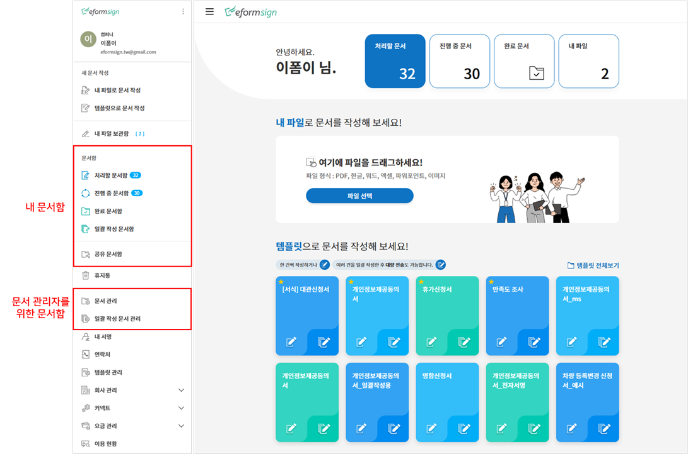
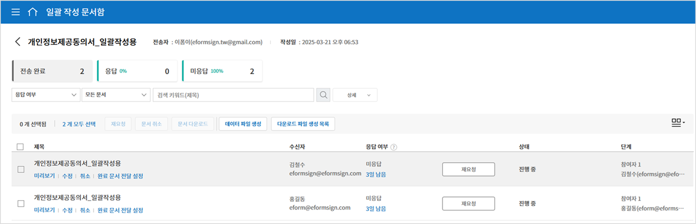
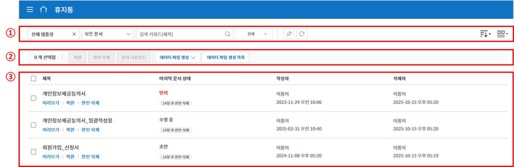

.. _documents:

==========
문서함
==========

------------------
기본 문서함
------------------

작성한 문서는 상태에 따라 문서함에 저장됩니다.

문서함에서는 각각 문서의 상태와 이력에 대한 상세 정보를 확인하고 관리할 수 있으며, 문서를 처리하거나, 재전송, 완료 문서 전달 등 추가 작업을 수행할 수 있습니다. 문서 작성 도중 임시 저장한 문서는 처리할 문서함에 나타나며 목록에서 문서를 선택해 전송할 수 있습니다.

-  **처리할 문서함:** 임시 저장한 문서(초안), 내가 처리해야 할 문서(다른 멤버가 나에게 작성 요청한 문서), 또는 멤버가 아닌 수신자에게 보낸 문서 중 문서 기한이 지나 재요청이 필요한 문서 목록을 확인할 수 있습니다.

-  **진행 중 문서함:** 내가 작성 또는 처리한 문서 중 완료되지 않은 문서 목록을 확인할 수 있습니다.

-  **완료 문서함:** 내가 작성한 문서 중 완료된 문서 목록을 확인할 수 있습니다.

-  **일괄 작성 문서함:** 내가 일괄로 작성한 문서의 진행 상태 등 일괄 작성 문서에 대한 현황을 확인할 수 있습니다. (일괄 작성 문서함에 대한 설명은 `일괄 작성 문서함 <#bulksend-documents>`__\  참고)

--------------------------

- **공유 문서함:** 소유한 문서를 다른 멤버에게 공유하거나 공유 문서함에 접근 권한이 있을 경우 공유된 문서를 한눈에 확인할 수 있습니다. (공유 문서함에 대한 설명은 `공유 문서함 <#shared-documents>`__\  참고)

- **휴지통:** 문서함 또는 문서 관리 메뉴에서 삭제된 문서를 확인할 수 있습니다. (휴지통에 대한 설명은 `휴지통 <#trash>`__\  참고)

-------------------------

**문서 관리/일괄 작성 문서 관리** 메뉴는 문서 관리자를 위한 문서함으로 **문서 관리자**\ 가 권한이 있는 문서를 확인할 수 있습니다.

.. note::

   문서 관리자 설정 방법은  `문서 관리자 설정 <chapter2.html#docmanager-permissions>`__\ 에서 확인해 주세요. 대표 관리자는 모든 문서를 조회하고 관리할 수 있습니다.

-  **문서 관리:** 문서 관리자 권한이 있는 멤버만 접근 가능한 메뉴입니다. 해당 멤버는 문서 관리 권한이 있는 템플릿으로 작성된 모든 문서를 조회할 수 있습니다.

-  **일괄 작성 문서 관리:** 문서 관리자 권한이 있어야만 접근 가능한 메뉴입니다. 문서 관리 권한이 있는 템플릿으로 일괄 작성된 문서를 조회할 수 있습니다. 

.. tip::

   다른 멤버가 보낸 문서에 대해 수신자가 문서를 처리하지 않은 경우, 문서 관리자가 직접 문서를 **재요청**\ 할 수 있습니다. 

   - 재요청 가능한 문서는 **문서 관리**\ 와 **일괄 작성 문서 관리 > 상세 보기**\ 에 **재요청** 버튼이 표시됩니다.
   - 일괄 작성 문서함 및 일괄 작성 문서 관리에서 일괄로 문서 재요청 시 기존 메시지 및 전송 기한을 수정할 수 있습니다

---------------
문서함 구성
---------------

.. note::

   **처리할, 진행중, 완료 문서함**\ 과 **문서 관리** 화면 구성은 거의 동일하지만, 상태 또는 권한에 따라 표시되는 문서에 차이가 있습니다.

문서함은 다음의 5가지 항목으로 구성되어 있습니다.

.. figure:: resources/inbox_layout.png
   :alt: 문서함 형태
   :width: 700px

① 메뉴 및 홈 아이콘, 문서함 이름
   메뉴(|image2|)와 홈(|image3|) 아이콘을 통해 다른 메뉴로 이동하거나 대시보드로 이동할 수 있습니다. 현재 표시되고 있는 문서함의 이름을
   확인할 수 있습니다.

②  `카테고리 <#category>`__ 표시창, 필터 콤보박스 및 검색 입력박스
   템플릿 관리 메뉴에서 설정한 카테고리 별로 문서를 볼 수 있으며 필터를 통해 필요한 문서만 목록에 표시되도록 할 수 있습니다.

   검색은 키워드 검색, 상세 검색을 통해 제목이나 내용을 조합해서 검색할 수 있으며, 숫자, 날짜 범위를 지정해 검색, 사용자 지정 필터를 통한 검색 등 다양한 방법으로 검색할 수 있습니다.

③ 문서 목록 및 `작업 항목 <#additional-work>`__
   문서는 한 페이지에 최대 20개까지 표시됩니다. 

   문서의 상태, 제목, 단계, 작성자, 처리자, 문서 ID, 문서 번호 등의 컬럼을 기반으로 문서 목록의 내용을 보여주며, 표시 컬럼의 종류는 문서함 오른쪽 상단의 아이콘 중 컬럼(|image4|) 아이콘을 클릭하면 나타나는 `컬럼 체크박스 <#document-column>`__\ 에서 선택할 수 있습니다. 

   문서 목록에서 수행할 수 있는 추가 작업에는 **미리보기, 삭제 요청, 재요청, 완료 문서 전달** 등이 있습니다.

④ `문서 상태 및 이력 보기 <#history>`__
   문서 상태와 이력을 확인할 수 있습니다.

   - **문서 상태**\ :문서의 관점에서 언제 문서가 만들어지고 처리되고 완료되었는 지를 확인할 수 있습니다.

   - **이력**\ : 작성자 및 수신자 입장에서 누가 어떤 작업을 수행했는 지를 확인할 수 있습니다.

⑤ 공유, `문서함 컬럼 <#document-column>`__, `문서 다운로드 <#document-download>`__ 및 `삭제 <#document-delete>`__ 아이콘

- 공유 (|image1|): 아이콘을 클릭한 후 문서를 선택하여 공유 문서함에 문서를 공유할 수 있습니다.

- 문서함 컬럼 (|image4|): 문서함 컬럼의 종류가 표시되고, 문서 목록에 어떤 컬럼을 보여줄 지를 선택할 수 있습니다.

- 문서 다운로드 (|image5|): 문서를 PDF 파일 또는 데이터 파일(CSV)로 다운로드 받을 수 있고 다운로드 파일 생성 목록을 확인할 수 있습니다. 
   

.. note::

   **문서 삭제하는 방법**

   문서함에서는 문서 삭제 아이콘이 비활성화되어 있습니다.

   문서 삭제는 **문서 관리** 메뉴에서만 가능하며, 삭제를 위해서는 **문서 관리자 권한**\ 이 필요합니다. 문서 관리자 설정은 대표 관리자만 할 수 있으며, **회사 관리 > 문서 관리자 설정**\ 메뉴에서 할 수 있습니다.

   문서 관리자는 각 템플릿별로 지정할 수 있으며, 지정되면 **문서 관리** 메뉴에서 해당 템플릿으로 작성된 문서를 열람, 삭제 및 다운로드(PDF, CSV) 할 수 있는 권한을 갖게 됩니다.

.. _category:

카테고리, 키워드, 필터 검색
~~~~~~~~~~~~~~~~~~~~~~~~~~~~~

카테고리, 키워드 및 필터 검색 창은 각 문서함의 왼쪽 상단에 있습니다.
문서 관리함에만 상태별 필터가 추가되어 있습니다.

-  **진행 중/처리할/완료 문서함**

   문서함에는 카테고리별 검색창, 문서별 필터, 검색 키워드 창이 좌측 상단에 배치되어 있습니다.

-  **문서 관리**

   문서함에는 카테고리별 검색창, 문서별/상태별 필터, 검색 키워드 창이 좌측 상단에 배치되어 있습니다.

카테고리 검색
-------------------

카테고리 검색 콤보박스를 활용하면 **템플릿 관리** 메뉴에서 설정한 카테고리별로 문서를 표시하고 이 중 원하는 카테고리나 문서를 확인할 수 있습니다.

콤보박스의 **X** 아이콘을 누르면 아래와 같이 템플릿에서 설정한 카테고리에 따라 분류되어 나타납니다.

.. figure:: resources/category_search.png
   :alt: 카테고리 검색 콤보박스
   :width: 500px

문서 상태별 검색
------------------------

각각의 문서함에서 문서의 상태별로 문서를 검색할 수 있습니다.

-  **처리할 문서함**

|image6|

-  **진행 중 문서함**

|image7|

-  **완료 문서함**

|image8|

-  **문서 관리**

|image9|

키워드 및 필터 검색
-----------------------------

검색은 키워드 검색은 물론, 상세 검색을 통해 제목이나 내용을 조합해서 검색하거나, 숫자, 날짜 범위를 지정해 검색, 사용자 지정 필터를 통한 검색 등 다양한 검색 방법을 제공하고 있습니다. 또한, 사용자 지정 필터를 설정해서 문서에 입력된 값도 검색할 수 있으며, 숫자의 범위, 날짜의 기간을 설정해서 검색할 수도 있습니다.

필터를 사용해서 검색 가능한 필터는 다음과 같습니다. 한편, 사용자 지정 필터는 완료 문서함과 문서 관리에서만 사용할 수 있습니다.

.. table:: **필터 종류 리스트**

   ============== ==================== =================== ===================
   처리할 문서함   진행 중 문서함         완료 문서함         문서 관리
   ============== ==================== =================== ===================
   제목 + 내용      제목 + 내용          제목 + 내용         제목 + 내용
   제목             제목                 제목               제목
   내용             내용                 내용               내용
   문서 ID          문서 ID              문서 ID            문서 ID 
   문서 번호         문서 번호            문서 번호          문서 번호
   템플릿 이름       템플릿 이름          단계                단계
   단계              단계                작성자              작성자
   작성자            작성자               작성일              작성일
   작성일            작성일               수신자              수신자
   요청자           문서 처리 경과일수   사용자 지정 필터    사용자 지정 필터                      
   요청일           수신자  
   수신자                                  
   ============== ==================== =================== ===================

**사용자 지정 필터 사용 방법**

1. **상세** 콤보박스에서 **사용자 지정 필터**\ 를 선택합니다.

   |image10|

2. 필드 이름, 필드 타입, 검색 값을 설정합니다.

   필드 이름은 기본 값이 빈 값입니다. 검색하고자 하는 문서 입력 필드의 표시이름(=템플릿의 필드 설정 표시이름)을 직접 입력해야 합니다.

   .. note::

      - 존재하지 않는 문서 입력 필드의 표시이름을 설정해서 검색하면 문서가 조회되지 않습니다.

      - 필드 이름에 특수 문자(", ', ;, <, >, \\)를 입력할 수는 없습니다.

      - 필드 이름의 앞/뒤 공백은 모두 제거되어 추가됩니다. 예) “휴가신청서 ” → “휴가신청서”

      - 추가/수정 시, 기존에 추가된 사용자 지정 필터와 동일한 필드 이름을 입력하면, 필드 타입, 필드 검색 값이 기존에 설정한 정보로 표시됩니다.

      예) 기존에 사용자 지정 필터 ‘근속연수 : 5~10’가 추가된 상태에서 다시 사용자 지정 필터를 추가할 때, 필드 이름에 동일한 이름의 ‘근속연수’를 입력하면 필드 타입은 ‘범위’, 검색 값1은 ‘5’, 값2는 ‘10’으로 기존 설정이 표시됩니다.

   필드 타입은 키워드, 범위, 기간 타입 중에 선택합니다. 기본 값은 키워드입니다.

   필드 타입 선택에 따라 검색 값으로 표시되는 입력 박스가 다릅니다.

   ========= ============= =============
   필드 타입  입력 박스 1    입력 박스 2
   ========= ============= =============
   키워드     텍스트       
   범위       시작 값        종료 값
   기간       시작 날짜      종료 날짜
   ========= ============= =============

   -  **키워드**

      콤마(,)로 구분해서 복수 개의 값을 설정할 수 있습니다. 기본값은 빈 값입니다.

      설정한 텍스트를 포함하는 값이 검색됩니다. 즉, 복수의 값 중 하나 이상을 포함하는 문서를 검색합니다.

      예) 필드 이름: 과일 / 필드 타입: 키워드 / 값1: 딸기 , 사과 → 과일에 ‘딸기’와 ‘사과’ 둘 중 하나 이상을 포함하는 문서 검색

   -  **범위**

      숫자나 날짜의 사이값을 검색할 때 사용합니다. 

      예) 숫자: 100~200 / 기간: 2019/01/01~2019/06/30

      설정한 시작 값과 종료 값 사이에 있는 값이 검색됩니다. 범위 값 중 시작 값만 입력한 경우에는 시작 값 이상을 검색하며, 범위 값 중 종료
      값만 입력한 경우에는 종료 값 이하를 검색합니다. 

      예) 연봉 : 1000~ / 연봉 : ~5000

   -  **기간**

      표시되는 달력에서 날짜의 기간을 설정합니다. 기본값은 현재일 기준으로 이전 1주일로 설정되어 있습니다.

      설정한 시작일과 종료일 사이에 있는 날짜를 검색합니다.

3. 검색 추가(|image11|) 버튼을 클릭하면 검색 키워드로 추가되고, 설정한 조건에 따라 문서가 검색됩니다.

   .. note::

      - 사용자 지정 필터를 여러 개 추가할 수 있고, 추가한 사용자 지정 필터를 수정/삭제할 수 있습니다.

      - 사용자 지정 필터는 중복된 필드 이름으로 여러 개 추가할 수 없습니다.

      - 이미 지정한 사용자 지정 필터를 수정하면, 필드 타입과 검색 값은 최근 입력 값으로 변경됩니다.

**검색 키워드 표시 방법 및 수정/삭제 방법**

1. 검색 키워드는 **필드 이름 : 값**\ 의 형식으로 다음과 같이 추가됩니다.

   -  키워드: “근무형태 : 정규직 , 계약직”

   -  범위: “근속연수 : 5~10”

   -  기간: “근로계약기간_년월일 : 2018-01-01~2018-12-31“

2. 추가한 검색 키워드를 선택해서 사용자 지정 필터를 수정합니다. 
   수정 시에는 상세 검색 필터 항목이 “사용자 지정 필터”로 변경되고 선택한 필터의 필드 이름, 필드 타입, 검색 값이 표시됩니다.

3. 추가한 검색 키워드는 오른쪽의 **X**\ 아이콘을 클릭해 삭제합니다.

.. _additional_work:

문서함별 작업 항목
~~~~~~~~~~~~~~~~~~

각 문서함의 목록에서 수행할 수 있는 추가 작업에는 미리보기, 재요청, 완료 문서 전달 등이 있습니다.

-  **처리할 문서함**

   편집, 검토하기, 재요청, 미리보기, 수정, 취소, 공유, 완료 문서 전달 설정, 다운로드를 할 수 있습니다. 
   *반려된 문서 및 초안 문서는 삭제 가능합니다. 

-  **진행 중 문서함**

   재요청, 미리보기, 수정, 취소, 공유, 완료 문서 전달 설정, 다운로드를 할 수 있습니다.

-  **완료 문서함**

   미리보기, 공유, 새 문서 작성, 전달(완료 문서), 리마인더 설정, 다운로드를 할 수 있습니다.

-  **문서 관리**

   미리보기, 취소, 완료 문서 전달, 삭제, 새 문서 작성, 다운로드 및 문서를 삭제할 수 있습니다. 문서는 **문서 관리**\ 에서만 삭제할 수 있습니다.

.. _history:

상태 및 이력보기
~~~~~~~~~~~~~~~~

문서함 목록에서 문서를 선택하면 해당 문서의 상태와 이력을 화면 오른쪽에서 확인할 수 있습니다.

-  **문서 상태**\ : 워크플로우 단계별로 문서가 언제, 누구에 의해 작성/처리되었는지 표시

-  **이력**\ : 작성자 및 수신자 관점에서 시간 순으로 누가 어떤 작업을 수행했는지 표시

   .. figure:: resources/document_status.png
      :alt: 문서 상태 탭
      :width: 500px

.. _document_download:

문서 다운로드
~~~~~~~~~~~~~~~~

eformsign에서 작성된 문서는 **PDF로 다운로드**\ 하거나 입력된 내용을 포함한 문서 **데이터 파일**\ 을 별도로 다운로드할 수 있습니다. 

.. note::

   💡 **데이터 파일이란?**

   문서 내 입력된 내용을 포함하여 문서 제목, 문서 ID, 수신자 등 문서 메타데이터를 확인할 수 있는 파일로 CSV 파일 형식으로 다운로드됩니다. 

PDF 파일로 다운로드 
-------------------------------

1. **문서함/문서 관리** 메뉴에서 문서 다운로드(|image12|) 아이콘을 클릭합니다.
2. 문서 목록 왼쪽에 표시된 체크박스를 선택하여 다운로드할 문서를 선택합니다.
3. **문서 다운로드** 버튼을 클릭합니다.
4. 문서 다운로드 팝업에서 **감사추적증명서 포함** 여부를 선택하고 **다운로드** 버튼을 클릭합니다.

.. figure:: resources/download_popup.png
   :alt: 문서 다운로드 팝업
   :width: 400px

.. tip::

   💡 **문서 PDF 파일 20개 이상 다운로드하는 방법**

   문서함에는 기본 20개의 문서가 목록에 표시되며, 문서 다운로드 시에도 기본 20개 단위로 다운로드됩니다.
   아래의 방법을 활용하시면 최대 100건의 문서를 한번에 다운로드할 수 있습니다. 

   1. **문서함/문서 관리** 메뉴의 화면 하단에서 목록에 표시되는 문서 개수를 선택할 수 있습니다.

   .. figure:: resources/document-list-100.png
      :alt: 문서함 목록 100개씩 보기
      :width: 700px

   2. **50개씩 보기** 또는 **100개씩 보기**\ 를 선택합니다. 

   3. 오른쪽 상단의 문서 다운로드(|image12|) 아이콘을 클릭합니다.
   4. 문서 목록 왼쪽에 표시된 체크박스를 모두 선택한 후 **문서 다운로드** 버튼을 클릭합니다.
   5. 문서 다운로드 팝업에서 **감사추적증명서 포함** 여부를 선택하고 파일명을 입력한 후 **생성하기** 버튼을 클릭합니다.
   6. **다운로드 파일 생성 목록** 팝업에서 **새로 고침**\ 을 클릭합니다. 

   .. figure:: resources/document-download-popup.png
      :alt: 문서 다운로드 생성 목록1
      :width: 600px

   7. 다운로드 버튼이 활성화된 것을 확인할 수 있습니다. **다운로드** 버튼을 클릭하면 문서가 다운로드됩니다.

   .. figure:: resources/document-download-popup1.png
      :alt: 문서 다운로드 생성 목록2
      :width: 600px

   ❗ 20개 이상의 문서를 PDF 파일로 다운로드할 경우, 다운로드 파일 생성 목록(|image17|)에서 다운로드 및 확인할 수 있습니다. 

데이터 파일 다운로드
-------------------------------

1. **완료 문서함/문서 관리** 메뉴에서 데이터 파일 생성(|image14|) 아이콘을 클릭합니다.
2. 문서 목록 왼쪽에 표시된 체크박스를 선택하여 다운로드할 문서를 선택합니다.
3. **데이터 파일 생성** 버튼을 클릭합니다.
4. **데이터 파일 생성** 팝업에서 문서 정보와 입력 항목을 선택하고 파일명 및 비밀번호를 입력합니다.

   - **문서 정보:** 문서 제목, 문서 ID, 문서 번호, 단계, 작성자 등 문서에 대한 기본 정보를 선택합니다. 
   - **입력 항목:** 선택한 문서에 포함된 모든 입력 항목의 목록(최대 512개)이 표시됩니다. 데이터를 추출할 입력 항목을 선택하거나 입력된 모든 데이터를 다운로드하려면 모두 선택을 선택합니다.  

.. figure:: resources/cvs_file_popup.png
   :alt: 데이터파일 생성 팝업
   :width: 400px

5. **생성** 버튼을 클릭합니다.

6. **다운로드 파일 생성 목록** 팝업에서 왼쪽 하단의 새로 고침을 클릭하면 **다운로드** 버튼이 활성화됩니다. **다운로드**\ 를 클릭하면 파일이 다운로드됩니다. 
   *데이터 용량에 따라 파일 생성 시 시간이 소요될 수 있습니다.
 
   .. figure:: resources/cvs_file_list_popup.png
      :alt: 데이터파일 생성 목록 팝업
      :width: 600px

.. note::

   **다운로드 파일 생성 목록**

   다운로드 파일 생성 목록(|image17|) 아이콘을 클릭하면 이미 생성된 파일, 생성 중인 파일 목록을 확인할 수 있습니다. 
   파일이 생성 중일 경우 중도에 취소할 수 있으며, 생성 완료된 문서는 목록에서 다시 다운로드하거나 삭제할 수 있습니다. 다운로드 파일은 생성된 후 7일 이내에 언제든지 다시 다운로드할 수 있으며, 7일 후에는 자동 삭제됩니다. 

   .. figure:: resources/cvs_file_list_popup1.png
      :alt: 데이터파일 생성 목록 팝업
      :width: 600px

.. tip::

   **일괄 작성 문서함/일괄 작성 문서 관리에서 문서 다운로드하기**

   일괄 작성으로 보낸 문서는 일괄 작성 문서함에서 다운로드할 수 있습니다.

   1. **일괄 작성 문서함** 목록에서 다운로드할 문서의 **상세 보기**\ 를 클릭합니다.

   2. 다운로드할 문서를 목록에서 선택한 후 **문서 다운로드** 또는 **데이터 파일 생성**\ 을 클릭합니다. 

   .. figure:: resources/bulksend_download.png
      :alt: 데이터파일 생성 목록 팝업
      :width: 700px

.. _set_reminder:

리마인더 설정하기
~~~~~~~~~~~~~~~~~~~~~~~~~~~~~

완료 문서함에서는 문서에 대한 리마인더가 필요한 경우 알림을 설정할 수 있습니다. 예를 들어, 갱신 계약이 필요한 경우 갱신일자가 도래했음을 알려주는 알림을 설정할 수 있습니다. 

1. 완료 문서함으로 이동합니다.
2. 리마인더를 설정할 문서 제목 아래 리마인더 설정 버튼을 클릭합니다.

   .. figure:: resources/set_reminder.png
      :alt: 완료문서함-리마인더 설정
      :width: 600px

3. 리마인더 알림 설정 팝업에서 알림일, 메시지, 수신자를 설정합니다. 수신자는 그룹 또는 멤버만 선택할 수 있습니다.

   .. figure:: resources/set_reminder_popup.png
      :alt: 리마인더 설정 팝업
      :width: 500px

4. 저장 버튼을 클릭하면 리마인더 설정이 완료됩니다.
5. 설정된 알림은 설정된 시간에 수신자의 이메일로 전송됩니다.

.. note::

   리마인더가 설정된 경우 문서 제목 아래 버튼명이 **리마인더 수정**\ 으로 변경되며, **리마인더 수정**\ 을 클릭하여 설정 사항을 변경할 수 있습니다. 

   .. figure:: resources/edit_reminder.png
      :alt: 리마인더 수
      :width: 400px

.. _document_delete:

문서 삭제하기
~~~~~~~~~~~~~

eformsign에서는 지정된 관리자만 문서를 삭제할 수 있습니다.

1. 문서함 목록에서 오른쪽 상단에 있는 삭제(|image13|) 아이콘을 클릭합니다.

2. 삭제할 문서를 선택한 후 **삭제** 버튼을 클릭합니다.

3. 삭제 확인 팝업창에서 **예**\ 를 클릭하면 문서가 삭제됩니다.

.. _document_column:

문서함 컬럼 설정
~~~~~~~~~~~~~~~~

문서함 오른쪽 상단의 아이콘 중 컬럼(|image4|) 아이콘을 클릭하면 목록에서 어떤 컬럼을 표시할 지 선택할 수 있습니다.

   .. figure:: resources/column_type.png
      :alt: 문서함 컬럼 설정 아이콘

---------------------------------------------------

.. _myfiles:

-----------------
내 파일 보관함
-----------------

**내 파일 보관함**\ 에는 **내 파일로 문서 작성** 과정에서 **문서 시작하기** 전 단계에서 **내 파일 보관함에 저장**\ 을 클릭하여 저장한 문서들이 보관됩니다. 

**내 파일로 문서 작성**\ 을 통해 작성한 문서를 저장한 후 매번 새로 만들 필요없이 템플릿처럼 활용할 수 있습니다.

1. 사이드바 메뉴 또는 대시보드에서 **내 파일 보관함**\ 을 클릭하여 이동합니다.

   .. figure:: resources/myfile-menu.png
      :alt: 내 파일 보관함 메뉴
      :width: 700px

2. 저장된 문서 목록에서 원하는 문서의 **열기** 버튼을 클릭합니다.

   .. figure:: resources/myfile-documentlist.png
      :alt: 내파일 보관함
      :width: 700px

3. **내 파일로 문서 작성** 화면에서 문서를 수정한 후 전송합니다.

.. tip::

   **내 파일로 문서 작성**\ 을 클릭하면 파일 선택 팝업에서 **내 컴퓨터에서 파일을 선택**\ 하거나 **최근 파일**\ 을 선택할 수 있습니다. 이때 최근 파일에는 **내 파일 보관함**\ 에 저장된 파일이 최신순으로 표시됩니다.

.. note::

   내 파일로 문서 작성하는 방법은 `내 파일로 문서 작성하기 <chapter3.html#id2>`__ 를 참고해 주세요.

--------------------------------------------------

.. _bulksend_documents:

-------------------------
일괄 작성 문서함
-------------------------

일괄 작성 문서함에서는 일괄 작성으로 대량 전송한 문서를 한 눈에 볼 수 있습니다. 일괄 작성한 문서의 진행 상황을 확인하고, 예약 전송 변경, 취소 또는 재요청 등을 할 수 있습니다. 

.. figure:: resources/bulksend-documents.png
   :alt: 일괄 작성 문서함

**일괄 작성 시 엑셀 업로드 파일 다운로드**

일괄 작성 시 엑셀 파일 업로드를 통해 일괄 작성 데이터를 입력한 경우, 일괄 작성 문서함에서 해당 엑셀 파일을 다운로드 받을 수 있습니다. 
엑셀 파일 업로드한 일괄 작성 문서의 경우 아래와 같이 문서함에 **다운로드** 링크가 표시됩니다. 
다운로드를 클릭한 후 다운로드 사유 입력하고 다운로드 버튼을 클릭하면 파일이 다운로드 됩니다. 

※다운로드 사유는 **회사 관리 > 활동 이력 관리** 메뉴의 **다운로드 이력** 화면에 기록됩니다.

**일괄 작성 문서 예약 변경**

아직 전송이 안된 예약 전송 문서는 일괄 작성 문서함에서 예약 변경을 할 수 있습니다. 
예약 변경이 가능한 문서는 아래와 같이 목록에 버튼이 표시됩니다. 예약 변경 또는 문서 전송 취소를 할 수 있습니다. 

.. figure:: resources/bulksend-schedule-change.png
   :alt: 일괄 작성 문서함-예약 변경

**일괄 작성 문서 - 상세 보기**

일괄 작성한 문서 목록에서 **상세 보기**\ 를 클릭하면 전송된 문서의 응답 여부, 단계 상태 등을 확인할 수 있습니다.

.. figure:: resources/bulksend-documents.png
   :alt: 일괄 작성 문서함

- 문서의 응답/미응답 여부 확인
- 일괄 또는 개별 재요청, 문서 취소, 다운로드(PDF, CSV 파일) 가능
- 문서별 단계, 상태 및 이력 확인 가능

.. caution::

   **재요청 시 수신자 정보를 수정해서 보낼 수 있나요?** 

   일괄로 재요청 시 수신자 정보는 수정할 수 없으며, 처음 입력한 이메일 주소 또는 휴대폰 번호로 전송됩니다.

   수신자 정보를 변경해야 할 경우 개별로 재요청 버튼을 클릭하여 재요청해야 합니다.
   개별로 재요청 시 이메일 주소 또는 휴대폰 번호를 수정하여 전송할 수 있습니다. 

.. note::

   한번에 대량으로 문서를 전송할 수 있는 문서 일괄 작성 방법은 `일괄 작성으로 문서 대량 전송하기 <chapter3.html#bulksend>`__ 를 참고해 주세요.

--------------------------------------------------

.. _shared_documents:

-------------------------
공유 문서함
-------------------------

공유 문서함에서는 공유 문서함을 만들어 내가 소유한 문서를 다른 멤버들과 공유하거나 다른 멤버들이 나에게 공유한 문서를 확인할 수 있습니다. 

멤버는 공유 문서함 메뉴에서 공유 문서함을 생성할 수 있으며 해당 공유 문서함에 접근할 수 있는 멤버 또는 그룹을 선택할 수 있습니다.

공유 문서함에 추가하고 싶은 문서가 있다면 처리할 문서함, 진행 중 문서함 또는 완료 문서함에서 원하는 문서를 공유 문서함에 추가할 수 있습니다.

**공유 문서함 만들기**

1. 사이드바 메뉴에서 공유 문서함을 클릭합니다.
2. 공유 문서함 추가 버튼을 클릭하여 공유 문서함 폴더를 생성합니다.
3. 팝업창에 문서함 이름 및 설명을 입력하고 문서함 접근 권한을 부여할 멤버/그룹을 선택합니다.

4. 생성된 공유 문서함 옆의 더보기(⋯) 버튼을 클릭해 문서함에 대한 설정을 합니다.

   .. figure:: resources/shared-documentbox-setting.png
      :alt: 공유 문서함 설정

   - **일반 설정:** 문서함 이름, 설명, 문서함에 접근 권한이 부여된 멤버를 설정합니다.

   - **자동 공유 규칙 설정:** 해당 문서함에 자동으로 공유될 문서에 대한 규칙을 설정합니다.
      문서 제목에 포함된 문구와 문서 종류를 설정하면 규칙에 따라 자동으로 공유 문서함에 문서가 공유됩니다. 

      예를 들어, 문서 제목에 포함된 문구를 "계약서"로 설정하고 문서 종류를 "템플릿 없이 내 파일로 작성된 문서"로 설정하면 내 파일로 작성된 문서 중 문서 제목에서 "계약서"가 포함된 문서는 해당 문서함에 공유됩니다.

   - **소유자 변경:** 해당 공유 문서함의 소유자를 변경합니다.

   .. note::

      ❗공유 문서함을 생성한 멤버는 자동으로 해당 공유 문서함의 소유자가 됩니다.

   - **삭제:** 공유 문서함을 삭제합니다. 문서함을 삭제할 경우 문서함에 공유된 모든 문서가 공유 해제됩니다.

.. tip::

   **Tip. 자동 공유 규칙 설정 방법**

   1. 자동 공유 규칙을 설정하고자 하는 공유 문서함 옆의 더 보기(⋯) 버튼을 클릭하고 자동 공유 규칙 설정 옵션을 클릭합니다.

   2. 팝업창에서 해당 공유 문서함에 특정 문서를 자동으로 공유하기 위한 규칙을 설정합니다. 아래 두 가지 조건을 각각 또는 모두 설정할 수 있습니다.

      - **문서 제목에 포함된 문구:** 문구를 추가하면 해당 문구가 문서 제목에 포함된 문서가 자동으로 공유 문서함에 추가됩니다. 여러 개의 문구를 설정할 수 있으며, 설정한 문구 중 하나의 문구만 문서 제목에 포함되면 해당 문서가 공유됩니다.

      - **문서 종류:** 공유하고자 하는 템플릿 이름을 선택하면 해당 템플릿으로 문서 작성 시 공유 문서함에 자동으로 공유됩니다. 템플릿 없이 내 파일로 작성한 문서를 선택하면 내 파일로 작성한 문서 모두 또는 문서 제목에 포함된 문구에 설정된 문구가 있을 경우 해당 문구가 포함된 문서가 공유 문서함에 공유됩니다.

      예를 들어, 문서 제목에 포함된 문구를 "계약서"로 설정하고 문서 종류를 "템플릿 없이 내 파일로 작성된 문서"로 설정하면 내 파일로 작성된 문서 중 문서 제목에서 "계약서"가 포함된 문서는 해당 문서함에 공유됩니다.

      .. figure:: resources/shared-rule-setting.png
         :alt: 자동 공유 규칙
         :width: 400px

**공유 문서함에 문서 추가하기**  

.. note::

   작성된 문서는 **처리할 문서함, 진행 중 문서함, 완료 문서함**\ 에서 공유할 수 있습니다. 

1. 문서함으로 이동합니다. 
2. 문서 이름 아래의 **공유**\ 를 클릭한 후 공유할 공유 문서함을 선택합니다.

   .. figure:: resources/share-document.png
      :alt: 문서 공유하기

.. tip::

   문서함 목록에서 여러 개의 문서를 동시에 공유하려면 문서함 우측 상단의 **공유 아이콘**\ (|image1|)을 클릭합니다.
   공유할 문서를 체크한 후 **공유** 버튼을 클릭하고 공유할 문서함을 선택합니다.

--------------------------------------------------

.. _trash:

-------------------------
휴지통
-------------------------

내가 작성한 문서 또는 문서 관리 권한이 있는 문서를 삭제하거나 설정에 의해 문서의 보관 기간이 지난 경우, 해당 문서는 휴지통으로 이동됩니다. 
휴지통으로 이동된 문서는 14일 동안 보관되며 이후 완전 삭제됩니다. 

**①   카테고리 표시창, 필터 콤보박스 및 검색 입력박스**

카테고리 별로 문서를 볼 수 있으며 필터를 통해 필요한 문서만 목록에 표시되도록 할 수 있습니다. 또한 키워드를 입력하여 문서를 검색할 수 있습니다.

**②   문서 복원, 삭제 및 다운로드 등**
   •  복원: 선택한 문서를 복원합니다. 복원 버튼 클릭 시 문서는 기존에 있던 문서함으로 돌아갑니다.
   •  완전 삭제: 선택한 문서를 시스템에서 완전 삭제합니다. 본인이 삭제한 문서만 완전 삭제 가능합니다.
   •  문서 다운로드: 문서를 PDF 파일로 다운로드합니다. 다운로드 시 사유를 입력해야 합니다.
   •  데이터 파일 생성: 문서 내 입력된 데이터를 CSV파일로 생성합니다.
   •  데이터 파일 생성 목록: 데이터 파일 생성을 통해 생성된 파일 목록을 확인할 수 있으며, 데이터 파일을 다운로드 할 수 있습니다. 
   •  문서함 컬럼(|image4|): 문서함 컬럼의 종류가 표시되고, 문서 목록에 어떤 컬럼을 보여줄 지를 선택할 수 있습니다.

**③   문서 목록 및 작업 항목**

문서는 한 페이지에 최대 20개까지 표시됩니다. 문서 제목, 삭제 시 마지막 문서 상태, 작성자, 삭제자를 확인할 수 있습니다. 
문서 목록에서 수행할 수 있는 추가 작업에는 미리보기, 복원, 완전 삭제 등이 있습니다.

.. caution::

   **유의사항**

   - 휴지통 메뉴는 모든 멤버에게 표시되지만, 권한에 따라(대표 관리자, 문서 관리자, 멤버) 보여지는 문서 목록과 가능한 작업이 다릅니다.
   - 삭제된 문서는 휴지통에 14일 동안 보관 후 완전 삭제되며, 수동으로 완전 삭제 또는 복원도 가능합니다.
   - 문서 복원은 수동으로 삭제된 문서에 대해서만 가능합니다.
   - 휴지통에 보관된 문서 중 본인이 삭제한 문서는 완전 삭제를 할 수 있으며, 자동 삭제된 문서는 대표 관리자 또는 문서 관리자만 완전 삭제 가능합니다. 권한에 따라 완전 삭제 가능한 문서가 다릅니다.
   - 완전 삭제된 문서는 복원이 불가합니다. 
   - 권한에 따라 삭제할 수 있는 문서는 다음과 같습니다.
      - 대표 관리자: 문서 관리 메뉴에서 확인할 수 있는 멤버가 작성한 모든 문서
      - 문서 관리자: 문서 관리 메뉴에서 삭제 권한을 부여받은 문서
      - 멤버: 처리할 문서함에서 본인이 작성한 초안 및 본인이 작성한 문서 중 본인에게 반려된 문서

.. |image1| image:: resources/share_icon.png
   :width: 25px
.. |image2| image:: resources/menu_icon_2.png
   :width: 25px
.. |image3| image:: resources/home_icon_2.png
   :width: 25px
.. |image4| image:: resources/column_icon.png
   :width: 35px

.. |image6| image:: resources/actionrequiredbox-status-search.png
   :width: 700px

.. |image8| image:: resources/completedbox-status-search.png
   :width: 700px
.. |image9| image:: resources/documentmanage_status_search.png
   :width: 700px
.. |image10| image:: resources/userdefined_search1.png
.. |image11| image:: resources/searchplus.png
.. |image12| image:: resources/pdf_download_icon.png
   :width: 25px
.. |image13| image:: resources/delete_icon1.png
.. |image14| image:: resources/csv_download_icon.png
   :width: 25px

