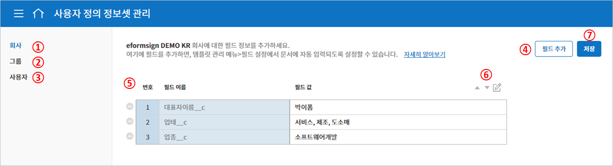
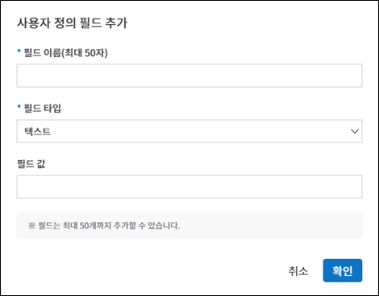
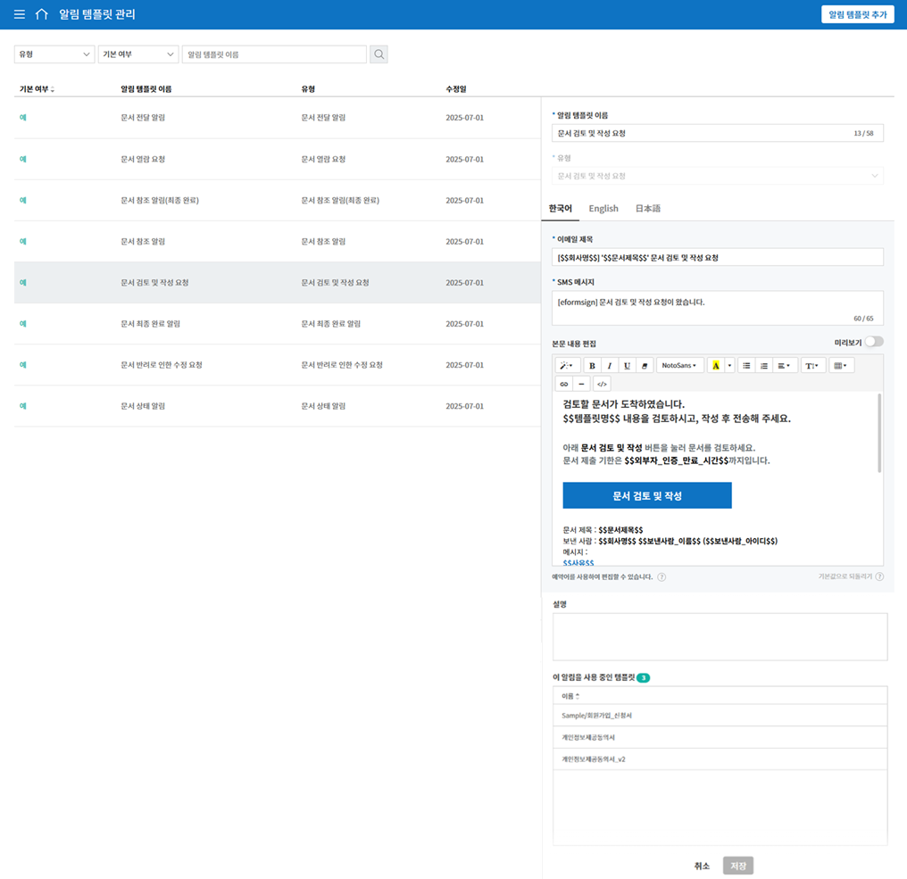

커스터마이즈
============

사용자 정의 필드 관리
--------------------------

**회사관리 > 사용자 정의 필드 관리**\ 에서는 회사, 그룹, 멤버에 관한 필드를 추가하고 편집할 수 있습니다.

.. tip::

   문서에서 자주 사용되는 회사, 그룹, 멤버에 관한 정보(예. 회사 대표번호, 주소, 대표자 명 등)를 사용자 정의 필드에서 추가하고
   **템플릿 설정 > 필드 설정**\ 에서 필요 정보를 자동으로 입력되도록 설정할 수 있습니다.

**① 사용자 정의 필드 관리 > 회사**
   회사 대표, 대표 전화번호, 직인 등 회사와 관련된 필드를 추가하고 값을 설정할 수 있습니다.

**② 사용자 정의 필드 관리 > 그룹**
   부서명, 책임자 등 그룹과 관련된 필드를 추가하고 값을 설정할 수 있습니다.

**③ 사용자 정의 필드 관리 > 멤버**
   직급, 메일 주소, 전화번호 등 멤버와 관련된 필드를 추가하고 값을 설정할 수 있습니다.

**④ 필드 추가**
   새로운 필드를 추가합니다. 필드 추가 버튼을 클릭하면 사용자 정의 필드를 추가할 수있는 팝업창이 나타납니다. **필드 이름** 과 **필드 타입** (텍스트/ 이미지), **필드 값**\ 을 입력하여 확인을 클릭하면 목록에 필드가 추가됩니다.

**⑤ 필드 목록**
   필드 목록으로 필드 이름과 필드 값을 보여주며, 필드 삭제, 필드값 편집을 할 수 있습니다.

   필드를 삭제하려면 해당 필드 목록 왼쪽에 위치한 아이콘(|회사 관리 > 사용자 정의 필드 관리|)을 클릭합니다.

**⑥ 필드 편집**
   수정할 필드를 선택하여 수정 아이콘(|image1|)을 클릭하면 사용자 정의 필드 수정 팝업 창이 표시되어 필드 이름, 타입, 값 등을 수정할 수
   있습니다.

   필드의 순서는 해당 필드를 선택한 후 화살표(|image2|)를 클릭하여 순서를 조정할 수 있습니다.

   .. figure:: resources/customfield-edit.PNG
      :alt: 회사 관리 > 사용자 정의 필드 관리
      :width: 700px

**⑦ 저장**
   사용자 정의 필드 편집이 완료되면 **저장** 버튼을 클릭해 변경사항을 저장합니다.

알림 템플릿 관리
----------------

문서 요청시 발송되는 메일/SMS 템플릿을 회사 맞춤형으로 편집할 수 있습니다.

알림 템플릿 변경은 **회사 관리 > 알림 템플릿 관리**\ 에서 설정하거나 **템플릿 관리 > 템플릿 설정 > 알림 설정**\ 에서 편집할 수 있습니다.

**회사 관리 > 알림 템플릿 관리**\ 에는 기본적인 메일/SMS 템플릿이 설정되어 있으며, 기본 템플릿의 내용 등 변경 및 새로운 알림 템플릿을 추가할 수 있습니다.

**기본 템플릿 종류(메일/SMS)**

.. table:: 표. 템플릿 타입 및 상태

   +--------------------+-------------------------------------------------+
   | 타입               | 상태                                            |
   +====================+=================================================+
   | 문서 처리 요청     | 결재 요청/문서 검토 및 작성                     |
   |                    | 요청(내부/외부)/문서 반려로 인한 수정 요청/문서 |
   |                    | 취소 요청 수신/문서 취소 요청 거절              |
   +--------------------+-------------------------------------------------+
   | 문서 처리 상태     | 문서 승인/문서 삭제/문서 반려/문서 검토 및 작성 |
   |                    | 완료/문서 최종 완료(내부/외부)/문서 이관        |
   |                    | 완료/문서 수정/완료 문서 전송/문서 취소         |
   +--------------------+-------------------------------------------------+
   | 멤버 초대          | 멤버 초대/멤버 가입 완료/멤버 초대 거절/멤버    |
   |                    | 회사 탈퇴                                       |
   +--------------------+-------------------------------------------------+
   | 헤더/풋터          |                                                 |
   +--------------------+-------------------------------------------------+

.. tip::

   헤더는 이폼사인의 로고가 기본으로 설정되어 있습니다. **회사 관리 > 회사 정보 >** `브랜드 <chapter2.html#brand>`__\ 에서 회사의 로고를 등록하면 이메일 템플릿에 회사의 로고가 함께 적용됩니다

**새 알림 템플릿 추가하는 방법**

기존에 등록된 메일/SMS 템플릿 외에 새 알림 템플릿을 추가할 수 있습니다.

1. 사이드바 메뉴에서 **회사 관리 > 알림 템플릿 관리**\ 를 클릭합니다.

2. **알림 템플릿 관리** 화면의 오른쪽 상단에 위치한 **알림 템플릿 추가** 버튼을 클릭합니다.

3. 해당하는 **타입**\ 을 선택하고 **상태**\ 를 선택합니다(표 템플릿 타입 및 상태 참고).

   |image3|

4. **채널**\ (메일 또는 SMS)을 선택하고 **알림 템플릿 이름**\ 을 입력합니다.

5. **헤터**\ 와 **풋터**\ 를 선택합니다.

6. 내용을 작성합니다.

7. **저장** 버튼을 클릭하여 템플릿으로 추가합니다.

.. |image3| image:: resources/notification-template-new.PNG
   :width: 700px
